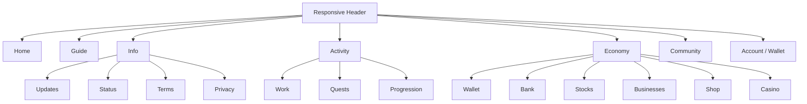
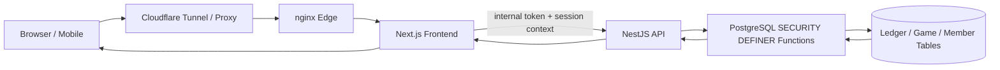
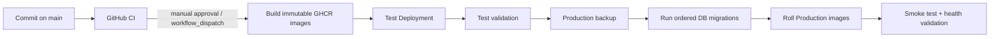

# 🌙 Woldeok Moneyverse

[한국어](README/README.ko.md) | [English](README/README.en.md) | [简体中文](README/README.zh-CN.md) | [繁體中文](README/README.zh-TW.md) | [日本語](README/README.ja.md) | [Español](README/README.es.md) | [Français](README/README.fr.md) | [Русский](README/README.ru.md) | [العربية](README/README.ar.md) | [हिन्दी](README/README.hi.md) · 📜 [Changelog](docs/changelog/CHANGELOG.md) · 🚀 [Releases](docs/releases/v2026.09.07.2.md)

---

> **Woldeok Moneyverse** is a community virtual-economy platform built with **Next.js, NestJS and PostgreSQL**. It combines jobs, quests, progression, a ledger-backed wallet, shop, stocks, businesses, banking and virtual casino minigames in one responsive web experience.
>
> **Production:** <https://easy-scraping.com> · **Test:** <https://test.easy-scraping.com>

> [!IMPORTANT]
> WLD, virtual stocks, casino plays, jobs and rewards are **in-service virtual data only**. They are not real money, securities, deposits, investments or gambling products.

---

## 📚 Multi-Language Documentation & Changelogs

| Language | User / Project Guide | Changelog |
| --- | --- | --- |
| **한국어 (Korean)** | [README.ko.md](README/README.ko.md) | [CHANGELOG.ko.md](docs/changelog/CHANGELOG.ko.md) |
| **English** | [README.en.md](README/README.en.md) | [CHANGELOG.md](docs/changelog/CHANGELOG.md) |
| **简体中文** | [README.zh-CN.md](README/README.zh-CN.md) | [CHANGELOG.zh-CN.md](docs/changelog/CHANGELOG.zh-CN.md) |
| **繁體中文** | [README.zh-TW.md](README/README.zh-TW.md) | [CHANGELOG.zh-TW.md](docs/changelog/CHANGELOG.zh-TW.md) |
| **日本語** | [README.ja.md](README/README.ja.md) | [CHANGELOG.ja.md](docs/changelog/CHANGELOG.ja.md) |
| **Español** | [README.es.md](README/README.es.md) | [CHANGELOG.es.md](docs/changelog/CHANGELOG.es.md) |
| **Français** | [README.fr.md](README/README.fr.md) | [CHANGELOG.fr.md](docs/changelog/CHANGELOG.fr.md) |
| **Русский** | [README.ru.md](README/README.ru.md) | [CHANGELOG.ru.md](docs/changelog/CHANGELOG.ru.md) |
| **العربية** | [README.ar.md](README/README.ar.md) | [CHANGELOG.ar.md](docs/changelog/CHANGELOG.ar.md) |
| **हिन्दी** | [README.hi.md](README/README.hi.md) | [CHANGELOG.hi.md](docs/changelog/CHANGELOG.hi.md) |

> **Localized guides are full guides, not short summaries.** Each language covers product features, architecture, gameplay/economy, security, mobile API, deployment, backup/recovery and development.

---

## 📸 Product & User Experience Showcase

These screenshots were captured from the **real production site in a public, non-member browser session**. No private member data, authentication cookies or administrator screens are included.

### 1. Home & Service Guide

| Production Home | Service Guide |
| --- | --- |
|  |  |

### 2. Casino & Live Service Status

| Virtual Casino | Service Status |
| --- | --- |
|  |  |

### 3. Responsive Layout

| Mobile Home | Tablet Home | Mobile Casino |
| --- | --- | --- |
|  |  |  |

The responsive header keeps the brand/navigation nodes in the DOM and changes visibility using CSS breakpoints. Narrow screens hide secondary brand text and desktop navigation; widening the viewport restores them without destructive client-side removal.

Member-only pages are intentionally **not** represented by fake/demo screenshots here: a clean public browser sees the authentication gate. Their gameplay contracts and interaction flows are documented in the feature docs and Mermaid diagrams below.

See [docs/images/README.md](docs/images/README.md) for screenshot provenance and update rules.

---

## 🎮 Main Gameplay Areas

| Area | What it does | Detailed document |
| --- | --- | --- |
| 💼 **Jobs & Progression** | Career switching, repeatable tasks, WLD + EXP, level progression | [Jobs & Progression](docs/features/jobs-and-progression.md) |
| 📋 **Quests** | Daily events, early-game steps and progression objectives | [Quests](docs/features/quests.md) |
| 💳 **Wallet / Ledger** | Virtual WLD balances, transfers and transaction history | [System Overview](docs/architecture/system-overview.md) |
| 🛒 **Shop** | Catalog, inventory, limited stock and member purchases | [Shop](docs/features/shop.md) |
| 📈 **Stocks** | Virtual market, candles, market dynamics and portfolio flows | [Stocks](docs/features/stocks.md) |
| 🏢 **Businesses** | Virtual business ownership, operating economics and distributions | [Businesses](docs/features/businesses.md) |
| 🏦 **Banking** | Deposits, interest, credit-grade loans and virtual bonds | [Banking](docs/features/banking.md) |
| 🎰 **Casino** | Server-authoritative virtual minigames, limits and history | [Casino](docs/features/casino.md) |
| 🛡️ **Admin Control Center** | Operations read models and policy controls behind admin boundaries | [Admin Control Center](docs/features/admin-control-center.md) |

### UI Navigation Map



This map documents the product information architecture; the exact label presentation adapts by viewport, locale and signed-in state.

---

## 🧭 Architecture at a Glance



### The load-bearing security boundary

The application does **not** treat TypeScript controllers as the final authority for economy writes. The runtime application role is intentionally restricted; money-moving and identity-sensitive mutations go through PostgreSQL `SECURITY DEFINER` functions.

```text
Browser
  │
  ▼
Next.js server
  │  same-origin session + CSRF
  ▼
NestJS internal API
  │  INTERNAL_API_TOKEN boundary
  ▼
PostgreSQL SECURITY DEFINER function
  │  authorization + invariants + idempotency + ledger write
  ▼
Economy tables
```

Read more:
- [System overview](docs/architecture/system-overview.md)
- [Request flow](docs/architecture/request-flow.md)
- [Database security boundary](docs/architecture/database-security.md)
- [Deployment flow](docs/architecture/deployment-flow.md)

---

## 🔐 Security & Integrity Principles

- The public browser talks to **Next.js**, not directly to the NestJS service.
- Production API calls require a server-to-server internal token except for intentionally exempt health/webhook surfaces.
- WLD is represented as a **canonical integer string**, not a JavaScript floating-point number.
- Economy mutations use database functions and ledger receipts rather than direct application-table updates.
- Write endpoints use idempotency where a retry could otherwise duplicate value.
- Production containers run with hardened settings such as read-only roots, dropped capabilities and `no-new-privileges` where supported.
- Production DB/data/volumes are never deleted by normal release operations.

See [Security Model](docs/operations/security-model.md).

---

## 🎰 Casino Safety & Balance Snapshot

The casino is a **virtual entertainment subsystem**, not a real-money gambling service.

- Baseline RTP: **95%** for the currently disclosed core games.
- Per-play stake: **10–200 WLD**.
- Platform daily stake exposure: **2,000 WLD**.
- Platform daily realized-loss exposure: **1,000 WLD**.
- Member self-limits and self-exclusion can be stricter than platform limits.
- The final visual result is derived from the server receipt; the browser does not decide wins.

See [Casino Gameplay](docs/features/casino.md).

---

## 🏦 Banking Integrity Snapshot

- Deposit interest uses one server-side contract for display and settlement.
- Balance changes reset the accrual clock to prevent retroactive interest inflation.
- Sub-1-WLD interest is accumulated rather than rounded up into a minimum faucet.
- New loans use the credit-grade policy rather than a bypass loan path.
- Existing loan/bond contracts are not retroactively rewritten during releases.

See [Banking](docs/features/banking.md).

---

## 🗂️ Documentation Map

### Architecture
- [System Overview](docs/architecture/system-overview.md)
- [Request Flow](docs/architecture/request-flow.md)
- [Database Security](docs/architecture/database-security.md)
- [Deployment Pipeline](docs/architecture/deployment-flow.md)
- [Mobile / External App API](docs/mobile-api.md) — use a gateway/BFF; never embed `INTERNAL_API_TOKEN` in a native client

### Features
- [Jobs & Progression](docs/features/jobs-and-progression.md)
- [Quests](docs/features/quests.md)
- [Casino](docs/features/casino.md)
- [Banking](docs/features/banking.md)
- [Stocks](docs/features/stocks.md)
- [Businesses](docs/features/businesses.md)
- [Shop](docs/features/shop.md)
- [Admin Control Center](docs/features/admin-control-center.md)

### Integrations
- [Mobile / External App API](docs/mobile-api.md)

### Operations
- [Local Development](docs/operations/local-development.md)
- [Database Migrations](docs/operations/database-migrations.md)
- [Backup & Recovery](docs/operations/backup-and-recovery.md)
- [Production Deployment](docs/operations/production-deployment.md)
- [Security Model](docs/operations/security-model.md)

### Change History
- [Documentation Index](docs/INDEX.md)
- [Current Documentation Release](docs/releases/v2026.09.07.2.md)
- [Previous Documentation Showcase](docs/releases/v2026.09.07.1.md)
- [Gameplay Runtime Release](docs/releases/v2026.09.07.md)
- [Detailed Worklog](docs/worklog/2026-09-07-gameplay-ux-release.md)
- [English Changelog](docs/changelog/CHANGELOG.md)

---

## 🧰 Workspace

| Path | Purpose |
| --- | --- |
| `frontend/` | Next.js App Router frontend and same-origin server actions |
| `backend/` | NestJS internal API |
| `packages/database/` | PostgreSQL init files, ordered migrations and DB policy |
| `packages/contract/` | Shared contracts and route map |
| `deploy/` | Docker Compose, nginx and host deployment scripts |
| `ops/` | Infrastructure helper scripts |
| `README/` | Localized project guides |
| `docs/` | Architecture, feature, operations, screenshots, changelogs and worklogs |

---

## 🧪 Validation Baseline

The `v2026.09.07` gameplay/UX release was validated with:

- **1,367 / 1,367** backend DB/application tests passing.
- **519 / 519** frontend tests passing.
- Lint with **0 errors**.
- Full TypeScript typecheck and production build passing.
- Secret, raw-control-byte and Prisma schema-mutation guards passing.
- Test canary followed by official Test and Production GitHub Deploy workflows.

See the [release notes](docs/releases/v2026.09.07.md) for the exact scope.

---

## 🚀 Release & Deployment Model



Production is intentionally **not auto-deployed on every push**. The release workflow builds commit-tagged images and rolls a selected environment only when explicitly dispatched.

See [Production Deployment](docs/operations/production-deployment.md) and [Backup & Recovery](docs/operations/backup-and-recovery.md).

---

## 📜 Release

Latest documentation release:

**[v2026.09.07.2 — Localized Guide Parity](docs/releases/v2026.09.07.2.md)**

Previous documentation showcase:

**[v2026.09.07.1 — Documentation & Showcase](docs/releases/v2026.09.07.1.md)**

Runtime/gameplay baseline:

**[v2026.09.07 — Gameplay, UX and Economy Stability](docs/releases/v2026.09.07.md)**
