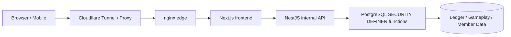
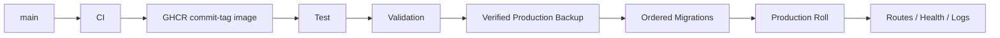

# 🌙 Woldeok Moneyverse — الدليل العربي الكامل

[← README الرئيسي](../README.md) · [سجل التغييرات](../docs/changelog/CHANGELOG.ar.md) · [فهرس الوثائق](../docs/INDEX.md) · [Production](https://easy-scraping.com) · [Test](https://test.easy-scraping.com)

> Woldeok Moneyverse منصة اقتصاد افتراضي للمجتمع تجمع المهن والمهام والتقدم ومحفظة WLD والمتجر والأسهم/الشركات الافتراضية والبنك وألعاب الكازينو الافتراضية في خدمة ويب متجاوبة واحدة.
>
> ‏WLD والأسهم الافتراضية ونتائج الكازينو والمكافآت كلها بيانات داخلية للخدمة، وليست أموالاً أو أوراقاً مالية أو ودائع أو استثمارات أو منتجات مقامرة حقيقية.

---

## 📸 لقطات حقيقية من الخدمة

الصور التالية مأخوذة من Production الفعلي في جلسة عامة نظيفة. لا تحتوي على Cookies للأعضاء أو بيانات خاصة أو شاشات إدارة أو أسرار.

| الصفحة الرئيسية | دليل الخدمة |
| --- | --- |
|  |  |

| الكازينو الافتراضي | حالة الخدمة |
| --- | --- |
|  |  |

### التصميم المتجاوب

| الهاتف | الجهاز اللوحي | كازينو الهاتف |
| --- | --- | --- |
|  |  |  |

لا يحذف Header المتجاوب عناصر العلامة من DOM باستخدام JavaScript. تقوم CSS breakpoints بالتبديل بين `display:none` والحالة الظاهرة، لذلك عند توسيع الشاشة تعود الشعار والنص والقائمة المكتبية تلقائياً.

---

## 🎮 الوظائف الرئيسية

| المجال | الوظيفة | الوثيقة |
| --- | --- | --- |
| 💼 المهن | 8 مهن، أعمال متكررة، WLD + EXP | [Jobs & Progression](../docs/features/jobs-and-progression.md) |
| 📋 المهام | أحداث يومية وأهداف وتقدم | [Quests](../docs/features/quests.md) |
| 💳 المحفظة | أرصدة WLD دقيقة وتحويلات وسجل Ledger | [System Overview](../docs/architecture/system-overview.md) |
| 🛒 المتجر | أسعار ومخزون وشراء يحدده DB | [Shop](../docs/features/shop.md) |
| 📈 الأسهم الافتراضية | أسعار وCandles وشراء/بيع ومحفظة | [Stocks](../docs/features/stocks.md) |
| 🏢 الشركات الافتراضية | ملكية ودورة اقتصادية طويلة | [Businesses](../docs/features/businesses.md) |
| 🏦 البنك | ودائع وفوائد وائتمان وسندات افتراضية | [Banking](../docs/features/banking.md) |
| 🎰 الكازينو | نتيجة يحددها الخادم واحتمالات وحدود | [Casino](../docs/features/casino.md) |
| 🛡️ الإدارة | Read models وضوابط تشغيلية محدودة | [Admin Control Center](../docs/features/admin-control-center.md) |

---

## 🏗️ البنية المعمارية



**المتصفح** يعرض الواجهة ولا يحصل أبداً على Internal API Token أو بيانات اعتماد قاعدة البيانات.

**Next.js** هو أصل الويب العام، يدير الصفحات وServer Actions ويحافظ على Session/CSRF عند طلب API الداخلي.

**NestJS** هو API داخلي في Production ويتحقق من DTO والسياق وحدّ Internal Token.

**PostgreSQL** هو الحد النهائي لتكامل الاقتصاد، ويمكنه التحقق من Actor والسياسات وIdempotency والرصيد والمخزون وLedger داخل معاملة ذرية واحدة.

- [System Overview](../docs/architecture/system-overview.md)
- [Request Flow](../docs/architecture/request-flow.md)
- [Database Security](../docs/architecture/database-security.md)
- [Deployment Flow](../docs/architecture/deployment-flow.md)

---

## 💼 المهن والعمل

Job 2.0 منظم إلى **8 مهن × 3 مهام نشطة لكل مهنة = 24 مهمة نشطة**.

- يمكن للعضو جمع EXP في عدة مهن لكن مهنة واحدة فقط تكون نشطة.
- إكمال العمل يسجل WLD وEXP معاً.
- معاينة المكافأة والتسوية الفعلية تستخدمان نفس قاعدة الخادم.
- يحتفظ Work Modal بنفس idempotency key لكل محاولة.
- إذا تم الدفع في DB وضاع رد HTTP، فإن إعادة نفس المفتاح تعيد Receipt القديم ولا تدفع مرة ثانية.

---

## 📋 المهام والأحداث

يجب أن يصف نص المهمة التأثيرات المنفذة فعلياً فقط.

مثال حدث خصم السوق: تسجيل Claim لليوم، تحديد starter items المؤهلة، حساب خصم 10%، استخدام نفس Effective Price في العرض والشراء، ثم انتهاء التأثير عند حدود تاريخ سيول.

أي وظيفة مستقبلية بدون نموذج بيانات أو Settlement حقيقي لا تُعرض كمكافأة نشطة.

---

## 🎰 الكازينو الافتراضي

يستخدم الكازينو WLD الداخلي فقط ولا يقدم سحباً إلى أموال حقيقية.

### الشروط الأساسية المعلنة

| اللعبة | احتمال الفوز | المضاعف | RTP الأساسي |
| --- | ---: | ---: | ---: |
| العملة | 50% | 1.9× | 95% |
| زوجي/فردي للنرد | 50% | 1.9× | 95% |
| رقم النرد | 1/6 | 5.7× | 95% |

### حدود التعرض

- الحد الأدنى: **10 WLD**
- الحد الأقصى لكل لعبة: **200 WLD**
- إجمالي الرهان اليومي: **2,000 WLD**
- الخسارة اليومية المحققة: **1,000 WLD**
- يمكن للعضو وضع Self-limits/Self-exclusion أشد

### نتيجة يقررها الخادم

رسوم Slot وHigh/Low وWheel وTreasure وGem لا تحدد النتيجة. الحالة المرئية النهائية مشتقة من Server Receipt.

كان هناك سابقاً خلل قد يعرض `777` بعد نتيجة خاسرة؛ المزامنة الحالية تمنع أي تعارض بين Animation والنتيجة المخزنة.

كما يستخدم سجل اللعب Read Model خاصاً بالعضو بدلاً من تصفية عدد قليل من معاملات المحفظة العامة.

---

## 🏦 البنك والائتمان والسندات

- معدل الفائدة المعروض والتسوية الفعلية يستخدمان نفس عقد الخادم.
- تغيير الرصيد عبر الإيداع/السحب يعيد ضبط ساعة Accrual.
- الفائدة الأقل من 1 WLD تستمر في التراكم ولا تُرفع مجاناً إلى 1 WLD.
- إعادة نفس Idempotency Key تعيد Settlement السابق.
- القروض الجديدة تستخدم Credit-grade Policy.
- عقود القروض/السندات القديمة لا يعاد كتابتها بأثر رجعي.

الأرصدة والقروض وتسوية السندات تبقى Integer Strings دقيقة.

---

## 📈 الأسهم والشركات والمتجر

### الأسهم الافتراضية
- أسعار وCandles ومحفظة.
- التقلب وحدود الحركة اليومية سياسات على الخادم.
- أسعار وعوائد WLD تستخدم أعداداً صحيحة دقيقة.

### الشركات الافتراضية
- محتوى ملكية وتشغيل طويل الأجل.
- Payback يُقارن مع العمل والبنك وبقية Faucet/Sink.
- تاريخ الملكية والتوزيعات محفوظ.

### المتجر
- العميل لا يحدد السعر النهائي.
- السعر المعروض والمبلغ المدفوع يستخدمان نفس قاعدة DB.
- تعديلات الإدارة للسعر/المخزون تمر عبر Actor-scoped DB Functions.

---

## 💰 دقة WLD

‏WLD هو **Canonical Integer String** وليس JavaScript `Number`.

```text
PostgreSQL bigint / numeric
        ↓
node-postgres string
        ↓
API JSON string
        ↓
Frontend string / BigInt
```

القيم الأكبر من 2^53 قد تفقد الدقة عند تحويلها إلى Floating Point، لذلك تبقى الأرصدة والأسعار والقروض String/BigInt.

---

## 🔐 نموذج الأمان

- المتصفح يتعامل عادة مع Next.js.
- NestJS هو API داخلي في Production.
- الطلبات الداخلية تحتاج `INTERNAL_API_TOKEN` إلا الاستثناءات الصريحة.
- لا يتم تضمين هذا Token في Browser أو Native App.
- الكتابات الاقتصادية المهمة تستخدم PostgreSQL `SECURITY DEFINER`.
- يتم إلغاء `PUBLIC EXECUTE` غير الضروري.
- العمليات التي قد تضاعف القيمة عند Retry تستخدم Idempotency.
- حاويات Production تستخدم read-only rootfs وcap drop و`no-new-privileges` حيث أمكن.
- Deployment/Cleanup العادي لا يحذف Production DB أو بيانات الأعضاء أو Ledger أو Docker Volumes.

[Security Model](../docs/operations/security-model.md)

---

## 📱 Mobile / External App API

يجب ألا يضمّن Native/Mobile App **`INTERNAL_API_TOKEN`** مباشرة.

```text
Native App
   ↓ HTTPS
Gateway / BFF
   ↓ يضيف Server-side Internal Token
NestJS API
```

يحتفظ Gateway بالـ server-to-server secret ويعيد استخدام Session وCSRF وOAuth PKCE الموجودة.

[Mobile / External App API](../docs/mobile-api.md)

---

## 🚀 النشر من Test إلى Production



Push إلى `main` يشغل CI لكنه لا ينشر Production تلقائياً. Production يتم عبر Deploy Workflow صريح.

- اختلاف Checksum في Migration مطبق يوقف Rollout.
- لا يعاد إنشاء Production Data/Volumes.
- الصور في GHCR مرتبطة بالـ commit.
- Local Edge Smoke Test يستخدم Public Host Header الحقيقي.

---

## 💾 النسخ الاحتياطي والاستعادة

قبل تغيير Production يتم التحقق من فك تشفير DB Dump، قراءة بنية Dump، فتح Photo Archive، والتأكد من أن النسخة تخص Stack الصحيح.

النسخ داخل نفس الخادم لا تحمي من فقدان SSD/الخادم بالكامل؛ DR الكامل يحتاج نسخة Off-host واختبارات Restore فعلية.

---

## 🧰 التطوير

الخط الأساسي الحالي: Node.js 24، pnpm 10، PostgreSQL 17.x (Production 17.11)، nginx 1.30.4.

```bash
corepack enable
pnpm install --frozen-lockfile
pnpm lint
pnpm typecheck
pnpm build
```

اختبارات DB يجب أن تعمل على PostgreSQL معزول، وليس على Production.

---

## 🗂️ الوثائق

- [System Overview](../docs/architecture/system-overview.md)
- [Request Flow](../docs/architecture/request-flow.md)
- [Database Security](../docs/architecture/database-security.md)
- [Deployment Flow](../docs/architecture/deployment-flow.md)
- [Jobs & Progression](../docs/features/jobs-and-progression.md)
- [Quests](../docs/features/quests.md)
- [Casino](../docs/features/casino.md)
- [Banking](../docs/features/banking.md)
- [Stocks](../docs/features/stocks.md)
- [Businesses](../docs/features/businesses.md)
- [Shop](../docs/features/shop.md)
- [Admin Control Center](../docs/features/admin-control-center.md)
- [Database Migrations](../docs/operations/database-migrations.md)
- [Backup & Recovery](../docs/operations/backup-and-recovery.md)
- [Production Deployment](../docs/operations/production-deployment.md)
- [Security Model](../docs/operations/security-model.md)
- [v2026.09.07.2 Localized Guide Parity](../docs/releases/v2026.09.07.2.md)
- [v2026.09.07.1 Documentation & Showcase](../docs/releases/v2026.09.07.1.md)
- [v2026.09.07 Gameplay / UX / Economy](../docs/releases/v2026.09.07.md)

---

## ✅ التحقق

Gameplay/UX Runtime Release: Backend **1,367 / 1,367 PASS**، Frontend **519 / 519 PASS**، lint 0 errors، typecheck/build PASS، Test Canary وGitHub Test/Production Deploy الرسميان PASS.

إصدار التوثيق يغير README/docs/public screenshots فقط ولا يحتاج إلى إعادة تشغيل Production Runtime.
