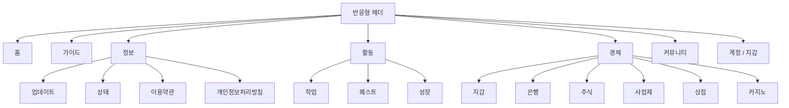
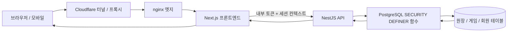
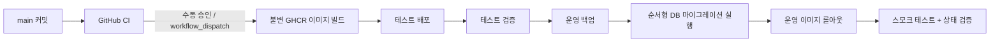

# 🌙 월덕 머니버스

[한국어](README.ko.md) | [English](README.en.md) | [简体中文](README.zh-CN.md) | [繁體中文](README.zh-TW.md) | [日本語](README.ja.md) | [Español](README.es.md) | [Français](README.fr.md) | [Русский](README.ru.md) | [العربية](README.ar.md) | [हिन्दी](README.hi.md) · 📜 [변경 기록](../docs/changelog/CHANGELOG.md) · 🚀 [릴리스](../docs/releases/v2026.09.07.2.md)

---

> **월덕 머니버스(Woldeok Moneyverse)**는 **Next.js, NestJS, PostgreSQL**로 구축된 커뮤니티 가상 경제 플랫폼입니다. 직업, 퀘스트, 성장, 원장 기반 지갑, 상점, 주식, 사업체, 은행, 가상 카지노 미니게임을 하나의 반응형 웹 환경에 통합합니다.
>
> **운영:** <https://easy-scraping.com> · **테스트:** <https://test.easy-scraping.com>

> [!IMPORTANT]
> WLD, 가상 주식, 카지노 플레이, 직업 및 보상은 **서비스 내부 가상 데이터일 뿐입니다**. 실제 화폐, 증권, 예금, 투자 또는 도박 상품이 아닙니다.

---

## 📚 다국어 문서 및 변경 기록

| 언어 | 사용자 / 프로젝트 가이드 | 변경 기록 |
| --- | --- | --- |
| **한국어 (Korean)** | [README.ko.md](README.ko.md) | [CHANGELOG.ko.md](../docs/changelog/CHANGELOG.ko.md) |
| **English** | [README.en.md](README.en.md) | [CHANGELOG.md](../docs/changelog/CHANGELOG.md) |
| **简体中文** | [README.zh-CN.md](README.zh-CN.md) | [CHANGELOG.zh-CN.md](../docs/changelog/CHANGELOG.zh-CN.md) |
| **繁體中文** | [README.zh-TW.md](README.zh-TW.md) | [CHANGELOG.zh-TW.md](../docs/changelog/CHANGELOG.zh-TW.md) |
| **日本語** | [README.ja.md](README.ja.md) | [CHANGELOG.ja.md](../docs/changelog/CHANGELOG.ja.md) |
| **Español** | [README.es.md](README.es.md) | [CHANGELOG.es.md](../docs/changelog/CHANGELOG.es.md) |
| **Français** | [README.fr.md](README.fr.md) | [CHANGELOG.fr.md](../docs/changelog/CHANGELOG.fr.md) |
| **Русский** | [README.ru.md](README.ru.md) | [CHANGELOG.ru.md](../docs/changelog/CHANGELOG.ru.md) |
| **العربية** | [README.ar.md](README.ar.md) | [CHANGELOG.ar.md](../docs/changelog/CHANGELOG.ar.md) |
| **हिन्दी** | [README.hi.md](README.hi.md) | [CHANGELOG.hi.md](../docs/changelog/CHANGELOG.hi.md) |

> **현지화 가이드는 짧은 요약이 아니라 완전한 가이드입니다.** 각 언어 문서는 제품 기능, 아키텍처, 게임플레이/경제, 보안, 모바일 API, 배포, 백업/복구, 개발 내용을 다룹니다.

---

## 📸 제품 및 사용자 경험 쇼케이스

아래 스크린샷은 **실제 운영 사이트의 비회원 공개 브라우저 세션**에서 캡처되었습니다. 비공개 회원 데이터, 인증 쿠키 또는 관리자 화면은 포함되지 않습니다.

### 1. 홈 및 서비스 가이드

| 운영 홈 | 서비스 가이드 |
| --- | --- |
|  |  |

### 2. 카지노 및 실시간 서비스 상태

| 가상 카지노 | 서비스 상태 |
| --- | --- |
|  |  |

### 3. 반응형 레이아웃

| 모바일 홈 | 태블릿 홈 | 모바일 카지노 |
| --- | --- | --- |
|  |  |  |

반응형 헤더는 브랜드/내비게이션 노드를 DOM에 유지한 채 CSS 브레이크포인트로 표시 여부를 변경합니다. 좁은 화면에서는 보조 브랜드 텍스트와 데스크톱 내비게이션을 숨기고, 화면을 다시 넓히면 클라이언트에서 노드를 제거하지 않은 상태로 다시 표시합니다.

회원 전용 페이지는 가짜/데모 스크린샷으로 표시하지 않습니다. 공개 브라우저에서는 인증 게이트가 나타나며, 회원 전용 기능의 게임플레이 계약과 상호작용 흐름은 아래 기능 문서 및 Mermaid 다이어그램에 정리되어 있습니다.

스크린샷 출처와 업데이트 규칙은 [docs/images/README.md](../docs/images/README.md)를 참고하세요.

---

## 🎮 주요 게임플레이 영역

| 영역 | 기능 | 상세 문서 |
| --- | --- | --- |
| 💼 **직업 및 성장** | 직업 전환, 반복 업무, WLD + EXP, 레벨 성장 | [직업 및 성장](../docs/features/jobs-and-progression.md) |
| 📋 **퀘스트** | 일일 이벤트, 초반 진행 단계, 성장 목표 | [퀘스트](../docs/features/quests.md) |
| 💳 **지갑 / 원장** | 가상 WLD 잔액, 송금, 거래 내역 | [시스템 개요](../docs/architecture/system-overview.md) |
| 🛒 **상점** | 상품 카탈로그, 인벤토리, 제한 재고, 회원 구매 | [상점](../docs/features/shop.md) |
| 📈 **주식** | 가상 시장, 캔들, 시장 동역학, 포트폴리오 흐름 | [주식](../docs/features/stocks.md) |
| 🏢 **사업체** | 가상 사업체 소유, 운영 경제, 분배 | [사업체](../docs/features/businesses.md) |
| 🏦 **은행** | 예금, 이자, 신용등급 기반 대출, 가상 채권 | [은행](../docs/features/banking.md) |
| 🎰 **카지노** | 서버 권한 기반 가상 미니게임, 한도, 기록 | [카지노](../docs/features/casino.md) |
| 🛡️ **관리자 제어 센터** | 관리자 경계 뒤의 운영 read model 및 정책 제어 | [관리자 제어 센터](../docs/features/admin-control-center.md) |

### UI 내비게이션 맵



이 맵은 제품의 정보 구조를 나타냅니다. 실제 라벨 표시는 화면 크기, 언어, 로그인 상태에 따라 달라질 수 있습니다.

---

## 🧭 아키텍처 한눈에 보기



### 핵심 보안 경계

애플리케이션은 TypeScript 컨트롤러를 경제 쓰기의 최종 권한으로 취급하지 않습니다. 런타임 애플리케이션 역할은 의도적으로 제한되며, 자금 이동 및 신원 관련 중요 변경은 PostgreSQL `SECURITY DEFINER` 함수를 통해 수행됩니다.

```text
브라우저
  │
  ▼
Next.js 서버
  │  same-origin 세션 + CSRF
  ▼
NestJS 내부 API
  │  INTERNAL_API_TOKEN 경계
  ▼
PostgreSQL SECURITY DEFINER 함수
  │  권한 확인 + 불변조건 + 멱등성 + 원장 기록
  ▼
경제 테이블
```

자세히 보기:
- [시스템 개요](../docs/architecture/system-overview.md)
- [요청 흐름](../docs/architecture/request-flow.md)
- [데이터베이스 보안 경계](../docs/architecture/database-security.md)
- [배포 흐름](../docs/architecture/deployment-flow.md)

---

## 🔐 보안 및 무결성 원칙

- 공개 브라우저는 **NestJS 서비스에 직접 연결하지 않고 Next.js를 통해 통신**합니다.
- 의도적으로 예외 처리된 health/webhook 엔드포인트를 제외하면 운영 API 호출에는 서버 간 내부 토큰이 필요합니다.
- WLD는 JavaScript 부동소수점 숫자가 아니라 **정규화된 정수 문자열**로 표현됩니다.
- 경제 변경은 애플리케이션 테이블 직접 수정이 아니라 DB 함수와 원장 영수증을 사용합니다.
- 재시도로 인해 가치가 중복 생성될 수 있는 쓰기 엔드포인트에는 멱등성을 적용합니다.
- 운영 컨테이너는 지원되는 범위에서 read-only root, capability drop, `no-new-privileges` 같은 강화 설정을 사용합니다.
- 정상적인 릴리스 작업에서는 운영 DB/데이터/볼륨을 삭제하지 않습니다.

자세한 내용은 [보안 모델](../docs/operations/security-model.md)을 참고하세요.

---

## 🎰 카지노 안전 및 밸런스 요약

카지노는 **가상 엔터테인먼트 하위 시스템**이며 실제 돈을 사용하는 도박 서비스가 아닙니다.

- 현재 공개된 핵심 게임의 기준 RTP: **95%**
- 1회 베팅 금액: **10–200 WLD**
- 플랫폼 하루 총 베팅 노출 한도: **2,000 WLD**
- 플랫폼 하루 실현 손실 노출 한도: **1,000 WLD**
- 회원이 설정하는 자기 한도 및 자기 제외는 플랫폼 한도보다 더 엄격할 수 있습니다.
- 최종 화면 결과는 서버 영수증에서 파생되며 브라우저가 승패를 결정하지 않습니다.

자세한 내용은 [카지노 게임플레이](../docs/features/casino.md)를 참고하세요.

---

## 🏦 은행 무결성 요약

- 예금 이자는 표시와 실제 정산에 동일한 서버 측 계약을 사용합니다.
- 잔액이 바뀌면 누적 기준 시점을 재설정해 과거 기간에 대한 이자 부풀리기를 방지합니다.
- 1 WLD 미만의 이자를 강제로 최소 1 WLD로 올리지 않고 누적합니다.
- 신규 대출은 우회 경로가 아니라 신용등급 정책을 사용합니다.
- 기존 대출/채권 계약은 릴리스 과정에서 소급 변경하지 않습니다.

자세한 내용은 [은행](../docs/features/banking.md)을 참고하세요.

---

## 🗂️ 문서 맵

### 아키텍처
- [시스템 개요](../docs/architecture/system-overview.md)
- [요청 흐름](../docs/architecture/request-flow.md)
- [데이터베이스 보안](../docs/architecture/database-security.md)
- [배포 파이프라인](../docs/architecture/deployment-flow.md)
- [모바일 / 외부 앱 API](../docs/mobile-api.md) — Gateway/BFF를 사용하며 네이티브 클라이언트에 `INTERNAL_API_TOKEN`을 넣지 않습니다.

### 기능
- [직업 및 성장](../docs/features/jobs-and-progression.md)
- [퀘스트](../docs/features/quests.md)
- [카지노](../docs/features/casino.md)
- [은행](../docs/features/banking.md)
- [주식](../docs/features/stocks.md)
- [사업체](../docs/features/businesses.md)
- [상점](../docs/features/shop.md)
- [관리자 제어 센터](../docs/features/admin-control-center.md)

### 연동
- [모바일 / 외부 앱 API](../docs/mobile-api.md)

### 운영
- [로컬 개발](../docs/operations/local-development.md)
- [데이터베이스 마이그레이션](../docs/operations/database-migrations.md)
- [백업 및 복구](../docs/operations/backup-and-recovery.md)
- [운영 배포](../docs/operations/production-deployment.md)
- [보안 모델](../docs/operations/security-model.md)

### 변경 이력
- [문서 인덱스](../docs/INDEX.md)
- [현재 문서 릴리스](../docs/releases/v2026.09.07.2.md)
- [이전 문서 쇼케이스](../docs/releases/v2026.09.07.1.md)
- [게임플레이 런타임 릴리스](../docs/releases/v2026.09.07.md)
- [상세 작업 기록](../docs/worklog/2026-09-07-gameplay-ux-release.md)
- [영문 변경 기록](../docs/changelog/CHANGELOG.md)

---

## 🧰 워크스페이스

| 경로 | 용도 |
| --- | --- |
| `frontend/` | Next.js App Router 프론트엔드 및 same-origin 서버 액션 |
| `backend/` | NestJS 내부 API |
| `packages/database/` | PostgreSQL 초기화 파일, 순서형 마이그레이션, DB 정책 |
| `packages/contract/` | 공유 계약 및 라우트 맵 |
| `deploy/` | Docker Compose, nginx, 호스트 배포 스크립트 |
| `ops/` | 인프라 보조 스크립트 |
| `README/` | 현지화 프로젝트 가이드 |
| `docs/` | 아키텍처, 기능, 운영, 스크린샷, 변경 기록, 작업 기록 |

---

## 🧪 검증 기준

`v2026.09.07` 게임플레이/UX 릴리스는 다음 항목으로 검증되었습니다.

- 백엔드 DB/애플리케이션 테스트 **1,367 / 1,367** 통과
- 프론트엔드 테스트 **519 / 519** 통과
- Lint 오류 **0개**
- 전체 TypeScript 타입 검사 및 운영 빌드 통과
- Secret, raw-control-byte, Prisma schema-mutation 가드 통과
- 테스트 카나리 이후 공식 Test 및 Production GitHub Deploy 워크플로 수행

정확한 범위는 [릴리스 노트](../docs/releases/v2026.09.07.md)를 참고하세요.

---

## 🚀 릴리스 및 배포 모델



운영 환경은 모든 push마다 자동 배포되지 않습니다. 릴리스 워크플로는 커밋 태그가 붙은 이미지를 빌드하고, 명시적으로 실행된 경우에만 선택한 환경에 배포합니다.

자세한 내용은 [운영 배포](../docs/operations/production-deployment.md) 및 [백업 및 복구](../docs/operations/backup-and-recovery.md)를 참고하세요.

---

## 📜 릴리스

최신 문서 릴리스:

**[v2026.09.07.2 — 현지화 가이드 동등성](../docs/releases/v2026.09.07.2.md)**

이전 문서 쇼케이스:

**[v2026.09.07.1 — 문서 및 쇼케이스](../docs/releases/v2026.09.07.1.md)**

런타임/게임플레이 기준:

**[v2026.09.07 — 게임플레이, UX 및 경제 안정성](../docs/releases/v2026.09.07.md)**
