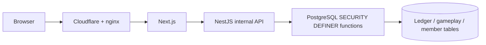

# Woldeok Moneyverse — English Guide

[← Main README](../README.md) · [Changelog](../docs/changelog/CHANGELOG.md) · [Documentation Index](../docs/INDEX.md) · [Production](https://easy-scraping.com) · [Test](https://test.easy-scraping.com)

## What is Woldeok Moneyverse?

Woldeok Moneyverse is a Korean community virtual-economy service rebuilt on Next.js, NestJS and PostgreSQL. Members can participate in jobs, quests, progression, a ledger-backed wallet, catalog shop, virtual stocks/businesses, banking and virtual casino minigames.

All WLD and game/economy assets are in-service virtual data. There is no real-money cash-out.

## Main features

- **Jobs & careers:** 8 careers, career EXP and repeatable task rewards.
- **Quests & progression:** daily events, early-game guidance and long-term objectives.
- **Wallet:** exact WLD balances, transaction history and transfers.
- **Shop & inventory:** database-authoritative price and stock rules.
- **Virtual stocks:** market prices, candles and portfolio flows.
- **Virtual businesses:** ownership and long-horizon economy loops.
- **Banking:** deposits, interest, credit-grade loans and virtual bonds.
- **Virtual casino:** server-authoritative outcomes, disclosed odds and self-limits.
- **Admin tools:** actor-scoped economy/control read models and operations functions.

## Architecture



The application role is intentionally unable to perform arbitrary direct economy mutations. Important writes are centralized in PostgreSQL functions that validate actor/policy/idempotency and update the ledger atomically.

## Exact WLD rule

WLD values cross the API as canonical integer **strings**. Do not convert large balances/prices to JavaScript `Number`; use strings and `BigInt` when exact arithmetic is required.

## Current casino baseline

- 95% baseline RTP for disclosed core games.
- 10–200 WLD per play.
- 2,000 WLD daily platform stake exposure.
- 1,000 WLD daily realized-loss exposure.
- Member self-limits/self-exclusion can be stricter.

See [Casino](../docs/features/casino.md).

## Current deployment baseline

- Node.js 24 runtime.
- PostgreSQL 17.11.
- nginx 1.30.4 edge.
- Test and Production use commit-tagged GHCR images.
- A push to `main` runs CI; Production deployment is an explicit workflow action.

## Development

```bash
corepack enable
pnpm install --frozen-lockfile
pnpm lint
pnpm typecheck
pnpm build
```

Database tests require an isolated PostgreSQL database. Never run test migration workflows against Production.

## Where to read next

- [System overview](../docs/architecture/system-overview.md)
- [Request flow](../docs/architecture/request-flow.md)
- [Database security](../docs/architecture/database-security.md)
- [Production deployment](../docs/operations/production-deployment.md)
- [Backup and recovery](../docs/operations/backup-and-recovery.md)
- [Gameplay/UX release worklog](../docs/worklog/2026-09-07-gameplay-ux-release.md)
