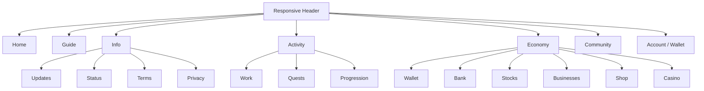
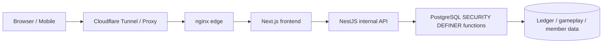
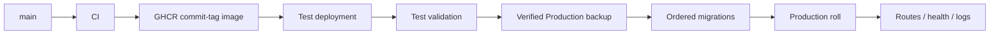

# 🌙 Woldeok Moneyverse — Complete English Guide

[← Main README](../README.md) · [Changelog](../docs/changelog/CHANGELOG.md) · [Documentation Index](../docs/INDEX.md) · [Production](https://easy-scraping.com) · [Test](https://test.easy-scraping.com)

> **Woldeok Moneyverse** is a community virtual-economy platform that combines jobs, quests, progression, a ledger-backed wallet, shop, virtual stocks/businesses, banking and virtual casino minigames in one responsive web service.
>
> WLD, virtual stocks, casino plays and rewards are in-service virtual data only. They are not real money, securities, deposits, investments or gambling products.

---

## 📸 Real Service Showcase

The screenshots below were captured from the **real Production site using a clean public browser session**. No member cookies, private account data, admin screens or secrets are included.

| Production Home | Service Guide |
| --- | --- |
|  |  |

| Virtual Casino | Service Status |
| --- | --- |
|  |  |

### Responsive views

| Mobile Home | Tablet Home | Mobile Casino |
| --- | --- | --- |
|  |  |  |

The responsive header does not destructively remove the brand/navigation nodes. CSS breakpoints switch visibility with `display:none`/visible states so widening the viewport restores the logo, brand text and desktop navigation automatically.

---

## 🎮 Product Areas

| Area | Purpose | Detailed document |
| --- | --- | --- |
| 💼 Jobs & Careers | 8 careers, repeatable tasks, WLD + career EXP | [Jobs & Progression](../docs/features/jobs-and-progression.md) |
| 📋 Quests | Daily events, early-game goals, progression objectives | [Quests](../docs/features/quests.md) |
| 💳 Wallet | Exact WLD balances, transfers, ledger history | [System Overview](../docs/architecture/system-overview.md) |
| 🛒 Shop | Database-authoritative pricing, inventory and stock | [Shop](../docs/features/shop.md) |
| 📈 Virtual Stocks | Prices, candles, buy/sell and portfolio flows | [Stocks](../docs/features/stocks.md) |
| 🏢 Virtual Businesses | Ownership and long-horizon economy loops | [Businesses](../docs/features/businesses.md) |
| 🏦 Banking | Deposits, interest, credit-grade loans and virtual bonds | [Banking](../docs/features/banking.md) |
| 🎰 Virtual Casino | Server-authoritative results, disclosed odds, self-limits | [Casino](../docs/features/casino.md) |
| 🛡️ Admin Control Center | Scoped operational/economy read models and controls | [Admin Control Center](../docs/features/admin-control-center.md) |

---

## 🧭 UI Information Architecture



Exact labels and visibility adapt to viewport width, locale and sign-in state, but the information architecture follows this structure.

---

## 🏗️ Architecture



### Layer responsibilities

**Browser**
- renders responsive UI;
- uses same-origin session state;
- never receives the internal API token or database credentials.

**Next.js**
- public web origin;
- page rendering and Server Actions;
- forwards authenticated server-side requests while preserving session/CSRF context.

**NestJS**
- internal service rather than a normal public API origin;
- validates DTOs/request context;
- enforces the Production internal-token boundary;
- calls database read models and protected functions.

**PostgreSQL**
- final consistency boundary for economy writes;
- important functions can validate actor, policy, idempotency, balance, inventory and ledger updates atomically.

Read more:
- [System Overview](../docs/architecture/system-overview.md)
- [Request Flow](../docs/architecture/request-flow.md)
- [Database Security](../docs/architecture/database-security.md)
- [Deployment Flow](../docs/architecture/deployment-flow.md)

---

## 💼 Jobs & Work

The current Job 2.0 catalog is normalized to **8 careers × 3 active tasks = 24 active tasks**.

- A member can accumulate EXP across careers but has one active career.
- Completing a task records WLD and career EXP together.
- Reward previews should use the same effective server calculation as settlement.
- The work modal keeps one idempotency key per attempt so a slow response can be retried without close/reopen UX.
- If the database committed but the HTTP response was lost, replaying the same key returns the original receipt instead of paying twice.

---

## 📋 Quests & Events

Quest copy should describe only implemented effects.

A fully implemented market-sale event follows this contract:

1. record today's claim;
2. identify eligible starter items;
3. calculate the 10% effective discount;
4. use the same rule for displayed price and purchase settlement;
5. expire at the Seoul-date boundary.

Future mechanics that do not yet have a real data/runtime contract are not advertised as live rewards.

---

## 🎰 Virtual Casino

The casino uses in-service WLD only and has no real-money cash-out.

### Core disclosed terms

| Game | Win probability | Payout | Baseline RTP |
| --- | ---: | ---: | ---: |
| Coin | 50% | 1.9× | 95% |
| Dice parity | 50% | 1.9× | 95% |
| Dice number | 1/6 | 5.7× | 95% |

### Platform exposure baseline

- minimum stake: **10 WLD**;
- maximum stake per play: **200 WLD**;
- daily total stake exposure: **2,000 WLD**;
- daily realized-loss exposure: **1,000 WLD**;
- member self-limits/self-exclusion can be stricter.

### Server-authoritative results

Slot/high-low/wheel/treasure/gem animations do not decide settlement. Their final visual state is derived from the server receipt.

A previous UI defect could display `777` after a losing receipt; the result mapping now prevents a themed animation from contradicting the stored server outcome.

Recent gameplay also uses a member-scoped casino history read model instead of filtering a tiny generic wallet feed.

---

## 🏦 Banking, Credit & Bonds

The banking contract follows these rules:

- displayed deposit rate and actual settlement use one server-side contract;
- deposit/withdrawal balance changes reset the accrual clock;
- sub-1-WLD interest accumulates instead of being rounded up into a free minimum payout;
- replaying the same interest-claim idempotency key returns the existing settlement;
- new loans use the credit-grade policy;
- existing loan/bond contracts are not retroactively rewritten by later releases.

Balances, loan principal and bond settlement remain exact integer strings.

---

## 📈 Stocks, Businesses & Shop

### Virtual stocks
- price/candle/portfolio surfaces;
- bounded market dynamics are server economy policy;
- WLD prices and proceeds use exact integer handling.

### Virtual businesses
- long-horizon ownership/economy loop;
- payback is reviewed against work, banking and other faucets/sinks;
- historical ownership/distribution records are preserved.

### Shop
- client-submitted price is never authoritative;
- displayed effective price and purchase price use the same database rule;
- admin price/stock mutations go through actor-scoped DB functions and validation.

---

## 💰 WLD Precision Rule

WLD is a **canonical integer string**, not a JavaScript `Number`.

```text
PostgreSQL bigint / numeric
        ↓
node-postgres string
        ↓
API JSON string
        ↓
Frontend string / BigInt
```

Large balances, prices, loans and net worth must not silently pass through floating-point arithmetic because values beyond 2^53 can lose precision.

---

## 🔐 Security Model

- Browsers normally interact with Next.js.
- NestJS is an internal Production API boundary.
- Internal requests require `INTERNAL_API_TOKEN` except explicitly intended exemptions.
- That token is never a browser/mobile credential.
- Economy mutations are centered in PostgreSQL `SECURITY DEFINER` functions.
- Unwanted `PUBLIC EXECUTE` is revoked.
- Writes that can duplicate value on retry use idempotency.
- Hardened containers use read-only roots, dropped capabilities and `no-new-privileges` where supported.
- Production DB/member data/ledger/Docker volumes are not deleted by normal deployment/cleanup.

[Security Model](../docs/operations/security-model.md)

---

## 📱 Mobile / External App API

A native/mobile client must **not** embed `INTERNAL_API_TOKEN`.

Recommended pattern:

```text
Native App
   ↓ HTTPS
Gateway / BFF
   ↓ adds server-side internal token
NestJS API
```

The gateway keeps server-to-server secrets while reusing the existing member session, CSRF and OAuth PKCE model.

[Mobile / External App API](../docs/mobile-api.md)

---

## 🚀 Test → Production Deployment



A push to `main` runs CI but does not automatically deploy Production. Production is rolled through an explicit Deploy workflow.

Deployment expectations:
- checksum drift in already-applied migrations stops the rollout;
- Production data/volumes are not recreated;
- commit-tagged GHCR images pin runtime identity;
- local edge smoke tests use the real public Host header.

[Production Deployment](../docs/operations/production-deployment.md)

---

## 💾 Backup & Recovery

A release backup is verified beyond file existence:

- encrypted database dump can decrypt;
- dump structure/end is readable;
- photo archive can be opened/read;
- Test vs Production stack identity is correct.

Host-local backup is useful for software rollback, but full disaster recovery still requires an off-host copy and restore testing.

[Backup & Recovery](../docs/operations/backup-and-recovery.md)

---

## 🧰 Development

Current baseline:
- Node.js 24;
- pnpm 10;
- PostgreSQL 17.x / Production 17.11;
- nginx edge 1.30.4.

```bash
corepack enable
pnpm install --frozen-lockfile
pnpm lint
pnpm typecheck
pnpm build
```

Database tests must run against isolated PostgreSQL, never against Production.

---

## 🗂️ Documentation Map

### Architecture
- [System Overview](../docs/architecture/system-overview.md)
- [Request Flow](../docs/architecture/request-flow.md)
- [Database Security](../docs/architecture/database-security.md)
- [Deployment Flow](../docs/architecture/deployment-flow.md)

### Features
- [Jobs & Progression](../docs/features/jobs-and-progression.md)
- [Quests](../docs/features/quests.md)
- [Casino](../docs/features/casino.md)
- [Banking](../docs/features/banking.md)
- [Stocks](../docs/features/stocks.md)
- [Businesses](../docs/features/businesses.md)
- [Shop](../docs/features/shop.md)
- [Admin Control Center](../docs/features/admin-control-center.md)

### Operations
- [Local Development](../docs/operations/local-development.md)
- [Database Migrations](../docs/operations/database-migrations.md)
- [Backup & Recovery](../docs/operations/backup-and-recovery.md)
- [Production Deployment](../docs/operations/production-deployment.md)
- [Security Model](../docs/operations/security-model.md)

### Releases / Worklog
- [v2026.09.07.2 Localized Guide Parity](../docs/releases/v2026.09.07.2.md)
- [v2026.09.07.1 Documentation & Showcase](../docs/releases/v2026.09.07.1.md)
- [v2026.09.07 Gameplay / UX / Economy](../docs/releases/v2026.09.07.md)
- [Detailed gameplay/UX worklog](../docs/worklog/2026-09-07-gameplay-ux-release.md)

---

## ✅ Validation Baseline

Gameplay/UX runtime release:
- Backend DB/application tests: **1,367 / 1,367 PASS**;
- Frontend tests: **519 / 519 PASS**;
- lint: **0 errors**;
- typecheck/build: PASS;
- secret/control-byte/Prisma mutation guards: PASS;
- Test canary: PASS;
- official GitHub Test Deploy: PASS;
- official GitHub Production Deploy: PASS.

The documentation release changes documentation/public screenshots only and does not require a Production runtime restart.

---

## 📜 Releases

- [v2026.09.07.1 — Documentation & Showcase](../docs/releases/v2026.09.07.1.md)
- [v2026.09.07 — Gameplay, UX and Economy Stability](../docs/releases/v2026.09.07.md)
