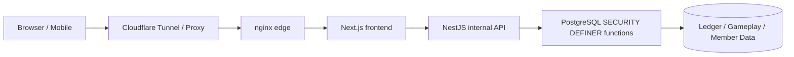
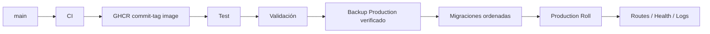

# 🌙 Woldeok Moneyverse — Guía Completa en Español

[← README principal](../README.md) · [Registro de cambios](../docs/changelog/CHANGELOG.es.md) · [Índice de documentación](../docs/INDEX.md) · [Producción](https://easy-scraping.com) · [Test](https://test.easy-scraping.com)

> Woldeok Moneyverse es una plataforma de economía virtual comunitaria que reúne profesiones, misiones, progresión, monedero WLD, tienda, acciones/negocios virtuales, banca y minijuegos de casino virtual.
>
> WLD, acciones virtuales, partidas de casino y recompensas son datos internos del servicio. No son dinero, valores, depósitos, inversiones ni productos de juego reales.

---

## 📸 Capturas del servicio real

Las imágenes se capturaron desde la Production real usando una sesión pública limpia. No incluyen cookies de miembros, datos privados, pantallas administrativas ni secretos.

| Inicio Production | Guía del servicio |
| --- | --- |
|  |  |

| Casino virtual | Estado del servicio |
| --- | --- |
|  |  |

### Diseño responsive

| Inicio móvil | Inicio tablet | Casino móvil |
| --- | --- | --- |
|  |  |  |

El Header responsive no elimina el DOM de marca con JavaScript. Los breakpoints CSS alternan `display:none`/visible, de forma que al ampliar de nuevo la ventana reaparecen logo, texto de marca y navegación de escritorio.

---

## 🎮 Áreas principales

| Área | Función | Documento |
| --- | --- | --- |
| 💼 Profesiones | 8 profesiones, tareas repetibles, WLD + EXP | [Jobs & Progression](../docs/features/jobs-and-progression.md) |
| 📋 Misiones | Eventos diarios, objetivos iniciales y progresión | [Quests](../docs/features/quests.md) |
| 💳 Monedero | Saldos WLD exactos, transferencias, libro contable | [System Overview](../docs/architecture/system-overview.md) |
| 🛒 Tienda | Precio/inventario autoritativo en DB | [Shop](../docs/features/shop.md) |
| 📈 Acciones virtuales | Precios, velas, compra/venta, cartera | [Stocks](../docs/features/stocks.md) |
| 🏢 Negocios virtuales | Propiedad y bucles económicos de largo plazo | [Businesses](../docs/features/businesses.md) |
| 🏦 Banco | Depósitos, intereses, crédito y bonos virtuales | [Banking](../docs/features/banking.md) |
| 🎰 Casino virtual | Resultado del servidor, probabilidades y límites | [Casino](../docs/features/casino.md) |
| 🛡️ Administración | Read models y controles operativos limitados | [Admin Control Center](../docs/features/admin-control-center.md) |

---

## 🏗️ Arquitectura



**Browser** renderiza la UI y nunca recibe credenciales de DB ni el token interno.

**Next.js** es el origen web público, maneja páginas/Server Actions y mantiene el contexto Session/CSRF al llamar a la API interna.

**NestJS** es una API interna de Production; valida DTO, contexto y la frontera del token interno.

**PostgreSQL** es la frontera final de consistencia económica y puede validar actor, políticas, idempotencia, saldo, inventario y ledger en una única transacción.

- [System Overview](../docs/architecture/system-overview.md)
- [Request Flow](../docs/architecture/request-flow.md)
- [Database Security](../docs/architecture/database-security.md)
- [Deployment Flow](../docs/architecture/deployment-flow.md)

---

## 💼 Profesiones y trabajo

Job 2.0 mantiene **8 profesiones × 3 tareas activas = 24 tareas activas**.

- El miembro puede acumular EXP en varias profesiones pero solo una está activa.
- Completar una tarea registra WLD y EXP profesional juntos.
- La vista previa y el pago usan la misma regla del servidor.
- El modal conserva una misma idempotency key durante un intento.
- Si la DB ya pagó pero se perdió la respuesta HTTP, reintentar la misma key devuelve el recibo anterior y evita un pago duplicado.

---

## 📋 Misiones y eventos

La interfaz solo debe prometer efectos realmente implementados.

El evento de descuento de mercado, por ejemplo, registra el Claim diario, identifica starter items elegibles, calcula 10% de descuento, usa la misma regla para precio visible/compra y termina en el cambio de fecha de Seúl.

Funciones futuras sin modelo de datos o liquidación real no se presentan como recompensas activas.

---

## 🎰 Casino virtual

El casino usa únicamente WLD interno y no ofrece cash-out real.

### Condiciones básicas

| Juego | Probabilidad | Multiplicador | RTP base |
| --- | ---: | ---: | ---: |
| Moneda | 50% | 1.9× | 95% |
| Paridad de dado | 50% | 1.9× | 95% |
| Número de dado | 1/6 | 5.7× | 95% |

### Límites de exposición

- mínimo por partida: **10 WLD**;
- máximo por partida: **200 WLD**;
- apuesta total diaria: **2.000 WLD**;
- pérdida realizada diaria: **1.000 WLD**;
- límites personales/autoexclusión pueden ser más estrictos.

### Resultado autoritativo del servidor

Las animaciones de slot, high/low, rueda, tesoro o gemas no deciden el resultado. El estado visual final deriva del recibo del servidor.

Un error anterior podía mostrar `777` tras una derrota; el mapeo actual impide que la animación contradiga el resultado almacenado.

El historial reciente usa un read model de casino por miembro, no un filtro sobre unas pocas transacciones genéricas del monedero.

---

## 🏦 Banca, crédito y bonos

- El interés mostrado y liquidado utiliza un solo contrato de servidor.
- Un cambio de saldo por depósito/retiro reinicia el reloj de acumulación.
- Interés inferior a 1 WLD sigue acumulándose en vez de redondearse gratis a 1 WLD.
- Repetir la misma idempotency key devuelve la liquidación previa.
- Nuevos préstamos usan la política de grado crediticio.
- Contratos históricos de préstamo/bono no se reescriben retroactivamente.

Saldos, principal de préstamos y bonos permanecen como enteros exactos en string.

---

## 📈 Acciones, negocios y tienda

### Acciones virtuales
- precios, velas y cartera;
- volatilidad y límites intradía son políticas del servidor;
- importes WLD usan aritmética exacta.

### Negocios virtuales
- contenido de propiedad/operación a largo plazo;
- recuperación se compara con trabajo, banca y otros faucets/sinks;
- historial de propiedad/distribución se conserva.

### Tienda
- el cliente no decide el precio;
- precio mostrado y cobrado comparten una regla DB;
- cambios admin de precio/stock pasan por funciones actor-scoped.

---

## 💰 Precisión WLD

WLD es una **cadena de entero canónica**, no un `Number` de JavaScript.

```text
PostgreSQL bigint / numeric
        ↓
node-postgres string
        ↓
API JSON string
        ↓
Frontend string / BigInt
```

Saldos/precios/préstamos superiores a 2^53 pueden perder precisión en floating point, por eso el dinero permanece string/BigInt.

---

## 🔐 Seguridad

- El browser normalmente habla con Next.js.
- NestJS es la API interna de Production.
- Solicitudes internas requieren `INTERNAL_API_TOKEN` salvo excepciones explícitas.
- Ese token nunca se incrusta en Browser/Native App.
- Escrituras económicas importantes usan funciones PostgreSQL `SECURITY DEFINER`.
- Se revoca `PUBLIC EXECUTE` no necesario.
- Operaciones que podrían duplicar valor usan idempotencia.
- Contenedores Production usan read-only rootfs, cap drop y `no-new-privileges` donde sea compatible.
- Deployment/cleanup normal no elimina DB, datos de miembros, ledger ni volúmenes Docker de Production.

[Security Model](../docs/operations/security-model.md)

---

## 📱 API móvil / aplicación externa

Una aplicación Native/Mobile **no debe incluir `INTERNAL_API_TOKEN`**.

```text
Native App
   ↓ HTTPS
Gateway / BFF
   ↓ añade token interno del servidor
NestJS API
```

El Gateway conserva secretos server-to-server y reutiliza Session, CSRF y OAuth PKCE existentes.

[Mobile / External App API](../docs/mobile-api.md)

---

## 🚀 Despliegue Test → Production



Un push a `main` ejecuta CI pero no despliega Production automáticamente. Production se despliega mediante Workflow explícito.

- checksum drift de migrations aplicadas detiene el despliegue;
- no se recrean datos/volúmenes Production;
- se usan imágenes GHCR con commit tag;
- smoke test local usa el Host público real.

---

## 💾 Backup y recuperación

Antes de cambios Production se verifica que el dump cifrado se pueda descifrar, que el dump sea legible, que el archive de fotos abra correctamente y que el backup pertenezca al stack correcto.

Los backups en el mismo host no cubren una pérdida total de SSD/host; DR completo requiere copia off-host y pruebas reales de restauración.

---

## 🧰 Desarrollo

Base actual: Node.js 24, pnpm 10, PostgreSQL 17.x (Production 17.11), nginx 1.30.4.

```bash
corepack enable
pnpm install --frozen-lockfile
pnpm lint
pnpm typecheck
pnpm build
```

Las pruebas DB deben ejecutarse contra PostgreSQL aislado, nunca contra Production.

---

## 🗂️ Documentación

- [System Overview](../docs/architecture/system-overview.md)
- [Request Flow](../docs/architecture/request-flow.md)
- [Database Security](../docs/architecture/database-security.md)
- [Deployment Flow](../docs/architecture/deployment-flow.md)
- [Jobs & Progression](../docs/features/jobs-and-progression.md)
- [Quests](../docs/features/quests.md)
- [Casino](../docs/features/casino.md)
- [Banking](../docs/features/banking.md)
- [Stocks](../docs/features/stocks.md)
- [Businesses](../docs/features/businesses.md)
- [Shop](../docs/features/shop.md)
- [Admin Control Center](../docs/features/admin-control-center.md)
- [Database Migrations](../docs/operations/database-migrations.md)
- [Backup & Recovery](../docs/operations/backup-and-recovery.md)
- [Production Deployment](../docs/operations/production-deployment.md)
- [Security Model](../docs/operations/security-model.md)
- [v2026.09.07.2 Localized Guide Parity](../docs/releases/v2026.09.07.2.md)
- [v2026.09.07.1 Documentation & Showcase](../docs/releases/v2026.09.07.1.md)
- [v2026.09.07 Gameplay / UX / Economy](../docs/releases/v2026.09.07.md)

---

## ✅ Validación

Release runtime Gameplay/UX: Backend **1.367 / 1.367 PASS**, Frontend **519 / 519 PASS**, lint 0 errors, typecheck/build PASS, Test Canary y Deploy oficiales Test/Production PASS.

El release de documentación solo cambia README/docs/capturas públicas y no necesita reiniciar Production Runtime.
