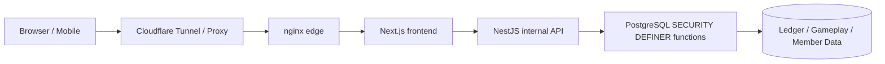
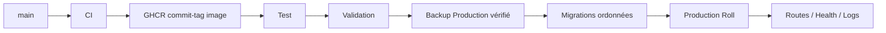

# 🌙 Woldeok Moneyverse — Guide Français Complet

[← README principal](../README.md) · [Changelog](../docs/changelog/CHANGELOG.fr.md) · [Index des documents](../docs/INDEX.md) · [Production](https://easy-scraping.com) · [Test](https://test.easy-scraping.com)

> Woldeok Moneyverse est une plateforme d’économie virtuelle communautaire réunissant métiers, quêtes, progression, portefeuille WLD, boutique, actions/entreprises virtuelles, banque et mini-jeux de casino virtuel.
>
> WLD, actions virtuelles, parties de casino et récompenses sont uniquement des données internes au service. Ce ne sont pas de l’argent réel, des titres, des dépôts, des investissements ou des produits de jeu d’argent.

---

## 📸 Captures réelles du service

Les captures ci-dessous proviennent du vrai site Production dans une session publique propre. Elles n’incluent aucun cookie de membre, donnée privée, écran administrateur ou secret.

| Accueil Production | Guide du service |
| --- | --- |
|  |  |

| Casino virtuel | État du service |
| --- | --- |
|  |  |

### Interface responsive

| Accueil mobile | Accueil tablette | Casino mobile |
| --- | --- | --- |
|  |  |  |

Le Header responsive ne supprime pas le DOM de la marque en JavaScript. Les breakpoints CSS alternent `display:none`/visible; si la fenêtre redevient large, logo, texte de marque et navigation desktop réapparaissent automatiquement.

---

## 🎮 Fonctions principales

| Zone | Rôle | Documentation |
| --- | --- | --- |
| 💼 Métiers | 8 métiers, tâches répétables, WLD + EXP métier | [Jobs & Progression](../docs/features/jobs-and-progression.md) |
| 📋 Quêtes | Événements quotidiens et progression | [Quests](../docs/features/quests.md) |
| 💳 Portefeuille | Soldes WLD exacts, transferts et registre | [System Overview](../docs/architecture/system-overview.md) |
| 🛒 Boutique | Prix/stock autoritaires en DB | [Shop](../docs/features/shop.md) |
| 📈 Actions virtuelles | Prix, bougies, achats/ventes, portefeuille | [Stocks](../docs/features/stocks.md) |
| 🏢 Entreprises | Propriété et boucles économiques longues | [Businesses](../docs/features/businesses.md) |
| 🏦 Banque | Dépôts, intérêts, crédit et obligations virtuelles | [Banking](../docs/features/banking.md) |
| 🎰 Casino virtuel | Résultats serveur, probabilités et limites | [Casino](../docs/features/casino.md) |
| 🛡️ Administration | Read models et contrôles opérationnels limités | [Admin Control Center](../docs/features/admin-control-center.md) |

---

## 🏗️ Architecture



**Browser** rend l’interface et ne reçoit jamais le token API interne ni les identifiants de base de données.

**Next.js** est l’origine web publique, gère les pages/Server Actions et conserve le contexte Session/CSRF lors des appels internes.

**NestJS** est l’API interne Production: validation DTO/contexte et frontière du token interne.

**PostgreSQL** est la frontière finale de cohérence économique: acteur, politique, idempotence, solde, inventaire et registre peuvent être validés dans une transaction atomique.

- [System Overview](../docs/architecture/system-overview.md)
- [Request Flow](../docs/architecture/request-flow.md)
- [Database Security](../docs/architecture/database-security.md)
- [Deployment Flow](../docs/architecture/deployment-flow.md)

---

## 💼 Métiers et tâches

Job 2.0 est normalisé à **8 métiers × 3 tâches actives = 24 tâches**.

- Un membre peut accumuler de l’EXP dans plusieurs métiers mais un seul métier est actif.
- Une tâche validée enregistre WLD et EXP métier ensemble.
- L’aperçu et le paiement utilisent le même calcul serveur.
- Le modal conserve une même idempotency key pour une tentative.
- Si la DB a déjà validé mais que la réponse HTTP est perdue, rejouer la même clé renvoie le reçu existant sans double paiement.

---

## 📋 Quêtes et événements

Le texte d’une quête ne doit annoncer que des effets réellement implémentés.

L’événement de remise de marché suit un contrat complet: claim du jour, sélection des starter items éligibles, calcul de 10% de remise, même prix effectif pour affichage/achat, expiration à la frontière de date de Séoul.

Les mécanismes futurs sans modèle de données ou traitement serveur réel ne sont pas présentés comme récompenses actives.

---

## 🎰 Casino virtuel

Le casino utilise seulement des WLD internes et ne permet aucun cash-out réel.

### Conditions principales

| Jeu | Probabilité | Multiplicateur | RTP de base |
| --- | ---: | ---: | ---: |
| Pièce | 50% | 1.9× | 95% |
| Parité du dé | 50% | 1.9× | 95% |
| Nombre du dé | 1/6 | 5.7× | 95% |

### Limites d’exposition

- minimum: **10 WLD**;
- maximum par partie: **200 WLD**;
- mise totale quotidienne: **2 000 WLD**;
- perte réalisée quotidienne: **1 000 WLD**;
- les limites personnelles / auto-exclusion peuvent être plus strictes.

### Résultat autoritaire serveur

Les animations slot, high/low, roue, coffre et gemme ne décident jamais le résultat. Leur état final provient du reçu serveur.

Un ancien bug pouvait afficher `777` après un résultat perdant; la correspondance actuelle empêche toute contradiction entre animation et résultat enregistré.

L’historique récent utilise aussi un read model casino par membre plutôt qu’un filtre sur quelques transactions génériques du portefeuille.

---

## 🏦 Banque, crédit et obligations

- Taux affiché et règlement des intérêts utilisent le même contrat serveur.
- Un dépôt/retrait réinitialise l’horloge d’accumulation.
- Un intérêt < 1 WLD continue à s’accumuler au lieu d’être arrondi gratuitement à 1 WLD.
- Rejouer la même idempotency key retourne le règlement existant.
- Les nouveaux prêts utilisent la politique de grade de crédit.
- Les anciens contrats de prêt/obligation ne sont pas réécrits rétroactivement.

Soldes, principal et règlements restent des chaînes d’entiers exactes.

---

## 📈 Actions, entreprises et boutique

### Actions virtuelles
- prix, bougies et portefeuille;
- volatilité et limites intrajournalières sont des politiques serveur;
- prix/profits WLD utilisent des entiers exacts.

### Entreprises virtuelles
- boucle de propriété/opération longue;
- horizon de remboursement comparé aux autres faucets/sinks;
- historiques de propriété/distribution conservés.

### Boutique
- le client ne décide pas du prix;
- prix affiché et prix payé partagent la même règle DB;
- mutations admin prix/stock passent par des fonctions actor-scoped.

---

## 💰 Précision WLD

WLD est une **chaîne d’entier canonique**, pas un `Number` JavaScript.

```text
PostgreSQL bigint / numeric
        ↓
node-postgres string
        ↓
API JSON string
        ↓
Frontend string / BigInt
```

Au-delà de 2^53, un nombre flottant peut perdre la précision; soldes, prix, prêts et valeur nette restent donc string/BigInt.

---

## 🔐 Sécurité

- Le navigateur communique normalement avec Next.js.
- NestJS est l’API interne Production.
- Les requêtes internes nécessitent `INTERNAL_API_TOKEN` sauf exemptions explicites.
- Ce token n’est jamais embarqué dans Browser/Native App.
- Les écritures économiques importantes utilisent PostgreSQL `SECURITY DEFINER`.
- Les `PUBLIC EXECUTE` non nécessaires sont révoqués.
- Les écritures pouvant dupliquer de la valeur utilisent l’idempotence.
- Les conteneurs Production utilisent read-only rootfs, cap drop et `no-new-privileges` lorsque possible.
- Le déploiement/nettoyage normal ne supprime pas DB, membres, ledger ni volumes Docker Production.

[Security Model](../docs/operations/security-model.md)

---

## 📱 API mobile / application externe

Une application Native/Mobile ne doit **jamais intégrer `INTERNAL_API_TOKEN`**.

```text
Native App
   ↓ HTTPS
Gateway / BFF
   ↓ ajoute le token interne côté serveur
NestJS API
```

Le Gateway conserve le secret server-to-server et réutilise Session, CSRF et OAuth PKCE existants.

[Mobile / External App API](../docs/mobile-api.md)

---

## 🚀 Déploiement Test → Production



Un push sur `main` lance CI mais ne déploie pas automatiquement Production. Production passe par un Workflow Deploy explicite.

- un checksum drift de migration appliquée arrête le rollout;
- les données/volumes Production ne sont pas recréés;
- les images GHCR sont taguées par commit;
- le smoke test local utilise le vrai Host public.

---

## 💾 Backup et récupération

Avant un changement Production, on vérifie que le dump chiffré se déchiffre, que sa structure est lisible, que l’archive photo s’ouvre et que le backup appartient au bon stack.

Un backup sur le même hôte ne protège pas contre la perte totale du serveur/SSD; un vrai DR nécessite une copie off-host et des tests de restauration.

---

## 🧰 Développement

Base actuelle: Node.js 24, pnpm 10, PostgreSQL 17.x (Production 17.11), nginx 1.30.4.

```bash
corepack enable
pnpm install --frozen-lockfile
pnpm lint
pnpm typecheck
pnpm build
```

Les tests DB doivent utiliser PostgreSQL isolé, jamais Production.

---

## 🗂️ Documentation

- [System Overview](../docs/architecture/system-overview.md)
- [Request Flow](../docs/architecture/request-flow.md)
- [Database Security](../docs/architecture/database-security.md)
- [Deployment Flow](../docs/architecture/deployment-flow.md)
- [Jobs & Progression](../docs/features/jobs-and-progression.md)
- [Quests](../docs/features/quests.md)
- [Casino](../docs/features/casino.md)
- [Banking](../docs/features/banking.md)
- [Stocks](../docs/features/stocks.md)
- [Businesses](../docs/features/businesses.md)
- [Shop](../docs/features/shop.md)
- [Admin Control Center](../docs/features/admin-control-center.md)
- [Database Migrations](../docs/operations/database-migrations.md)
- [Backup & Recovery](../docs/operations/backup-and-recovery.md)
- [Production Deployment](../docs/operations/production-deployment.md)
- [Security Model](../docs/operations/security-model.md)
- [v2026.09.07.2 Localized Guide Parity](../docs/releases/v2026.09.07.2.md)
- [v2026.09.07.1 Documentation & Showcase](../docs/releases/v2026.09.07.1.md)
- [v2026.09.07 Gameplay / UX / Economy](../docs/releases/v2026.09.07.md)

---

## ✅ Validation

Release runtime Gameplay/UX: Backend **1 367 / 1 367 PASS**, Frontend **519 / 519 PASS**, lint 0 errors, typecheck/build PASS, Test Canary et Deploy officiels Test/Production PASS.

La release de documentation ne modifie que README/docs/captures publiques et ne nécessite pas de redémarrage du runtime Production.
