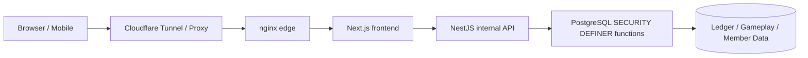
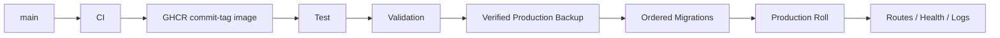

# 🌙 Woldeok Moneyverse — पूर्ण हिन्दी गाइड

[← मुख्य README](../README.md) · [परिवर्तन लॉग](../docs/changelog/CHANGELOG.hi.md) · [दस्तावेज़ सूची](../docs/INDEX.md) · [Production](https://easy-scraping.com) · [Test](https://test.easy-scraping.com)

> Woldeok Moneyverse एक community virtual-economy platform है जिसमें careers, quests, progression, WLD wallet, shop, virtual stocks/businesses, banking और virtual casino minigames एक ही responsive web service में जुड़े हैं।
>
> WLD, virtual stocks, casino plays और rewards केवल service के अंदर के virtual data हैं; वे वास्तविक पैसा, securities, deposits, investments या real gambling products नहीं हैं।

---

## 📸 वास्तविक सेवा के स्क्रीनशॉट

नीचे की images वास्तविक Production की clean public session से ली गई हैं। इनमें member cookies, private account data, admin screens या secrets शामिल नहीं हैं।

| Production Home | Service Guide |
| --- | --- |
|  |  |

| Virtual Casino | Service Status |
| --- | --- |
|  |  |

### Responsive UI

| Mobile Home | Tablet Home | Mobile Casino |
| --- | --- | --- |
|  |  |  |

Responsive Header JavaScript से brand DOM को हटाता नहीं है। CSS breakpoints `display:none`/visible state बदलते हैं, इसलिए viewport फिर बड़ा होने पर logo, brand text और desktop navigation स्वतः वापस दिखाई देते हैं।

---

## 🎮 मुख्य फीचर्स

| क्षेत्र | क्या करता है | दस्तावेज़ |
| --- | --- | --- |
| 💼 Careers | 8 careers, repeatable tasks, WLD + career EXP | [Jobs & Progression](../docs/features/jobs-and-progression.md) |
| 📋 Quests | Daily events, early-game goals, progression | [Quests](../docs/features/quests.md) |
| 💳 Wallet | Exact WLD balances, transfers, ledger history | [System Overview](../docs/architecture/system-overview.md) |
| 🛒 Shop | DB-authoritative price, inventory और stock | [Shop](../docs/features/shop.md) |
| 📈 Virtual Stocks | Prices, candles, buy/sell और portfolio | [Stocks](../docs/features/stocks.md) |
| 🏢 Virtual Businesses | Ownership और long-term economy loop | [Businesses](../docs/features/businesses.md) |
| 🏦 Banking | Deposits, interest, credit-grade loans, virtual bonds | [Banking](../docs/features/banking.md) |
| 🎰 Virtual Casino | Server-authoritative result, disclosed odds, limits | [Casino](../docs/features/casino.md) |
| 🛡️ Admin Tools | Scoped operational/economy read models | [Admin Control Center](../docs/features/admin-control-center.md) |

---

## 🏗️ Architecture



**Browser** responsive UI render करता है और internal API token या DB credentials प्राप्त नहीं करता।

**Next.js** public web origin है, pages/Server Actions संभालता है और Session/CSRF context के साथ internal API calls करता है।

**NestJS** Production का internal API है, DTO/context validation और internal-token boundary लागू करता है।

**PostgreSQL** economy consistency की अंतिम सीमा है; Actor, Policy, Idempotency, balance, inventory और ledger writes एक atomic transaction में जाँचे जा सकते हैं।

- [System Overview](../docs/architecture/system-overview.md)
- [Request Flow](../docs/architecture/request-flow.md)
- [Database Security](../docs/architecture/database-security.md)
- [Deployment Flow](../docs/architecture/deployment-flow.md)

---

## 💼 Careers और Work

Job 2.0 को **8 careers × हर career में 3 active tasks = 24 active tasks** पर normalize किया गया है।

- Member कई careers में EXP जमा कर सकता है लेकिन एक समय में एक active career रहता है।
- Task completion WLD और career EXP साथ में रिकॉर्ड करता है।
- Reward preview और वास्तविक settlement एक ही server rule इस्तेमाल करते हैं।
- Work modal एक attempt के लिए वही idempotency key रखता है।
- यदि DB ने reward commit कर दिया लेकिन HTTP response खो गया, उसी key से retry पुराना receipt लौटाता है और duplicate payment नहीं करता।

---

## 📋 Quests और Events

Quest text केवल वही effect बताता है जो वास्तव में implemented है।

Market-sale event का पूरा contract: आज का Claim रिकॉर्ड, eligible starter items पहचानना, 10% Effective Price गणना, UI/खरीद में वही pricing rule और Seoul date boundary पर effect समाप्त।

जिस future feature का वास्तविक data model या server settlement नहीं है, उसे active reward की तरह advertise नहीं किया जाता।

---

## 🎰 Virtual Casino

Casino केवल service के अंदर के WLD का उपयोग करता है और real-money cash-out नहीं देता।

### Core disclosed terms

| Game | Win probability | Multiplier | Baseline RTP |
| --- | ---: | ---: | ---: |
| Coin | 50% | 1.9× | 95% |
| Dice parity | 50% | 1.9× | 95% |
| Dice number | 1/6 | 5.7× | 95% |

### Platform exposure limits

- minimum stake: **10 WLD**
- maximum per play: **200 WLD**
- daily total stake: **2,000 WLD**
- daily realized loss: **1,000 WLD**
- Member self-limits/self-exclusion इससे अधिक strict हो सकते हैं।

### Server-authoritative result

Slot, high/low, wheel, treasure और gem animations परिणाम तय नहीं करते। Final visual state server receipt से आता है।

पहले एक UI bug losing receipt के बाद भी `777` दिखा सकता था; अब theme mapping stored server result के विरुद्ध नहीं जा सकता।

Recent gameplay history member-scoped casino read model से आता है, generic wallet की कुछ latest transactions filter करके नहीं।

---

## 🏦 Banking, Credit और Bonds

- Displayed deposit rate और वास्तविक settlement एक ही server contract उपयोग करते हैं।
- Deposit/withdrawal से balance बदलने पर accrual clock reset होता है।
- 1 WLD से कम interest को मुफ्त में 1 WLD round-up नहीं किया जाता; वह आगे accumulate होता है।
- Same idempotency key retry existing settlement लौटाता है।
- New loans credit-grade policy इस्तेमाल करते हैं।
- Existing loan/bond contracts को नई release पीछे से rewrite नहीं करती।

Balances, loan principal और bond settlements exact integer strings रहते हैं।

---

## 📈 Stocks, Businesses और Shop

### Virtual Stocks
- Prices, candles और portfolio.
- Volatility और intraday limits server economy policy हैं।
- WLD prices/proceeds exact integer handling उपयोग करते हैं।

### Virtual Businesses
- Long-horizon ownership/operation loop.
- Payback को work, banking और दूसरे faucet/sink के साथ compare किया जाता है।
- Historical ownership/distribution records preserve किए जाते हैं।

### Shop
- Client final price तय नहीं करता।
- Displayed Effective Price और charged price एक ही DB rule उपयोग करते हैं।
- Admin price/stock update भी actor-scoped DB functions से गुजरता है।

---

## 💰 WLD Precision Rule

WLD एक **canonical integer string** है, JavaScript `Number` नहीं।

```text
PostgreSQL bigint / numeric
        ↓
node-postgres string
        ↓
API JSON string
        ↓
Frontend string / BigInt
```

2^53 से बड़े balances/prices/loans floating-point में precision खो सकते हैं, इसलिए money values string/BigInt रूप में रहते हैं।

---

## 🔐 Security Model

- Browser सामान्यतः Next.js से बात करता है।
- NestJS Production internal API है।
- Explicit exceptions के अलावा internal requests को `INTERNAL_API_TOKEN` चाहिए।
- यह token Browser/Native App में embed नहीं किया जाता।
- Critical economy writes PostgreSQL `SECURITY DEFINER` functions में केंद्रित हैं।
- Unneeded `PUBLIC EXECUTE` revoke किया जाता है।
- Retry पर value duplicate हो सकने वाले writes idempotency उपयोग करते हैं।
- Production containers जहाँ संभव हो read-only rootfs, cap drop और `no-new-privileges` इस्तेमाल करते हैं।
- Normal deploy/cleanup Production DB, member data, ledger या Docker volumes delete नहीं करता।

[Security Model](../docs/operations/security-model.md)

---

## 📱 Mobile / External App API

Native/Mobile App में **`INTERNAL_API_TOKEN` embed नहीं करना चाहिए**।

```text
Native App
   ↓ HTTPS
Gateway / BFF
   ↓ server-side internal token जोड़ता है
NestJS API
```

Gateway server-to-server secret रखता है और मौजूदा Session, CSRF और OAuth PKCE model reuse करता है।

[Mobile / External App API](../docs/mobile-api.md)

---

## 🚀 Test → Production Deployment



`main` push CI चलाता है लेकिन Production को auto-deploy नहीं करता। Production explicit Deploy Workflow से deploy होता है।

- Applied migration checksum drift rollout रोकता है।
- Production data/volumes recreate नहीं होते।
- Commit-tagged GHCR images runtime identity pin करते हैं।
- Local edge smoke test वास्तविक public Host header भेजता है।

---

## 💾 Backup और Recovery

Production change से पहले encrypted DB dump decryptability, dump readability, photo archive और Test/Production stack identity verify किए जाते हैं।

Same host backup total SSD/host failure से नहीं बचाता; पूर्ण DR के लिए off-host copy और वास्तविक restore test आवश्यक है।

---

## 🧰 Development

Current baseline: Node.js 24, pnpm 10, PostgreSQL 17.x (Production 17.11), nginx 1.30.4.

```bash
corepack enable
pnpm install --frozen-lockfile
pnpm lint
pnpm typecheck
pnpm build
```

DB tests isolated PostgreSQL पर चलने चाहिए, Production पर कभी नहीं।

---

## 🗂️ Documentation

- [System Overview](../docs/architecture/system-overview.md)
- [Request Flow](../docs/architecture/request-flow.md)
- [Database Security](../docs/architecture/database-security.md)
- [Deployment Flow](../docs/architecture/deployment-flow.md)
- [Jobs & Progression](../docs/features/jobs-and-progression.md)
- [Quests](../docs/features/quests.md)
- [Casino](../docs/features/casino.md)
- [Banking](../docs/features/banking.md)
- [Stocks](../docs/features/stocks.md)
- [Businesses](../docs/features/businesses.md)
- [Shop](../docs/features/shop.md)
- [Admin Control Center](../docs/features/admin-control-center.md)
- [Database Migrations](../docs/operations/database-migrations.md)
- [Backup & Recovery](../docs/operations/backup-and-recovery.md)
- [Production Deployment](../docs/operations/production-deployment.md)
- [Security Model](../docs/operations/security-model.md)
- [v2026.09.07.2 Localized Guide Parity](../docs/releases/v2026.09.07.2.md)
- [v2026.09.07.1 Documentation & Showcase](../docs/releases/v2026.09.07.1.md)
- [v2026.09.07 Gameplay / UX / Economy](../docs/releases/v2026.09.07.md)

---

## ✅ Validation Baseline

Gameplay/UX Runtime Release: Backend **1,367 / 1,367 PASS**, Frontend **519 / 519 PASS**, lint 0 errors, typecheck/build PASS, Test Canary और official GitHub Test/Production Deploy PASS।

Documentation Release केवल README/docs/public screenshots बदलता है और Production Runtime restart की आवश्यकता नहीं है।
