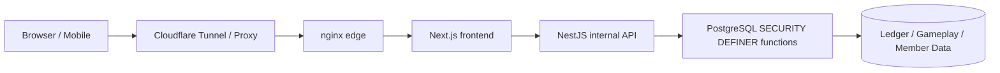
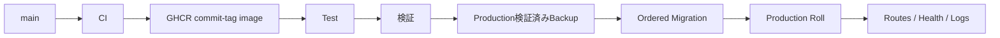

# 🌙 Woldeok Moneyverse — 日本語完全ガイド

[← Main README](../README.md) · [変更履歴](../docs/changelog/CHANGELOG.ja.md) · [ドキュメント一覧](../docs/INDEX.md) · [Production](https://easy-scraping.com) · [Test](https://test.easy-scraping.com)

> Woldeok Moneyverse は、職業・クエスト・成長・WLDウォレット・ショップ・仮想株式/事業・銀行・仮想カジノを統合したコミュニティ向け仮想経済サービスです。
>
> WLD、仮想株式、カジノ結果、報酬はすべてサービス内部の仮想データであり、現実の通貨・証券・預金・投資・ギャンブル商品ではありません。

---

## 📸 実際のサービス画面

以下は実際の Production をクリーンな公開セッションで撮影した画面です。会員 Cookie、個人情報、管理者画面、秘密情報は含みません。

| Production ホーム | サービスガイド |
| --- | --- |
|  |  |

| 仮想カジノ | サービスステータス |
| --- | --- |
|  |  |

### レスポンシブUI

| モバイルホーム | タブレットホーム | モバイルカジノ |
| --- | --- | --- |
|  |  |  |

レスポンシブ Header は JavaScript でブランド DOM を削除しません。CSS breakpoint で `display:none`/表示状態を切り替えるため、画面幅を戻すと Logo・ブランド名・デスクトップナビゲーションも自動的に復元されます。

---

## 🎮 主な機能

| 領域 | 内容 | 詳細 |
| --- | --- | --- |
| 💼 職業/仕事 | 8職業、反復タスク、WLD + 職業EXP | [Jobs & Progression](../docs/features/jobs-and-progression.md) |
| 📋 クエスト | デイリーイベント、初期目標、成長導線 | [Quests](../docs/features/quests.md) |
| 💳 ウォレット | 正確なWLD残高、送金、台帳履歴 | [System Overview](../docs/architecture/system-overview.md) |
| 🛒 ショップ | DB権威の価格・在庫・購入 | [Shop](../docs/features/shop.md) |
| 📈 仮想株式 | 価格、ローソク足、売買、ポートフォリオ | [Stocks](../docs/features/stocks.md) |
| 🏢 仮想事業 | 所有と長期経済ループ | [Businesses](../docs/features/businesses.md) |
| 🏦 銀行 | 預金、利息、信用ランク別ローン、仮想債券 | [Banking](../docs/features/banking.md) |
| 🎰 仮想カジノ | サーバー判定、公開確率、自己制限 | [Casino](../docs/features/casino.md) |
| 🛡️ 管理ツール | 制限された運用/経済 read model と制御 | [Admin Control Center](../docs/features/admin-control-center.md) |

---

## 🏗️ アーキテクチャ



**Browser** はUIのみを担当し、内部API tokenやDB資格情報を受け取りません。

**Next.js** は公開Web OriginとしてページとServer Actionを処理し、Session/CSRFコンテキストを保ったまま内部APIを呼びます。

**NestJS** はProduction内部APIであり、DTO/認証コンテキスト/内部token境界を検証します。

**PostgreSQL** は経済整合性の最終境界で、Actor・Policy・Idempotency・残高・在庫・台帳更新を同一トランザクション内で検証できます。

- [System Overview](../docs/architecture/system-overview.md)
- [Request Flow](../docs/architecture/request-flow.md)
- [Database Security](../docs/architecture/database-security.md)
- [Deployment Flow](../docs/architecture/deployment-flow.md)

---

## 💼 職業/作業システム

現在の Job 2.0 は **8職業 × 各3アクティブタスク = 24タスク**です。

- 複数職業のEXPを蓄積できますがアクティブ職業は1つです。
- タスク完了時に WLD と職業EXPを同時記録します。
- 表示報酬と実際の支払いは同じサーバールールを使用します。
- 作業モーダルは1回の試行で同じ idempotency key を保持します。
- DB決済済みなのにHTTP応答だけ失われた場合、同じkeyの再試行は既存receiptを返し二重支払いを防ぎます。

---

## 📋 クエスト/イベント

クエスト文言は実装済みの効果だけを説明します。

「市場割引日」のような完全実装イベントでは、当日Claim → 対象商品判定 → 10% Effective Price → 表示/決済に同じ価格ルール → ソウル日付境界で終了、という一貫した契約を使います。

実際のデータモデルやサーバー処理がない将来機能を、現在利用可能な報酬のようには表示しません。

---

## 🎰 仮想カジノ

カジノはサービス内WLDのみを使い、現実通貨への換金はありません。

### 公開コア条件

| ゲーム | 勝率 | 倍率 | 基準RTP |
| --- | ---: | ---: | ---: |
| コイン | 50% | 1.9× | 95% |
| ダイス偶奇 | 50% | 1.9× | 95% |
| ダイス数字 | 1/6 | 5.7× | 95% |

### プラットフォーム制限

- 1回最小: **10 WLD**
- 1回最大: **200 WLD**
- 1日総ベット: **2,000 WLD**
- 1日実現損失: **1,000 WLD**
- 会員の自己制限/自己排除はさらに厳しく設定可能

### サーバー権威型結果

スロット、High/Low、ホイール、宝箱、ジェムなどのテーマUIは結果を決定しません。最終表示はサーバーreceiptの結果から生成します。

過去の「敗北receiptなのに `777` と表示される」問題は修正され、テーマアニメーションと保存済み結果が矛盾しないようになっています。

ゲーム履歴も一般ウォレットの短い履歴をフィルターせず、会員範囲のcasino history read modelを使用します。

---

## 🏦 銀行・信用・仮想債券

- 表示預金金利と実際の決済は同じサーバー契約を使用します。
- 入出金で残高が変わると利息累積時刻をリセットします。
- 1 WLD未満の利息は蓄積し、無条件に1 WLDへ切り上げません。
- 同一 interest claim idempotency key の再試行は既存決済を返します。
- 新規ローンは信用ランクPolicyを使います。
- 既存ローン/債券契約を新リリースで遡及変更しません。

残高・元本・債券決済は正確な整数文字列で保持します。

---

## 📈 株式・事業・ショップ

### 仮想株式
- 価格、ローソク足、ポートフォリオ。
- ボラティリティ/日中変動上限はサーバー経済Policy。
- WLD価格・売買代金は正確な整数として扱います。

### 仮想事業
- 長期所有/運用コンテンツ。
- 回収期間は仕事報酬・銀行・他Faucet/Sinkと合わせて評価します。
- 過去の所有/分配履歴は保持します。

### ショップ
- Client提出価格は権威値ではありません。
- 表示Effective Priceと購入決済は同じDBルールを使います。
- 管理者価格/在庫更新もActor-scoped DB functionを通ります。

---

## 💰 WLD精度ルール

WLDは JavaScript `Number` ではなく **canonical integer string** です。

```text
PostgreSQL bigint / numeric
        ↓
node-postgres string
        ↓
API JSON string
        ↓
Frontend string / BigInt
```

2^53を超える残高・価格・ローン・純資産を浮動小数にすると精度が失われるため、金額は文字列/BigIntで保持します。

---

## 🔐 セキュリティモデル

- Browserは通常Next.jsとのみ通信。
- NestJSはProduction内部API。
- 明示的な例外以外は `INTERNAL_API_TOKEN` が必要。
- TokenをBrowser/Native Appへ埋め込みません。
- 重要な経済Writeは PostgreSQL `SECURITY DEFINER` function中心。
- 不要な `PUBLIC EXECUTE` は削除。
- Retryで価値が重複しうるWriteはIdempotencyを使用。
- Production containerは可能な範囲でread-only rootfs、cap drop、`no-new-privileges`。
- 通常のDeploy/CleanupでProduction DB・会員データ・Ledger・Docker Volumeを削除しません。

[Security Model](../docs/operations/security-model.md)

---

## 📱 Mobile / External App API

Native/Mobile Appへ **`INTERNAL_API_TOKEN` を直接埋め込んではいけません**。

```text
Native App
   ↓ HTTPS
Gateway / BFF
   ↓ server-side internal token
NestJS API
```

Gatewayがserver-to-server secretを保持し、既存Session・CSRF・OAuth PKCEモデルを再利用します。

[Mobile / External App API](../docs/mobile-api.md)

---

## 🚀 Test → Production デプロイ



`main` push はCIを実行しますがProductionを自動デプロイしません。Productionは明示的なDeploy Workflowで実行します。

- 適用済みMigrationのchecksum driftがあれば停止。
- Production data/volumeは再作成しません。
- Commit-tagged GHCR Imageを使用。
- Local Edge Smoke Testは実際のPublic Host Headerを使います。

---

## 💾 バックアップ/復旧

Production変更前バックアップでは、暗号化DB dumpの復号、dumpの読み取り、写真Archive、Test/Production Stack識別まで確認します。

同一ホスト上のBackupだけではホスト/SSD全損に対応できないため、完全DRにはOff-host Backupと実Restoreテストが必要です。

---

## 🧰 開発環境

現在の基準: Node.js 24、pnpm 10、PostgreSQL 17.x（Production 17.11）、nginx 1.30.4。

```bash
corepack enable
pnpm install --frozen-lockfile
pnpm lint
pnpm typecheck
pnpm build
```

DBテストは隔離PostgreSQLで実行し、Production DBをテスト対象にしてはいけません。

---

## 🗂️ ドキュメント

- [System Overview](../docs/architecture/system-overview.md)
- [Request Flow](../docs/architecture/request-flow.md)
- [Database Security](../docs/architecture/database-security.md)
- [Deployment Flow](../docs/architecture/deployment-flow.md)
- [Jobs & Progression](../docs/features/jobs-and-progression.md)
- [Quests](../docs/features/quests.md)
- [Casino](../docs/features/casino.md)
- [Banking](../docs/features/banking.md)
- [Stocks](../docs/features/stocks.md)
- [Businesses](../docs/features/businesses.md)
- [Shop](../docs/features/shop.md)
- [Admin Control Center](../docs/features/admin-control-center.md)
- [Local Development](../docs/operations/local-development.md)
- [Database Migrations](../docs/operations/database-migrations.md)
- [Backup & Recovery](../docs/operations/backup-and-recovery.md)
- [Production Deployment](../docs/operations/production-deployment.md)
- [Security Model](../docs/operations/security-model.md)
- [v2026.09.07.2 Localized Guide Parity](../docs/releases/v2026.09.07.2.md)
- [v2026.09.07.1 Documentation & Showcase](../docs/releases/v2026.09.07.1.md)
- [v2026.09.07 Gameplay / UX / Economy](../docs/releases/v2026.09.07.md)

---

## ✅ 検証基準

Gameplay/UX Runtime Release: Backend **1,367 / 1,367 PASS**、Frontend **519 / 519 PASS**、lint 0 errors、typecheck/build PASS、Test Canaryと公式GitHub Test/Production DeployともにPASS。

Documentation ReleaseはREADME/Docs/公開Screenshotのみを変更し、Production Runtimeの再起動を必要としません。
