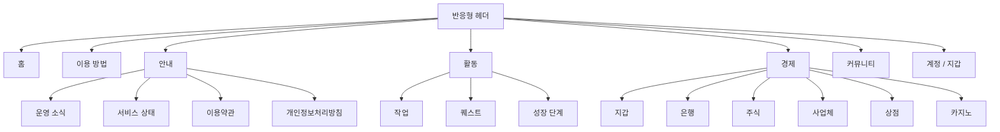
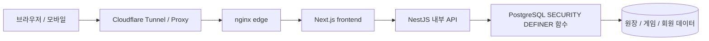
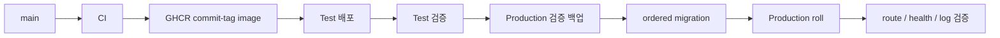

# 🌙 월덕 머니버스 — 한국어 완전 가이드

[← 메인 README](../README.md) · [변경 기록](../docs/changelog/CHANGELOG.ko.md) · [전체 문서](../docs/INDEX.md) · [운영 사이트](https://easy-scraping.com) · [테스트 사이트](https://test.easy-scraping.com)

> **월덕 머니버스**는 커뮤니티 구성원이 직업, 퀘스트, 성장, 지갑, 상점, 가상 주식/사업체, 은행, 가상 카지노를 이용할 수 있는 **서비스 내부 가상 경제 플랫폼**입니다.
>
> WLD, 가상 주식, 카지노 플레이, 직업 보상은 모두 서비스 내부 데이터이며 실제 통화·증권·예금·투자·도박 상품이 아닙니다.

---

## 📸 실제 서비스 화면

아래 이미지는 회원 쿠키나 관리자 권한을 사용하지 않은 **실제 Production 공개 세션**에서 캡처한 문서용 화면입니다.

| 홈 | 서비스 가이드 |
| --- | --- |
|  |  |

| 가상 카지노 | 서비스 상태 |
| --- | --- |
|  |  |

### 반응형 UI

| 모바일 홈 | 태블릿 홈 | 모바일 카지노 |
| --- | --- | --- |
|  |  |  |

헤더/브랜드는 화면이 좁아졌다고 DOM에서 삭제하지 않습니다. CSS breakpoint에 따라 `display:none`/표시 상태가 바뀌며, 창을 다시 넓히면 로고·브랜드·메뉴가 자동으로 복구됩니다.

---

## 🎮 주요 기능

| 영역 | 설명 | 상세 문서 |
| --- | --- | --- |
| 💼 직업/작업 | 8개 직업, 반복 업무, WLD + 직업 EXP | [직업/성장](../docs/features/jobs-and-progression.md) |
| 📋 퀘스트 | 일일 사건, 초반 목표, 성장 연결 | [퀘스트](../docs/features/quests.md) |
| 💳 지갑 | WLD 잔액, 송금, 원장 기반 거래 기록 | [시스템 개요](../docs/architecture/system-overview.md) |
| 🛒 상점 | DB 권한 기반 가격/재고/구매 | [상점](../docs/features/shop.md) |
| 📈 가상 주식 | 가격, 캔들, 매수/매도, 포트폴리오 | [주식](../docs/features/stocks.md) |
| 🏢 가상 사업체 | 소유, 운영, 장기 경제 루프 | [사업체](../docs/features/businesses.md) |
| 🏦 은행 | 예금, 이자, 신용등급 대출, 가상 채권 | [은행](../docs/features/banking.md) |
| 🎰 가상 카지노 | 서버 판정 결과, 공개 확률, 자기 한도 | [카지노](../docs/features/casino.md) |
| 🛡️ 관리자 도구 | 운영/경제 read model 및 제한된 제어 함수 | [관리자 Control Center](../docs/features/admin-control-center.md) |

---

## 🧭 UI 정보 구조



실제 메뉴 표시 방식은 화면폭, 로그인 상태, 언어에 따라 달라질 수 있지만 기능 정보 구조는 위 흐름을 따릅니다.

---

## 🏗️ 아키텍처



### 계층별 역할

**브라우저**
- 반응형 UI 렌더링
- same-origin 세션 사용
- 내부 API token이나 DB 자격증명을 받지 않음

**Next.js**
- 공개 웹 origin
- Server Action과 페이지 렌더링
- 세션/CSRF 맥락을 유지한 내부 API 호출

**NestJS**
- 외부 공개용 일반 API origin이 아니라 내부 서비스
- DTO 검증, 요청 컨텍스트, 내부 token 경계
- DB 함수/read model 호출

**PostgreSQL**
- 경제/권한 정합성의 최종 경계
- 중요 쓰기에서 사용자, 정책, 멱등성, 원장, 재고/잔액을 한 트랜잭션에서 검증

자세한 내용:
- [시스템 개요](../docs/architecture/system-overview.md)
- [요청 흐름](../docs/architecture/request-flow.md)
- [DB 보안 경계](../docs/architecture/database-security.md)
- [배포 흐름](../docs/architecture/deployment-flow.md)

---

## 💼 직업/작업 시스템

현재 Job 2.0 기준은 **8개 직업 × 직업별 3개 활성 업무 = 24개 활성 업무**입니다.

- 한 회원은 여러 직업의 누적 EXP를 가질 수 있지만 활성 직업은 하나만 유지합니다.
- 업무 보상은 WLD와 직업 EXP를 함께 기록합니다.
- 화면 미리보기와 실제 지급 계산은 같은 서버 규칙을 사용해야 합니다.
- 느린 네트워크에서도 모달을 닫았다 다시 열지 않고 복구할 수 있도록 동일 idempotency key를 유지합니다.
- 서버가 이미 지급했는데 응답만 유실된 경우 같은 키로 재시도하면 기존 receipt를 재사용하여 중복 지급을 막습니다.

---

## 📋 퀘스트/이벤트

퀘스트는 실제 구현된 보상만 설명해야 합니다.

예를 들어 `시장 할인일`은:

1. 오늘 사건 claim 기록
2. 대상 starter item 판별
3. 10% 할인된 effective price 계산
4. 상점 표시 가격과 실제 결제 가격에 동일 규칙 적용
5. 서울 날짜 기준 종료

흐름으로 완전히 구현되어 있습니다.

아직 실제 데이터 모델/지급 로직이 없는 미래 기능은 `준비 중`이라는 표현만으로 실제 보상처럼 약속하지 않습니다.

---

## 🎰 가상 카지노

카지노는 WLD만 사용하는 서비스 내부 엔터테인먼트 기능입니다.

### 핵심 확률 기준

| 게임 | 승률 | 배당 | 기준 RTP |
| --- | ---: | ---: | ---: |
| 동전 | 50% | 1.9× | 95% |
| 주사위 홀짝 | 50% | 1.9× | 95% |
| 주사위 숫자 | 1/6 | 5.7× | 95% |

### 현재 플랫폼 노출 제한

- 1회 최소: **10 WLD**
- 1회 최대: **200 WLD**
- 하루 총 베팅: **2,000 WLD**
- 하루 실손실: **1,000 WLD**
- 사용자 자기 한도/자가 제외는 더 엄격하게 설정 가능

### 서버 권한 원칙

브라우저의 슬롯/하이로우/휠/보물/젬 애니메이션은 결과를 결정하지 않습니다. 최종 표시 상태는 서버 receipt의 실제 결과에서 파생합니다.

과거에는 패배 receipt인데 슬롯이 `777`로 끝나는 UI 문제가 있었고, 현재는 서버 결과와 최종 애니메이션이 모순되지 않도록 수정되어 있습니다.

최근 게임 기록도 일반 지갑 최근 N건을 필터링하는 방식이 아니라 회원 전용 카지노 history read model을 사용합니다.

---

## 🏦 은행/신용/채권

은행 시스템은 다음 원칙을 따릅니다.

- 예금 이자 표시와 실제 정산은 같은 서버 금리 계약 사용
- 입금/출금으로 잔액이 변하면 이자 누적 기준시각 재설정
- 1 WLD 미만 이자를 억지로 1 WLD로 올리지 않음
- 동일 이자 청구 idempotency key는 기존 정산 결과 재사용
- 신규 대출은 신용등급 정책 사용
- 기존 대출/채권 계약은 새 배포로 소급 변경하지 않음

WLD, 대출 원금, 채권 원금/정산값은 정확한 정수 문자열로 유지합니다.

---

## 📈 주식/사업체/상점

### 가상 주식
- 시장 가격/캔들/포트폴리오 제공
- 변동성/일중 변동 상한 같은 정책은 서버 경제 설정
- 가격/정산 WLD는 정수 문자열로 처리

### 가상 사업체
- 단기 작업과 장기 자산 사이의 경제 콘텐츠
- 가격/수익/비용/배당은 다른 faucet/sink와 함께 밸런스 검토
- 기존 소유/배당 기록은 보존

### 상점
- 클라이언트가 가격을 결정하지 않음
- 화면 effective price와 실제 purchase price는 동일 DB 규칙 사용
- 관리자 가격/재고 변경도 actor-scoped DB 함수와 validation을 통과

---

## 💰 WLD 정밀도 원칙

WLD는 JavaScript `Number`가 아니라 **canonical integer string**입니다.

```text
PostgreSQL bigint / numeric
        ↓
node-postgres string
        ↓
API JSON string
        ↓
Frontend string / BigInt
```

큰 잔액, 순자산, 대출, 가격을 `Number()`로 바꾸면 2^53 이후 정밀도가 깨질 수 있으므로 사용하지 않습니다.

---

## 🔐 보안 모델

- 브라우저는 Next.js를 통해 서비스 사용
- NestJS는 Production 내부 API 경계
- 내부 API 요청은 의도된 예외 외 `INTERNAL_API_TOKEN` 필요
- 해당 token은 브라우저/모바일 앱에 포함하지 않음
- 경제 쓰기는 PostgreSQL `SECURITY DEFINER` 함수 중심
- 불필요한 `PUBLIC EXECUTE`를 차단
- retry가 가치 중복을 만들 수 있는 요청은 idempotency 사용
- Production 컨테이너는 가능한 범위에서 read-only rootfs, cap drop, `no-new-privileges` 적용
- Production DB/회원 데이터/원장/Docker volume은 일반 배포·정리에서 삭제하지 않음

[보안 모델 상세](../docs/operations/security-model.md)

---

## 📱 모바일/외부 앱 API

Native/mobile 앱에 `INTERNAL_API_TOKEN`을 직접 넣으면 안 됩니다.

권장 구조:

```text
Native App
   ↓ HTTPS
Gateway / BFF
   ↓ 내부 token 추가
NestJS API
```

Gateway/BFF가 server-to-server secret을 보관하고, 회원 세션/CSRF/OAuth PKCE 흐름은 기존 웹 보안 모델을 재사용합니다.

[Mobile / External App API](../docs/mobile-api.md)

---

## 🚀 Test → Production 배포



`main` push는 CI를 실행하지만 Production을 자동 배포하지 않습니다. Production은 명시적인 Deploy workflow로 실행합니다.

배포 시:
- 적용된 migration checksum drift가 있으면 중단
- Production 데이터/volume은 재생성하지 않음
- commit-tagged GHCR image를 사용
- 실제 public Host header로 local edge smoke test 수행

[Production 배포 문서](../docs/operations/production-deployment.md)

---

## 💾 백업/복구

Production 변경 전 백업은 파일 생성만 확인하지 않고:

- 암호화 dump 복호화 가능 여부
- DB dump 구조/종료 확인
- 사진 archive 읽기 가능 여부
- Test/Production stack 식별

까지 확인합니다.

호스트 내부 백업만으로는 전체 SSD/호스트 장애 DR이 되지 않으므로 off-host 백업과 실제 복구 테스트가 별도로 필요합니다.

[백업/복구 문서](../docs/operations/backup-and-recovery.md)

---

## 🧰 개발 환경

현재 기준:
- Node.js 24
- pnpm 10
- PostgreSQL 17.x / Production 17.11
- nginx edge 1.30.4

```bash
corepack enable
pnpm install --frozen-lockfile
pnpm lint
pnpm typecheck
pnpm build
```

DB 테스트는 반드시 격리 PostgreSQL에서 수행합니다. Production DB를 테스트 대상으로 사용하지 않습니다.

---

## 🗂️ 문서 지도

### Architecture
- [System Overview](../docs/architecture/system-overview.md)
- [Request Flow](../docs/architecture/request-flow.md)
- [Database Security](../docs/architecture/database-security.md)
- [Deployment Flow](../docs/architecture/deployment-flow.md)

### Features
- [Jobs & Progression](../docs/features/jobs-and-progression.md)
- [Quests](../docs/features/quests.md)
- [Casino](../docs/features/casino.md)
- [Banking](../docs/features/banking.md)
- [Stocks](../docs/features/stocks.md)
- [Businesses](../docs/features/businesses.md)
- [Shop](../docs/features/shop.md)
- [Admin Control Center](../docs/features/admin-control-center.md)

### Operations
- [Local Development](../docs/operations/local-development.md)
- [Database Migrations](../docs/operations/database-migrations.md)
- [Backup & Recovery](../docs/operations/backup-and-recovery.md)
- [Production Deployment](../docs/operations/production-deployment.md)
- [Security Model](../docs/operations/security-model.md)

### Release / Worklog
- [v2026.09.07.2 Localized Guide Parity](../docs/releases/v2026.09.07.2.md)
- [v2026.09.07.1 Documentation & Showcase](../docs/releases/v2026.09.07.1.md)
- [v2026.09.07 Gameplay / UX / Economy](../docs/releases/v2026.09.07.md)
- [상세 작업 기록](../docs/worklog/2026-09-07-gameplay-ux-release.md)

---

## ✅ 최근 검증 기준

Gameplay/UX runtime release 기준:
- Backend DB/application tests: **1,367 / 1,367 PASS**
- Frontend tests: **519 / 519 PASS**
- lint: **0 errors**
- typecheck/build: PASS
- secret/control-byte/Prisma mutation guard: PASS
- Test canary: PASS
- 공식 GitHub Test Deploy: PASS
- 공식 GitHub Production Deploy: PASS

문서 릴리스는 runtime 코드를 변경하지 않으며 README/문서/공개 스크린샷만 확장합니다.

---

## 📜 릴리스

- [v2026.09.07.1 — Documentation & Showcase](../docs/releases/v2026.09.07.1.md)
- [v2026.09.07 — Gameplay, UX and Economy Stability](../docs/releases/v2026.09.07.md)
