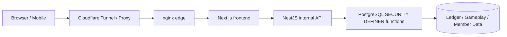
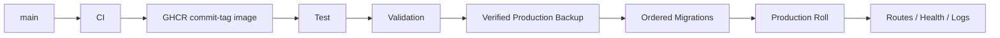

# 🌙 Woldeok Moneyverse — Полное руководство на русском

[← Главный README](../README.md) · [Журнал изменений](../docs/changelog/CHANGELOG.ru.md) · [Документация](../docs/INDEX.md) · [Production](https://easy-scraping.com) · [Test](https://test.easy-scraping.com)

> Woldeok Moneyverse — общественная платформа виртуальной экономики с профессиями, квестами, прогрессией, WLD-кошельком, магазином, виртуальными акциями/бизнесами, банком и мини-играми виртуального казино.
>
> WLD, виртуальные акции, игровые результаты и награды являются только внутренними данными сервиса. Это не реальные деньги, ценные бумаги, банковские вклады, инвестиции или реальные азартные продукты.

---

## 📸 Реальные экраны сервиса

Скриншоты сделаны на реальном Production в чистой публичной сессии. Они не содержат cookies участников, приватные данные, админ-экраны или секреты.

| Главная Production | Руководство |
| --- | --- |
|  |  |

| Виртуальное казино | Состояние сервиса |
| --- | --- |
|  |  |

### Адаптивный интерфейс

| Мобильная главная | Планшет | Мобильное казино |
| --- | --- | --- |
|  |  |  |

Responsive Header не удаляет DOM бренда через JavaScript. CSS breakpoints переключают `display:none`/видимость, поэтому при расширении окна логотип, текст бренда и desktop-навигация появляются снова автоматически.

---

## 🎮 Основные функции

| Область | Назначение | Документ |
| --- | --- | --- |
| 💼 Профессии | 8 профессий, повторяемые задачи, WLD + EXP | [Jobs & Progression](../docs/features/jobs-and-progression.md) |
| 📋 Квесты | Ежедневные события и прогрессия | [Quests](../docs/features/quests.md) |
| 💳 Кошелёк | Точные балансы WLD, переводы и ledger | [System Overview](../docs/architecture/system-overview.md) |
| 🛒 Магазин | Авторитетная DB-цена, инвентарь и stock | [Shop](../docs/features/shop.md) |
| 📈 Виртуальные акции | Цена, свечи, покупка/продажа, портфель | [Stocks](../docs/features/stocks.md) |
| 🏢 Виртуальный бизнес | Владение и длинный экономический цикл | [Businesses](../docs/features/businesses.md) |
| 🏦 Банк | Депозиты, проценты, кредитные уровни, облигации | [Banking](../docs/features/banking.md) |
| 🎰 Казино | Серверный результат, раскрытые вероятности, лимиты | [Casino](../docs/features/casino.md) |
| 🛡️ Админ-инструменты | Ограниченные read models и операции | [Admin Control Center](../docs/features/admin-control-center.md) |

---

## 🏗️ Архитектура



**Browser** рендерит UI и никогда не получает внутренний API token или DB credentials.

**Next.js** — публичный Web Origin, страницы/Server Actions и серверная передача Session/CSRF в внутреннюю API.

**NestJS** — внутренняя Production API с DTO/context проверкой и internal-token boundary.

**PostgreSQL** — финальная граница целостности экономики: Actor, Policy, Idempotency, баланс, инвентарь и ledger могут проверяться в одной транзакции.

- [System Overview](../docs/architecture/system-overview.md)
- [Request Flow](../docs/architecture/request-flow.md)
- [Database Security](../docs/architecture/database-security.md)
- [Deployment Flow](../docs/architecture/deployment-flow.md)

---

## 💼 Профессии и работа

Job 2.0 нормализован до **8 профессий × 3 активные задачи = 24 задачи**.

- Участник может копить EXP разных профессий, но активна только одна.
- Выполнение задачи фиксирует WLD и профессиональный EXP вместе.
- Предпросмотр награды и реальное начисление используют одну серверную формулу.
- Work modal держит одну idempotency key на попытку.
- Если DB уже рассчитала награду, но HTTP-ответ потерялся, повтор с тем же ключом возвращает старый receipt и не платит второй раз.

---

## 📋 Квесты и события

Текст квестов должен обещать только реально реализованные эффекты.

Событие рыночной скидки, например, фиксирует ежедневный Claim, определяет подходящие starter items, рассчитывает 10% Effective Price, использует одну и ту же цену в UI/покупке и заканчивается на границе даты Сеула.

Будущие механики без реальной модели данных или серверного settlement не показываются как активные награды.

---

## 🎰 Виртуальное казино

Казино использует только внутренний WLD и не имеет cash-out в реальные деньги.

### Основные раскрытые условия

| Игра | Вероятность | Множитель | Базовый RTP |
| --- | ---: | ---: | ---: |
| Монета | 50% | 1.9× | 95% |
| Чёт/нечёт кубика | 50% | 1.9× | 95% |
| Число кубика | 1/6 | 5.7× | 95% |

### Лимиты платформы

- минимум: **10 WLD**;
- максимум за игру: **200 WLD**;
- общий дневной stake: **2 000 WLD**;
- дневной realized loss: **1 000 WLD**;
- пользовательские self-limits/self-exclusion могут быть строже.

### Сервер авторитетен

Slot, high/low, wheel, treasure и gem-анимации не определяют результат. Финальный UI строится из server receipt.

Ранее UI мог показать `777` после проигрышного результата; текущая логика исключает противоречие между анимацией и сохранённым outcome.

История игр использует member-scoped casino history read model, а не фильтр из нескольких последних операций кошелька.

---

## 🏦 Банк, кредит и облигации

- Отображаемая ставка и реальное начисление используют один server contract.
- Изменение баланса депозитом/снятием сбрасывает accrual clock.
- Процент < 1 WLD продолжает накапливаться, а не округляется бесплатно до 1 WLD.
- Повтор одной idempotency key возвращает уже существующий settlement.
- Новые кредиты используют credit-grade policy.
- Старые loan/bond контракты не переписываются задним числом.

Баланс, principal кредита и bond settlement остаются точными integer strings.

---

## 📈 Акции, бизнесы и магазин

### Виртуальные акции
- цены, свечи, портфель;
- волатильность и дневные лимиты — серверная экономическая политика;
- WLD-цены и proceeds используют точные целые значения.

### Виртуальный бизнес
- долгосрочный цикл владения/управления;
- payback оценивается вместе с работой, банком и другими faucet/sink;
- исторические записи владения/распределений сохраняются.

### Магазин
- Client не определяет цену;
- отображаемая и списываемая цена используют одну DB-формулу;
- admin price/stock изменения проходят actor-scoped DB functions.

---

## 💰 Точность WLD

WLD — **каноническая целочисленная строка**, а не JavaScript `Number`.

```text
PostgreSQL bigint / numeric
        ↓
node-postgres string
        ↓
API JSON string
        ↓
Frontend string / BigInt
```

Значения выше 2^53 могут потерять точность во floating point, поэтому баланс, цены, кредиты и net worth остаются string/BigInt.

---

## 🔐 Модель безопасности

- Browser обычно работает с Next.js.
- NestJS — внутренняя Production API.
- Внутренние запросы требуют `INTERNAL_API_TOKEN`, кроме явных исключений.
- Этот token не встраивается в Browser/Native App.
- Критические экономические write-операции используют PostgreSQL `SECURITY DEFINER`.
- Ненужный `PUBLIC EXECUTE` отзывается.
- Операции, где retry может удвоить значение, используют idempotency.
- Production containers по возможности используют read-only rootfs, cap drop и `no-new-privileges`.
- Обычный deployment/cleanup не удаляет Production DB, member data, ledger или Docker volumes.

[Security Model](../docs/operations/security-model.md)

---

## 📱 Mobile / External App API

Native/Mobile App **не должен содержать `INTERNAL_API_TOKEN`**.

```text
Native App
   ↓ HTTPS
Gateway / BFF
   ↓ добавляет server-side internal token
NestJS API
```

Gateway хранит server-to-server secret и повторно использует существующие Session, CSRF и OAuth PKCE.

[Mobile / External App API](../docs/mobile-api.md)

---

## 🚀 Deployment Test → Production



Push в `main` запускает CI, но не деплоит Production автоматически. Production разворачивается явным Deploy Workflow.

- checksum drift применённых migrations останавливает rollout;
- Production data/volumes не пересоздаются;
- используются commit-tagged GHCR images;
- local edge smoke test отправляет реальный public Host header.

---

## 💾 Backup / восстановление

Перед изменением Production проверяются: расшифровка encrypted DB dump, читаемость dump, открытие photo archive и правильная идентификация Test/Production stack.

Backup на том же хосте не защищает от полной потери SSD/сервера; полноценный DR требует off-host копии и реального restore test.

---

## 🧰 Разработка

Текущая база: Node.js 24, pnpm 10, PostgreSQL 17.x (Production 17.11), nginx 1.30.4.

```bash
corepack enable
pnpm install --frozen-lockfile
pnpm lint
pnpm typecheck
pnpm build
```

DB tests должны выполняться на изолированном PostgreSQL, никогда на Production.

---

## 🗂️ Документы

- [System Overview](../docs/architecture/system-overview.md)
- [Request Flow](../docs/architecture/request-flow.md)
- [Database Security](../docs/architecture/database-security.md)
- [Deployment Flow](../docs/architecture/deployment-flow.md)
- [Jobs & Progression](../docs/features/jobs-and-progression.md)
- [Quests](../docs/features/quests.md)
- [Casino](../docs/features/casino.md)
- [Banking](../docs/features/banking.md)
- [Stocks](../docs/features/stocks.md)
- [Businesses](../docs/features/businesses.md)
- [Shop](../docs/features/shop.md)
- [Admin Control Center](../docs/features/admin-control-center.md)
- [Database Migrations](../docs/operations/database-migrations.md)
- [Backup & Recovery](../docs/operations/backup-and-recovery.md)
- [Production Deployment](../docs/operations/production-deployment.md)
- [Security Model](../docs/operations/security-model.md)
- [v2026.09.07.2 Localized Guide Parity](../docs/releases/v2026.09.07.2.md)
- [v2026.09.07.1 Documentation & Showcase](../docs/releases/v2026.09.07.1.md)
- [v2026.09.07 Gameplay / UX / Economy](../docs/releases/v2026.09.07.md)

---

## ✅ Проверка

Gameplay/UX Runtime Release: Backend **1 367 / 1 367 PASS**, Frontend **519 / 519 PASS**, lint 0 errors, typecheck/build PASS, Test Canary и официальные GitHub Test/Production Deploy PASS.

Documentation Release меняет только README/docs/public screenshots и не требует перезапуска Production Runtime.
