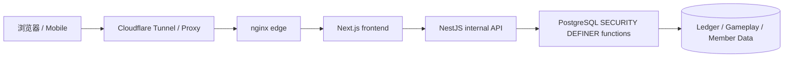
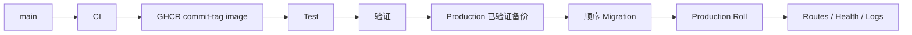

# 🌙 Woldeok Moneyverse — 简体中文完整指南

[← 主 README](../README.md) · [更新日志](../docs/changelog/CHANGELOG.zh-CN.md) · [文档索引](../docs/INDEX.md) · [生产环境](https://easy-scraping.com) · [测试环境](https://test.easy-scraping.com)

> Woldeok Moneyverse 是一个社区虚拟经济平台，整合职业、任务、成长、WLD 钱包、商店、虚拟股票/企业、银行与虚拟赌场小游戏。
>
> WLD、虚拟股票、赌场结果与奖励均为服务内部虚拟数据，不是现实货币、证券、存款、投资或博彩产品。

---

## 📸 实际服务界面

以下截图来自真实 Production 公共会话，不包含会员 Cookie、私人账户资料、管理员页面或任何密钥。

| Production 首页 | 服务指南 |
| --- | --- |
|  |  |

| 虚拟赌场 | 服务状态 |
| --- | --- |
|  |  |

### 响应式布局

| 手机首页 | 平板首页 | 手机赌场 |
| --- | --- | --- |
|  |  |  |

响应式 Header 不会通过 JavaScript 删除品牌 DOM。CSS breakpoint 使用 `display:none`/显示状态控制；窗口重新变宽后 Logo、品牌文字与桌面菜单会自动恢复。

---

## 🎮 功能一览

| 区域 | 功能 | 详细文档 |
| --- | --- | --- |
| 💼 职业/工作 | 8 个职业、重复任务、WLD + 职业 EXP | [Jobs & Progression](../docs/features/jobs-and-progression.md) |
| 📋 任务 | 每日事件、早期目标、成长流程 | [Quests](../docs/features/quests.md) |
| 💳 钱包 | 精确 WLD 余额、转账、账本记录 | [System Overview](../docs/architecture/system-overview.md) |
| 🛒 商店 | DB 权威价格、库存与购买 | [Shop](../docs/features/shop.md) |
| 📈 虚拟股票 | 价格、K 线、买卖、投资组合 | [Stocks](../docs/features/stocks.md) |
| 🏢 虚拟企业 | 所有权与长期经济循环 | [Businesses](../docs/features/businesses.md) |
| 🏦 银行 | 存款、利息、信用等级贷款、虚拟债券 | [Banking](../docs/features/banking.md) |
| 🎰 虚拟赌场 | 服务端判定结果、公开赔率、个人限制 | [Casino](../docs/features/casino.md) |
| 🛡️ 管理工具 | 受限的运营/经济 read model 与控制函数 | [Admin Control Center](../docs/features/admin-control-center.md) |

---

## 🏗️ 系统架构



### 各层职责

**浏览器**
- 渲染响应式 UI；
- 使用 same-origin 会话；
- 不接收内部 API Token 或数据库凭据。

**Next.js**
- 对外 Web Origin；
- 页面与 Server Action；
- 在服务端保持 Session/CSRF 上下文并调用内部 API。

**NestJS**
- Production 内部 API；
- DTO/请求上下文校验；
- 内部 Token 边界；
- 调用数据库 read model / 安全函数。

**PostgreSQL**
- 经济一致性的最终边界；
- 在一个事务中检查 Actor、Policy、Idempotency、余额、库存与账本写入。

更多架构文档：
- [系统总览](../docs/architecture/system-overview.md)
- [请求流程](../docs/architecture/request-flow.md)
- [数据库安全](../docs/architecture/database-security.md)
- [部署流程](../docs/architecture/deployment-flow.md)

---

## 💼 职业与工作

当前 Job 2.0 目录固定为 **8 个职业 × 每个职业 3 个活动任务 = 24 个活动任务**。

- 用户可以在多个职业积累 EXP，但同时只有一个活动职业；
- 完成任务同时写入 WLD 与职业 EXP；
- UI 预估奖励与实际结算使用同一服务端规则；
- 工作弹窗一次尝试保持同一个 idempotency key；
- 即使服务器已结算但响应丢失，重试同一个 key 只回放旧 receipt，不会重复支付。

---

## 📋 任务与事件

任务文案只能描述已经实现的效果。

例如“市场折扣日”完整流程：

1. 记录当天事件 Claim；
2. 确认符合条件的 starter items；
3. 计算 10% Effective Price；
4. 显示价格与实际购买结算使用同一规则；
5. 按首尔日期边界结束。

没有实际数据模型或服务器结算逻辑的未来功能不会被写成已上线奖励。

---

## 🎰 虚拟赌场

赌场只使用服务内部 WLD，不提供现实货币提现。

### 核心公开概率

| 游戏 | 胜率 | 倍率 | 基准 RTP |
| --- | ---: | ---: | ---: |
| 硬币 | 50% | 1.9× | 95% |
| 骰子奇偶 | 50% | 1.9× | 95% |
| 骰子数字 | 1/6 | 5.7× | 95% |

### 平台暴露限制

- 单局最小：**10 WLD**
- 单局最大：**200 WLD**
- 每日总投注：**2,000 WLD**
- 每日已实现损失：**1,000 WLD**
- 用户个人限制/自我排除可以更严格

### 服务端权威结果

老虎机、High/Low、转盘、宝箱、宝石等主题动画不会决定输赢。最终视觉结果必须来自服务器 receipt。

过去曾存在“服务器判定输，但动画显示 `777`”的 UI 缺陷；现在主题结果映射不能再与服务端存储结果冲突。

最近游戏记录也使用用户范围的赌场 history read model，不再依赖通用钱包最近几条记录。

---

## 🏦 银行、信用与虚拟债券

银行规则：

- 显示的存款利率与实际结算使用同一服务端合同；
- 存/取款后重置利息累计时间；
- 小于 1 WLD 的利息继续累计，不强制向上取整为 1 WLD；
- 同一利息 Claim idempotency key 重试时返回旧结算；
- 新贷款遵循信用等级 Policy；
- 旧贷款/债券合同不会因软件升级被追溯修改。

余额、贷款本金、债券本金/结算均保持精确整数字符串。

---

## 📈 股票、企业与商店

### 虚拟股票
- 价格、K 线、投资组合；
- 波动率与日内变化上限属于服务端经济 Policy；
- WLD 价格/收益使用精确整数处理。

### 虚拟企业
- 长周期所有权/经营经济内容；
- 回本周期要与工作奖励、银行与其他 Faucet/Sink 一起评估；
- 历史所有权与分配记录保留。

### 商店
- 客户端提交的价格不是权威价格；
- 页面 Effective Price 与数据库购买价格使用同一规则；
- 管理员价格/库存修改也必须通过 Actor-scoped DB 函数。

---

## 💰 WLD 精度规则

WLD 在 API 中是 **规范化整数字符串**，而不是 JavaScript `Number`。

```text
PostgreSQL bigint / numeric
        ↓
node-postgres string
        ↓
API JSON string
        ↓
Frontend string / BigInt
```

超过 2^53 的余额、价格、贷款或净资产如果转换成浮点数可能丢失精度，因此金额保持字符串/BigInt。

---

## 🔐 安全模型

- 浏览器通常只与 Next.js 交互；
- NestJS 是 Production 内部 API；
- 除明确例外外内部请求需要 `INTERNAL_API_TOKEN`；
- Token 不得放入浏览器或 Native App；
- 关键经济写入集中在 PostgreSQL `SECURITY DEFINER` 函数；
- 关闭不需要的 `PUBLIC EXECUTE`；
- 可能因重试造成重复价值的写操作使用 Idempotency；
- Production 容器尽可能使用 read-only rootfs、cap drop、`no-new-privileges`；
- 普通部署/清理不会删除 Production DB、会员数据、账本或 Docker Volume。

[安全模型](../docs/operations/security-model.md)

---

## 📱 Mobile / External App API

Native/Mobile App **不能直接嵌入 `INTERNAL_API_TOKEN`**。

推荐模式：

```text
Native App
   ↓ HTTPS
Gateway / BFF
   ↓ 加入服务端 Internal Token
NestJS API
```

Gateway 保存 server-to-server secret，同时复用现有 Session、CSRF 与 OAuth PKCE 模型。

[Mobile / External App API](../docs/mobile-api.md)

---

## 🚀 Test → Production 部署



`main` push 只运行 CI，不会自动部署 Production。Production 通过显式 Deploy Workflow 进行。

- 已执行 Migration checksum 不一致时部署中止；
- 不重建 Production 数据/Volume；
- 使用 Commit-tagged GHCR Image；
- Local Edge Smoke Test 使用真实 Public Host Header。

[Production 部署](../docs/operations/production-deployment.md)

---

## 💾 备份与恢复

Production 变更前的备份必须验证：

- 加密 DB Dump 可以解密；
- Dump 结构/结束正常；
- 图片 Archive 可读取；
- 确认备份属于正确的 Test/Production Stack。

仅在同一主机上的备份不能覆盖整机/磁盘故障，因此完整 DR 仍需要 Off-host 备份与恢复演练。

[备份与恢复](../docs/operations/backup-and-recovery.md)

---

## 🧰 开发环境

当前基线：Node.js 24、pnpm 10、PostgreSQL 17.x（Production 17.11）、nginx 1.30.4。

```bash
corepack enable
pnpm install --frozen-lockfile
pnpm lint
pnpm typecheck
pnpm build
```

数据库测试必须使用隔离 PostgreSQL，禁止以 Production DB 作为测试目标。

---

## 🗂️ 文档导航

### Architecture
- [System Overview](../docs/architecture/system-overview.md)
- [Request Flow](../docs/architecture/request-flow.md)
- [Database Security](../docs/architecture/database-security.md)
- [Deployment Flow](../docs/architecture/deployment-flow.md)

### Features
- [Jobs & Progression](../docs/features/jobs-and-progression.md)
- [Quests](../docs/features/quests.md)
- [Casino](../docs/features/casino.md)
- [Banking](../docs/features/banking.md)
- [Stocks](../docs/features/stocks.md)
- [Businesses](../docs/features/businesses.md)
- [Shop](../docs/features/shop.md)
- [Admin Control Center](../docs/features/admin-control-center.md)

### Operations
- [Local Development](../docs/operations/local-development.md)
- [Database Migrations](../docs/operations/database-migrations.md)
- [Backup & Recovery](../docs/operations/backup-and-recovery.md)
- [Production Deployment](../docs/operations/production-deployment.md)
- [Security Model](../docs/operations/security-model.md)

### Releases
- [v2026.09.07.2 Localized Guide Parity](../docs/releases/v2026.09.07.2.md)
- [v2026.09.07.1 Documentation & Showcase](../docs/releases/v2026.09.07.1.md)
- [v2026.09.07 Gameplay / UX / Economy](../docs/releases/v2026.09.07.md)
- [详细 Worklog](../docs/worklog/2026-09-07-gameplay-ux-release.md)

---

## ✅ 验证基线

Gameplay/UX Runtime Release：Backend **1,367 / 1,367 PASS**、Frontend **519 / 519 PASS**、lint 0 errors、typecheck/build PASS、Test Canary 与官方 Test/Production Deploy 均 PASS。

文档 Release 只修改 README、文档与公共截图，不需要重启 Production Runtime。
