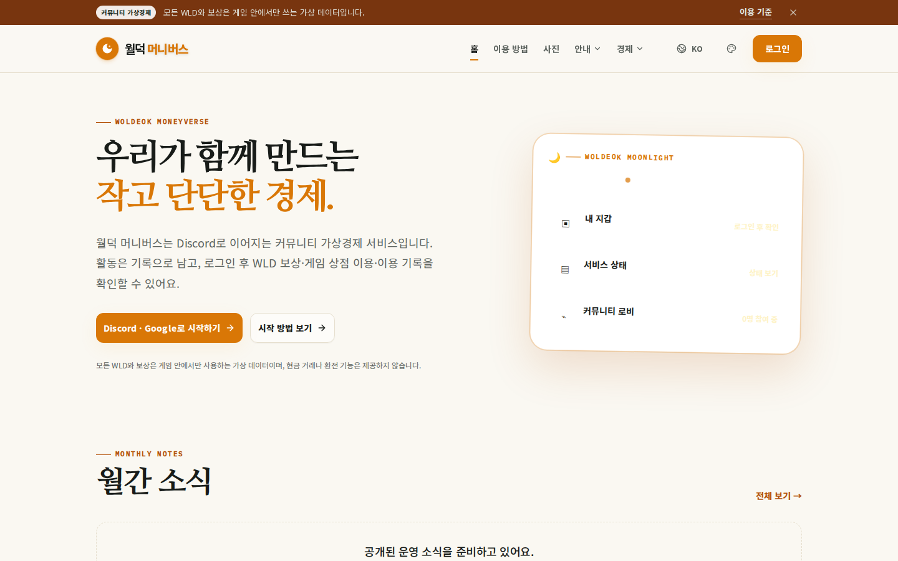
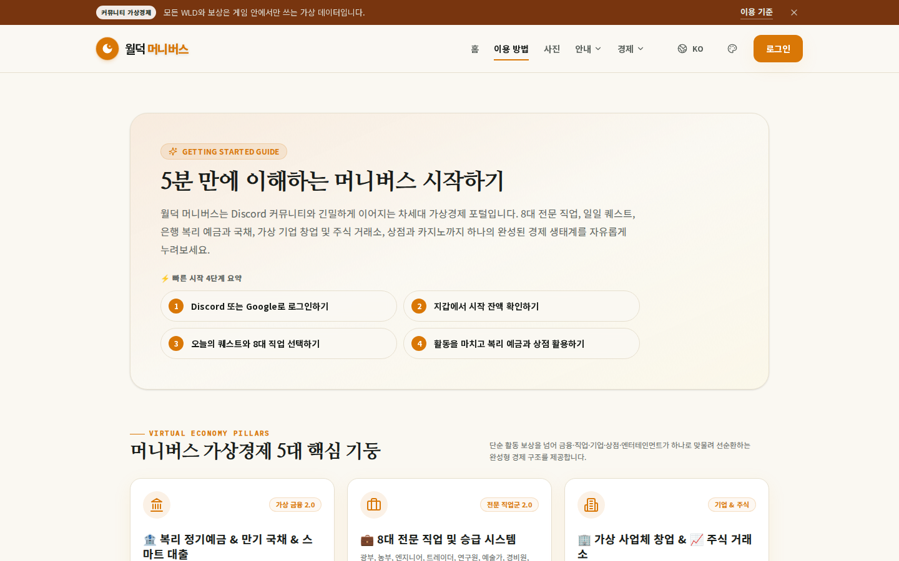
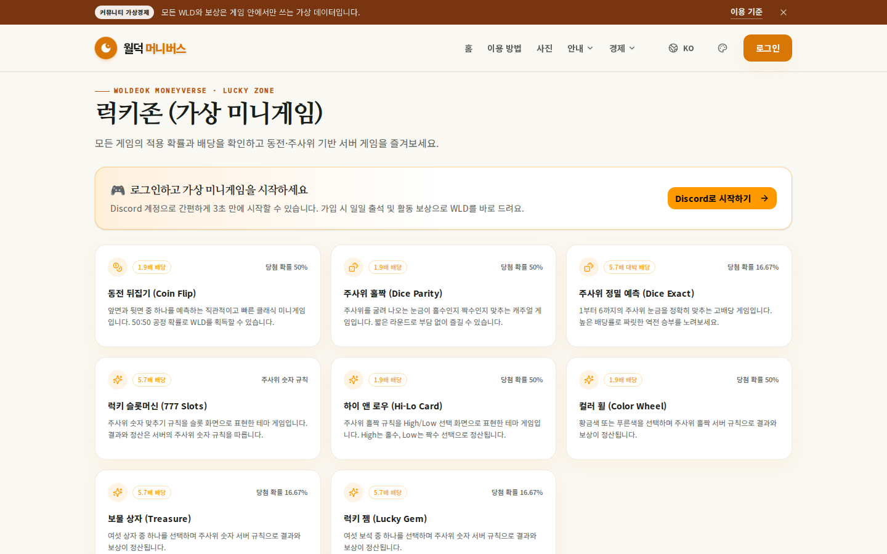
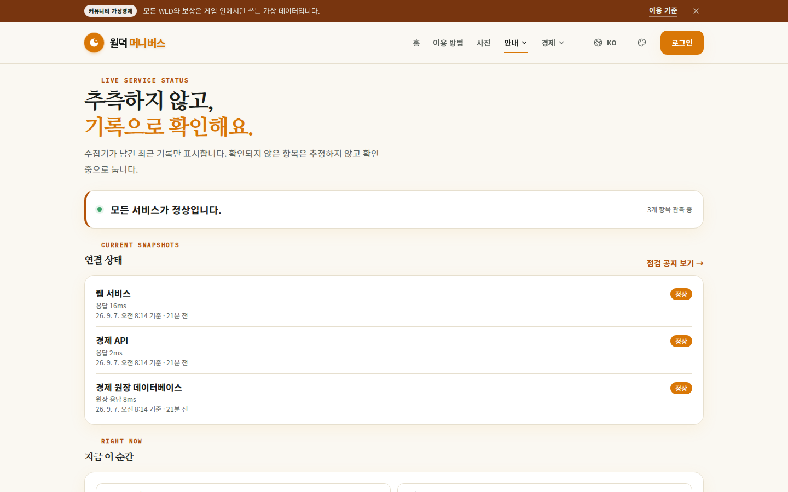
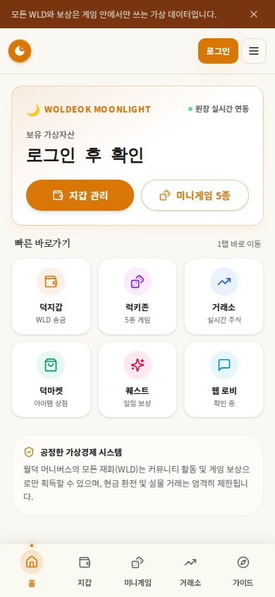
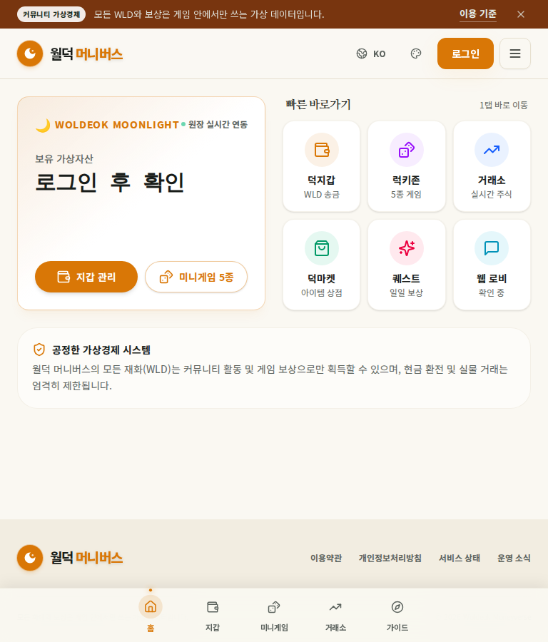
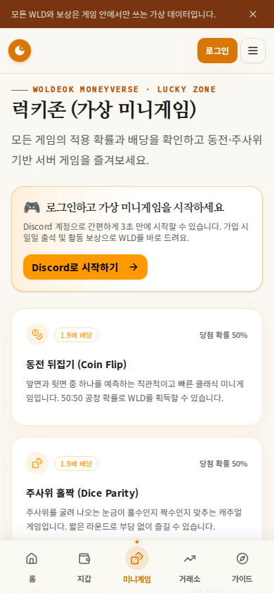
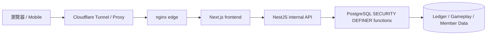
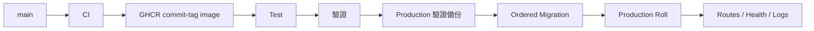

# 🌙 Woldeok Moneyverse — 繁體中文完整指南

[← 主 README](../README.md) · [變更記錄](../docs/changelog/CHANGELOG.zh-TW.md) · [文件索引](../docs/INDEX.md) · [Production](https://easy-scraping.com) · [Test](https://test.easy-scraping.com)

> Woldeok Moneyverse 是一個社群虛擬經濟平台，整合職業、任務、成長、WLD 錢包、商店、虛擬股票/企業、銀行與虛擬賭場小遊戲。
>
> WLD、虛擬股票、賭場遊戲與獎勵皆為服務內部虛擬資料，不是現實貨幣、證券、存款、投資或博彩商品。

---

## 📸 實際服務畫面

以下截圖來自真實 Production 公開會話，不包含會員 Cookie、私人帳號資料、管理員頁面或任何秘密資訊。

| Production 首頁 | 服務指南 |
| --- | --- |
|  |  |

| 虛擬賭場 | 服務狀態 |
| --- | --- |
|  |  |

### 響應式介面

| 手機首頁 | 平板首頁 | 手機賭場 |
| --- | --- | --- |
|  |  |  |

響應式 Header 不會用 JavaScript 把品牌 DOM 刪除。CSS breakpoint 只切換 `display:none`/顯示狀態，重新放寬視窗後 Logo、品牌文字與桌面選單會自動恢復。

---

## 🎮 主要功能

| 區域 | 功能 | 詳細文件 |
| --- | --- | --- |
| 💼 職業/工作 | 8 個職業、重複任務、WLD + 職業 EXP | [Jobs & Progression](../docs/features/jobs-and-progression.md) |
| 📋 任務 | 每日事件、初期目標、成長流程 | [Quests](../docs/features/quests.md) |
| 💳 錢包 | 精確 WLD 餘額、轉帳、帳本紀錄 | [System Overview](../docs/architecture/system-overview.md) |
| 🛒 商店 | DB 權威價格、庫存與購買 | [Shop](../docs/features/shop.md) |
| 📈 虛擬股票 | 價格、K 線、買賣、投資組合 | [Stocks](../docs/features/stocks.md) |
| 🏢 虛擬企業 | 所有權與長期經濟循環 | [Businesses](../docs/features/businesses.md) |
| 🏦 銀行 | 存款、利息、信用等級貸款、虛擬債券 | [Banking](../docs/features/banking.md) |
| 🎰 虛擬賭場 | 伺服器判定結果、公開機率、個人限制 | [Casino](../docs/features/casino.md) |
| 🛡️ 管理工具 | 受限營運/經濟 read model 與控制函數 | [Admin Control Center](../docs/features/admin-control-center.md) |

---

## 🏗️ 系統架構



### 各層責任

**瀏覽器**
- 呈現響應式 UI；
- 使用 same-origin Session；
- 不取得內部 API Token 或資料庫憑證。

**Next.js**
- 對外 Web Origin；
- 頁面與 Server Action；
- 在伺服器端保留 Session/CSRF 狀態並呼叫內部 API。

**NestJS**
- Production 內部 API；
- DTO 與請求上下文驗證；
- 內部 Token 邊界；
- 呼叫 DB read model / 安全函數。

**PostgreSQL**
- 經濟一致性的最終邊界；
- 可在同一交易內驗證 Actor、Policy、Idempotency、餘額、庫存與帳本寫入。

更多：
- [System Overview](../docs/architecture/system-overview.md)
- [Request Flow](../docs/architecture/request-flow.md)
- [Database Security](../docs/architecture/database-security.md)
- [Deployment Flow](../docs/architecture/deployment-flow.md)

---

## 💼 職業與工作

目前 Job 2.0 目錄為 **8 職業 × 每職業 3 個活動任務 = 24 個活動任務**。

- 會員可以累積多個職業的 EXP，但同時只有一個活動職業；
- 任務完成會同時紀錄 WLD 與職業 EXP；
- 畫面預估獎勵與實際結算使用同一伺服器規則；
- 工作 Modal 每次嘗試維持同一個 idempotency key；
- 如果 DB 已經結算但 HTTP 回應遺失，以同一 key 重試只會重播舊 receipt，不會重複支付。

---

## 📋 任務與事件

任務文案只能描述已實作的效果。

例如「市場折扣日」：

1. 記錄當日事件 Claim；
2. 判斷 eligible starter items；
3. 計算 10% Effective Price；
4. 顯示價格與實際購買使用同一規則；
5. 以首爾日期邊界結束。

尚無實際資料模型或執行邏輯的未來功能，不會以已上線獎勵方式描述。

---

## 🎰 虛擬賭場

賭場僅使用服務內部 WLD，不提供真實貨幣兌現。

### 核心公開條件

| 遊戲 | 勝率 | 倍率 | 基準 RTP |
| --- | ---: | ---: | ---: |
| 硬幣 | 50% | 1.9× | 95% |
| 骰子奇偶 | 50% | 1.9× | 95% |
| 骰子數字 | 1/6 | 5.7× | 95% |

### 平台曝險限制

- 單局最小：**10 WLD**
- 單局最大：**200 WLD**
- 每日總投注：**2,000 WLD**
- 每日已實現損失：**1,000 WLD**
- 會員個人限制/自我排除可設定得更嚴格

### 伺服器權威結果

拉霸、High/Low、轉盤、寶箱、寶石等主題動畫不決定結算。最終視覺狀態必須由伺服器 receipt 的實際結果推導。

過去曾出現「伺服器判輸，但畫面顯示 `777`」的 UI 問題；目前結果映射已保證動畫不能與已儲存的結果衝突。

最近遊戲紀錄也使用會員範圍的 casino history read model，不再只過濾少量一般錢包紀錄。

---

## 🏦 銀行、信用與虛擬債券

- 顯示存款利率與實際結算使用同一伺服器合約；
- 存/提款造成餘額變化後重設利息累積時鐘；
- 小於 1 WLD 的利息繼續累積，不強制向上補成 1 WLD；
- 相同 interest claim idempotency key 會回傳既有結算；
- 新貸款遵循信用等級 Policy；
- 舊貸款/債券合約不會被新版軟體追溯改寫。

餘額、貸款本金、債券本金/結算均保持精確整數字串。

---

## 📈 股票、企業與商店

### 虛擬股票
- 價格、K 線、投資組合；
- 波動率與日內上限屬伺服器經濟 Policy；
- WLD 價格/收益採精確整數處理。

### 虛擬企業
- 長期所有權/經營內容；
- 回本週期要和工作、銀行與其他 Faucet/Sink 一起衡量；
- 歷史所有權/分配紀錄保留。

### 商店
- Client 提交價格不是權威值；
- 畫面 Effective Price 與購買結算使用同一 DB 規則；
- 管理員價格/庫存更新也必須通過 Actor-scoped DB 函數。

---

## 💰 WLD 精度

WLD 在 API 中是 **canonical integer string**，不是 JavaScript `Number`。

```text
PostgreSQL bigint / numeric
        ↓
node-postgres string
        ↓
API JSON string
        ↓
Frontend string / BigInt
```

超過 2^53 的大額餘額/價格/貸款若轉成浮點數可能失去精度，因此必須維持字串/BigInt。

---

## 🔐 安全模型

- Browser 通常只與 Next.js 溝通；
- NestJS 是 Production 內部 API；
- 除明確例外外內部請求需 `INTERNAL_API_TOKEN`；
- Token 不放進瀏覽器或 Native App；
- 重要經濟寫入由 PostgreSQL `SECURITY DEFINER` 函數處理；
- 關閉不必要的 `PUBLIC EXECUTE`；
- 重試可能重複價值的寫入使用 Idempotency；
- Production 容器盡量使用 read-only rootfs、cap drop、`no-new-privileges`；
- 一般部署/清理不會刪除 Production DB、會員資料、帳本或 Docker Volume。

[Security Model](../docs/operations/security-model.md)

---

## 📱 Mobile / External App API

Native/Mobile App **不可直接嵌入 `INTERNAL_API_TOKEN`**。

```text
Native App
   ↓ HTTPS
Gateway / BFF
   ↓ 加入伺服器端 Internal Token
NestJS API
```

Gateway 保管 server-to-server secret，同時沿用既有 Session、CSRF、OAuth PKCE 模型。

[Mobile / External App API](../docs/mobile-api.md)

---

## 🚀 Test → Production 部署



`main` push 只跑 CI，不會自動部署 Production。Production 透過明確的 Deploy Workflow 進行。

- Applied Migration checksum drift 會中止部署；
- 不重建 Production 資料/Volume；
- 使用 Commit-tagged GHCR Image；
- Local Edge Smoke Test 使用真實 Public Host Header。

---

## 💾 備份/復原

Production 變更前備份需確認：
- 加密 DB dump 可解密；
- Dump 結構/結尾正常；
- 圖片 Archive 可讀；
- Test/Production Stack 身分正確。

同一主機上的備份無法涵蓋整機/SSD 故障，因此完整 DR 還需要 Off-host 備份與實際還原測試。

---

## 🧰 開發環境

目前基準：Node.js 24、pnpm 10、PostgreSQL 17.x（Production 17.11）、nginx 1.30.4。

```bash
corepack enable
pnpm install --frozen-lockfile
pnpm lint
pnpm typecheck
pnpm build
```

DB 測試必須使用隔離 PostgreSQL，不能把 Production DB 當測試目標。

---

## 🗂️ 文件導航

- [System Overview](../docs/architecture/system-overview.md)
- [Request Flow](../docs/architecture/request-flow.md)
- [Database Security](../docs/architecture/database-security.md)
- [Deployment Flow](../docs/architecture/deployment-flow.md)
- [Jobs & Progression](../docs/features/jobs-and-progression.md)
- [Quests](../docs/features/quests.md)
- [Casino](../docs/features/casino.md)
- [Banking](../docs/features/banking.md)
- [Stocks](../docs/features/stocks.md)
- [Businesses](../docs/features/businesses.md)
- [Shop](../docs/features/shop.md)
- [Admin Control Center](../docs/features/admin-control-center.md)
- [Local Development](../docs/operations/local-development.md)
- [Database Migrations](../docs/operations/database-migrations.md)
- [Backup & Recovery](../docs/operations/backup-and-recovery.md)
- [Production Deployment](../docs/operations/production-deployment.md)
- [Security Model](../docs/operations/security-model.md)
- [v2026.09.07.2 Localized Guide Parity](../docs/releases/v2026.09.07.2.md)
- [v2026.09.07.1 Documentation & Showcase](../docs/releases/v2026.09.07.1.md)
- [v2026.09.07 Gameplay / UX / Economy](../docs/releases/v2026.09.07.md)

---

## ✅ 驗證基準

Gameplay/UX Runtime Release：Backend **1,367 / 1,367 PASS**、Frontend **519 / 519 PASS**、lint 0 errors、typecheck/build PASS、Test Canary 與官方 GitHub Test/Production Deploy 均 PASS。

文件 Release 僅修改 README、文件與公開截圖，不需要重新啟動 Production Runtime。
