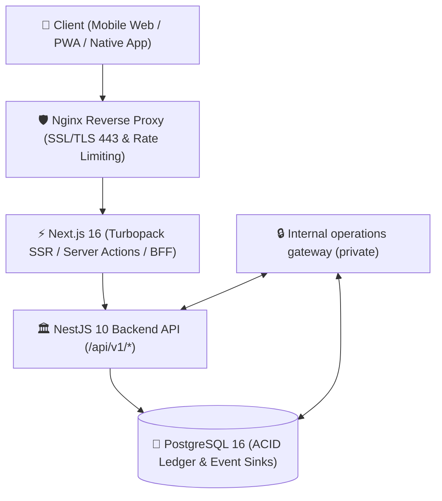

# 📱 Woldeok Moneyverse Integrated App Specification & Comprehensive User Guide

> **Document Version**: `v2026.09.22.343`  
> **Base Commit**: `3de891b` (Latest main)  
> **Official Production URL**: [https://easy-scraping.com](https://easy-scraping.com)  
> **Staging URL**: [https://test.easy-scraping.com](https://test.easy-scraping.com)  
> **Internal operations gateway**: private operational detail intentionally omitted from the public repository.

---

## 1. Overview & System Architecture

Woldeok Moneyverse is an all-in-one virtual fintech, economic simulation, stock exchange, casino 7-game suite, career/enterprise management, cooperative club, and social community platform.

```mermaid
flowchart TD
    Client["📱 Client (Mobile Web / PWA / Native App)"]
    Nginx["🛡️ Nginx Reverse Proxy (SSL/TLS 443 & Rate Limiting)"]
    BFF["⚡ Next.js 16 (Turbopack SSR / Server Actions / BFF)"]
    API["🏛️ NestJS 10 Backend API (/api/v1/*)"]
    DB[("🐘 PostgreSQL 16 (ACID Ledger & Event Sinks)")]
    MCP["🔒 Internal operations gateway (private)"]

    Client --> Nginx
    Nginx --> BFF
    BFF --> API
    API --> DB
    MCP <--> API
    MCP <--> DB
```

### Core Design Principles
- **Anti-AI Human Craftsmanship**: Adopts the design ethos of Toss, Robinhood, and Apple—clean typography, high-contrast monospace numeric displays, 44px+ touch targets, and zero horizontal overflow across 320px to 1440px viewports.
- **Atomic Ledger Invariant**: All monetary transfers, stock halt refunds, and casino settlements are backed by PostgreSQL ACID transactions and idempotent keys (`idempotencyKey`), preventing replay attacks and race conditions.
- **Defense-in-Depth Security**: Administrative actions and sensitive operations require 6-digit TOTP Step-Up 2FA and 300-second session rotation windows.

---

## 2. Navigation Architecture

### 2.1 5 Core Bottom Tabs (Mobile Viewport)
1. **Home (`/`)**: Comprehensive net wealth dashboard, 24-hour WLD circulation metrics, quick execution grid, daily attendance check.
2. **Economy (`/bank`, `/stocks`, `/work`, `/businesses`, `/shop`)**: Savings pockets, virtual stock exchange, career tasks, enterprise management, shop inventory.
3. **Casino (`/casino`)**: 7 regular games (Coin Flip, Dice Parity, Dice Number, Hi-Lo 20, Treasure 4, Lucky Gem 5, Wheel 20) and real-time gold jackpot ticker.
4. **Social (`/board`, `/gallery`, `/chat`, `/clubs`, `/newspaper`)**: Community board, media gallery, 1:1 private messages, cooperative clubs, weekly economic brief.
5. **MY (`/account`, `/account/notifications`, `/account/safety`)**: Profile, security sessions, notification preferences, age assurance, account closure.

---

## 3. End-User Feature Guides (Step-by-Step)

### 3.1 Authentication & Security Sessions (`/login`, `/register`, `/account`)
1. **Sign-up & Verification**: Register with an email and password, then verify the 6-digit code sent to your inbox.
2. **Active Session Control (`/account/security/sessions`)**: Inspect all active mobile/desktop sessions and instantly revoke suspicious logins.

### 3.2 Financial Center: Banking 5 Surfaces & Saving Pockets (`/bank`)
- **Saving Pockets**: Create dedicated goal pockets (e.g., "Emergency Fund", "New Home"), transfer funds with 0 WLD fee, customize theme colors, and archive completed goals with a 500 WLD hard sink.
- **Virtual Treasury Bonds**: Purchase 7d/30d/90d bonds with fixed APRs and automated maturity payouts.
- **Smart Credit & Loans**: Borrow emergency funds based on your credit score and repay with custom installments.

### 3.3 Stock Exchange & 100% Cost-Basis Halt Protection (`/stocks`)
- Place real-time BUY and SELL orders with order book depth and candlestick charts.
- **Investor Protection Guarantee**: If a stock is halted (`HALTED`), 100% of your remaining cost-basis is automatically refunded in WLD with 0% trading fees or slippage.

### 3.4 Career Work & Business Ownership (`/work`, `/businesses`)
- Perform 10-second work cycles to earn WLD rewards and profession experience points.
- Acquire businesses, manage daily maintenance costs, and apply marketing boosts.

### 3.5 Casino 7-Game Suite & 20-Segment Wheel (`/casino`)
- **Responsible Gaming**: Set daily stake and loss limits to prevent excessive play.
- **7 Authoritative Games**:
  1. **Coin Flip**: Heads / Tails (50%, 1.90x).
  2. **Dice Parity**: Odd / Even (50%, 1.90x).
  3. **Dice Number**: Exact number 1~6 (16.67%, 5.70x).
  4. **Hi-Lo 20**: Low (1~10) / High (11~20) (50%, 1.90x).
  5. **Treasure Vault 4**: 1 of 4 chests (25%, 3.80x).
  6. **Lucky Gem 5**: 1 of 5 colored gems (20%, 4.75x).
  7. **20-Segment Wheel**: Blue (1.90x), Gold (3.80x), Violet (9.50x), with a **3.2s smooth decelerating SVG animation** and recent 10-spin history.

### 3.6 Minor Safety & Emergency Content Takedown (`/safety`)
- **Public Takedown Intake (`/safety/takedown`)**: Victims and legal guardians can request emergency takedowns of non-consensual imagery or illicit content without an account.
- **Private Status Lookup (`/safety/takedown/status`)**: Track resolution using the Case ID and private passcode.

### 3.7 Programmatic SEO & Viral Growth Suite (`/tools/*`, `/invite/*`)
- 20,000+ pSEO dynamic long-tail landing pages for stock dollar-cost averaging, compound interest, and profession simulators.
- Viral diagnosis share cards and 2-way referral reward system (+10M WLD bonus).

### 3.8 Virtual Real Estate & Metaverse Land Leasing (`/spaces/real-estate`)
- 10 premier virtual land parcels (Gangnam, Yeouido, Wall St, Silicon Valley) with commercial building construction.
- Automated 15% passive fee distribution to land owners and 0.5%/wk property tax deflationary sink.

### 3.9 Virtual Derivatives & 10x Leverage Futures Exchange (`/stocks/derivatives`)
- 1x ~ 10x Isolated margin Long and Short leverage trading across 10 virtual premier stocks (WDG, FNAK, CHIMU, etc.).
- Global standard 8-hour funding rate mechanism (00:00, 08:00, 16:00 KST) and real-time Liquidation Heatmap visualization.
- Automated Take-Profit (TP) and Stop-Loss (SL) trigger orders.
- Dual-settlement liquidation ledger: 50% allocated to Central Bank Insurance Fund and 50% permanently burned (Hard Sink) to eliminate inflation.
- One-click dark FinTech PnL share card generator for Instagram and Discord.

### 3.10 Virtual Startup VC Angel Investment & Crowdfunding (`/businesses/ventures`)
- User-founded virtual enterprises across 5 tech verticals (AI FinTech, Quantum Computing, Space Robotics, Bio Healthcare, Green Grid) with real-time valuation metrics.
- 30% equity public crowdfunding IPOs with oversubscription proportional allocation (`calculateIpoAllocation`).
- Daily corporate revenue dividend distributions (10%~50% founder-set payout ratio) with one-click "Claim All" dashboard.
- Governance voting rights and Golden Angel Investor badge for 5%+ shareholders.
- 3% corporate revenue hard burn (Hard Sink) deflationary ledger.

### 3.11 Discord Club Warfare & Territory Domination (`/clubs/warfare`)
- Weekly 1-hour capital siege battles between Discord servers/clubs for financial territory control.
- 10% trading fee tax revenue redistribution to conquering club vaults and Hall of Fame emblems.

### 3.12 No-Code Quant Bot Builder & Backtesting Studio (`/tools/quant-studio`)
- Visual drag-and-drop rule assembly for technical indicators (RSI, MA Cross, Bollinger Bands).
- Instant 30-day historical tick backtesting and Strategy Marketplace with recurring WLD subscriptions.

---

## 4. Operator Control Tower Guide (`/admin`)
- Accessible only by `superadmin` and `operator` roles with Step-Up TOTP 2FA.
- Manage user restrictions, execute stock halts with automatic cost-basis settlements, control the 3 Treasury Vaults, and triage emergency content takedowns.
