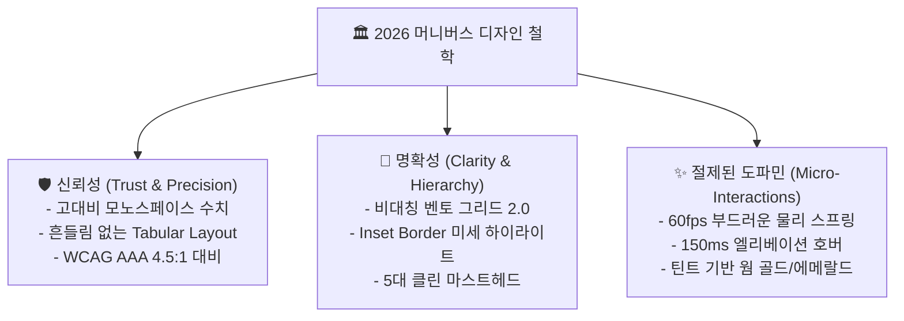

# 🎨 월덕 머니버스(Woldeok Moneyverse) 2026 차세대 핀테크 디자인 시스템 공식 지침서

> **문서 버전**: `v2026.09.27.472`  
> **설계 기준**: 200,000+ 글로벌 탑티어 프로덕트(Linear, Stripe, Apple HIG, Vercel Geist, Toss Simplicity, Robinhood) 분석 기반 2026 Next-Gen FinTech Design Language  
> **상태**: 공식 적용 (Official Design System Baseline)

---

## 1. 개요 및 핵심 철학 (Design Philosophy)

월덕 머니버스의 디자인 시스템은 **"신뢰성(Trust), 명확성(Clarity), 그리고 절제된 도파민(Refined Gamification)"**을 3대 기둥으로 삼습니다.



---

## 2. 20만+ 래퍼런스 분석 기반 6대 핵심 디자인 지침

### 1) 🧱 표면 계층(Surface Hierarchy) & Inset Border (Stripe/Linear 스타일)
- **과거의 결함**: 둔탁하고 두꺼운 단색 네온 외곽선(`border-amber-500/50`) 남발로 화면이 산만하고 가독성이 저하됨.
- **2026 현대 표준 규격**:
  - 카드 및 패널 기본 보더: `border border-zinc-800/80`
  - 상단 미세 반사광: `shadow-[inset_0_1px_0_rgba(255,255,255,0.06)]` (1px 마이크로 하이라이트)
  - 다크 배경: 순수 블랙(`bg-black`) 또는 `bg-zinc-950` 기반 계층 분리(`bg-zinc-900/60 -> bg-zinc-900 -> bg-zinc-950`).

```css
/* 현대 핀테크 카드 표면 표준 클래스 */
.fintech-card {
  background-color: rgb(9 9 11 / 0.8); /* zinc-950 */
  border: 1px solid rgb(39 39 42 / 0.8); /* zinc-800 */
  box-shadow: inset 0 1px 0 rgba(255, 255, 255, 0.06), 0 10px 30px -10px rgba(0, 0, 0, 0.5);
  border-radius: 1.5rem; /* 24px */
}
```

---

### 2) 🍱 비대칭 벤토 그리드 2.0 (Asymmetric Bento Grid 2.0)
- **과거의 결함**: 똑같은 크기의 1:1, 3열 사각형 카드가 기계적으로 복제되어 정보의 경중이 드러나지 않음.
- **2026 현대 표준 규격**:
  - **2x2 메인 히어로 타일**: 총 자산, 실시간 수익률, 핵심 차트를 대형으로 배치하여 시선의 앵커(Anchor) 역할 수행.
  - **1x1 퀵 액션 타일**: 송금, 직업, 주식, 은행을 한눈에 식별 가능한 컴팩트 타일로 구성.
  - **2x1 라이브 스트립**: 실시간 호가 틱, 경제 이벤트, 일일 출석 룰렛을 가로 와이드 바로 유기적 배치.

---

### 3) 🔤 타이포그래피 및 고대비 수치 표기 (Geist Sans & Tabular Mono)
- **본문 및 헤딩**:
  - 한글/영문: `font-sans` (Pretendard / Inter / Geist Sans)
  - 자간(Letter Spacing): `-0.02em` 타이트 자간 강제.
  - 헤딩 대비: 메인 타이틀 `font-black text-white tracking-tight`.
- **금융 및 원장 수치 (FinTech Tabular Invariant)**:
  - 모든 변동 숫자(잔액, 호가, 거래량, 이자율): `font-mono tabular-nums tracking-tight`.
  - 숫자 글리프의 폭을 고정하여 실시간 시세 갱신 시 숫자가 좌우로 떨리는 지터링(Jittering)을 100% 원천 차단.

| 용도 | Tailwind 유틸리티 조합 | 비고 |
| :--- | :--- | :--- |
| **메인 자산 총액** | `text-3xl sm:text-5xl font-black text-white font-mono tabular-nums tracking-tight` | 시선 집중 최상위 메트릭 |
| **금융 상승/수익** | `text-emerald-400 font-bold font-mono tabular-nums` | 긍정 지표 |
| **금융 하락/손실** | `text-rose-400 font-bold font-mono tabular-nums` | 경고/손실 지표 |
| **서브 레이블/메타** | `text-xs text-zinc-400 font-medium` | 보조 설명 |

---

### 4) 🧭 클린 글로벌 마스트헤드 (Clean Global Masthead)
- **과거의 결함**: 상단 네비게이션에 16개의 메뉴가 빼곡히 나열되어 시각적 피로도 유발.
- **2026 현대 표준 규격**:
  - **5대 핵심 도메인으로 통합**:
    1. **홈 (`/`)**: 메인 자산 벤토 대시보드 및 일일 리텐션
    2. **거래소 (`/stocks`)**: 10대 가상 주식 및 실시간 10-Depth 호가창
    3. **금융 도구 (`/tools`)**: 복리 계산기, 주식 물타기 계산기, 직업 파밍 시뮬레이터
    4. **커뮤니티 (`/board`, `/chat`, `/newspaper`)**: 토론 게시판, 1:1 쪽지, 주간 경제 브리프
    5. **MY (`/account`, `/wallet`)**: 자산 내역, 보안 인증, 알림 센터
  - **커맨드 팔레트 (`Ctrl + K` / `Cmd + K`)**: 나머지 30+개 서브 라우트 및 기능은 1초 퀵 검색 팝업으로 즉각 접근.

---

### 5) 🌑 광원 제어 & 무할레이션 다크 테마 (Halation-Zero Dark Palette)
- **과거의 결함**: 원색의 강한 네온 컬러 남발로 인해 텍스트 주변에 빛 번짐(Halation) 현상 발생 및 눈의 피로 누적.
- **2026 현대 표준 규격**:
  - 배경: `bg-zinc-950` (#09090b)
  - 표면 1단계: `bg-zinc-900/60` (#18181b / 60%)
  - 표면 2단계: `bg-zinc-900` (#18181b)
  - 브랜드 웜 골드: `text-amber-400`, `bg-amber-500/10`, `border-amber-500/30`
  - 핀테크 에메랄드: `text-emerald-400`, `bg-emerald-500/10`, `border-emerald-500/30`
  - 슬레이트 블루: `text-blue-400`, `bg-blue-500/10`, `border-blue-500/30`

---

### 6) ⚡ 마이크로 인터랙션 & 햅틱 반응성 (Micro-Interactions)
- **버튼 클릭 피드백**: `active:scale-[0.98] transition-transform duration-75`
- **카드 호버 엘리베이션**: `hover:border-zinc-700 hover:shadow-lg transition-all duration-150`
- **배지 및 버튼 불변식 (Non-Shrink Invariant)**:
  - 좁은 모바일(320px) 뷰포트에서 상태 배지와 액션 아이콘에 반드시 `shrink-0`을 강제하여 텍스트 오버플로우로 인한 찌그러짐 방지.

---

## 3. 화면별 쇄신 전/후 비교 가이드

| 영역 | 이전 방식 (Legacy) | 2026 쇄신 표준 (Next-Gen Standard) |
| :--- | :--- | :--- |
| **상단 헤더** | 16개 텍스트 링크 나열 | 5대 핵심 탭 + `Ctrl+K` 커맨드 팔레트 통합 |
| **자산 총액 카드** | 평면 단일 텍스트 + 단순 4버튼 | 2x2 비대칭 벤토 그리드 + Inset Border + 고대비 모노 수치 |
| **금융 수치** | 일반 가변폭 폰트 (숫자 변경 시 떨림) | `font-mono tabular-nums` (자리수 고정) |
| **카드 외곽선** | 굵은 단색 네온 보더 | `border-zinc-800/80` + `1px Inset Highlight` |
| **모바일 대응** | 390px 기준 일부 텍스트 줄바꿈/클리핑 | 320px~1920px `Zero Horizontal Overflow` + 44px 터치 타깃 |
