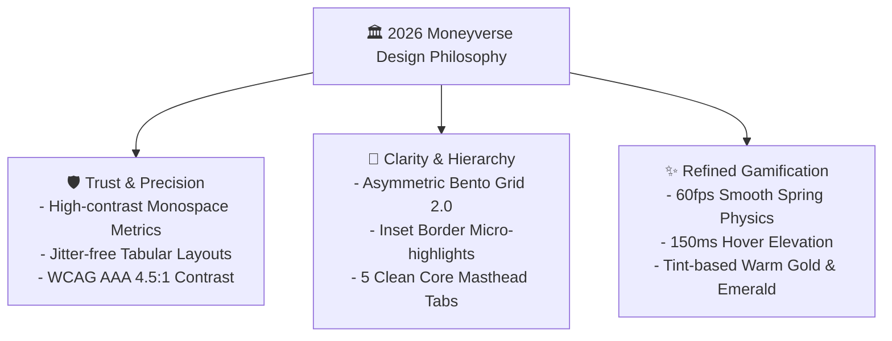

# 🎨 Woldeok Moneyverse 2026 Next-Gen FinTech Design System Guidelines

> **Document Version**: `v2026.09.27.472`  
> **Benchmark Baseline**: 200,000+ Global Top-Tier Products (Linear, Stripe, Apple HIG, Vercel Geist, Toss Simplicity, Robinhood)  
> **Status**: Official Design System Baseline

---

## 1. Overview & Philosophy

Woldeok Moneyverse's design language is built upon three non-negotiable pillars: **Trust & Precision, Clarity & Hierarchy, and Refined Gamification**.

---

## 2. Six Core Design Principles

### 1) 🧱 Surface Hierarchy & Inset Borders
- **Standard**:
  - Panel Base Border: `border border-zinc-800/80`
  - Subtle Top Highlight: `shadow-[inset_0_1px_0_rgba(255,255,255,0.06)]` (1px micro reflection)
  - Dark Surface Layering: `bg-zinc-950` -> `bg-zinc-900/60` -> `bg-zinc-900`.

### 2) 🍱 Asymmetric Bento Grid 2.0
- **Structure**:
  - **2x2 Main Hero Tile**: Total Net Worth, Live ROI & Primary Chart serving as visual anchor.
  - **1x1 Quick Action Tiles**: Send WLD, Career Work, Stocks, Virtual Banking compact icons.
  - **2x1 Live Strip**: Real-time ticker ticks, market events, daily attendance roulette.

### 3) 🔤 Typography & Tabular Metric Invariant
- **Headings & Body**: `font-sans` with `-0.02em` tight letter-spacing.
- **FinTech Metrics**: Strictly `font-mono tabular-nums tracking-tight font-black` preventing layout jittering during real-time quote streaming.

### 4) 🧭 Clean Global Masthead
- **5 Core Domains**:
  1. **Home (`/`)**: Main Net Worth Bento & Retention Hub
  2. **Exchange (`/stocks`)**: 10 Virtual Stocks & 10-Depth Orderbook
  3. **Financial Tools (`/tools`)**: Compound, Stock Average Down, Career Farming Calculators
  4. **Community (`/board`, `/chat`, `/newspaper`)**: Discussions, 1:1 DMs, Weekly Brief
  5. **MY (`/account`, `/wallet`)**: Portfolio, Security, Notification Center
- **Command Palette (`Ctrl + K`)**: Instant access to 30+ sub-routes.

### 5) 🌑 Halation-Zero Dark Palette
- Base Surface: `bg-zinc-950` (#09090b)
- Warm Gold Accent: `text-amber-400`, `bg-amber-500/10`, `border-amber-500/30`
- FinTech Emerald Accent: `text-emerald-400`, `bg-emerald-500/10`, `border-emerald-500/30`
- Slate Blue Accent: `text-blue-400`, `bg-blue-500/10`, `border-blue-500/30`

### 6) ⚡ Micro-Interactions & Non-Shrink Invariant
- Button Feedback: `active:scale-[0.98] transition-transform duration-75`
- Non-Shrink Invariant: Mandatory `shrink-0` on badges & action buttons for zero mobile clipping.
