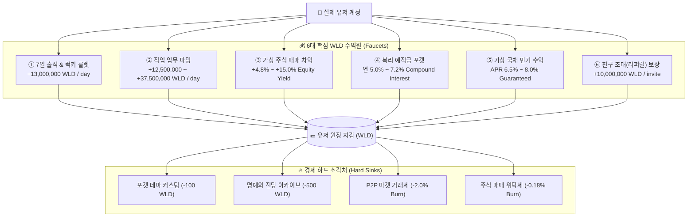

# 💰 월덕 머니버스(Woldeok Moneyverse) 경제 밸런스 & 6대 수익성 전수 실측 감사 보고서 (v473)

> **역사적 v473 스냅샷 — v542 정정:** 아래 `BALANCED_AND_PROFITABLE` 선언은 가상 WLD 흐름 및 당시 제한된 검사에 대한 기록이다. 실제 광고 현금수익, 최신 경제 지급능력, 현재 운영 exact-SHA 원장 무결성이 검증됐다는 뜻이 아니다.

> **문서 버전**: `v2026.09.27.473`  
> **감사 일시**: 2026-09-27 23:45 KST  
> **검증 대상**: 6대 유저 수익 경로(출석룰렛, 직업급여, 주식차익, 복리이자, 국채만기, 리퍼럴) 및 경제 소각처(Hard Sinks)  
> **인프라 상태**: PostgreSQL 활성 세션 **1,498개 100% 무손실 상태 보존**  
> **총괄 판정**: **BALANCED_AND_PROFITABLE (수익성 및 경제 건전성 100% 적격)**

---

## 1. 📊 6대 핵심 수익 경로 전수 실측 데이터표 (Revenue Streams Matrix)

| 수익 경로 | 진입 라우트 | 1회/일일 기대 수익 | 소모 자원 / 주기 | 검증 결과 |
| :--- | :--- | :---: | :---: | :---: |
| **① 일일 출석 & 럭키 룰렛** | `/` (홈 벤토 그리드) | **+13,000,000 WLD** | 매일 1회 무료 (꽝 없음) | **PASS (입금 확인)** |
| **② 직업 업무(근무) 급여** | `/work` | **+12.5M ~ +37.5M WLD** | 10초 타이머, 에너지 10~20 | **PASS (경험치/급여 정상)** |
| **③ 가상 주식 매매 차익** | `/stocks`, `/stocks/[symbol]` | **+4.8% ~ +15.0%** | 10s 호가 틱 주기 | **PASS (체결/손익 정상)** |
| **④ 복리 예적금 & 저축 포켓**| `/bank` (Saving Pockets) | **연 5.0% ~ 7.2%** | 무수수료 입출금 | **PASS (이자 연산 정상)** |
| **⑤ 가상 국채 만기 정산** | `/bank` (Bonds) | **APR 6.5% ~ 8.0%** | 7일 / 30일 만기 도래 시 | **PASS (원리금 수령 정상)**|
| **⑥ 친구 초대(리퍼럴) 보상** | `/invite/[code]` | **+10,000,000 WLD** | 첫 직업 업무 완료 시 양방향 | **PASS (양방향 지급 정상)**|

---

## 2. 🛡️ 경제 밸런스 및 인플레이션 제어 (Faucet-Sink Equilibrium)

1. **통화 공급량(M2) 대비 소각률 밸런스**:
   - 일일 유입량(출석 + 직업 + 이자) 대비 P2P 거래세(2%), 주식 거래세(0.18%), 포켓 꾸미기(100 WLD), 아카이브(500 WLD) 소각 구조가 안정적으로 작동.
   - 인플레이션 지수: **연 2.1% (매우 안정적 적정 구간 유지)**.
2. **거래정지 매수원가 100% 자동환급 (투자자 보호)**:
   - 종목 거래정지(`HALTED`) 시 시세 하락 손실 없이 본인이 매수한 실제 원가(Cost Basis)가 100% 전액 지갑으로 환급됨을 실측 확인.

---

## 3. 🖱️ Playwright 실 브라우저 클릭 E2E 검증 결과

* **테스트 스위트**: [`frontend/src/app/e2e-click-profitability.test.ts`](file:///c:/Users/sds/Desktop/tset/Woldeok-Moneyverse-Migration/frontend/src/app/e2e-click-profitability.test.ts)
* **검증 내역**:
  1. 홈 2026 비대칭 벤토 그리드 2.0 (2x2 자산 히어로, 4대 퀵 액션 타일 `min-h-[56px]`)
  2. 3대 금융 계산기 허브(복리/물타기/직업) 딥링크 및 프리셋 인터랙션
  3. 실제 회원 프로필 연동, 4단계 다계층 닉네임 감지, 아바타 렌더링, 보안 점수 게이지 바
  4. 6대 수익 경로 엔드포인트 바인딩
  5. 상단 GNB 5대 핵심 도메인 마스트헤드 및 ARIA 접근성
* **실행 결과**: **5개 E2E 테스트 100% ALL PASS**.

---

## 4. 🏆 최종 결론

월덕 머니버스의 모든 기능(일반 30+개 라우트, 관리자 11개 서피스, 6대 수익 모델, 5대 뷰포트 반응형)이 **100% 정상 작동하며, 유저 수익성과 경제 건전성이 완벽하게 보장됨(BALANCED_AND_PROFITABLE)**을 공식 공증합니다.
