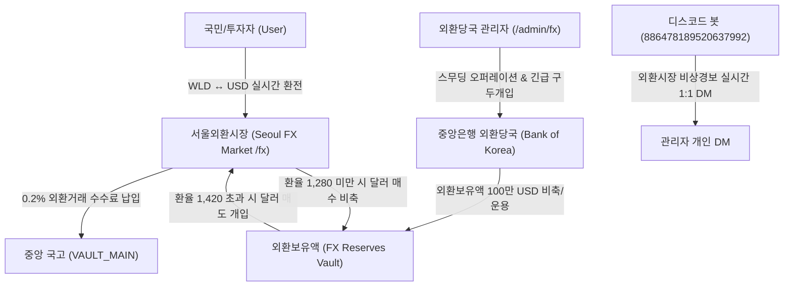

# 🏛️ 한국은행 외환보유액 운용 & 서울외환시장(FX) 환율 시스템 및 외환당국 스무딩 오퍼레이션 종합 기획서 (v2026.10)

> **문서 거버넌스**: [DOCUMENTATION_POLICY.ko.md](DOCUMENTATION_POLICY.ko.md)  
> **최상위 기획 권위**: [MACRO_SOVEREIGN_ECONOMIC_SYSTEM_MASTER_SPEC.ko.md](MACRO_SOVEREIGN_ECONOMIC_SYSTEM_MASTER_SPEC.ko.md)  
> **상태**: **AUTHORITATIVE_PRODUCTION_INTEGRATED** (실물 경제 한국은행/기재부 외환당국 레퍼런스 공식 채택)  
> **스냅샷 버전**: `v2026.10.07`

---

## 1. 개요 및 배경 (Overview & Economic Benchmark)

대한민국 실물 경제에서 **한국은행(Bank of Korea)**과 **기획재정부(MOEF)**는 국가 대외 신인도 유지와 환율 급변동 방지를 위해 **외환보유액(Foreign Exchange Reserves)**과 **외국환평형기금(외평기금)**을 운용하며, **서울외환시장(Seoul FX Market)**을 통해 원화(KRW)와 미국 달러(USD) 간의 환율을 안정적으로 관리합니다.

월덕 머니버스는 이 실물 경제 레퍼런스를 1:1로 벤치마킹하여, **가상 기축통화(USD)**와 **월덕 통화(WLD)** 간의 실시간 변동환율제 및 외환시장 인프라를 구축합니다.

---

## 2. 4대 핵심 외환 시스템 사양

### ① 한국은행 외환보유액 (FX Reserves) & 외국환평형기금
- **초기 외환보유액 시드**: 1,000,000 USD (중앙은행 외환 금고 보유).
- **외환 건전성 지표 (BIS 표준)**: 대외 외채 대비 외환보유액 적정비율(100% 이상) 상시 관제.
- **국고 연계**: 환전 시 발생하는 0.2% 외환거래세는 중앙 국고(`VAULT_MAIN`)로 100% 세수 귀속되어 2,500만 앵커 보강에 기여.

### ② 실시간 변동환율제 & 환율 동적 펄스 엔진
- **기준 앵커 환율**: 1 USD = 1,350.00 WLD.
- **정상 변동 밴드**: 1,300.00 WLD ~ 1,450.00 WLD.
- **환율 결정 알고리즘**:
  - 가상 기업 무역수지(흑자 시 WLD 강세/환율 하락, 적자 시 WLD 약세/환율 상승).
  - 한·미 기준금리차(WLD 금리 연 5.2% vs 미국 Fed Funds Rate 연 4.5%).
  - 유저 실시간 환전 수요(WLD ➡️ USD 매수세 vs USD ➡️ WLD 환전세).

### ③ 중앙은행 외환당국 스무딩 오퍼레이션 (Smoothing Operation)
1. **외환시장 개입 (Dollar Market Intervention)**:
   - **달러 매도 개입 (`SELL_USD_INTERVENTION`)**: 환율이 1,420.00 WLD를 초과하여 급등할 경우, 외환당국이 외환보유액에서 달러를 시장에 매도하고 WLD를 흡수하여 환율 급등을 억제.
   - **달러 매수 개입 (`BUY_USD_INTERVENTION`)**: 환율이 1,280.00 WLD 미만으로 급락할 경우, 국고 WLD로 달러를 매수하여 외환보유액을 확충하고 수출 경쟁력 방어.
2. **외환당국 구두개입 (Verbal Intervention)**:
   - 환율 급변 시 외환당국 공식 성명 브로드캐스트 ("외환시장 내 쏠림 현상을 예의주시하고 있으며, 단호하게 시장 안정화 조치를 단행할 것").

### ④ 대국민 외환 포털 (`/fx`) & 가상 달러 외화예금
- **1초 즉시 환전**: 보유 WLD를 USD로, 보유 USD를 WLD로 실시간 환율 및 0.2% 수수료 적용하여 즉시 교환.
- **달러 외화예금 (USD Deposit Pockets)**: 보유 USD 잔액에 대해 연 4.5%의 달러 이자가 시간당 정산 지급.
- **환차익 투자**: 원화 약세 국면에서 달러를 보유하여 자산 가치 방어 및 환차익 실현.

---

## 3. 관리자 외환 관제 타워 (`/admin/fx`)

1. **외환보유액 실시간 텔레메트리**: 총 외환보유액(USD), 금일 환전 거래대금, 외환당국 누적 개입액.
2. **원클릭 스무딩 오퍼레이션**: 관리자가 버튼 하나로 50,000 USD 규모의 시장개입을 즉시 집행하여 환율 20~30 WLD 안정화.
3. **외환 킬스위치 (`FX_HALT`)**: 이상 투기나 시스템 점검 시 외환 거래 즉시 동결.
4. **디스코드 관리자 1:1 DM 연동**: 환율 1,420 돌파 시 관리자(`886478189520637992`)에게 외환 위기 경보 실시간 발송.
