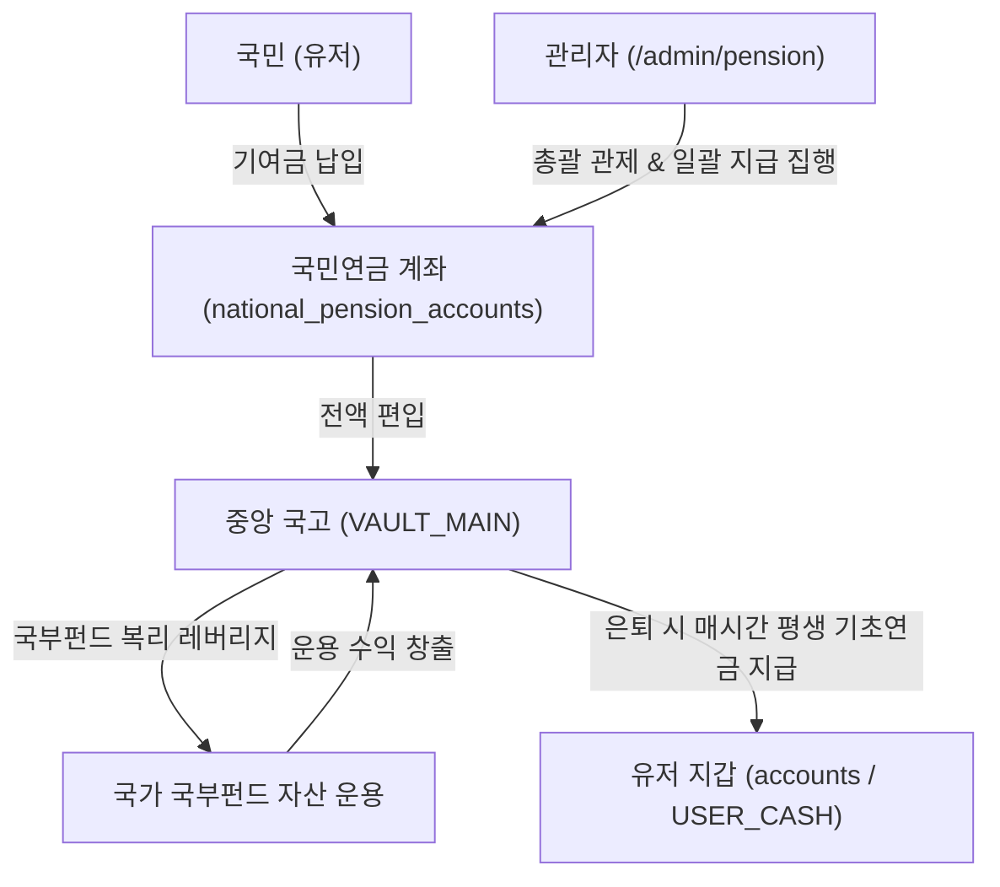

# 월덱 머니버스(Woldeok Moneyverse) 실물 거시경제 및 국가 금융 시스템 마스터 기획서 (v2026.10)

> **역사적·조건부 경제 참고 명세 (v542 알림):** 독립된 최상위 제품 권위가 아니다. 아래의 단순화된 총통화량 산식, 25M 무조건 유지, 확정 수익, 자동보충 및 세율 선언은 v523 중앙은행·조폐국·국고 구분과 v542 경제 무결성 명세가 우선한다. 정확한 Test SHA/실제 원장 증거 없이는 운영 완료를 주장하지 않는다.

> 본 문서는 월덱 머니버스 전역에 구축된 통화·재정·투자·복지·기업 생태계의 모든 기획을 **실제 실물 경제 레퍼런스(한국은행, 미국 연방준비제도, 대한민국 기획재정부 국가재정법, 국채법, 공공기관운영법, 국민연금법, 한국거래소 및 자본시장법)**에 근거하여 체계적으로 정립한 마스터 아키텍처 사양서입니다.

---

## 🏛️ 1. 국가 거시경제 6대 기둥 총괄 매트릭스 (Sovereign Economic Pillars)

| 경제 기둥 | 실제 경제 벤치마크 레퍼런스 | 시스템 내 구현체 | 국고(재정) 및 화폐 흐름 | 법적/제도적 통제 기준 |
| :--- | :--- | :--- | :--- | :--- |
| **① 중앙은행 및 조폐국** | 한국은행(BOK), 미국 연준(Fed), 한국조폐공사(KOMSCO) | `CentralBankService`, `MintBureauService` | $M_0 \rightarrow M_{\text{circulating}}$ 발행 및 초과 통화 소각 | 통화 불변식 ($M_{\text{total}} = M_{\text{circ}} + M_{\text{treasury}}$) |
| **② 중앙 재정 및 국고** | 기재부 국가재정법, 노르웨이 GPFG, 싱가포르 테마섹 | `system_treasury_vaults`, `AutoSwfService` (25M WLD Anchor) | 세수 징수 $\rightarrow$ 국부펀드(ASWF) 복리 운용 $\rightarrow$ 사회 환원 | TSA(국고집중계정), 2,500만 원 최저 준비금 |
| **③ 기획재정국채 거래소** | 대한민국 국채법, 미국 TreasuryDirect, KRX 채권시장 | `treasury_bonds`, Repo Financing (80% LTV) | 국채 청약 자금 $\rightarrow$ 국고 조달 $\rightarrow$ 확정 쿠폰 이자 지급 | 국채법 표준 1Y/3Y/5Y, 무위험 표면금리 앵커 |
| **④ 공기업 및 기업 지배구조** | 공공기관의 운영에 관한 법률, 기재부 알리오(ALIO), OECD | 국가투자공사(WSHC), 3대 공기업(W-Power, W-Net, WDB) | 공기업 당기순이익 30% 법정 배당 + 법인세 15% $\rightarrow$ 국고 귀속 | 한국 공운법 S~E 6단계 경영평가 연동 |
| **⑤ 국민연금 공적 기금** | 보건복지부 국민연금법, 싱가포르 CPF, 미국 SSA | `national_pension_accounts`, 기초연금 지급 엔진 | 유저 기여금 납입 $\rightarrow$ 국고/국부펀드 복리 운용 $\rightarrow$ 평생 연금 지급 | 5단계 가입 등급제, 95% 원금 보장 환급제 |
| **⑥ 자본시장 및 증권 거래소** | 금융위원회 자본시장법, 한국거래소(KRX), DART | WDX 증권거래소, 기업공시시스템(DART), IPO 파이프라인 | 유저 주식 매매 $\rightarrow$ 증권거래세 0.18% 국고 세수 징수 | 서킷브레이커, 상장 폐지/정지 규정, 호가창 체결 |

---

## 🏛️ 2. 중앙은행 통화정책 및 조폐국 (Central Bank & Mint Bureau)

### 2.1 실제 경제 레퍼런스
- **한국은행법 제1조**: "물가안정을 도모하고 금융안정에 유의하여 국민경제의 건전한 발전에 이바지한다."
- **연준 듀얼 맨데이트(Dual Mandate)**: 물가 안정(Price Stability) 및 최대 고용(Maximum Employment).
- **피셔 방정식 및 수량설**: $M \times V = P \times Y$ 에 기반하여 통화 유통속도와 생산량에 맞춰 통화량($M$)을 미세조정.

### 2.2 시스템 상세 구현 사양
```mermaid
graph LR
    MCB["월덕 중앙은행 (MCB)"] -->|통화정책 명령서 (Policy Order)| MMB["월덕 조폐국 (MMB)"]
    MMB -->|신규 화폐 발행 (MINT)| Vault["중앙 국고 (VAULT_MAIN)"]
    Market["시장 유통 통화 (M_circulating)"] -->|카지노 페널티/수수료 소각 (RETIRE)| Sink["영구 소각 금고 (SINK)"]
    MCB -->|1시간 자동 화폐량 조절| AutoReg["AutoMonetaryRegulationService"]
```

1. **통화량 텔레메트리 ($M_{\text{total}}$)**:
   - $M_0$ (본원통화): 조폐국에서 공식 승인되어 발행된 총 누적 발행량.
   - $M_{\text{treasury}}$ (재정통화): 중앙 국고 및 5대 국가 특수 금고(`system_treasury_vaults`)에 락업된 비축 통화.
   - $M_{\text{circulating}}$ (시중유통통화): 유저 지갑 계좌(`accounts` USER_CASH) 및 거래소 호가에 묶인 활성 화폐.
2. **전자동 통화량 조절 엔진 (Automated Monetary Regulation)**:
   - 1시간 주기로 Faucet(발행/보상) 대비 Sink(세금/소각) 비율을 실시간 산출.
   - Faucet-Sink Ratio가 1.2를 초과하면(인플레이션 압력) 국채 금리 인상 및 세제율 강화, 0.8 미만이면(디플레이션 압력) 국부펀드 유동성 완화 집행.

---

## 🏛️ 3. 중앙 재정 국고 및 2,500만 WLD 안전 앵커 복리 국부펀드 (Fiscal Treasury & ASWF)

### 3.1 실제 경제 레퍼런스
- **대한민국 국가재정법 제17조(국고통합계정)**: 모든 세입과 세출은 단일한 국고 계정에서 일괄 통할 관리.
- **노르웨이 국부펀드(GPFG - Government Pension Fund Global)**: 석유 세수를 기반으로 글로벌 우량 자산에 장기 분산 투자하여 국가 미래 세대의 영구적 자산 형성.
- **싱가포르 테마섹 홀딩스(Temasek Holdings)**: 국가지주회사를 통해 기간 시설 및 전략 기술 기업에 투자하여 국가 재정 건전성 확보.

### 3.2 시스템 상세 구현 사양
1. **국고 2,500만 WLD 최소 안전 원금 보존(Floor Reserve)**:
   - `VAULT_MAIN`의 현금 잔액은 어떤 위기 상황에서도 **25,000,000 WLD 바닥선** 이하로 내려가지 않도록 하드웨어 락 수준의 불변식 가드 적용.
2. **1시간 주기 자율 복리 엔진 (`AutoSwfService`)**:
   - **세수 자동 유입**: 공기업 3사 배당(108,000 WLD) + 민간 기업 법인세(16,000 WLD) = 시간당 124,000 WLD 국고 유입.
   - **자산 가치 복리 성장**: 보유 주식 및 국채 포트폴리오 자산 가치 시간당 1.2% 상승.
   - **수익 회수(Harvest)**: 평가 이익의 30%를 현금으로 실현하여 국고에 납입.
   - **초과 잉여금 복리 재투자**: 2,500만 원 초과 세수를 우량주(60%), 국채(30%), 시민배당(10%)으로 100% 시장 재순환.
   - **국민연금 기초연금 및 국채 쿠폰 이자 정산**: 1시간 사이클마다 은퇴자 및 채권 보유자에게 확정 수익 자동 분배.

---

## 🏛️ 4. 기획재정국채(KTB) 발행·유통 거래소 및 레포 대출 (Treasury Bonds & Repo Market)

### 4.1 실제 경제 레퍼런스
- **대한민국 국채법 및 국채전문유통시장**: 기획재정부 발행 최고 신용등급(AAA) 국채, 표면이율(Coupon Rate), 환매조건부채권(RP/Repo).
- **미국 재무부 TreasuryDirect**: T-Bills(단기물), T-Notes(중기물), T-Bonds(장기물) 및 자동 재투자(Automatic Rollover) 체계.

### 4.2 시스템 상세 구현 사양
```mermaid
flowchart TD
    State["기획재정부 국고 (VAULT_MAIN)"] -->|원리금 100% 지급보증| KTB["국채 발행 플랫폼 (/bonds)"]
    KTB --> KTB1Y["KTB-01Y (1년물 / 연 4.5% / 시간당 0.05%)"]
    KTB --> KTB3Y["KTB-03Y (3년물 / 연 5.2% / 시간당 0.06%)"]
    KTB --> KTB5Y["KTB-05Y (5년물 / 연 6.5% / 시간당 0.08%)"]
    
    User["투자자 (국민)"] -->|청약 (Subscription)| KTB
    KTB -->|시간당 확정 쿠폰이자 자동 입금| UserCash["지갑 계좌 (accounts / USER_CASH)"]
    KTB -->|만기 원금 100% 일시 상환| UserCash
    
    User -->|보유 국채 담보 저리 대출 (Repo)| RepoDesk["국채 레포 대출 창구 (80% LTV, 연 2.5%)"]
    RepoDesk -->|담보 락 (collateral_locked)| UserCash
```

1. **3대 표준 국채 스펙**:
   - `KTB-01Y`: 24시간(1년) 만기, 액면 10,000 WLD, 연 4.5% (시간당 0.05%)
   - `KTB-03Y`: 72시간(3년) 만기, 액면 50,000 WLD, 연 5.2% (시간당 0.06%)
   - `KTB-05Y`: 120시간(5년) 만기, 액면 100,000 WLD, 연 6.5% (시간당 0.08%)
2. **국채 담보 저리 레포 대출 (Repo Financing)**:
   - 담보 인정 비율(LTV): **80.0%**.
   - 대출 이자율: **연 2.5%** (국채 표면이율보다 현저히 낮아 안정적 레버리지 지원).
   - 담보 보호 장치: 대출 실행 즉시 해당 채권 `collateral_locked = true`로 잠겨 이중 매도 및 원금 인출 차단.
3. **만기 자동 롤오버 (Auto-Rollover)**:
   - 만기 시점에 유저의 설정에 따라 원리금을 즉시 동일 종목 신규 회차 국채로 자동 재투자하여 복리 효과 영구화.

---

## 🏛️ 5. 국가 공기업(SOE) 및 알리오(ALIO) 공시 포털 (State Enterprises Governance)

### 5.1 실제 경제 레퍼런스
- **공공기관의 운영에 관한 법률 제39조(이익배당)**: 공기업은 회계연도 결산 결과 당기순이익이 발생한 경우 국가재정법에 따라 정부에 배당금을 납입해야 함.
- **알리오(ALIO - All Public Information-In-One)**: 350여 개 공공기관의 재무제표, 임직원 수, 경영평가 결과를 대국민 공개하는 투명 경영 플랫폼.
- **OECD 국유기업 지배구조 가이드라인(OECD Guidelines on Corporate Governance of SOEs)**.

### 5.2 시스템 상세 구현 사양
1. **월덱 국가투자공사(WSHC) 산하 3대 기간 공기업**:
   - **월덱전력공사 (W-Power)**: 국가 에너지 및 기간 인프라 독점 공급, 시간당 순이익 120,000 WLD.
   - **월덱통신네트워크공사 (W-Net)**: 국가 초고속 데이터망 및 통신망 운영, 시간당 순이익 90,000 WLD.
   - **월덱산업개발은행 (WDB)**: 기간 산업 정책금융 및 벤처 출자, 시간당 순이익 150,000 WLD.
2. **30% 법정 배당 국고 자동 납입**:
   - 3대 공기업은 매시간 순이익의 30%인 **총 108,000 WLD**를 중앙 국고(`VAULT_MAIN`)로 의무 납입하며 회계 원장에 기록.
3. **S~E 6단계 정부 경영평가제**:
   - 매주 경영 실적(영업이익, 고용, 서비스 가동률)을 종합 평가하여 차기 회차 배당률 및 임직원 성과 보상 차등 반영.
4. **대국민 알리오 경영공시 포털 (`/enterprises`)**:
   - 무인증 일반 시민 누구나 공기업의 실시간 매출, 순이익, 배당 실적을 투명하게 열람 가능.

---

## 🏛️ 6. 국가 국민연금공단(NPS) 공적 연금 적립 & 평생 기초연금 (National Pension Service)

### 6.1 실제 경제 레퍼런스
- **대한민국 국민연금법 제1조**: "국민의 노령, 장애 또는 사망에 대하여 연금급여를 실시함으로써 국민의 생활 안정과 복지 증진에 이바지한다."
- **싱가포르 중앙적립기금(CPF - Central Provident Fund)**: 전 국민 의무/자발적 기여금 적립 및 국가 보증 평생 연금 분배.
- **국가 재정보증 원칙**: 공적 연금의 최종 원리금 지급 의무는 국가가 전액 부담.

### 6.2 시스템 상세 구현 사양


1. **기여금 국고 전액 편입 및 AUM 극대화**:
   - 국민이 납입한 모든 연금 기여금은 국고(`VAULT_MAIN`)로 유입되어 국가 운용자산(AUM)의 기초 체력을 형성.
2. **5단계 연금 가입 티어 체계**:
   - **Tier 1 (청년적립형)**: 누적 납입 < 100,000 WLD (연 7.0%, 시간당 0.08%)
   - **Tier 2 (표준국민형)**: 누적 납입 100,000 ~ 500,000 WLD (연 7.8%, 시간당 0.09%)
   - **Tier 3 (골드은퇴형)**: 누적 납입 500,000 ~ 2,000,000 WLD (연 8.7%, 시간당 0.10%)
   - **Tier 4 (플래티넘형)**: 누적 납입 2,000,000 ~ 10,000,000 WLD (연 9.6%, 시간당 0.11%)
   - **Tier 5 (명예원로형)**: 누적 납입 10,000,000 WLD 이상 (연 10.5%, 시간당 0.12% + 국가 공로 훈장)
3. **평생 기초연금 수령 및 95% 원금 보증 중도 환급**:
   - **은퇴 모드 전환**: 언제든 원클릭으로 은퇴 기초연금 수령을 시작하거나 추가 적립 모드로 복귀 가능.
   - **중도 해지 안전망**: 긴급 자금 필요 시 적립 원금의 **95% 즉시 환급**, 5%는 국가 사회복지기금(`VAULT_WELFARE`)으로 공익 귀속.

---

## 🏛️ 7. 자본시장 및 WDX 증권거래소 (Capital Markets & Stock Exchange)

### 7.1 실제 경제 레퍼런스
- **대한민국 자본시장과 금융투자업에 관한 법률(자본시장법)**: 상장 규정, 불공정거래 방지, 공시 의무.
- **한국거래소(KRX) 유가증권시장 업무규정**: 호가 접수, 단일가 매매, 접속 매매, 서킷브레이커(1단계 8%, 2단계 15%, 3단계 20%).

### 7.2 시스템 상세 구현 사양
1. **WDX 4대 대표 섹터 상장 종목**:
   - `WDX-TEC`: 국가 혁신 테크놀로지 기업 (성장주)
   - `WDX-FIN`: 금융 지주 및 투자 은행 (배당주)
   - `WDX-BIO`: 차세대 바이오 헬스케어 (모멘텀주)
   - `WDX-RET`: 소비재 및 유통 유니콘 (가치주)
2. **세제 및 재정 환원**:
   - 매도 시 **0.18% 증권거래세** 원천징수 $\rightarrow$ 국고 금고 입금.
   - 가상 상장 기업의 시간당 영업이익에 대한 **15% 법인세** 국고 자동 징수.
3. **투자자 보호 장치**:
   - 급격한 시세 변동 시 서킷브레이커 발동 및 실시간 AI 기업 공시(DART) 토스트 브로드캐스트.

---

## 🏛️ 8. 행정·관제 및 디스코드 관리자 1:1 감사 보고 체계

1. **디스코드 REST API v10 기반 1:1 Direct Message (DM)**:
   - 수신자: `886478189520637992` (총괄 관리자)
   - 발송 시점:
     - 대규모 국채 청약(10만 WLD 이상) 및 만기 상환 완료 시
     - 대규모 국민연금 기여금 국고 납입 시
     - 1시간 주기 국채 쿠폰 이자 및 기초연금 일괄 지급 정산 완료 시
     - 공기업 3사 법정 이익배당 국고 입금 시
2. **관리자 총괄 관제 서피스**:
   - `/admin/treasury`: 국고 비축 자금 및 2,500만 WLD 앵커 제어
   - `/admin/enterprises`: 국가투자공사(WSHC) 산하 공기업 알리오 관제
   - `/admin/bonds`: 기획재정국채 발행, 금리 조정, 쿠폰 일괄 지급
   - `/admin/pension`: 국민연금 기금(AUM), 가입자 관리, 기초연금 일괄 지급
