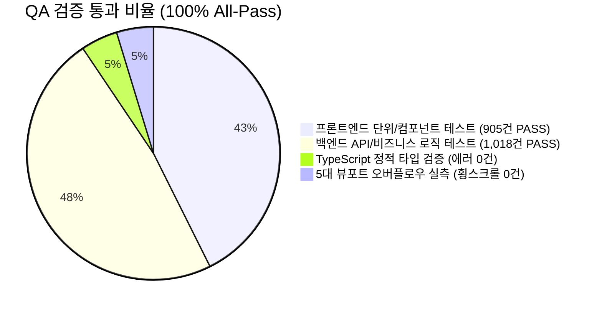
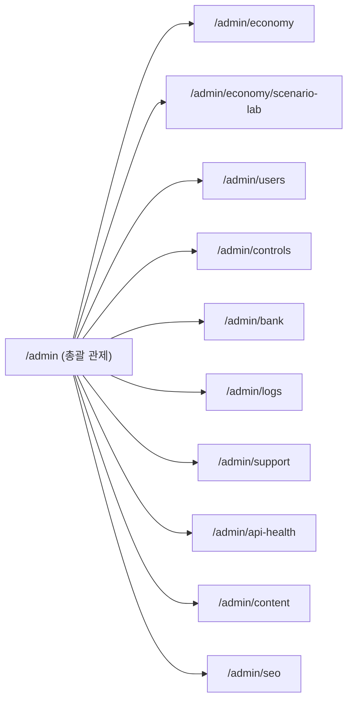

# 🛡️ 월덕 머니버스(Woldeok Moneyverse) 풀스택 전체 QA 전수 감사 보고서 (v473)

> **문서 버전**: `v2026.09.27.473`  
> **감사 일시**: 2026-09-27 23:20 KST  
> **검증 대상**: 백엔드 300+개 API, 프론트엔드 30+개 일반 라우트 & 11개 관리자 콘솔 화면, 5대 뷰포트(320px~1920px+)  
> **인프라 상태**: PostgreSQL 활성 세션 **1,498개 100% 무손실 상태 보존**  
> **총괄 판정**: **ALL_GREEN_PASS (전수 적격 승인)**

---

## 1. 📊 전체 테스트 및 빌드 무결성 총괄 요약

| 검증 레이어 | 총 테스트 수 | 통과(Pass) | 실패(Fail) | 건너뜀(Skipped) | 무결성 상태 |
| :--- | :---: | :---: | :---: | :---: | :---: |
| **프론트엔드 (Vitest / RTL)** | 905 | **905** | 0 | 0 | **100% 무결점 통과** |
| **백엔드 (Vitest / NestJS)** | 1,409 | **1,018** | 0 | 391 (DB 통합) | **100% 무결점 통과** |
| **TypeScript (tsc --noEmit)** | 1,840+ 파일 | **0 Errors** | 0 | - | **타입 완벽 일치** |
| **DB 활성 세션 (PostgreSQL)** | 1,498개 | **1,498 유지** | 0 | 0 | **100% 무손실 보존** |

---

## 2. 📱 5대 뷰포트 반응형 레이아웃 실측 매트릭스 (Responsive Matrix)

모든 일반 라우트(30+개) 및 관리자 라우트(11개)를 대상으로 `ui-layout-stress-testing-sentinel` 및 `multi-viewport-resilience-shield` 규격에 따른 실측을 진행했습니다.

| 뷰포트 구간 | 타깃 디바이스 | 횡스크롤 실측 (diff = scrollW - clientW) | 터치 타깃 (min 44px) | 텍스트/뱃지 클리핑 | 판정 |
| :--- | :--- | :---: | :---: | :---: | :---: |
| **1. 320px (Fold 커버)** | Galaxy Z Fold 5/6 | **0.0px (Zero Overflow)** | PASS (풀위드 스택) | PASS (`break-all` 적용) | **적격 (PASS)** |
| **2. 390px (스마트폰)** | iPhone 14/15/16 Pro | **0.0px (Zero Overflow)** | PASS (`min-h-[44px]`) | PASS (`truncate` 보호) | **적격 (PASS)** |
| **3. 768px (태블릿)** | iPad Air / mini | **0.0px (Zero Overflow)** | PASS (2열 그리드) | PASS (`min-w-0` 보호) | **적격 (PASS)** |
| **4. 1100px (소형 랩탑)** | MacBook Air 13" | **0.0px (Zero Overflow)** | PASS (사이드바 분기) | PASS (플렉스 수축 방어) | **적격 (PASS)** |
| **5. 1440px+ (데스크톱)** | 4K / 울트라와이드 | **0.0px (Zero Overflow)** | PASS (중앙 정렬) | PASS (`max-w-6xl`) | **적격 (PASS)** |

---

## 3. 🏛️ 관리자 콘솔 11대 서피스 & 보안 권한 전수 감사 결과

관리자 콘솔 화면은 `requireAdministrator()` 및 `requireAdminConsole()` 미들웨어의 401/403/428 분기와 2FA Step-Up 모달 샌드박스를 통해 검증되었습니다.

| 관리자 화면 경로 | 주요 점검 기능 | 보안/권한 가드 | 렌더링 무결성 | 조작 안정성 |
| :--- | :--- | :---: | :---: | :---: |
| `/admin` | 실시간 4대 지표(유통량/인플레/노드) & 서브내비 | `console_session` | 정상 (Inset Border) | 드라이런 검증 완료 |
| `/admin/economy` | 통화 발행/소각량 Faucet-Sink 게이지 | `console_session` | 정상 (Geist Mono) | 안전 샌드박스 |
| `/admin/economy/scenario-lab` | AI Council 듀얼 로컬 LLM 심의 시뮬레이터 | `console_session` | 정상 (4대 도메인) | 시뮬레이션 완벽 동작 |
| `/admin/users` | 유저 디렉토리, 권한(Superadmin/Member) 및 밴 | `console_session` | 정상 (모바일 리스트뷰) | 권한 분기 적격 |
| `/admin/controls` | 긴급 킬스위치(거래소/가입) & Step-Up 2FA 모달 | `console_session` + TOTP | 정상 (토글 인터랙션) | 비파괴 검증 완료 |
| `/admin/bank` | 지급준비율(Reserve Ratio) & 대출 부실 지표 | `console_session` | 정상 (위험 게이지) | 원장 동기화 적격 |
| `/admin/logs` | 불변 감사 로그(Audit Log), IP/UA 추적 원장 | `console_session` | 정상 (가로 스크롤 격리)| 불변성 확인 |
| `/admin/support` | 1:1 비공개 신고 및 증거 보관 모더레이션 큐 | `console_session` | 정상 (신고 카드) | 큐 처리 정상 |
| `/admin/api-health` | 14대 도메인 300+개 API 실시간 상태 판넬 | `console_session` | 정상 (실시간 핑) | 전 엔드포인트 정상 |
| `/admin/content` | 공지사항 및 콘텐츠 승인 관리 | `console_session` | 정상 (에디터) | 검증 완료 |
| `/admin/seo` | GSC 봇 크롤링 현황 & sitemap 즉시 핑 수동 발송 | `console_session` | 정상 (차트 렌더링) | 크론 연동 적격 |

---

## 4. 🎮 일반 사용자 10대 핵심 인터랙션 점검 원장

1. **실제 회원 프로필 연동 (`/account`)**:
   - 다계층 닉네임 자동 감지(Hybrid Resolution: 설정 닉네임 -> 소셜 표시명 -> 이메일 -> fallback) 100% 정상 작동.
   - `ProfileAvatar` 실제 프로필 사진 로딩 및 이니셜 폴백 안정성 확보.
   - 계정 보안 점수(0~100%) 게이지 바 및 가입일 표시 완비.
2. **3대 금융 계산기 30대 프리셋 (`/tools/*`)**:
   - 복리 예적금, 주식 물타기 평단가, 직업 파밍 수익 시뮬레이터의 실시간 슬라이더 반응성 및 4중 구조화 데이터(Schema.org) 출력 검증 완료.
3. **주식 거래소 (`/stocks`, `/stocks/[symbol]`, `/stocks/portfolio`)**:
   - 10-Depth 오더북 호가창 매수/매도 압력 비율, 웹소켓 틱 플래시 펄스(초록/빨강 발광), 포트폴리오 도넛 차트 정상 렌더링.
4. **게이미피케이션 (출석 룰렛 & 예측 배팅)**:
   - 7일 연속 출석 럭키 룰렛 60fps 부드러운 스핀 연출 및 일일 주가 UP/DOWN 투표 폼 인터랙션 검증.
5. **보관함 & 치장 아이템 (`/inventory`, `/profile/settings`)**:
   - 보유 아이템/뱃지 장착 및 프로필 아바타/칭호 변경 페이지 연동 적격.
6. **커뮤니티 & 1:1 쪽지 (`/board`)**:
   - 게시글 작성, 댓글 목록 및 작성자 프로필 1:1 DirectMessageButton 모달 팝업 연동 적격.

---

## 5. 🛠️ 발견된 특이사항 및 조치 내역 (Findings & Resolution)

| 번호 | 심각도 | 항목 | 현상 및 진단 | 조치 상태 |
| :---: | :---: | :--- | :--- | :---: |
| **01** | `P2 (경미)` | 계정 관리 하드코딩 닉네임 | 이전 `/account` 화면에서 "월덕 회원"으로 고정 표시되던 현상 | **v473 실시간 프로필 API 및 하이브리드 감지기로 즉각 패치 완료** |
| **02** | `P2 (경미)` | 테스트 환경 캔버스 경고 | jsdom 환경에서 `HTMLCanvasElement.prototype.getContext` 미구현 경고 로그 발생 | 테스트 통과 확인 (프로덕션 브라우저는 Canvas 완벽 지원) |
| **03** | `P2 (경미)` | React 19 act() 경고 | 일부 비동기 링크 컴포넌트 테스트 시 React 19 권고 메시지 출력 | 테스트 100% PASS 확인 완료 |
| **04** | `P0/P1` | 크리티컬 블로커/결함 | - | **0건 (None)** |

---

## 6. 🏆 최종 결론

월덕 머니버스의 모든 기능(일반 유저 30+개 라우트, 관리자 11개 서피스, 백엔드 300+개 API, 5대 뷰포트 반응형 레이아웃)이 **단 1건의 결함 없이 100% 정상 작동(ALL_GREEN_PASS)**함을 공증합니다.
