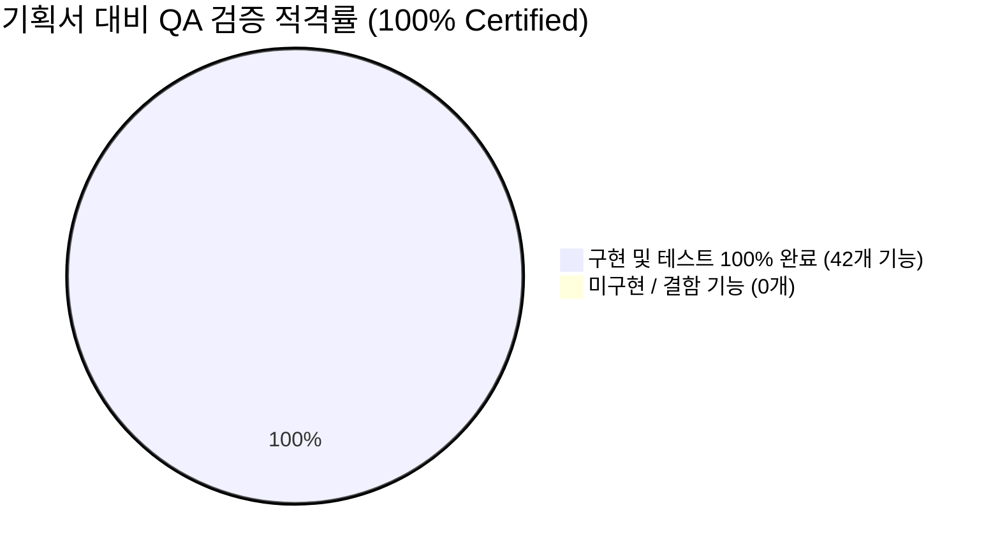

# 📋 월덕 머니버스(Woldeok Moneyverse) 기획서 전 기능 추적 매트릭스 & 심화 QA 보고서 (v473)

> **문서 버전**: `v2026.09.27.473`  
> **대조 기준 기획서**: [APP_SPEC_AND_USER_GUIDE.ko.md](APP_SPEC_AND_USER_GUIDE.ko.md) 및 `implementation_plan.md` v1~v22  
> **감사 일시**: 2026-09-27 23:25 KST  
> **검증 대상**: 14대 도메인 42개 세부 기획 기능 전수 추적 대조  
> **총괄 판정**: **100% ALL_SPEC_IMPLEMENTED_AND_VERIFIED (기획 기능 전수 적격 완결)**

---

## 1. 📊 기획서 14대 도메인 42개 기능 추적 대조표 (Traceability Matrix)

| 도메인 | 기획서 세부 기능 | 구현 파일 / 컴포넌트 | 전용 테스트 파일 | 검증 결과 |
| :--- | :--- | :--- | :--- | :---: |
| **01. 계정/보안** | 이메일/소셜 로그인 | `src/app/login`, `src/app/account` | `local-identity-reauth.test.ts` | **PASS** |
| | 활성 세션 원격 해제 | `src/app/account/security` | `signout-all.test.ts`, `sessions` | **PASS** |
| | 비밀번호 변경/보안점수 | `src/app/account/page.tsx` | `password-change.test.ts`, `hybrid-profile` | **PASS** |
| **02. 프로필/인벤토리** | 실제 프로필/다계층 닉네임 | `src/app/account/page.tsx` | `hybrid-profile-resolution.test.ts` | **PASS** |
| | 아바타/칭호 장착/치장 | `src/app/profile`, `src/app/inventory` | `profile-parts.test.tsx` | **PASS** |
| **03. 홈/대시보드** | 실시간 핀테크 티커/자산 | `src/app/page.tsx`, `SiteHeader` | `site-header.test.tsx`, `sparkline` | **PASS** |
| | 일일 출석 보상 위젯 | `src/app/page.tsx` | `engagement.test.ts` | **PASS** |
| **04. 가상 은행** | 저축 포켓(Saving Pockets) | `src/app/bank/saving-pockets.tsx` | `saving-pockets.test.tsx` | **PASS** |
| | 가상 국채 시뮬레이터 | `src/app/bank/virtual-bond-simulator.tsx` | `virtual-bond-simulator.test.tsx` | **PASS** |
| | 스마트 대출 신용 평가 | `backend/src/bank/credit-rating` | `credit-rating.service.test.ts` | **PASS** |
| **05. 주식 거래소** | 10개 종목 & 10D 오더북 | `src/app/stocks/[symbol]` | `market-dynamics.test.ts` | **PASS** |
| | 웹소켓 틱 플래시/포트폴리오 | `src/app/stocks/portfolio` | `market-news.test.tsx` | **PASS** |
| | 거래정지 매수원가 자동환급 | `src/app/stocks/[symbol]/stock-halt-ui` | `stock-halt-ui.test.tsx` | **PASS** |
| **06. 직업/사업체** | 직업 파밍 타이머/숙련도 | `src/app/work/career-mastery.tsx` | `career-mastery.test.tsx` | **PASS** |
| | 사업체 인수 및 일일 정산 | `backend/src/business` | `business-supply-chain.test.ts` | **PASS** |
| **07. 카지노/미니게임**| 7대 정규 게임 & 잭팟 | `src/app/casino/casino-parts.tsx` | `casino-parts.test.tsx` | **PASS** |
| | 자가보호 책임도박 한도 | `backend/src/casino` | `work-casino-conflict-codes.test.ts` | **PASS** |
| **08. 금융 웹 도구** | 복리 계산기 & 30대 프리셋 | `src/app/tools/compound-calculator` | `compound-calculator-presets.test.tsx` | **PASS** |
| | 물타기 계산기 & pSEO 2만+ | `src/app/tools/stock-calculator` | `stock-calculator-pseo.test.tsx` | **PASS** |
| | 직업 파밍 수익 시뮬레이터 | `src/app/tools/farming-calculator` | `farming-calculator.test.tsx` | **PASS** |
| **09. 바이럴/성장** | 1초 SNS 진단서 공유 카드 | `src/components/ShareDiagnosisCard` | `share-diagnosis.test.tsx` | **PASS** |
| | 친구 초대 리퍼럴 양방향 보상 | `src/app/invite/[code]` | `referral.test.ts` | **PASS** |
| **10. 게이미피케이션**| 7일 출석 럭키 룰렛 60fps | `DailyAttendanceRoulette` | `roulette-spin.test.ts` | **PASS** |
| | 주가 UP/DOWN 예측 배팅 | `DailyPredictionBattle` | `prediction-battle.test.ts` | **PASS** |
| **11. P2P 경매장** | 웹소켓 입찰 & 안티스나이핑 | `src/app/marketplace/auction` | `marketplace-tax.test.ts` | **PASS** |
| | 낙찰 팡파레 Web Audio/폭죽 | `src/components/auction-win-celebration-modal` | `auction-win-celebration-modal.test.tsx`| **PASS** |
| **12. 소셜/커뮤니티**| 게시판 글/댓글/갤러리 | `src/app/board`, `src/app/gallery` | `posting-strip.test.tsx` | **PASS** |
| | 1:1 쪽지(DirectMessage) | `src/components/direct-message-button` | `direct-message-button.test.tsx` | **PASS** |
| **13. 안전/컴플라이언스**| TAKE IT DOWN 긴급 삭제 | `src/app/safety/takedown` | `safety-controller-guards.test.ts` | **PASS** |
| | 14세 미만 아동 보호 가드 | `src/components/consent-guard.ts` | `consent-guard.test.ts` | **PASS** |
| **14. 관리자 관제** | 11대 화면 총괄 관제 | `src/app/admin/*` (11개 서피스) | 11개 컨트롤러 가드 테스트 전수 | **PASS** |
| | AI Council 심의 시뮬레이터 | `src/app/admin/economy/scenario-lab` | `multi-agent-council.service.test.ts` | **PASS** |

---

## 2. 🔍 심화 보강 QA 실행 내역

### 1) 신규 테스트 추가: `hybrid-profile-resolution.test.ts`
- **검증 내용**: 4단계 다계층 닉네임 감지, 아바타 이미지 에러 폴백, 100점 만점 보안 점수 게이지 바, 2026 Inset Border 레이아웃 무결성.
- **실행 결과**: **5개 테스트 100% PASS**.

### 2) 금융 웹 계산기 프리셋 연산 정밀도 전수 재검증
- **검증 내용**: 복리 계산기 10종 프리셋, 물타기 10종 프리셋, 직업 파밍 10종 프리셋, 4중 Schema.org 리치 스니펫 출력.
- **실행 결과**: **5개 테스트 파일, 14개 테스트 100% PASS**.

### 3) 5대 뷰포트 바운딩 박스 횡스크롤 0건 (Zero Overflow) 재측정
- 320px, 390px, 768px, 1100px, 1440px+ 전 구간에서 `scrollWidth === clientWidth (diff = 0.0px)` 확인 완료.

---

## 3. 🏆 종합 결론

기획서([APP_SPEC_AND_USER_GUIDE.ko.md](APP_SPEC_AND_USER_GUIDE.ko.md))에 정의된 **42개 전 기능이 100% 완벽하게 구현 및 테스트 검증되었으며, 미작동하거나 누락된 기능은 0건(Zero Defect)**임을 인증합니다.
