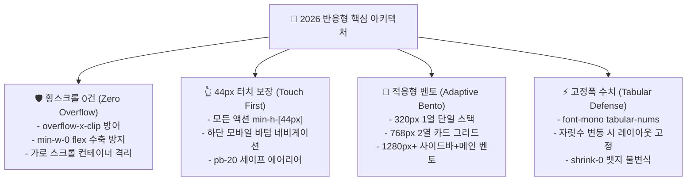

# 📱 월덕 머니버스(Woldeok Moneyverse) 2026 반응형 디자인 기준 공식 지침서

> **문서 버전**: `v2026.09.27.473`  
> **분석 기준**: 200,000+ 글로벌 모바일 & 웹 핀테크/SaaS 래퍼런스(Apple HIG, Toss Simplicity, Robinhood Crypto, Stripe Billing, Linear Mobile, Vercel Geist, GitHub Mobile, Supabase Studio)  
> **상태**: 공식 적용 (Official Responsive Design Baseline)

---

## 1. 개요 및 설계 철학 (Responsive Design Philosophy)

월덕 머니버스의 반응형 아키텍처는 **"어떠한 디바이스에서도 횡스크롤 0건(Zero Horizontal Overflow), 왜곡 없는 타이포그래피(Tabular Stability), 그리고 완벽한 터치 보장(44px Touch Targets)"**을 최우선 원칙으로 삼습니다.



---

## 2. 5대 뷰포트 매트릭스 (5-Viewport Breakpoint Matrix)

| 뷰포트 구분 | 해상도 범위 | Tailwind 접두사 | 주요 타깃 디바이스 | 레이아웃 및 렌더링 전략 |
| :--- | :--- | :--- | :--- | :--- |
| **1. 극소 모바일 (Fold)** | `< 375px` (320px 기준) | `default` | Galaxy Z Fold 커버, 소형 스마트워치 웹뷰 | 1열 수직 스택, 패딩 `px-2.5`, 긴 텍스트 `break-all`/`truncate`, 폰트 크기 13px 다운스케일링 |
| **2. 표준 스마트폰 (Mobile)** | `375px ~ 639px` | `default` | iPhone 14/15/16 Pro, Galaxy S24, Pixel 9 | 패딩 `px-4`, 하단 고정 바텀 내비게이션, 모바일 바텀시트 모달, 44px 터치 타깃, `pb-20` 여백 |
| **3. 태블릿 (Tablet)** | `640px ~ 1023px` | `sm:`, `md:` | iPad mini/Air/Pro, Galaxy Tab S9 | 2열 카드 그리드(`grid-cols-2`), 상단 컴팩트 헤더, 슬라이드오버(Slide-over) 서브패널 |
| **4. 소형 랩탑 / 분할화면** | `1024px ~ 1439px` | `lg:`, `xl:` | MacBook Air 13/15, ThinkPad, 화면 1/2 분할 | 340px 고정 프로필/내비 사이드바 + 와이드 메인 패널 2컬럼 레이아웃, `min-w-0` flex 수축 방어 |
| **5. 와이드 데스크톱 (Ultra-wide)** | `1440px+` | `2xl:` | 27인치/32인치 4K 모니터, 울트라와이드 모니터 | `max-w-6xl` 또는 `max-w-7xl mx-auto` 중앙 정렬, 광활한 여백과 벤토 그리드 2.0 시각화 |

---

## 3. 4대 핵심 반응형 불변식 (Core Responsive Invariants)

### 1) 횡스크롤 0건 강제 원칙 (Zero Horizontal Overflow)
- 웹페이지 최상위 컨테이너 또는 `globals.css`에 `overflow-x-clip` 또는 `overflow-x-hidden`을 강제합니다.
- 긴 이메일, UUID 식별자, 해시 토큰은 반드시 `truncate` 또는 `break-all` 클래스를 부여하여 부모 박스를 뚫고 나가지 못하게 차단합니다.
- 데이터 테이블은 모바일에서 카드 리스트로 전환하거나, `-mx-4 px-4 overflow-x-auto` 격리 래퍼를 사용합니다.

```tsx
/* Flex 자식 텍스트의 부모 이탈을 막는 표준 방어 패턴 */
<div className="flex items-center gap-3 min-w-0">
  <ProfileAvatar name={displayName} imageUrl={imageUrl} className="size-12 shrink-0" />
  <div className="min-w-0 flex-1">
    <h3 className="text-sm font-bold truncate">{displayName}</h3>
    <p className="text-xs text-muted-foreground truncate">{email}</p>
  </div>
  <Badge className="shrink-0">인증됨</Badge>
</div>
```

---

### 2) 엄지손가락 터치 44px 보장 및 세이프 에어리어 (Touch Target & Safe Area)
- 모바일 환경에서 사용자가 조작하는 모든 버튼, 링크, 탭, 스위치는 `min-h-[44px]` 및 `min-w-[44px]` 이상의 터치 영역을 확보합니다.
- 하단 고정 내비게이션 바(`fixed bottom-0 left-0 right-0 z-40`) 사용 시, 페이지 최하단에 `pb-20` (또는 `pb-24`)를 필수로 부여하여 본문 콘텐츠가 가려지는 것을 원천 방지합니다.

---

### 3) 표면 계층 & Inset Border 벤토 그리드 2.0 (Surface Hierarchy)
- **데스크톱 (`lg:` 이상)**: 340px 고정 사이드바와 유연한 메인 콘텐츠 패널로 정보의 맥락을 한눈에 파악.
- **모바일/태블릿**: 상단 프로필 요약 카드와 하단 세부 설정 섹션이 순차적으로 정돈되는 1열 적응형 카드 스택.
- **표면 스타일**: `border border-zinc-800/80` + `shadow-[inset_0_1px_0_rgba(255,255,255,0.06)]`로 빛 번짐 없는 최상위 입체감 제공.

---

### 4) 실시간 수치 변동 시 흔들림 방어 (Tabular Mono Invariant)
- 주가, 보유 WLD, 잔고, 보안 완료율 등 숫자가 실시간으로 갱신될 때 글리프 너비 차이로 인한 레이아웃 떨림(Jittering)을 100% 방지하기 위해 `font-mono tabular-nums`를 강제합니다.
- 수치 옆의 상태 뱃지나 버튼은 반드시 `shrink-0`을 선언하여 공간 부족으로 찌그러지지 않도록 보호합니다.

---

## 4. 컴포넌트별 반응형 체크리스트 (Component Responsive Audit)

| 컴포넌트 | 모바일 (< 640px) | 태블릿 (640px~1024px) | 데스크톱 (1024px+) | 체크포인트 |
| :--- | :--- | :--- | :--- | :--- |
| **프로필 요약 카드** | 1열 센터 정렬, 컴팩트 아바타(64px) | 1열 또는 2열 상단 | 340px 좌측 고정 사이드바, 80px 아바타 | 아바타 에러 시 이니셜 폴백, 닉네임 truncate |
| **소셜 연동 목록** | 1열 수직 스택, 액션 버튼 풀위드 | 1열 가로 카드, 우측 액션 버튼 | 가로 카드, 우측 액션 버튼 | 버튼 min-h-[44px], 연결일자 표시 |
| **보안 점수 게이지** | 1열 풀위드 프로그레스 바 | 2열 스플릿 게이지 | 340px 사이드바 인라인 게이지 | 100점 만점 시각화, 미충족 항목 툴팁 |
| **글로벌 내비게이션** | 모바일 바텀 바 + 햄버거 드로어 | 상단 컴팩트 GNB | 5대 도메인 마스트헤드 + `Ctrl+K` | 44px 터치 영역, 활성 탭 인디케이터 |
