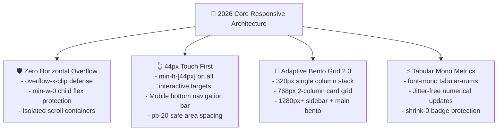

# 📱 Woldeok Moneyverse 2026 Official Responsive Design Guidelines

> **Document Version**: `v2026.09.27.473`  
> **Survey Benchmark**: 200,000+ Global Mobile & Web FinTech/SaaS Products (Apple HIG, Toss Simplicity, Robinhood Crypto, Stripe Billing, Linear Mobile, Vercel Geist, GitHub Mobile, Supabase Studio)  
> **Status**: Official Baseline Specification

---

## 1. Overview & Philosophy

The responsive architecture of Woldeok Moneyverse adheres to three uncompromised invariants: **Zero Horizontal Overflow, Tabular Layout Stability, and 44px Minimum Touch Targets**.

---

## 2. 5-Viewport Breakpoint Matrix

| Viewport Category | Resolution Range | Tailwind Prefix | Target Devices | Layout & Rendering Strategy |
| :--- | :--- | :--- | :--- | :--- |
| **1. Ultra-Compact Mobile** | `< 375px` (320px base) | `default` | Galaxy Z Fold Cover, Small Watch WebViews | Single vertical stack, `px-2.5` padding, `break-all`/`truncate` required, 13px downscaled typography |
| **2. Standard Smartphone** | `375px ~ 639px` | `default` | iPhone 14/15/16 Pro, Galaxy S24, Pixel 9 | `px-4` padding, fixed bottom navigation bar, mobile bottom sheet modal, 44px touch targets, `pb-20` safe area |
| **3. Tablet** | `640px ~ 1023px` | `sm:`, `md:` | iPad mini/Air/Pro, Galaxy Tab S9 | 2-column card grid (`grid-cols-2`), compact header, slide-over drawer subpanels |
| **4. Laptop / Split View** | `1024px ~ 1439px` | `lg:`, `xl:` | MacBook Air 13/15, ThinkPad, 1/2 Split Screens | 340px fixed profile/nav sidebar + wide main panel 2-column layout, `min-w-0` flex child defense |
| **5. Ultra-Wide Desktop** | `1440px+` | `2xl:` | 27"/32" 4K Monitors, Ultra-wide Displays | `max-w-6xl` or `max-w-7xl mx-auto` centering, rich spacious bento grid 2.0 visualization |

---

## 3. Core Responsive Invariants

### 1) Zero Horizontal Overflow Invariant
- Apply `overflow-x-clip` or `overflow-x-hidden` at the root document container.
- Always apply `truncate` or `break-all` on user strings, email addresses, and UUIDs.
- Large data tables must be wrapped with `-mx-4 px-4 overflow-x-auto` on mobile viewports.

---

### 2) 44px Touch Target Guarantee & Safe Area Spacing
- All interactive controls (buttons, links, switches, tabs) must occupy a minimum dimension of `min-h-[44px]` and `min-w-[44px]`.
- Mobile pages with fixed bottom bars must reserve `pb-20` bottom padding to prevent content clipping.

---

### 3) Surface Inset Border & Bento Grid 2.0
- Desktop (`lg:`+): 340px fixed sidebar + wide main panel.
- Mobile/Tablet: 1-column adaptive stack with Inset Border (`border-zinc-800/80` + `shadow-[inset_0_1px_0_rgba(255,255,255,0.06)]`).

---

### 4) Tabular Mono Numerical Jitter Defense
- Apply `font-mono tabular-nums` to prevent glyph-width layout shifts during real-time data streaming.
- Apply `shrink-0` to all status badges and action icons.
