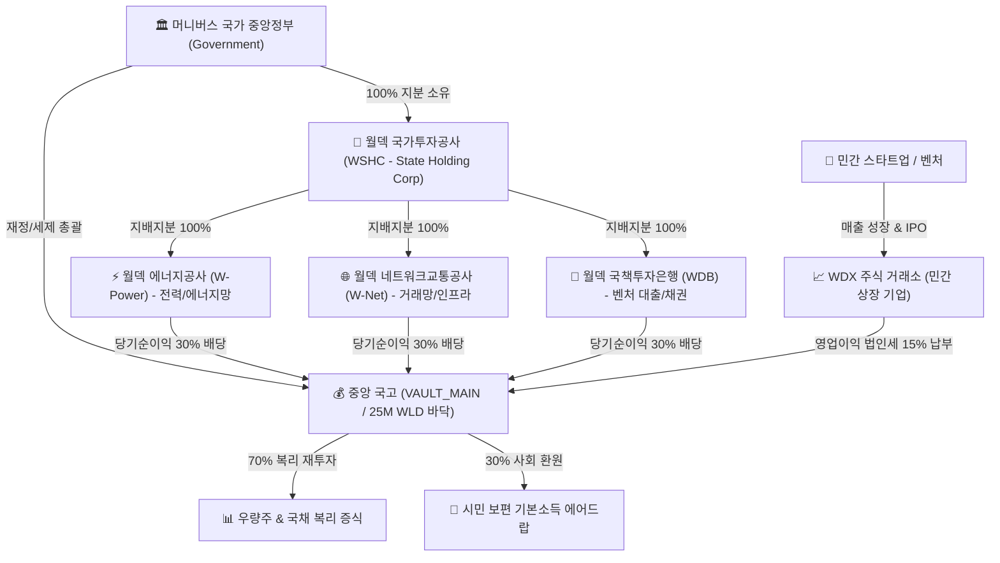

# 국가 지주회사·공기업(SOE) 및 민간 기업 자율 성장 경제 생태계 명세서 (v1.0)
> **Authoritative Specification: State-Owned Enterprises (SOE), State Holding Corporation & Autonomous Private Enterprise Ecosystem**

---

## 1. 개요 및 설계 철학 (Executive Summary & Philosophy)

본 명세서는 머니버스(Woldeok Moneyverse) 경제 생태계 내에 **국가(정부), 공기업(SOE), 국가투자지주회사(State Holding Corp), 민간 기업(Private Enterprises)**이 유기적으로 상호작용하는 현실감 넘치는 국가 거버넌스 및 시장 경제 모델을 구축하기 위한 표준 사양서이다.

### 1.1 글로벌 벤치마크 레퍼런스
1. **싱가포르 테마섹(Temasek) 지주회사 모델**:
   - 정부가 100% 지분을 보유한 국가지주회사(`WSHC`, Woldeok State Holding Corporation)를 두고, 정치적 간섭 없이 전문 경영진이 공기업과 전략적 지분을 독립 운용.
2. **노르웨이 국부펀드(GPFG) 투명 경영 원칙**:
   - 산티아고 원칙(Santiago Principles) 및 트루먼 스코어보드(Truman Scoreboard)를 준용하여 모든 공기업의 재무제표, 경영평가, 배당 납입 내역을 실시간 투명 공개.
3. **한국 공운법(공공기관의 운영에 관한 법률) 경영평가제**:
   - 매 주기(1시간)마다 자체수입비율, 공공 기여도, 재무 건전성을 평가하여 **S/A/B/C/D/E 6단계 경영평가 등급** 산정 및 성과급/배당 연동.
4. **민간 벤처 스케일업 & 자율 IPO(기업공개) 파이프라인**:
   - AI 및 유저 가상 창업가가 벤처/스타트업을 설립하여 매출 달성 시 WDX 주식 거래소에 자율 상장(IPO), 분기 실적 발표, 법인세(15%) 자동 납부 및 주주 배당을 실시하는 현실적 시장 경제 구현.

---

## 2. 국가 및 공기업 지배구조 아키텍처 (Governance Architecture)

---

## 3. 3대 국가 기간 공기업 (Core State-Owned Enterprises) 명세

| 공기업 코드 | 공기업 명칭 | 영문 명칭 | 설립 목적 및 핵심 역할 | 수익 모델 (Revenue Model) |
| :--- | :--- | :--- | :--- | :--- |
| `SOE_POWER` | **월덱 에너지공사** | **W-Power Corp** | 국가 기간 전력 공급, 가상 채굴 및 서버 인프라 안정화 | 기본 전력 사용료 및 인프라 요금 부과 |
| `SOE_NET` | **월덱 네트워크교통공사** | **W-Net & Transit** | 장터 거래망, 결제 통신망 및 유통 물류 고속도로 운영 | 거래 트래픽 수수료 징수 및 통신 회선료 |
| `SOE_BANK` | **월덱 국책투자은행** | **WDB (Dev Bank)** | 국가 전략 벤처기업 저금리 대출, 국채 인수 및 시장 안전판 | 기업 여신 이자 마진 및 국채 인수 수수료 |

### 3.1 공기업 경영평가 (Management Evaluation) 기준
- **S등급 (95점 이상)**: 배당률 35% 집행, 임직원 경영평가 성과급 15% 지급, 공기업 신용도 최고.
- **A등급 (85~94점)**: 표준 배당률 30% 집행, 성과급 10% 지급.
- **B등급 (75~84점)**: 표준 배당률 25% 집행, 성과급 5% 지급.
- **C등급 (65~74점)**: 기본 배당률 20% 집행, 경고 및 경영 개선 권고.
- **D등급 (55~64점)**: 배당 유예, 경영진 교체 권고.
- **E등급 (55점 미만)**: 긴급 구조조정 및 비상 경영 체제 가동.

---

## 4. 민간 기업 자율 성장 및 상장(IPO) 파이프라인

1. **설립 (Seed Stage)**:
   - 자본금 10,000 WLD로 법인 설립. 가상 비즈니스 모델(AI 솔루션, 핀테크, 게임, 바이오 등) 등록.
2. **성장 (Series A/B Stage)**:
   - 일일 가상 매출 발생, WDB 국책투자은행 저금리 대출을 통해 시설 확장 및 임직원 채용.
3. **상장 (IPO Stage)**:
   - 누적 영업이익 500,000 WLD 달성 시 WDX 거래소에 자동 IPO 상장.
   - 최초 공모가 산정 및 일반 시민 대상 주식 발행.
4. **법인세 및 주주 배당**:
   - 매 주기 영업이익의 15%를 국고 법인세로 납부하고, 20%를 일반 주주에게 배당금 지급.

---

## 5. 관리자 및 시민 인터페이스 UI 규격

1. **관리자 공기업 관제 타워 (`/admin/enterprises`)**:
   - 국가투자공사(WSHC) 총괄 자산 포트폴리오 요약 카드.
   - 3대 공기업 및 민간 상장 기업 실시간 영업이익, 배당 납입 현황 그리드.
   - 긴급 제어 킬스위치 (긴급 유상증자, 배당률 강제 조정, 긴급 자금 지원).
2. **시민 공기업 공시 포털 (`/enterprises`)**:
   - 국가 공기업 경영정보 공개 시스템(알리오, ALIO 벤치마크).
   - 공기업별 분기 실적, 경영평가 등급, 채용 공고(직업 파밍 연계), 대국민 공공 서비스 현황.
