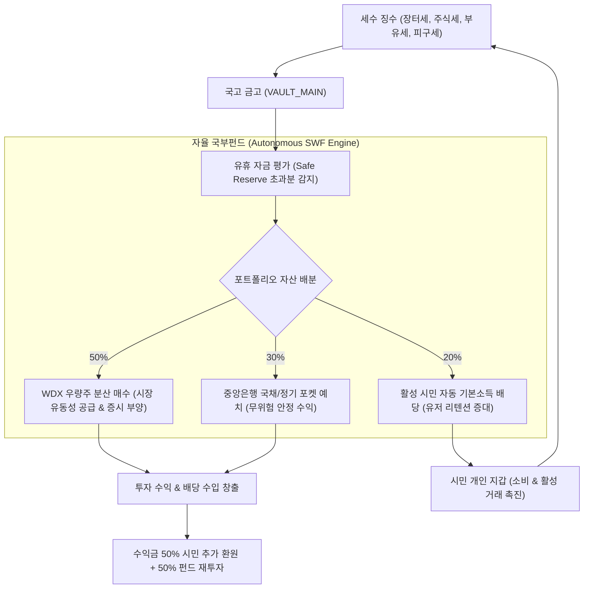

# [기획서] 머니버스 국고 자율 투자 및 재순환 국부펀드 (ASWF) 시스템

## 1. 배경 및 문제 정의 (Background & Problem)
- **현상**: 시스템 내 각종 세금(거래 수수료, 주식 매매세, 부유세, 카지노 피구세 등)이 국고(`treasury_vaults`)로 지속 유입되나, 관리자의 수동 집행 없이는 자금이 지출되지 않아 국고만 기하급수적으로 비대해지고 시장 유동성이 흡수·경색되는 문제 발생.
- **목표**: 노르웨이 국부펀드(GPFG) 및 싱가포르 테마섹(Temasek) 모델을 벤치마킹하여, 국고 유휴 잉여금을 안전하게 우량 자산에 분산 투자하고 수익을 시민 배당과 시장 유동성으로 자동 재순환(Recirculation)시키는 완전 자율 경제 루프 구축.

---

## 2. 글로벌 벤치마크 레퍼런스 (Global References)
1. **노르웨이 국부펀드 (NBIM / GPFG - Government Pension Fund Global)**:
   - 석유 세수로 누적된 잉여 국고를 국내에 묶어두지 않고 주식(70%), 채권(25%), 부동산(5%)에 분산 투자.
   - 연간 기대 수익률(약 3%)을 국가 복지 예산과 시민 혜택으로 환류하여 경제 선순환 달성.
2. **싱가포르 테마섹 (Temasek Holdings) & GIC**:
   - 재정 흑자 자금을 자국 핵심 산업 및 우량주에 전략 투자하여 주식 시장 안정화와 배당 수익을 동시에 창출.
3. **미국 연방준비제도 & 재무부 (Fed SOMA & Treasury)**:
   - 유동성 과잉/부족 시 시장 공개시장조작(Open Market Operations)을 통해 채권/자산을 매입하여 유동성 조절.

---

## 3. 핵심 아키텍처 및 경제 불변식

### 3대 경제 불변식 (Invariants):
1. **안전 지급준비금 보존 불변식 (Safe Reserve Guard)**: 국고의 최소 안전 준비금(5,000만 WLD) 이하로는 절대 자동 투자가 집행되지 않음.
2. **총통화량 보존 불변식 (M_total Invariant)**: 주식 매수와 배당은 국고 잔액에서 차감되어 시장/유저로 이전되므로 통화의 신규 찍어내기가 아닌 100% 재정 이전(Fiscal Transfer, $\Delta M_{\text{total}} = 0$) 원칙 준수.
3. **분산 투자 한도 불변식 (Diversification Cap)**: 단일 종목에 국고 펀드 자산의 25% 이상 집중 매수 금지.

---

## 4. 데이터베이스 및 스키마 설계
1. `treasury_swf_configs`: 국고 펀드 활성화 여부, 1회 투자 한도, 최소 안전 준비금, 배분 비율.
2. `treasury_swf_portfolios`: 국고 펀드가 매수한 주식 종목, 보유 수량, 평단가, 평가액.
3. `treasury_swf_events`: 국고 펀드 자동 매수, 배당 지급, 이익 실현 타임라인 감사 로그.

---

## 5. 관리자 관제 및 사용자 인터페이스
- `/admin/treasury`:
  - "자율 국부펀드(ASWF) 투자 관제 타워" 카드 탑재.
  - 펀드 총 운용 자산(AUM), 누적 시장 환류액, 보유 종목 파이 차트, 원클릭 긴급 동결 스위치.
- 메인 화면 / 뉴스 피드:
  - "머니버스 국부펀드, 금일 WDX 우량주 500,000 WLD 매수 집행 및 시민 배당 지급 완료" 실시간 공시 연동.
