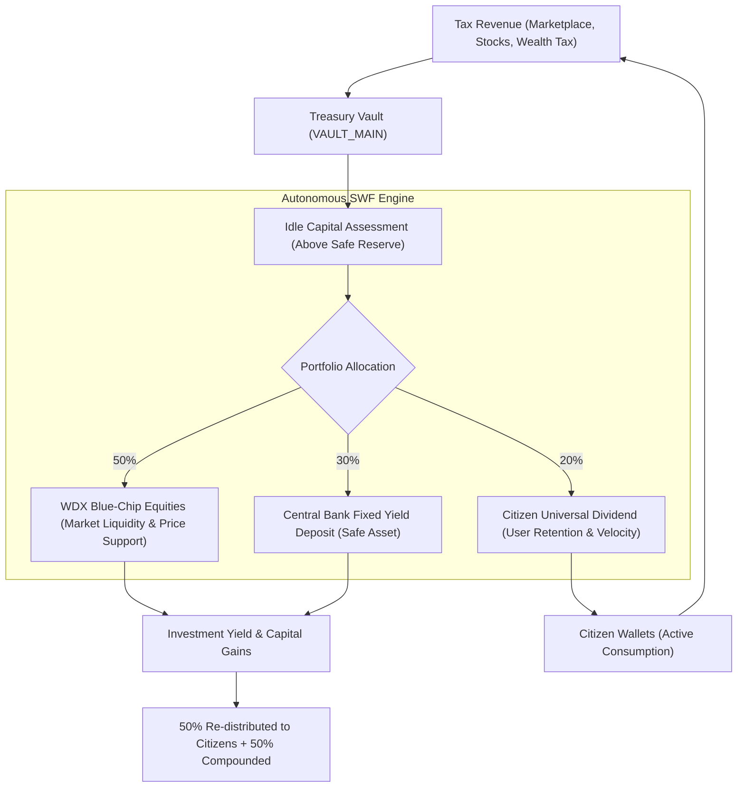

# [Specification] Woldeok Moneyverse Autonomous Sovereign Wealth Fund (ASWF) Engine

## 1. Background & Problem Definition
- **Symptom**: Tax revenues (marketplace fees, stock transaction taxes, progressive wealth taxes, casino Pigovian taxes) flow continuously into the national treasury (`treasury_vaults`), but without periodic manual intervention by operators, funds sit idle indefinitely, draining circulating liquidity and causing market deflation.
- **Objective**: Establish an autonomous sovereign wealth fund engine modeled after Norway's GPFG and Singapore's Temasek, automatically investing excess idle reserves into equities, bonds, and citizen dividend recirculation without operator bottleneck.

---

## 2. Global Benchmark References
1. **Norway's Government Pension Fund Global (NBIM / GPFG)**:
   - Invests surplus petroleum taxes globally in equities (70%), fixed income (25%), and real estate (5%).
   - Returns ~3% annually back into public welfare and fiscal buffers.
2. **Singapore's Temasek & GIC**:
   - Reinvests fiscal surpluses into core domestic industries and high-growth equities, generating steady dividends for public infrastructure.
3. **Federal Reserve & US Treasury (Open Market Operations)**:
   - Injects and absorbs liquidity dynamically via asset and security purchases.

---

## 3. Core Architecture & Economic Invariants

### 3 Economic Invariants:
1. **Safe Reserve Guard**: ASWF execution halts if `VAULT_MAIN` drops below the minimum safe reserve threshold (50,000,000 WLD).
2. **M_total Conservation ($\Delta M_{\text{total}} = 0$)**: All investments and dividends are fiscal transfers funded purely by collected tax revenues.
3. **Diversification Cap**: No single stock can exceed 25% of the total equity portfolio allocation.
