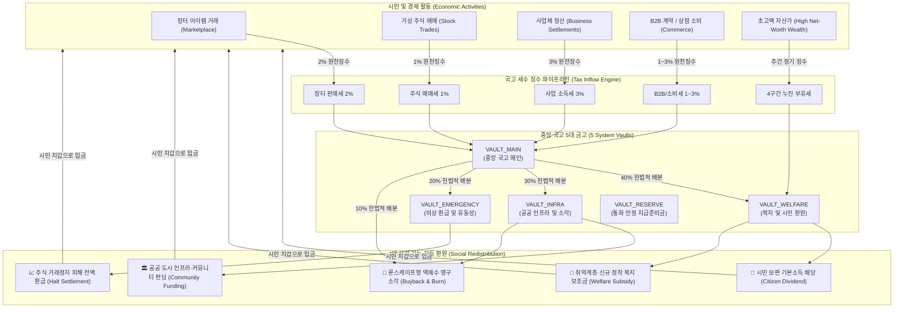

# Woldeok Moneyverse Treasury & Fiscal Recirculation Architecture
(국고 5대 금고 및 세수 자동 사회 환원 시스템 아키텍처)

> **상태**: 프로덕션 권위 아키텍처 명세 (AUTHORITATIVE)  
> **최신 개정일**: 2026-10-04  
> **대상 소스**: `backend/src/admin/treasury/`, `frontend/src/app/admin/treasury/`, `packages/database/`

---

## 🏛️ 1. 시스템 아키텍처 다이어그램 (System Architecture Diagram)

---

## 🔒 2. 국고 5대 금고 체계 (5 Vault Ledgers)

1. **`VAULT_MAIN` (중앙 국고 메인)**:
   - 장터, 주식, 사업체, B2B, 일반 상점 세수 1차 원천징수 입고 금고.
2. **`VAULT_WELFARE` (복지 및 시민 환원)**:
   - 시민 보편 기본소득 배당(`CITIZEN_DIVIDEND`) 및 정착 지원금(`WELFARE_SUBSIDY`) 지급 전용 금고.
   - 4구간 누진 부유세 전액 직입고.
3. **`VAULT_INFRA` (공공 인프라 및 소각)**:
   - 공공 랜드마크 건설, 메타버스 공간 펀딩, 룬스케이프형 바닥가 방어 역매수 소각 기금.
4. **`VAULT_EMERGENCY` (비상 환급 및 유동성 완충)**:
   - 가상 주식 상장폐지/거래정지 피해 매수원가 100% 자동정산(`STOCK_HALT_SETTLEMENT`).
5. **`VAULT_RESERVE` (통화 안정 지급준비금)**:
   - 30% 불가침 안전 비축금 영구 동결 보관.

---

## 📊 3. 헌법적 예산 배분 공식

$$\text{Constitutional Allocation} = \begin{cases}
\text{Welfare Fund}: & 40\% \\
\text{Infrastructure Fund}: & 30\% \\
\text{Emergency Reserve}: & 20\% \\
\text{Deflationary Burn}: & 10\%
\end{cases}$$

- **30% 안전 비축금 원칙 (`Safe Reserve Invariant`)**:
  - $\text{Reserve Floor} = \max(100{,}000\text{ WLD}, \text{Gross Assets} \times 30\%)$
  - 국고 잔고가 바닥나 국가 부도가 발생하는 사태를 수학적 불변식으로 원천 차단합니다.
