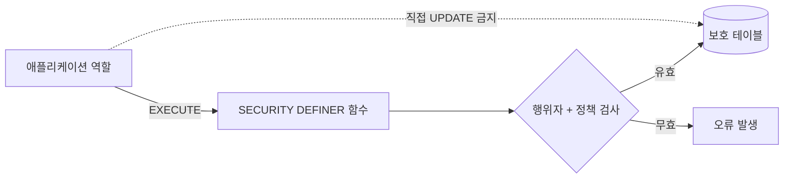

# 데이터베이스 보안 경계

[English](database-security.md) | **한국어** | [문서 색인](../INDEX.ko.md)

> **경제 비즈니스 로직은 임의의 TypeScript 테이블 변경이 아니라 PostgreSQL `SECURITY DEFINER` 함수에 둡니다.**

## 권장 쓰기 패턴



보호 함수는 하나의 원자적 변경을 커밋하기 전에 신원, 관리자/운영자 역할, 기능 스위치, 잔액, 인벤토리, 활성 직업, 일일 제한, 신용 정책, 멱등성 및 다중 테이블 불변조건을 검증할 수 있습니다.

## WLD 표현

```text
PostgreSQL bigint / numeric
        ↓
node-postgres string
        ↓
API JSON string
        ↓
프론트엔드 기준 문자열 / 정확한 연산용 BigInt
```

잔액, 가격, 대출, 순자산 또는 원장 금액에 JavaScript `Number`를 도입하지 않습니다.

## 함수 실행 권한
PostgreSQL 함수는 의도치 않게 `PUBLIC EXECUTE`를 상속할 수 있습니다. 마이그레이션 기록은 불필요한 공개 실행 권한을 제거하고 더 안전한 기본값을 설정합니다. 행위자 범위 함수는 의도된 런타임 역할에만 권한을 부여합니다.

## 읽기 모델
애플리케이션이 보호 데이터를 읽어야 하는 경우 광범위한 테이블 권한보다 범위가 제한된 읽기 모델 함수를 우선합니다. 카지노 회원 기록과 관리자 읽기 모델이 이 패턴을 따릅니다.

## 마이그레이션 불변성
적용된 마이그레이션은 체크섬으로 추적합니다. 적용된 마이그레이션을 조용히 다시 쓰지 말고 새 순번 마이그레이션을 추가합니다.

[데이터베이스 마이그레이션](../operations/database-migrations.ko.md)을 참고하세요.
