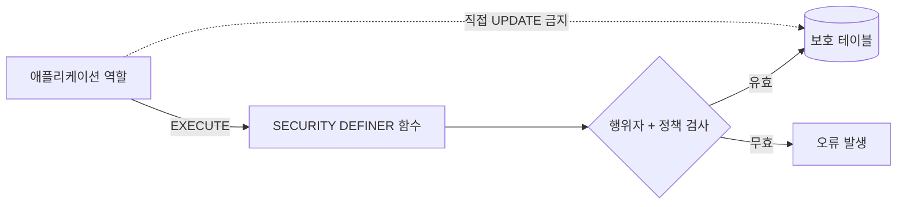

# 데이터베이스 보안 경계

<!-- CORE-AUTHORITY-V499 -->
## App/Site/Economy Core 상위 권위 — v2026.10.01.499 (2026-10-01)

- **상위 권위:** 이 maintained-document 블록은 아래의 충돌하는 과거 기획문구를 supersede한다. 과거 문구는 당시 의사결정 증거로 보존하되 현재 제품 권위가 아니다.
- **채널 경계:** 목표 canonical public contract는 **App Core** `/app-api/v2/**`, **Site Core** `/site-api/v1/**`다. **App API v1**은 측정된 retirement 전까지 compatibility/runtime 증거로 유지하며 이번 문서 회차는 목표 route가 Test/Production에 이미 구현됐다고 주장하지 않는다.
- **단일 경제권위:** App/Site BFF는 잔액·세금·은행·국고·시장·직업보상·통화정책 규칙을 독립 소유하지 않는다. 하나의 **Economy Core**만 경제 command/read 권위를 가지며 최종 WLD 변경은 append-only ledger와 검토된 PostgreSQL `SECURITY DEFINER` 함수를 거친다.
- **재정 보존:** 모든 `TAX_*`는 explicit reversal 제외 **100% TREASURY_MAIN**으로 들어간다. 세금을 burn/sink로 보내지 않는다. 국고 목적별 예산은 독립 spendable cash vault가 아니라 logical commitment/envelope다.
- **AI 경계:** 하나의 **Economy Policy Registry**와 policy executor만 수치정책 적용권한을 가진다. AI/model/work/stock module은 특정 low-risk key가 `BOUNDED_AUTO`로 등록된 경우를 제외하면 **proposal-only**다. **direct member balance write = 0 (prohibited)**, **direct absolute stock-price write = 0**, historical-ledger rewrite = 0이며 AI가 자기 limit을 넓힐 수 없다.
- **신원 경계:** 내부 **workload identity**와 user/admin/automation actor identity는 독립 검증한다. shared `INTERNAL_API_TOKEN` / `x-internal-token`은 legacy compatibility이며 최종 multi-core service-identity 설계가 아니다.
- **승격 사실성:** expand → shadow/observe → switch → reconcile → contract 순서로 이행한다. exact-SHA 증거 없이는 runtime/Test/Production 완료를 주장하지 않는다.

[English](database-security.md) | **한국어** | [문서 색인](../INDEX.ko.md)

> **경제 비즈니스 로직은 임의의 TypeScript 테이블 변경이 아니라 PostgreSQL `SECURITY DEFINER` 함수에 둡니다.**

## 권장 쓰기 패턴


```mermaid
flowchart LR
    A[애플리케이션 역할] -->|EXECUTE| F[SECURITY DEFINER 함수]
    F --> C{행위자 + 정책 검사}
    C -->|유효| T[(보호 테이블)]
    C -->|무효| X[오류 발생]
    A -. 직접 UPDATE 금지 .-> T
```

보호 함수는 하나의 원자적 변경을 커밋하기 전에 신원, 관리자/운영자 역할, 기능 스위치, 잔액, 인벤토리, 활성 직업, 일일 제한, 신용 정책, 멱등성 및 다중 테이블 불변조건을 검증할 수 있습니다.

## WLD 표현

```text
PostgreSQL bigint / numeric
        ↓
node-postgres string
        ↓
API JSON string
        ↓
프론트엔드 기준 문자열 / 정확한 연산용 BigInt
```

잔액, 가격, 대출, 순자산 또는 원장 금액에 JavaScript `Number`를 도입하지 않습니다.

## 함수 실행 권한
PostgreSQL 함수는 의도치 않게 `PUBLIC EXECUTE`를 상속할 수 있습니다. 마이그레이션 기록은 불필요한 공개 실행 권한을 제거하고 더 안전한 기본값을 설정합니다. 행위자 범위 함수는 의도된 런타임 역할에만 권한을 부여합니다.

## 읽기 모델
애플리케이션이 보호 데이터를 읽어야 하는 경우 광범위한 테이블 권한보다 범위가 제한된 읽기 모델 함수를 우선합니다. 카지노 회원 기록과 관리자 읽기 모델이 이 패턴을 따릅니다.

## 마이그레이션 불변성
적용된 마이그레이션은 체크섬으로 추적합니다. 적용된 마이그레이션을 조용히 다시 쓰지 말고 새 순번 마이그레이션을 추가합니다.

[데이터베이스 마이그레이션](../operations/database-migrations.ko.md)을 참고하세요.
