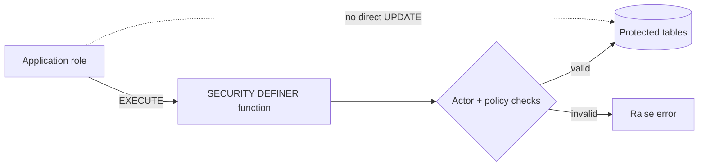

# Database Security Boundary

> **Economy business logic belongs in PostgreSQL `SECURITY DEFINER` functions, not in ad-hoc TypeScript table mutations.**

## Preferred write pattern



A protected function can validate identity, admin/operator role, feature switches, balance, inventory, active job, daily limits, credit policy, idempotency and multi-table invariants before committing one atomic mutation.

## WLD representation

```text
PostgreSQL bigint / numeric
        ↓
node-postgres string
        ↓
API JSON string
        ↓
frontend canonical string / BigInt for exact arithmetic
```

Do not introduce JavaScript `Number` for balances, prices, loans, net worth or ledger amounts.

## Function execution grants
PostgreSQL functions can accidentally inherit `PUBLIC EXECUTE`. The migration history closes unwanted public execution and configures safer defaults. Actor-scoped functions are granted only to the intended runtime role.

## Read models
When the app must read protected data, prefer a scoped read-model function instead of broad table grants. Casino member history and administrator read models follow this pattern.

## Migration immutability
Applied migrations are checksum-tracked. Never silently rewrite an applied migration. Add a new ordered migration instead.

See [Database Migrations](../operations/database-migrations.md).
