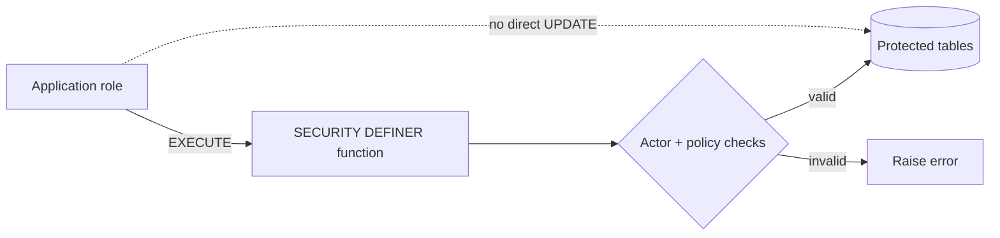

# Database Security Boundary

<!-- CORE-AUTHORITY-V499 -->
## App/Site/Economy Core authority overlay — v2026.10.01.499 (2026-10-01)

- **Superseding authority:** this maintained-document overlay supersedes any conflicting older planning text below. Historical passages remain evidence of prior decisions, not current product authority.
- **Channel boundary:** the target canonical public contracts are **App Core** at `/app-api/v2/**` and **Site Core** at `/site-api/v1/**`. **App API v1** remains compatibility/runtime evidence until measured retirement; this documentation cycle does not claim those target routes are already implemented in Test or Production.
- **Single economic authority:** App/Site BFFs never own independent balance, tax, banking, treasury, market, job-reward or monetary-policy rules. One **Economy Core** owns economic command/read authority and delegates final WLD mutation to the append-only ledger and reviewed PostgreSQL `SECURITY DEFINER` functions.
- **Fiscal conservation:** every `TAX_*` posts **100% to TREASURY_MAIN** net of explicit reversal. Tax may not target burn/sink. Treasury purposes are logical budget commitments/envelopes, not independently spendable cash vaults.
- **AI boundary:** one **Economy Policy Registry** and one policy executor own numeric policy application. AI/model/work/stock modules are **proposal-only** unless a specific low-risk key is registered `BOUNDED_AUTO`. **direct member balance write = 0 (prohibited)**, **direct absolute stock-price write = 0**, historical-ledger rewrite = 0, and AI cannot widen its own limits.
- **Identity boundary:** internal **workload identity** and user/admin/automation actor identity are validated independently. Shared `INTERNAL_API_TOKEN` / `x-internal-token` is legacy compatibility, not the final multi-core service-identity design.
- **Rollout truth:** the transition is expand → shadow/observe → switch → reconcile → contract. Runtime/Test/Production completion requires exact-SHA evidence and is not implied by this planning authority update.

> **Economy business logic belongs in PostgreSQL `SECURITY DEFINER` functions, not in ad-hoc TypeScript table mutations.**

## Preferred write pattern


```mermaid
flowchart LR
    A[Application role] -->|EXECUTE| F[SECURITY DEFINER function]
    F --> C{Actor + policy checks}
    C -->|valid| T[(Protected tables)]
    C -->|invalid| X[Raise error]
    A -. no direct UPDATE .-> T
```

A protected function can validate identity, admin/operator role, feature switches, balance, inventory, active job, daily limits, credit policy, idempotency and multi-table invariants before committing one atomic mutation.

## WLD representation

```text
PostgreSQL bigint / numeric
        ↓
node-postgres string
        ↓
API JSON string
        ↓
frontend canonical string / BigInt for exact arithmetic
```

Do not introduce JavaScript `Number` for balances, prices, loans, net worth or ledger amounts.

## Function execution grants
PostgreSQL functions can accidentally inherit `PUBLIC EXECUTE`. The migration history closes unwanted public execution and configures safer defaults. Actor-scoped functions are granted only to the intended runtime role.

## Read models
When the app must read protected data, prefer a scoped read-model function instead of broad table grants. Casino member history and administrator read models follow this pattern.

## Migration immutability
Applied migrations are checksum-tracked. Never silently rewrite an applied migration. Add a new ordered migration instead.

See [Database Migrations](../operations/database-migrations.md).
