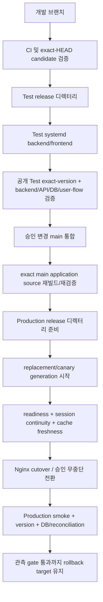

# 배포 흐름

[English canonical](deployment-flow.md) | **한국어**

> 현재 런타임 기준: [../CURRENT_RUNTIME_BASELINE.ko.md](../CURRENT_RUNTIME_BASELINE.ko.md)
> 버전: v2026.09.23.404

## 현재 배포 권위

현재 관측된 공개 런타임은 **Debian 13 + systemd release 디렉터리 + 호스트 Nginx + Docker PostgreSQL**이다.

Kubernetes/Flux는 복구/목표 아키텍처와 repository provenance로 유지하지만, 공개 트래픽이 Debian systemd 서비스를 통해 제공되는 동안에는 현재 공개 runtime 증거가 아니다.

현재 Production:
- backend: `moneyverse-backend.service` -> 3000;
- frontend: `moneyverse-frontend.service` -> 3001;
- release pointer: `/srv/moneyverse-data/releases/production-current/*`.

현재 Test:
- backend: `test-main-backend.service` -> 3100;
- frontend: `test-main-frontend.service` -> 3101;
- release pointer: `/srv/moneyverse-data/releases/test-current/*`.

호스트 Nginx가 현재 관측된 공개 reverse proxy다.

## 현재 승격 흐름

repository merge, image build, GitOps commit, service restart가 성공했다는 이유만으로 배포 성공으로 판정하지 않는다.

## 릴리스 identity

최소 다음을 추적한다.
- repository head SHA;
- application source SHA;
- candidate/release directory identity;
- backend/frontend runtime identity;
- migration set/checksum;
- authoritative DB identity;
- public `/api/version` 또는 동등한 version evidence;
- rollback target.

문서 전용 commit은 application source identity를 바꾸지 않으며 runtime release를 강제로 시작하면 안 된다.

## Test 게이트

Production 승격 전 exact application candidate를 isolated Test systemd 서비스에서 실제 실행 검증한다. 최소 검증:
- candidate identity가 의도한 application source와 일치;
- backend readiness와 대표 API path;
- 권위 Test DB 경로/migration compatibility;
- 변경 user flow;
- 영향 보안/인가 negative test;
- 재시작/업데이트 session continuity;
- frontend cache freshness;
- fatal/error log 검토.

Test identity가 없거나 stale이면 BLOCKED다. exact-version gate를 완화하는 이유가 아니다.

## Production 승격

승격은 무중단 계약을 따른다. replacement가 건강해질 때까지 이전 검증 generation을 유지하고, 대체 프로세스가 준비되기 전에 유일한 healthy Production 프로세스를 의도적으로 중지하지 않는다.

Production 수용조건:
1. 의도한 exact application source/release identity;
2. backend/frontend readiness;
3. 기존 로그인 세션 연속성;
4. 권위 Production DB 연결과 migration compatibility;
5. 변경 흐름 smoke;
6. public version freshness;
7. 신규 critical/fatal runtime 오류 없음;
8. 알려진 last-good rollback target.

## PostgreSQL·migration

현재 Production PostgreSQL은 Debian 호스트의 Docker PostgreSQL 17.11이다. 컨테이너 이름만으로 권위를 판단하지 않고 service connection과 DB identity를 확인한다.

Migration은 번호·내용·checksum을 불변으로 유지한다. schema-changing/destructive 변경은 검증된 backup/restore 증거가 필요하며 CI green만으로 진행하지 않는다.

## Kubernetes/Flux 복구 대상

Kubernetes/Flux 문서와 manifest는 목표/복구 아키텍처로 계속 유효하다. cluster/DB 권위를 명시적으로 대사하고 공개 routing이 실제 해당 runtime을 사용한다는 증거가 생기기 전까지:
- Kubernetes를 현재 공개 Production runtime이라고 부르지 않는다.
- Flux ready를 공개 Production 변경 증거로 사용하지 않는다.
- desired state만 보고 Production을 Kubernetes DB로 연결하지 않는다.
- GitOps 기록은 provenance/target evidence로 보존한다.

향후 Kubernetes/Flux로 복귀하면 [../CURRENT_RUNTIME_BASELINE.ko.md](../CURRENT_RUNTIME_BASELINE.ko.md), 이 문서, `RELEASING.ko.md`, `INFRASTRUCTURE.ko.md`, 통합 기획 마스터를 같은 작업에서 갱신한다.

## Rollback

Application/config 실패는 현재 DB/config/session 계약과 호환되는 마지막 검증 release generation으로 전환한다.

Data/schema 실패는 forward corrective migration을 우선하고, restore는 명시적 operator scope와 증거가 있는 검증된 복구절차만 사용한다.

Application rollback을 위해 Production DB, ledger, audit, session, volume을 삭제하지 않는다.
