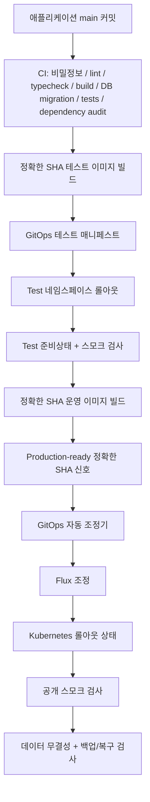

# 배포 흐름

[English](deployment-flow.md) | **한국어** | [문서 색인](../INDEX.ko.md)

운영 환경은 Kubernetes/Flux GitOps를 사용합니다. 애플리케이션 저장소는 변경 불가능한 이미지를 빌드하고 검증하며, GitOps 저장소가 실제 실행 상태를 선언합니다.



## 기준 저장소
- 애플리케이션 소스: `wtrdd1-hash/Woldeok-Moneyverse-Migration`
- 런타임 선언: `wtrdd1-hash/kuber-infrastructure`
- 운영 네임스페이스: `wdmvp`
- Docker Compose가 아니라 Flux 조정이 운영 변경의 기준 경로입니다.

애플리케이션 저장소의 `deploy.yml`은 분리된 테스트 주소에서 정확한 SHA를 기다리고 백엔드/데이터베이스 스모크 경로를 확인한 뒤 같은 SHA의 운영 아티팩트를 만들고 `production-ready` 배포 신호를 게시합니다. 호스트에 SSH하거나 Kubernetes를 직접 변경해서는 안 됩니다. GitOps가 릴리스 제어면입니다.

## 변경 불가능한 이미지 식별

```text
ghcr.io/wtrdd1-hash/wdmv/backend:<sha>-production
ghcr.io/wtrdd1-hash/wdmv/frontend:<sha>-production
```

GitOps 매니페스트는 승격되는 정확한 SHA 태그 이미지를 참조해야 합니다. 변경 가능한 `latest-*` 태그는 릴리스 식별자가 아닙니다.

## 테스트 게이트
분리된 `wdmv-test` 환경은 `kuber-infrastructure/staging/wdmv-test`에서 Flux가 독립적으로 조정하며 자체 네임스페이스와 PostgreSQL StatefulSet을 사용합니다. `test.easy-scraping.com`이 운영 전 검증 주소입니다.

각 애플리케이션 `main` 푸시는 CI 이후 변경 불가능한 `-test` 이미지를 만듭니다. Test 승격 시 백엔드, 프론트엔드, 마이그레이션 소스, 후보 메타데이터를 동일한 전체 애플리케이션 SHA에 고정해야 합니다. 정확한 후보가 Ready 상태이고 공개 테스트 주소의 백엔드/API 및 프론트엔드 스모크 검사가 통과하기 전에는 운영 승격을 막습니다.

## 운영 승격
1. 후보가 현재 애플리케이션 `main` SHA인지, CI와 `Build Test Candidate`가 성공했는지 확인합니다.
2. `kuber-infrastructure/.github/workflows/wdmv-promote.yml`을 통해 동일 SHA를 분리된 `wdmv-test` GitOps 매니페스트로 승격합니다.
3. Flux 준비상태, Kubernetes 롤아웃 완료, `https://test.easy-scraping.com`의 백엔드/API 포함 공개 스모크 검사를 요구합니다.
4. 정확한 SHA 테스트 게이트 후 `deploy.yml`이 같은 SHA의 `-production` 이미지를 만들고 성공한 `production-ready` 신호를 게시합니다.
5. `wdmv-auto-reconcile.yml`은 최신 성공 `main` 후보와 일치하는 `production-ready` 신호만 관찰하고 Test를 다시 검증한 뒤 운영 매니페스트를 갱신합니다.
6. 데이터 변경 선행조건이 충족된 경우에만 승격합니다. 검증된 별도 매체 복구가 없으면 스키마 변경/파괴적 변경은 차단합니다.
7. 운영 Deployment의 Flux 조정과 Kubernetes 롤아웃 완료를 확인합니다.
8. 운영 주소에서 `/`, `/status`, `/robots.txt`, `/sitemap.xml`, `/ads.txt` 등을 확인합니다.
9. 데이터에 영향을 주는 릴리스라면 운영 데이터 무결성 감사를 다시 실행하고 백업/복구 상태를 확인합니다.

## 마이그레이션 안전성
마이그레이션은 순번, 불변성, 체크섬을 유지합니다. 과거 체크섬 드리프트가 있으면 승격을 중단해야 합니다. 필요한 복구 게이트가 비정상인 동안 마이그레이션 포함 릴리스는 운영 대상이 아닙니다.

## 롤백 모델
- 애플리케이션/이미지 장애: GitOps 매니페스트를 이전에 검증된 SHA 이미지로 되돌리고 Flux가 조정하게 합니다.
- 설정 장애: 해당 설정을 도입한 GitOps 커밋/PR을 되돌립니다.
- 마이그레이션/데이터 장애: 가능하면 전진 수정하고, 명시적으로 필요한 경우에만 검증된 백업에서 복구합니다.

일반 릴리스 경로에서 `kubectl set image`를 사용하지 않습니다. Git과 드리프트가 생깁니다. 롤백 과정에서 운영 PVC나 데이터베이스를 삭제하지 않습니다.
