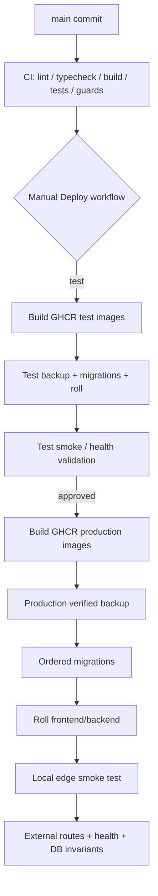

# Deployment Flow

A push to `main` runs CI but does not automatically roll Production.

## Immutable image identity
Frontend/backend images are tagged with the Git commit and environment, e.g. `backend:<commit>-production` and `frontend:<commit>-production`.

## Migration safety
The runner records filename + checksum. Historical drift stops deployment before app rollout.

## Edge smoke test
The hardened nginx edge rejects unknown Host headers. The deploy smoke test therefore connects to the local edge port with the real public Host header.

## Backup gate
Production-changing releases should have a verified backup immediately before rollout. Verification checks decryptability and dump/archive readability.

## Rollback model
- app/image failure → previous commit-tagged images;
- configuration failure → restore saved config and restart/reload;
- migration/data failure → prefer forward-fix; restore verified backup only when needed and approved.

Production volumes are not routine rollback targets and must not be deleted casually.
