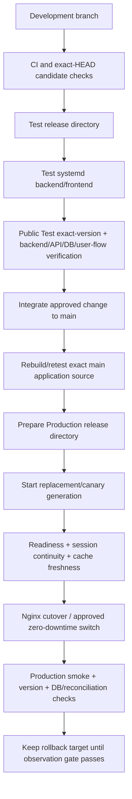

# Deployment Flow

**English canonical** | [한국어](deployment-flow.ko.md)

> Current runtime baseline: [../CURRENT_RUNTIME_BASELINE.md](../CURRENT_RUNTIME_BASELINE.md)
> Version: v2026.09.23.404

## Current deployment authority

The currently observed public runtime is **Debian 13 + systemd release directories + host Nginx + Docker-hosted PostgreSQL**.

Kubernetes/Flux remains a recovery/target architecture and repository provenance source, but it is **not** current public-runtime evidence while public traffic is served by the Debian systemd services.

Current Production:
- backend: `moneyverse-backend.service` -> port 3000;
- frontend: `moneyverse-frontend.service` -> port 3001;
- release pointer: `/srv/moneyverse-data/releases/production-current/*`.

Current Test:
- backend: `test-main-backend.service` -> port 3100;
- frontend: `test-main-frontend.service` -> port 3101;
- release pointer: `/srv/moneyverse-data/releases/test-current/*`.

Host Nginx is the observed public reverse proxy.

## Current promotion flow

A deployment is not accepted merely because a repository merge, image build, GitOps commit or service restart succeeded.

## Release identity

Track at least:
- repository head SHA;
- application source SHA;
- candidate/release directory identity;
- backend/frontend runtime identity;
- migration set/checksum;
- authoritative DB identity;
- public `/api/version` or equivalent version evidence;
- rollback target.

Documentation-only commits do not change application source identity and must not force a runtime release.

## Test gate

Production promotion requires the exact application candidate to be exercised on the isolated Test systemd services. Required checks include:
- candidate identity matches the intended application source;
- backend readiness and representative API path;
- authoritative Test DB path/migration compatibility;
- changed user flow;
- security/authorization negatives where affected;
- restart/update session continuity;
- frontend cache freshness;
- fatal/error log review.

A missing or stale Test identity is BLOCKED, not a reason to weaken the exact-version gate.

## Production promotion

Promotion is zero-downtime by contract. Keep the old verified generation available until the replacement is healthy. Do not intentionally stop the only healthy Production process before the replacement can serve.

Production acceptance requires:
1. exact intended application source/release identity;
2. backend/frontend readiness;
3. pre-existing authenticated session continuity;
4. authoritative Production DB connectivity and migration compatibility;
5. changed-flow smoke verification;
6. public version freshness;
7. no new critical/fatal runtime errors;
8. a known last-good rollback target.

## PostgreSQL and migrations

Current Production PostgreSQL is Docker-hosted PostgreSQL 17.11 on the Debian host. Container name alone is not authority; confirm the service connection and database identity.

Migrations remain numbered, immutable and checksummed. Schema-changing or destructive changes require verified backup/restore evidence and must not proceed solely because CI is green.

## Kubernetes/Flux recovery target

Kubernetes/Flux documentation and manifests remain valuable for the intended/recovery architecture. Until the cluster and database authority are explicitly reconciled and public routing is proven to use that runtime:
- do not call Kubernetes the current public Production runtime;
- do not treat Flux readiness as proof that public Production changed;
- do not point Production at a Kubernetes database based only on desired state;
- preserve GitOps records as provenance/target evidence.

A future migration back to Kubernetes/Flux must update [../CURRENT_RUNTIME_BASELINE.md](../CURRENT_RUNTIME_BASELINE.md), this document, `RELEASING.md`, `INFRASTRUCTURE.md`, and the planning master in the same workstream.

## Rollback

Application/config failure: switch back to the last verified release generation compatible with the current DB/config/session contract.

Data/schema failure: prefer a forward corrective migration. Restore only through the verified recovery procedure with explicit operator scope and evidence.

Never delete Production databases, ledgers, audit records, sessions or volumes as an application rollback shortcut.
