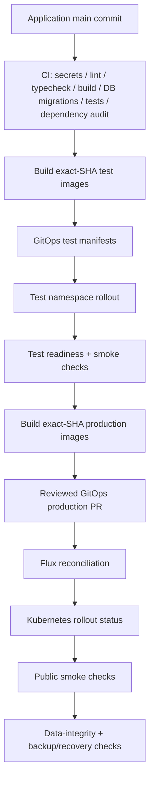

# Deployment Flow

Production is Kubernetes/Flux GitOps. The application repository builds and validates immutable images; the GitOps repository declares what runs.



## Source of truth

- Application source: `wtrdd1-hash/Woldeok-Moneyverse-Migration`.
- Runtime declarations: `wtrdd1-hash/kuber-infrastructure`.
- Production namespace: `wdmvp`.
- Flux reconciliation, not Docker Compose, is the authoritative production mutation path.

The application repository's `deploy.yml` builds immutable production artifacts only. It must not SSH to the host and run `docker compose`; the current NixOS production host uses Kubernetes/containerd and does not provide Docker as the release control plane.

## Immutable image identity

Backend and frontend images use the application Git SHA plus environment suffix, for example:

```text
ghcr.io/wtrdd1-hash/wdmv/backend:<sha>-production
ghcr.io/wtrdd1-hash/wdmv/frontend:<sha>-production
```

The GitOps manifests must reference the exact SHA-qualified images being promoted. Mutable `latest-*` tags are not release identity.

## Test gate

There is none. A `wdmv-test` namespace existed for one day and was removed on 2026-09-09; `test.easy-scraping.com` now answers 404. No commit is exercised anywhere between CI and production, so CI plus the pre-promotion checks below are the entire gate — and a green CI run is not the same as a candidate that has run.

## Production promotion

1. Confirm the candidate is the current application `main` SHA and CI is green.
2. Build immutable production images from that exact SHA.
3. Update `apps/wdmvp/backend.yaml` and `frontend.yaml` in `kuber-infrastructure` and commit directly to its `main`; that repository takes direct pushes, not branches or pull requests.
4. Promote only when data-changing prerequisites are satisfied. Schema-changing or destructive changes remain blocked when verified separate-media recovery is unavailable.
5. Wait for Flux reconciliation.
6. Require Kubernetes rollout completion for the changed Deployments. Kubernetes documents `kubectl rollout status` as the rollout completion check; a zero exit status means the rollout completed.
7. Verify `/`, `/status`, `/robots.txt`, `/sitemap.xml`, and `/ads.txt` as applicable.
8. Re-run the production aggregate data-integrity audit and confirm backup/recovery state when the release can affect data.

## Migration safety

Migrations remain numbered, immutable, and checksummed. Historical checksum drift must stop promotion. A release containing a migration is not eligible for production while the required recovery gate is unhealthy.

## Rollback model

- Application/image failure: revert the GitOps manifest to the previously verified SHA-qualified image and let Flux reconcile it.
- Configuration failure: revert the GitOps commit/PR that introduced the configuration.
- Migration/data failure: prefer a forward fix; restore only from a verified backup when explicitly required.

Do not use `kubectl set image` as the normal release path because it creates drift from Git. Do not delete production PVCs or databases as part of rollback.

## References

- Kubernetes Deployment rollout/status semantics: https://kubernetes.io/docs/concepts/workloads/controllers/deployment/
- Flux GitOps documentation: https://fluxcd.io/flux/
