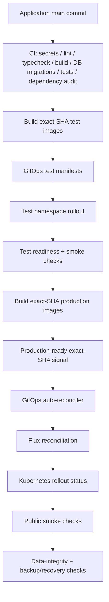

# Deployment Flow

Production is Kubernetes/Flux GitOps. The application repository builds and validates immutable images; the GitOps repository declares what runs.



## Source of truth

- Application source: `wtrdd1-hash/Woldeok-Moneyverse-Migration`.
- Runtime declarations: `wtrdd1-hash/kuber-infrastructure`.
- Production namespace: `wdmvp`.
- Flux reconciliation, not Docker Compose, is the authoritative production mutation path.

The application repository's `deploy.yml` waits for the exact SHA on the isolated test origin, verifies the backend/database smoke path, builds immutable Production artifacts for that same SHA, and publishes a `production-ready` deployment signal. It must not SSH to the host or mutate Kubernetes directly. GitOps remains the release control plane.

## Immutable image identity

Backend and frontend images use the application Git SHA plus environment suffix, for example:

```text
ghcr.io/wtrdd1-hash/wdmv/backend:<sha>-production
ghcr.io/wtrdd1-hash/wdmv/frontend:<sha>-production
```

The GitOps manifests must reference the exact SHA-qualified images being promoted. Mutable `latest-*` tags are not release identity.

## Test gate

The isolated `wdmv-test` environment is active again and is reconciled independently by Flux from `kuber-infrastructure/staging/wdmv-test`. It uses its own namespace and PostgreSQL StatefulSet, and `test.easy-scraping.com` is the pre-production origin.

Every application `main` push builds immutable `-test` images after CI. Promotion to `wdmv-test` must pin backend, frontend, migration source, and candidate metadata to the same full application SHA. Production promotion is blocked operationally until that exact candidate is Ready and the public test origin passes backend/API and frontend smoke checks.

## Production promotion

1. Confirm the candidate is the current application `main` SHA and CI plus `Build Test Candidate` are green.
2. Promote that exact SHA to the isolated `wdmv-test` GitOps manifests through `kuber-infrastructure/.github/workflows/wdmv-promote.yml`.
3. Require Flux readiness, Kubernetes rollout completion, and public smoke checks on `https://test.easy-scraping.com`, including backend/API health.
4. `deploy.yml` automatically builds immutable `-production` images for the same SHA after the exact-SHA test gate and publishes a successful `production-ready` deployment signal.
5. `kuber-infrastructure/.github/workflows/wdmv-auto-reconcile.yml` observes only the latest successful `main` candidate and the matching `production-ready` signal, re-verifies test, then updates `apps/wdmvp/backend.yaml` and `frontend.yaml` on GitOps `main`.
6. Promote only when data-changing prerequisites are satisfied. Schema-changing or destructive changes remain blocked when verified separate-media recovery is unavailable.
7. Require Flux reconciliation and Kubernetes rollout completion for the production Deployments.
8. Verify `/`, `/status`, `/robots.txt`, `/sitemap.xml`, and `/ads.txt` as applicable on the production origin.
9. Re-run the production aggregate data-integrity audit and confirm backup/recovery state when the release can affect data.

## Migration safety

Migrations remain numbered, immutable, and checksummed. Historical checksum drift must stop promotion. A release containing a migration is not eligible for production while the required recovery gate is unhealthy.

## Rollback model

- Application/image failure: revert the GitOps manifest to the previously verified SHA-qualified image and let Flux reconcile it.
- Configuration failure: revert the GitOps commit/PR that introduced the configuration.
- Migration/data failure: prefer a forward fix; restore only from a verified backup when explicitly required.

Do not use `kubectl set image` as the normal release path because it creates drift from Git. Do not delete production PVCs or databases as part of rollback.

## References

- Kubernetes Deployment rollout/status semantics: https://kubernetes.io/docs/concepts/workloads/controllers/deployment/
- Flux GitOps documentation: https://fluxcd.io/flux/
