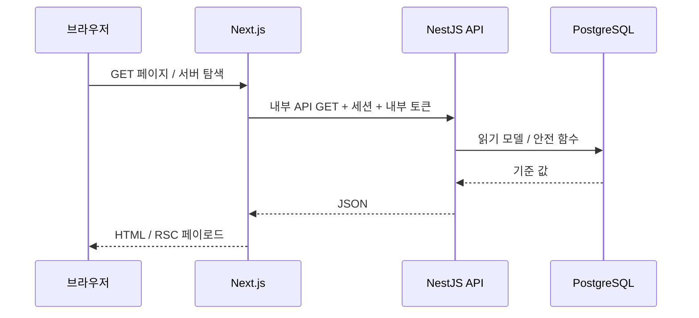
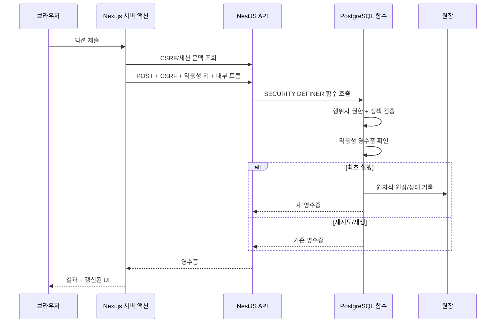

# 요청 흐름

[English](request-flow.md) | **한국어** | [문서 색인](../INDEX.ko.md)

## 읽기 요청



회원별 응답은 공개 캐시에 공유하지 않습니다.

## 경제 쓰기 요청



## 멱등성이 중요한 이유
서버가 보상을 커밋한 뒤 응답이 유실될 수 있습니다. 새 키로 다시 요청하면 이중 지급될 수 있지만 같은 키로 재시도하면 원래 영수증을 재생합니다. 작업 완료 UX는 하나의 모달 시도에 하나의 멱등성 키를 유지하여 타임아웃 복구 때 모달을 닫았다 다시 열 필요가 없고 가치가 중복 지급되지 않도록 합니다.

## 카지노 결과 흐름

```text
선택 + 베팅
    ↓
서버 액션
    ↓
NestJS 검증
    ↓
PostgreSQL 게임/정책 함수
    ↓
원장 + 플레이 영수증
    ↓
프론트엔드가 영수증 결과를 테마 애니메이션에 매핑
```

슬롯/하이로우/휠/보물/보석 테마 화면의 최종 상태는 영수증 결과에서 결정됩니다. 클라이언트 애니메이션은 결과를 꾸밀 수 있지만 저장된 결과와 모순되어서는 안 됩니다.

## 실패 동작
- 미인증 회원 → 로그인/리디렉션
- 오래되었거나 잘못된 CSRF → 쓰기 거부
- 잘못된 내부 토큰 → API 401
- 정책/제한 충돌 → 구조화된 거부 응답
- 중복 멱등성 키 → 영수증 재생
- API 사용 불가 → DB 직접 우회가 아니라 프론트엔드 복구/오류 상태
