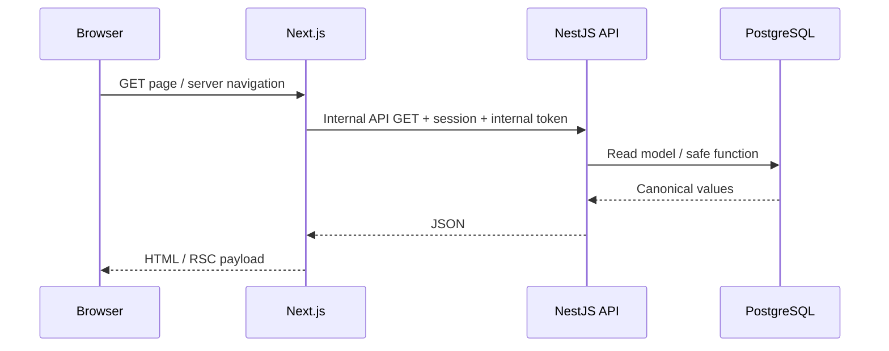
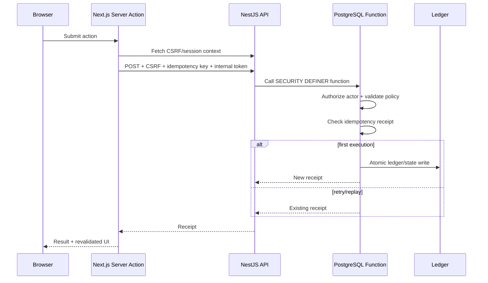

# Request Flow

## Read request



Per-member responses are not shared in a public cache.

## Economy write request



## Why idempotency matters
A server can commit a reward while the response is lost. Retrying with a new key could pay twice; retrying with the same key replays the original receipt. Work-completion UX keeps one idempotency key for one modal attempt so timeout recovery does not require close/reopen and does not duplicate value.

## Casino result flow

```text
choice + stake
    ↓
server action
    ↓
NestJS validation
    ↓
PostgreSQL game/policy function
    ↓
ledger + play receipt
    ↓
frontend maps receipt outcome to theme animation
```

The themed slot/high-low/wheel/treasure/gem views derive their final state from the receipt. Client animation can decorate a result but must never contradict the stored outcome.

## Failure behavior
- unauthenticated member → sign-in/redirect;
- stale/invalid CSRF → refused write;
- invalid internal token → API 401;
- policy/limit conflict → structured refusal;
- duplicate idempotency key → receipt replay;
- unavailable API → frontend recovery/error state rather than direct DB fallback.
