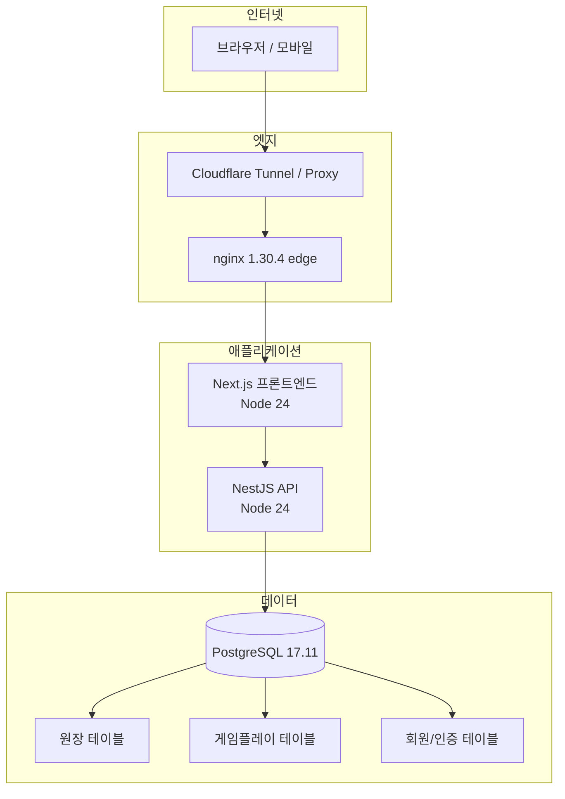
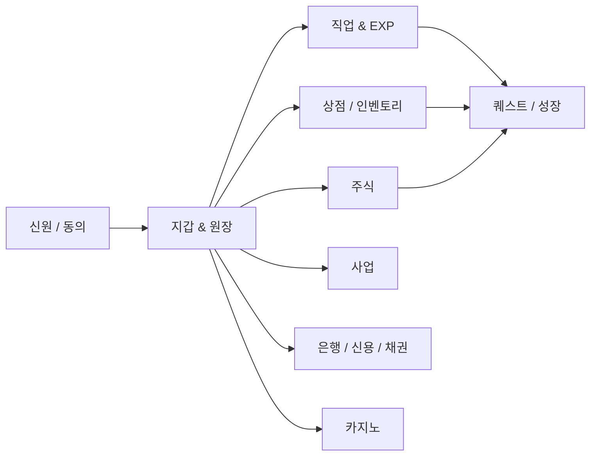

# 시스템 개요

[English](system-overview.md) | **한국어** | [문서 색인](../INDEX.ko.md)

Woldeok Moneyverse는 공개 브라우저, 공개 엣지/프론트엔드, 내부 API, PostgreSQL의 네 가지 신뢰 영역으로 나뉩니다. 이 분리는 브라우저 요청이 경제 테이블을 직접 변경하는 경로가 되는 것을 막습니다.

## 운영 구조

## 런타임 책임

### 브라우저
브라우저는 반응형 UI를 렌더링하고 동일 출처 요청을 전송합니다. 내부 API 토큰이나 데이터베이스 자격 증명을 절대 받지 않습니다.

### Next.js 프론트엔드
프론트엔드는 일반적인 공개 애플리케이션 출처입니다. 페이지를 렌더링하고 서버 액션을 소유하며, 인증된 서버 측 요청을 NestJS로 전달하고 CSRF/세션 문맥을 보존합니다. WLD는 정확한 정수 문자열로 표시합니다.

### NestJS API
API는 내부 서비스입니다. DTO와 라우트 권한 문맥을 검증하고 운영 환경의 내부 토큰 경계를 강제하며 데이터베이스 읽기 모델과 보호 함수를 호출합니다.

### PostgreSQL
PostgreSQL은 경제 시스템의 최종 일관성 경계입니다. 중요한 변경은 행위자 검사, 정책 검사, 멱등성 조회, 원장 변경, 게임/회원 상태 변경, 영수증 생성을 하나의 원자적 작업으로 수행할 수 있습니다.

## 주요 제품 모듈

금전 흐름 화살표는 모두 서비스 내부 가상 WLD 흐름을 뜻합니다.

## 테스트와 운영

| 환경 | 공개 주소 | 목적 |
| --- | --- | --- |
| Test | `https://test.easy-scraping.com` | 운영 전 후보 검증 |
| Production | `https://easy-scraping.com` | 실제 회원 서비스 |

각 스택은 서로 다른 설정과 데이터베이스 데이터를 사용합니다. 런타임 또는 마이그레이션 변경은 운영 반영 전에 Test에서 검증해야 합니다.

## 관련 문서
- [요청 흐름](request-flow.ko.md)
- [데이터베이스 보안 경계](database-security.ko.md)
- [배포 흐름](deployment-flow.ko.md)
- [보안 모델](../operations/security-model.ko.md)
