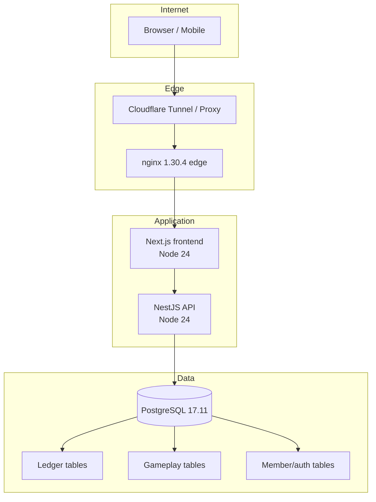
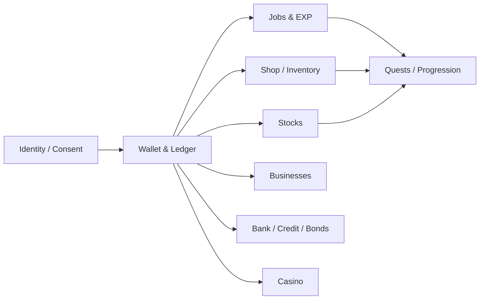

# System Overview

Woldeok Moneyverse is split into four trust zones: the public browser, the public edge/frontend, the internal API, and PostgreSQL. The split prevents a browser request from becoming a direct economy-table mutation.

## Production shape

## Runtime responsibilities

### Browser
The browser renders the responsive UI and submits same-origin requests. It never receives the internal API token or database credentials.

### Next.js frontend
The frontend is the normal public application origin. It renders pages, owns server actions, forwards authenticated server-side requests to NestJS, preserves CSRF/session context and presents WLD as exact integer strings.

### NestJS API
The API is internal. It validates DTOs and route authorization context, enforces the production internal-token boundary, and invokes database read models and protected functions.

### PostgreSQL
PostgreSQL is the final consistency boundary for the economy. Important mutations can atomically perform actor checks, policy checks, idempotency lookup, ledger mutation, gameplay/member-state mutation and receipt generation.

## Major product modules

All monetary arrows represent virtual in-service WLD flows.

## Test and Production

| Environment | Public origin | Purpose |
| --- | --- | --- |
| Test | `https://test.easy-scraping.com` | Canary verification before Production |
| Production | `https://easy-scraping.com` | Live member service |

The stacks use distinct configuration and database data. Runtime or migration changes should prove themselves on Test before Production.

## Related documents
- [Request Flow](request-flow.md)
- [Database Security](database-security.md)
- [Deployment Flow](deployment-flow.md)
- [Security Model](../operations/security-model.md)
