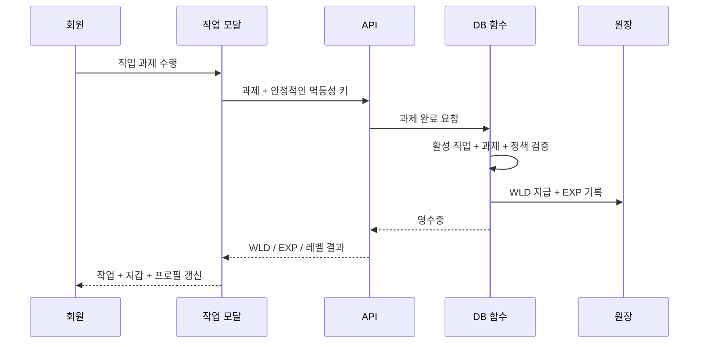

# 직업 및 성장

[English](jobs-and-progression.md) | **한국어** | [문서 색인](../INDEX.ko.md)

직업은 주요 반복 활동 루프입니다. 회원은 하나의 활성 직업을 선택하고 직업 과제를 완료해 가상 WLD와 직업 EXP를 받고 해당 직업 레벨을 성장시킵니다.

## 직업 모델
현재 Job 2.0 카탈로그는 **8개 직업 × 활성 과제 3개 = 총 24개 활성 과제**로 정규화되어 있습니다. 과거 과제와 원장 영수증은 보존하지만 레거시 카탈로그 항목은 현재 과제로 표시하지 않습니다. 회원은 여러 직업의 진행 기록을 가질 수 있지만 데이터베이스는 한 번에 하나의 활성 직업만 허용합니다.

## 완료 흐름

## 안정적인 모달 UX
네트워크 지연 때문에 회원이 모달을 닫았다 다시 열 필요가 없어야 합니다. 하나의 모달 시도는 하나의 멱등성 키를 유지합니다. 프론트엔드가 타임아웃되었지만 데이터베이스가 이미 과제를 커밋했다면 같은 시도의 재시도는 이중 지급 대신 같은 영수증을 재생합니다.

UI는 제출 준비, 요청 진행 중, 응답 지연, 성공 완료, 사유가 있는 거부, 재시도 가능한 통신 오류 상태를 구분합니다.

## 보상 미리보기
표시되는 WLD와 EXP는 직업 레벨 효과를 포함해 서버가 적용하는 실제 보상 계산과 같아야 합니다. UI가 다른 경제 규칙을 하드코딩하면 안 됩니다.

## 성장 공식
직업 레벨은 누적 직업 EXP에서 일관되게 계산합니다. 같은 EXP가 어떤 API 경로로 기록됐는지에 따라 다른 레벨이 되지 않도록 과거의 다른 선형 계산 경로를 정리했습니다.

## 보안 / 무결성 규칙
- 활성 직업 일치는 서버에서 강제합니다.
- 과거 assign/submit/verify 경로도 활성 직업 경계를 우회할 수 없습니다.
- 보상 기록의 최종 권한은 데이터베이스에 있습니다.
- 멱등성으로 실수에 의한 중복 지급을 방지합니다.
- 현재 UI를 단순화한다는 이유로 과거 작업 원장 기록을 삭제하지 않습니다.

## 관련 화면
- `/work`
- `/progression`
- `/wallet`
- `/profile`

[퀘스트](quests.ko.md)와 [요청 흐름](../architecture/request-flow.ko.md)도 참고하세요.
