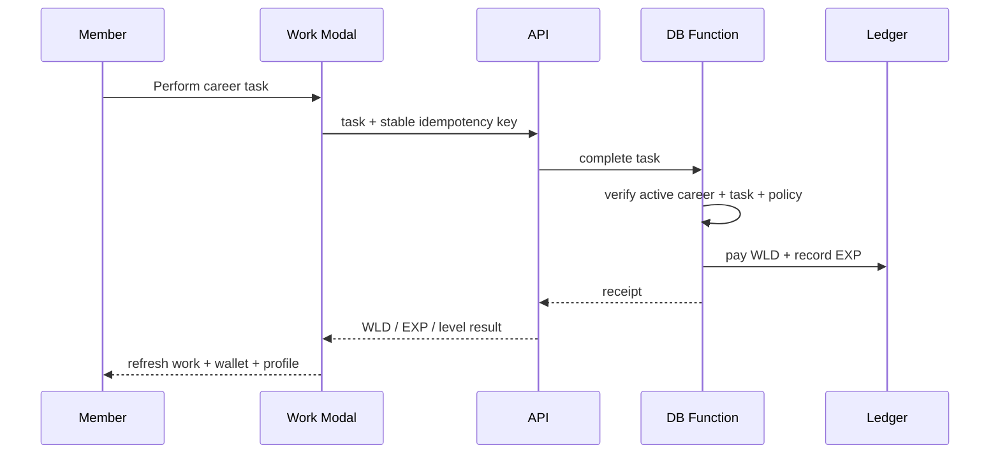

# Jobs & Progression

Jobs are the primary repeatable activity loop. A member chooses one active career, completes career tasks, receives virtual WLD and career EXP, and grows that career's level.

## Career model

The current Job 2.0 catalog is normalized to **8 careers × 3 active tasks = 24 active tasks**. Historical tasks and ledger receipts are preserved, but legacy catalog entries are not presented as current tasks.

A member may have progress in multiple careers but the database enforces one active career at a time.

## Completion flow

## Stable modal UX

A network delay must not force the member to close and reopen the modal. One modal attempt keeps one idempotency key. If the frontend times out while the database already committed the task, retrying the same attempt replays the same receipt instead of paying twice.

The UI also separates the states a person can understand:

- ready to submit;
- request in progress;
- response is unusually slow;
- completed successfully;
- refused with a reason;
- retryable communication failure.

## Reward preview

Displayed WLD and EXP should represent the same effective reward calculation the server applies, including career-level effects. UI previews must not hard-code a different economy rule.

## Progression formula

Career level is derived consistently from cumulative career EXP. Legacy paths that used a different linear calculation were reconciled so the same EXP cannot represent different levels depending on which API path wrote it.

## Security / integrity rules

- active-career match is enforced server-side;
- old assign/submit/verify paths must not bypass the active-career boundary;
- reward writes are database-authoritative;
- idempotency prevents accidental duplicate payment;
- historical work ledger entries are never deleted to make current UI simpler.

## Related surfaces

- `/work`
- `/progression`
- `/wallet`
- `/profile`

See also [Quests](quests.md) and [Request Flow](../architecture/request-flow.md).
