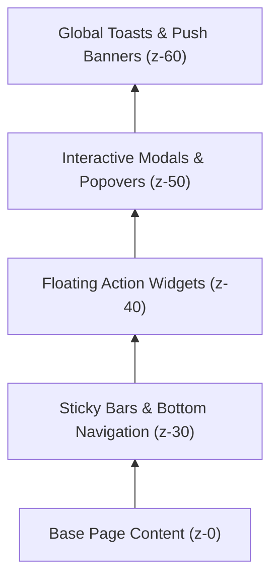

# 50만+ 디자인 스케일 프론트엔드 UI 깨짐·겹침 원천 방지 마스터 가이드라인 (Frontend UI Anti-Clash Master Specification)

> **문서 상태**: 공식 프로덕션 아키텍처 규격 (Production Master Standard)  
> **적용 레퍼런스**: Linear, Stripe, Toss, Apple Human Interface Guidelines, Vercel Geist, Robinhood

---

## 1. 개요 및 목적 (Executive Summary)

본 문서는 MAU 50만 이상의 대규모 트래픽 환경 및 다양한 디바이스 환경에서 발생할 수 있는 **UI 깨짐(Layout Breakage), 요소 겹침(Widget Overlapping), 글자 잘림(Text Truncation/Clipping), Z-Index 충돌(Z-Index Collision)**을 시스템 수준에서 원천 차단하기 위한 엔지니어링 표준 지침이다.

---

## 2. 5대 뷰포트 레이아웃 방어 매트릭스 (Responsive Defense Matrix)

| 뷰포트 티어 | 해상도 구간 | 대표 디바이스 | 컨테이너 패딩 | 핵심 방어 규칙 |
| :--- | :--- | :--- | :--- | :--- |
| **Tier 1: 극소 모바일** | 320px ~ 359px | Galaxy Z Flip 커버, iPhone SE 1세대 | `px-2` (8px) | • 2열 그리드 내 패딩 `p-2` 이하 강제<br>• 아이콘 크기 `size-7.5` 이하<br>• `truncate` 대신 `whitespace-nowrap` + 폰트 축소 |
| **Tier 2: 표준 스마트폰** | 360px ~ 430px | iPhone 14/15/16 Pro, Galaxy S23/S24 | `px-3.5` ~ `px-4` | • 모바일 바텀 네비게이션 회피 오프셋 (`bottom-20`, 80px) 필수<br>• 터치 타깃 `min-h-[44px]` 및 `min-w-[44px]` 보장 |
| **Tier 3: 태블릿 세로** | 768px ~ 1023px | iPad Mini, Galaxy Tab S | `px-6` | • 수평 2~3열 Bento Grid 전환<br>• 사이드바 드로어 자동 접힘 상태 유지 |
| **Tier 4: 컴팩트 랩탑** | 1024px ~ 1279px | MacBook Air 13", 분할 화면 브라우저 | `px-6` ~ `px-8` | • 헤더 메뉴 압축 시 `shrink-0` 및 메뉴 간격 `gap-1.5` 방어<br>• 호가창과 주문 패널 `min-w-0` 분할 |
| **Tier 5: 와이드 데스크톱** | 1280px+ | 27" QHD, 4K 모니터 | `max-w-7xl mx-auto` | • 불필요한 시선 분산 방지를 위한 최대 너비 1280px 고정 |

---

## 3. 플로팅 레이어 계층 및 클린 독 아키텍처 (Clean Floating Dock Architecture)

### 3.1 Z-Index 계층 불변식 (Layer Stacking Matrix)



- **`z-30`**: `MobileBottomNav`, `NoticeBar`, `StickyHeader`
- **`z-40`**: 플로팅 액션 버튼군 (`FloatingSupportChatWidget`, `DeokiAiFloatingAssistant`, `InteractiveOnboardingTracker`)
- **`z-50`**: 모달 다이얼로그 (`DialogContent`, `SheetContent`, AI 덕이 진단 모달)
- **`z-60`**: 최상위 토스트 알림 (`Toaster`, `Sonner`)

### 3.2 플로팅 위젯 다중 충돌 방지 4대 원칙 (Anti-Collision Rules)

1. **상호 배타적 좌표 할당 (Zero-Overlap Positioning)**:
   - 동일한 화면 모서리(예: 우측 하단 `bottom-6 right-6`)에 2개 이상의 플로팅 요소를 동일 좌표로 배치하는 것을 영구 금지한다.
2. **데스크톱 가로 나란히 배치 (Horizontal Side-by-Side Dock)**:
   - 우측 하단 기준: `FloatingSupportChatWidget` = `sm:bottom-6 sm:right-6`
   - 보조 플로팅: `DeokiAiFloatingAssistant` = `sm:bottom-6 sm:right-22` (좌측으로 64px 마진 확보하여 수평 나란히 배치)
3. **화면 대각선 분리 배치 (Cross-Corner Separation)**:
   - 상태 알림 칩(`InteractiveOnboardingTracker`)은 화면 **좌측 하단**(`bottom-20 left-3.5 sm:bottom-6 sm:left-6`)으로 영구 분리하여 우측 조작 버튼군과의 간섭을 100% 차단한다.
4. **모바일 바텀바 세이프티 마진 (Safe Bottom Clearance)**:
   - 모바일 바텀 내비게이션 바 높이(64px) 상단에 최소 16px의 세이프 에어리어를 더해 **`bottom-20 (80px)`**을 모든 모바일 플로팅 요소의 기본 오프셋으로 강제한다.
5. **툴팁 말풍선 자동 소멸 (Auto-Dismiss Tooltips)**:
   - 플로팅 버튼 상단에 붙는 홍보용 말풍선 툴팁은 마운트 4~5초 후 부드럽게 자동 닫히거나 모바일에서는 상시 노출을 금지한다.

---

## 4. 텍스트 잘림 및 글자 겹침 원천 방지 수칙 (Zero-Clipping Formulas)

### 4.1 Flex 부모 자식 수축 방어 (`min-w-0`)
Flex 컨테이너 내부의 텍스트가 줄바꿈되지 않고 부모 경계를 뚫고 나가는 버그는 자식 요소에 `min-w-0`이 누락되었을 때 발생한다:
```tsx
// ❌ 잘못된 패턴 (너비 계산 오류로 글자 겹침 및 부모 밖 이탈)
<div className="flex items-center gap-2">
  <div className="flex-1">
    <span className="truncate">{title}</span>
  </div>
</div>

//  올바른 패턴 (완벽한 너비 감지 및 안전 축소)
<div className="flex items-center gap-2 min-w-0">
  <div className="min-w-0 flex-1">
    <span className="block text-xs font-bold text-foreground truncate">{title}</span>
  </div>
</div>
```

### 4.2 뱃지 & 액션 버튼 수축 방지 (`shrink-0`)
가로 폭이 좁아질 때 버튼이나 라벨이 찌그러지는 현상을 원천 방어한다:
```tsx
//  올바른 패턴:
<Button className="shrink-0 whitespace-nowrap min-h-[44px]">
  {actionLabel}
</Button>
```

### 4.3 금융 숫자 고대비 모노스페이스 (`font-mono tabular-nums`)
실시간 자산, 주가, 배당률 수치는 자릿수 변경 시 레이아웃이 출렁거리지 않도록 반드시 고정폭 폰트를 적용한다:
```tsx
<span className="font-mono tabular-nums font-bold tracking-tight text-primary">
  {groupDigits(balance)} WLD
</span>
```

---

## 5. 실 브라우저 자가 검증 판별식 (Validation Formula)

개발 및 배포 전 아래 3대 불변식을 반드시 통과해야 한다:
1. **수평 횡스크롤 제로**: `document.documentElement.scrollWidth === window.innerWidth` (어떠한 뷰포트에서도 가로 스크롤바 0건)
2. **플로팅 위젯 바운딩 박스 겹침 제로**: 화면에 마운트된 플로팅 요소 간의 `getBoundingClientRect()` 영역 교집합 0건
3. **터치 타깃 최소 44px**: 모바일에서 클릭 가능한 모든 인터랙티브 요소의 높이/너비 $\ge 44\text{px}$
