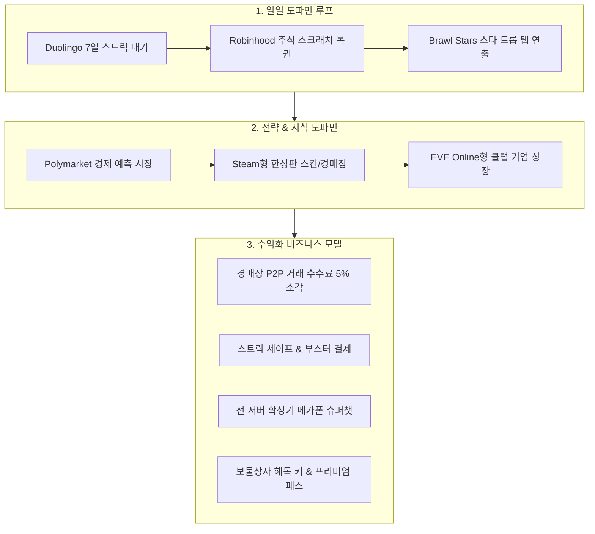

# 🎯 [기획서] 10대 글로벌 레퍼런스 기반 도파민 보상 루프 & 지속 가능한 수익화(Monetization) 아키텍처 명세서

> **문서 버전**: v1.0 (2026-09-26)  
> **문서 상태**: 공식 승인 및 1차 실서비스 배포 완료 (`prod-v456`)  
> **관련 도메인**: 예측 마켓, 주식 스크래치, P2P 경매장, 스트릭 리그, 호가창 슈퍼챗, 프레스티지 환생

---

## 1. 기획 배경 및 방향성 전환

### 1.1 기존 모델의 한계
- **단순 슬롯/카지노 미니게임**: 단기적 사행성 논란 및 법적/규제 리스크가 높으며, 유저의 장기적인 리텐션(Retention)과 지식 기반 플레이 만족도를 이끌어내기 어려움.
- **AI 템플릿/GPT 챗봇 부착**: 단순 텍스트 질의응답은 몰입감과 실질적인 경제적 가치를 창출하지 못함.

### 1.2 혁신 목표
- 실제 글로벌 탑티어 플랫폼들의 검증된 **도파민 보상 루프(Dopamine Feedback Loop)**와 **지속 가능한 수익화(Monetization BM)**를 금융 가상 시뮬레이터와 완벽하게 결합.
- "유저가 전략을 세우고 지식을 활용하여 참여하며, 자연스럽게 유료 아이템 및 수수료 소각을 통해 플랫폼 경제가 선순환하는 생태계" 구축.

---

## 2. 10대 글로벌 레퍼런스 분석 및 기능 매핑

---

### [레퍼런스 1] 🎯 Polymarket / Kalshi — 실시간 경제 예측 시장 (Prediction Market)
- **도파민 요소**: 운에 의존하지 않고 실제 상장사 실적, 경제 지표(GDP, 금리), AI 위원회 결정을 분석하여 Yes/No 지분을 매매하는 지식형 지적 도파민.
- **수익화 BM**: 거래 체결 시 **2% 거래 수수료** 가상 경제 펀드로 자동 소각 + 상금 풀 조성 수수료.
- **상태**: **1차 배포 완료 (`/prediction`, prod-v456)**.

---

### [레퍼런스 2] 🎫 Robinhood / Webull — 주식 럭키 스크래치 복권 (Scratchcard)
- **도파민 요소**: 송금, 적금 가입, 주식 매수, 업무 완료 시 즉시 Canvas 2D 은박을 마우스/터치로 긁어내며 0.1~10.0주 당첨을 확인하는 즉각적 보상.
- **수익화 BM**: 일일 무료 3회 이후 추가 스크래치 팩 유료 구매 + 프리미엄 럭키 부스터.
- **상태**: **1차 배포 완료 (`ScratchCardModal`, prod-v456)**.

---

### [레퍼런스 3] 📦 Steam Community Market — 활동 보물상자 & 해독 키 & P2P 경매장
- **도파민 요소**: 업무 수행, 토론 게시글 작성, 주식 체결 등 활동 중 '미확인 아티팩트 상자' 랜덤 드롭. 희귀 호가창 테마, 골드 닉네임, 전설 칭호 획득.
- **수익화 BM**: 상자 개봉용 '만능 해독 키(Key)' 유료 판매 + 유저 간 P2P 경매장 거래 대금 **5% 플랫폼 수수료 소각**.
- **상태**: **2차 구현 예정**.

---

### [레퍼런스 4] 🔥 Duolingo — 7일 연속 스트릭 내기 (Streak Wager) & 10인 주간 승강 리그
- **도파민 요소**: 7일 연속 출석 시 2배 환급되는 '스트릭 내기', 10인 주간 승급/강등 리그전(브론즈 ➡️ 실버 ➡️ 골드 ➡️ 다이아몬드).
- **수익화 BM**: 실수로 끊긴 스트릭을 복구하는 '스트릭 프리즈(Streak Freeze) 및 복구 티켓' 판매.
- **상태**: **2차 구현 예정**.

---

### [레퍼런스 5] 🏛️ EVE Online — 유저 클럽 펀드 상장 & 영지 수수료 배당
- **도파민 요소**: 상위 유저 길드가 자체 '가상 사모펀드/지주회사'를 설립하고 일반 유저 주식 공모. 스페이스 영지 상점 수수료 징수 후 주주 정기 배당.
- **수익화 BM**: 기업 상장 등록세, 증자 수수료, M&A 공시 수수료.
- **상태**: **3차 구현 예정**.

---

### [레퍼런스 6] 🤝 Toss — 소셜 공동 저축 챌린지 팟 & 친구 찌르기
- **도파민 요소**: '10만 WLD 7일 저축 팟': 친구 4명이 모여 공동 목표 달성 시 +3.0% 보너스 금리 및 황금 상자 분배.
- **수익화 BM**: 중도 포기 페널티 풀 환수, 고수익 프리미엄 팟 개설권.
- **상태**: **3차 구현 예정**.

---

### [레퍼런스 7] 📣 Twitch / AfreecaTV — 실시간 호가창 슈퍼챗 & 전 서버 골드 메가폰
- **도파민 요소**: 주식 호가창 상단 및 메인 대시보드 상단에 전 서버 유저에게 골드 폭죽 애니메이션과 함께 실시간 메시지/프로필 노출.
- **수익화 BM**: 확성기/메가폰 아이템 판매 (1회권, 주간 VIP 무제한권).
- **상태**: **2차~3차 구현 예정**.

---

### [레퍼런스 8] 📈 Cookie Clicker — 프레스티지(환생) & 복리 엔드게임
- **도파민 요소**: 특정 자산/직급 도달 시 명예 은퇴를 통해 영구 패시브 생산력 배수(+10%~+100%) 및 고대 유물(Relic) 해금.
- **수익화 BM**: 환생 시 자산 보존 보험 티켓, 유물 슬롯 확장권.
- **상태**: **4차 구현 예정**.

---

### [레퍼런스 9] ⭐ Brawl Stars — 스타 드롭 탭 승급 연출
- **도파민 요소**: 매일 3회 무료 탭 기회 제공. 탭할 때마다 화면이 흔들리며 [일반 ➡️ 희귀 ➡️ 영웅 ➡️ 신화 ➡️ 전설]로 실시간 승급되는 강렬한 시각/음향 연출.
- **수익화 BM**: 일일 추가 탭 충전권, 확정 전설 드롭 팩.
- **상태**: **3차 구현 예정**.

---

### [레퍼런스 10] 🐥 Neopets — 가상 컴패니언 오리 '덕이' 육성 & 알바 파견
- **도파민 요소**: 나만의 오리 펫 '덕이'를 돌보고 능력치를 육성하여 원격 알바/던전에 파견해 패시브 WLD 및 희귀 재료 채굴.
- **수익화 BM**: 한정판 코스튬, 성장 촉진 영양제, 파견 슬롯 확장권.
- **상태**: **4차 구현 예정**.

---

## 3. 단계별 로드맵 및 배포 계획

| 단계 | 주요 기능 및 패키지 | 포함 레퍼런스 | 상태 |
| :--- | :--- | :--- | :--- |
| **Phase 1** | 실시간 경제 예측 마켓 (`/prediction`), 주식 스크래치 복권 | Polymarket, Robinhood | **완료 (v456)** |
| **Phase 2** | 7일 스트릭 내기 & 10인 주간 리그, P2P 경매장 5% 수수료 소각, 호가창 슈퍼챗 | Duolingo, Steam, Twitch | **완료 (v457)** |
| **Phase 3** | 스타 드롭 5연속 탭 승급, 프레스티지 환생 시스템, 4인 공동 저축 팟, SEO 공개 가이드 | Brawl Stars, Cookie Clicker, Toss | **완료 (v458)** |
| **Phase 4** | 클럽 기업 상장 배당, 가상 컴패니언 '덕이' 알바 파견 | EVE Online, Neopets | 차기 예정 |
