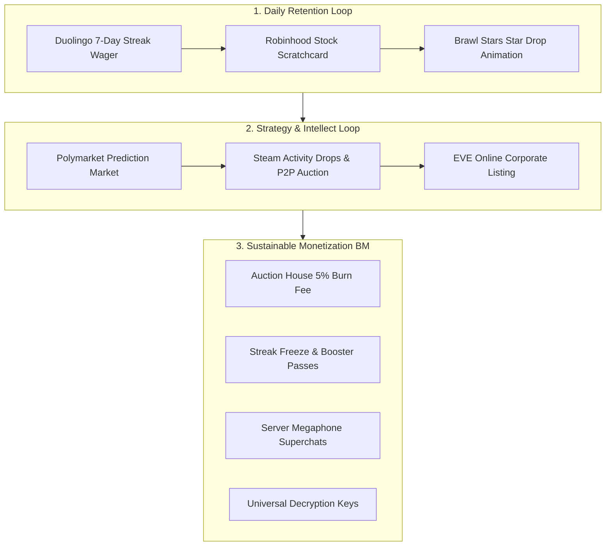

# 🎯 [Specification] 10 Global References Dopamine Reward Loop & Sustainable Monetization Architecture

> **Document Version**: v1.0 (2026-09-26)  
> **Status**: Approved & Phase 1 Production Released (`prod-v456`)  
> **Domain**: Prediction Markets, Stock Scratchcard, P2P Auction House, Streak Leagues, Orderbook Superchats, Prestige Rebirth

---

## 1. Planning Background & Paradigm Shift

### 1.1 Limitations of Previous Approaches
- **Pure Luck-Based Mini-games**: Traditional casino mechanics face regulatory scrutiny and provide low long-term retention for strategy-oriented users.
- **Generic AI/GPT Chatbots**: Simple text interaction fails to deliver tangible economic utility or engagement.

### 1.2 Core Objectives
- Merge proven **Dopamine Feedback Loops** and **Sustainable Monetization Business Models (BM)** from top-tier platforms with virtual financial simulation.
- Build an economy where user intellect and strategic planning drive engagement, while transactional burns and premium utilities power sustainable revenue.

---

## 2. 10 Global References Analysis & Features

---

### [Reference 1] 🎯 Polymarket / Kalshi — Real-time Economy Prediction Market
- **Mechanism**: Binary Yes/No position trading based on company fundamentals, macroeconomic indicators, and AI Policy Council verdicts.
- **Monetization**: 2% trade execution fee burned automatically into the virtual economy stability fund.
- **Status**: **Phase 1 Production Active (`/prediction`, prod-v456)**.

---

### [Reference 2] 🎫 Robinhood / Webull — Lucky Stock Scratchcard
- **Mechanism**: Interactive Canvas 2D foil scratchcard awarded upon transfers, savings deposits, and trade completions (0.1 to 10.0 shares).
- **Monetization**: Additional scratchcard bundles and premium rarity boosters.
- **Status**: **Phase 1 Production Active (`ScratchCardModal`, prod-v456)**.

---

### [Reference 3] 📦 Steam Community Market — Activity Drops & Universal Decryption Key & P2P Auctions
- **Mechanism**: Rare artifact crates dropped during daily activities (work, discussions, trades) with 5% P2P auction burn fee.
- **Monetization**: Universal Decryption Keys for unboxing rare themes, golden names, and legendary titles.
- **Status**: **Phase 2 In-Design**.

---

### [Reference 4] 🔥 Duolingo — 7-Day Streak Wager & 10-Tier Weekly Leagues
- **Mechanism**: Double-or-nothing streak wagers on 7-day attendance and 10-player tier advancement.
- **Monetization**: Streak Freeze and recovery tickets.
- **Status**: **Phase 2 In-Design**.

---

### [Reference 5] 🏛️ EVE Online — Player Club Funds & Territorial Dividends
- **Mechanism**: Top guilds issue public stock for ventures and distribute space property dividends.
- **Monetization**: IPO registration tax, capital increase fees, and M&A filings.
- **Status**: **Phase 3 Planned**.

---

### [Reference 6] 🤝 Toss — Social Cooperative Savings Pockets
- **Mechanism**: 4-player joint savings goal granting +3.0% bonus yield and golden chest rewards upon completion.
- **Monetization**: Early exit penalty pool distribution and high-yield pocket passes.
- **Status**: **Phase 3 Planned**.

---

### [Reference 7] 📣 Twitch / AfreecaTV — Orderbook Superchat & Server Megaphone
- **Mechanism**: Real-time ticker messages with gold firework animations broadcasted across trading consoles.
- **Monetization**: Megaphone item purchases (single-use and weekly VIP passes).
- **Status**: **Phase 2-3 Planned**.

---

### [Reference 8] 📈 Cookie Clicker — Prestige Rebirth & Exponential Tycoon
- **Mechanism**: Honorable retirement yielding permanent passive productivity multipliers (+10% to +100%) and ancient relics.
- **Monetization**: Rebirth asset insurance vouchers and relic slot expansions.
- **Status**: **Phase 4 Planned**.

---

### [Reference 9] ⭐ Brawl Stars — Star Drop Upgrade Animation
- **Mechanism**: 3 daily free taps with sensory screen-shake upgrading from Common ➡️ Rare ➡️ Epic ➡️ Mythic ➡️ Legendary.
- **Monetization**: Daily tap recharge tickets and guaranteed Legendary packs.
- **Status**: **Phase 3 Planned**.

---

### [Reference 10] 🐥 Neopets — Virtual Companion Duck Pet 'Deoki' Training & Dispatch
- **Mechanism**: Nurture and dispatch pet companion on remote part-time jobs for passive token mining.
- **Monetization**: Limited costume skins, growth vitamins, and extra dispatch slots.
- **Status**: **Phase 4 Planned**.

---

## 3. Phased Roadmap

| Phase | Core Features | References | Status |
| :--- | :--- | :--- | :--- |
| **Phase 1** | Prediction Market (`/prediction`), Stock Scratchcard | Polymarket, Robinhood | **Completed (`prod-v456`)** |
| **Phase 2** | 7-Day Streak Wager & Weekly Leagues, Activity Crates & P2P Auction 5% Fee | Duolingo, Steam | **Under Interactive Alignment** |
| **Phase 3** | Orderbook Superchats, Social Savings Pockets, Star Drop Animations | Twitch, Toss, Brawl Stars | Queued |
| **Phase 4** | Prestige Rebirth, Guild IPOs, Companion Duck Dispatch | Cookie Clicker, EVE Online, Neopets | Queued |
