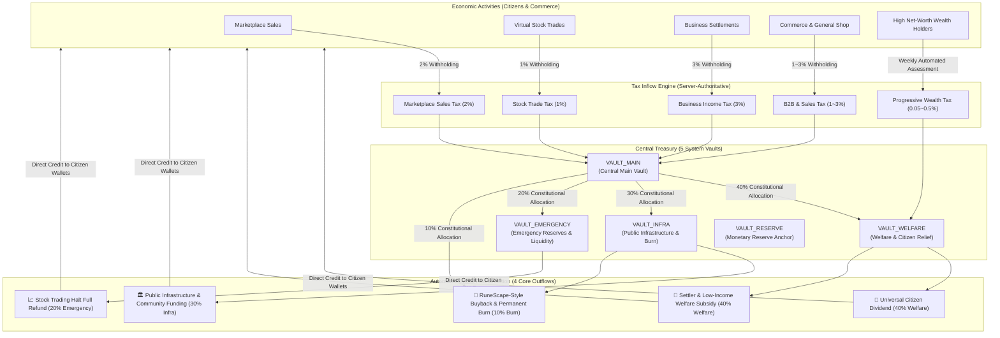

# Woldeok Moneyverse Treasury Automated Social Recirculation Specification

> **v542 fiscal evidence correction:** v522 Production statements are historical snapshots, not exact-current-main verification. The four-way 40/30/20/10 split applies once to a defined available surplus; program allocations (citizen dividend, welfare, infrastructure, trading-halt) are sub-budgets, not extra percentages of that same base. Protected reserves are fiscal only. A treasury transfer or VAULT_MAIN receipt never equals canonical currency retirement. [v542 correction](ECONOMY_INTEGRITY_AND_DOCUMENTATION_RECONCILIATION_SPEC.md) and v523 monetary authority govern.
(TREASURY AUTOMATED SOCIAL RECIRCULATION SPEC)

> **Version**: v2026.10.04.522  
> **Status**: Production Implemented & Verified (AUTHORITATIVE)  
> **Effective Date**: 2026-10-04  
> **Target Modules**: `backend/src/admin/treasury/`, `frontend/src/app/admin/treasury/`, `packages/database/migrations/`

---

> **v523 monetary/fiscal boundary:** treasury vaults, taxes and fiscal expenditure in this document move existing WLD. New WLD issuance and permanent retirement follow only the Central Bank authorization + canonical Mint execution path in `CENTRAL_BANK_MINT_TREASURY_ECONOMY_CORE_SPEC.md`. `VAULT_RESERVE` is a fiscal liquidity reserve, not a money-issuance reserve.

## 🏛️ 1. Fiscal Recirculation & Social Democratic Principles

Woldeok Moneyverse's fiscal and taxation system operates under a strict fiscal-transparency principle:
**"Every WLD collected from citizen transactions and market activity remains fully accounted for and is routed only to approved public spending, welfare, fiscal reserves, market stabilization, or an explicit permanent-retirement policy, with zero off-ledger leakage."** Treasury holding and spending do not create money; only canonical retirement reduces total supply.

---

## 💰 2. Authoritative 10-Tier Tax Schedule

All tax inflows are server-authoritative, executed inside ACID transactions:

| Tax Category | Statutory Rate | Tax Trigger Event | Vault Destination | Tax Exempt |
| :--- | :---: | :--- | :---: | :---: |
| **Marketplace Sales Tax** | **2%** | On marketplace settlement before net payout | **100% (`VAULT_MAIN`)** | Taxable |
| **Stock Trading Tax** | **1%** | On stock sell order execution | **100% (`VAULT_MAIN`)** | Taxable |
| **Business Net Income Tax** | **3%** | On corporate net operating profit settlement | **100% (`VAULT_MAIN`)** | Taxable |
| **B2B Contract Tax** | **1%** | On corporate wholesale contract settlement | **100% (`VAULT_MAIN`)** | Taxable |
| **General Shop Sales Tax** | **1%** | On NPC shop taxable item purchase | **100% (`VAULT_MAIN`)** | Taxable |
| **Luxury SKU Sales Tax** | **3%** | On premium titles & luxury cosmetics | **100% (`VAULT_MAIN`)** | Taxable |
| **Club Management Assessment** | **1%** | On club dues & tournament entry fees | **100% (`VAULT_MAIN`)** | Taxable |
| **Career License Exam Fee** | **Fixed Fee** | On occupational exam & tier promotions | **100% (`VAULT_MAIN`)** | Taxable |
| **Progressive Wealth Tax** | **0.05~0.5%** | Weekly automated high-net-worth tier audit | **100% (`VAULT_WELFARE`)** | Taxable |
| **Career Salary & Attendance** | **0%** | Labor protection policy | 0% | **100% Exempt** |
| **Trading Halt Full Refund** | **0%** | Investor protection restitution | 0% | **100% Exempt** |

---

## ⚖️ 3. Constitutional 4-Way Atomic Budget Distribution Rule

When treasury surplus is distributed, it strictly follows the **4-Way Constitutional Formula**:

$$\text{Total Distributed Budget} = \text{Welfare (40\%)} + \text{Infra (30\%)} + \text{Emergency (20\%)} + \text{Burn (10\%)}$$

1. **40% Welfare Fund (`VAULT_WELFARE`)**:
   - Universal Citizen Dividend (`CITIZEN_DIVIDEND`) for active community members.
   - Settlement subsidies (`WELFARE_SUBSIDY`) for new citizens and bottom 30% wealth tiers.
2. **30% Public Infrastructure Fund (`VAULT_INFRA`)**:
   - Megacity public spaces, community grants, and open metaverse spaces (`COMMUNITY_FUNDING`).
3. **20% Emergency Buffer Reserve (`VAULT_EMERGENCY`)**:
   - System failure contingencies, stock trading halt restitution (`STOCK_HALT_SETTLEMENT`).
4. **10% RuneScape-Style Deflationary Burn (`MARKET_BUYBACK_BURN`)**:
   - Automated open-market buyback of distressed floor assets followed by permanent burn to fight inflation.

---

## 🛡️ 4. Invariant: 30% Inviolable Safe Reserve Floor

$$\text{Safe Reserve Floor} = \max\left(100{,}000\text{ WLD},\, \text{Gross Treasury Assets} \times 30\%\right)$$

- Any outflow attempting to breach the 30% reserve floor is automatically rejected with `HTTP 409 InsufficientSafeReserve`.
- Zero fiscal default guarantee for all citizen deposits.
