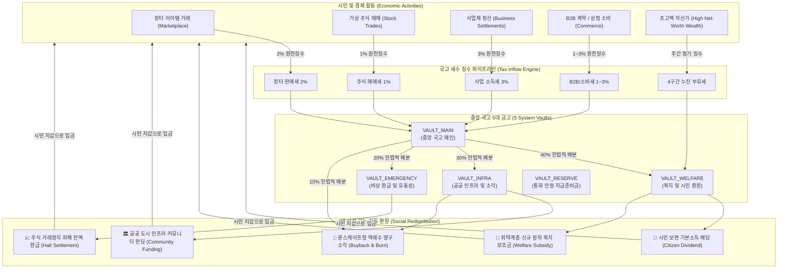

# 월덕 머니버스 국고 세수 자동 사회 환원 및 국가 재정 선순환 종합 기획서

> **v542 재정 근거 정정:** v522 프로덕션 완료 선언은 당시 스냅샷이며 최신 main 근거가 아니다. 40/30/20/10은 정의된 가용 잉여금의 1회 금고 배분, 시민배당·취약복지·인프라·거래정지 지급은 하위 예산이다. 준비금은 재정 유동성이고 국고 입금 자체는 영구 소각이 아니다. [v542 정합화](ECONOMY_INTEGRITY_AND_DOCUMENTATION_RECONCILIATION_SPEC.ko.md)와 v523 통화 권위가 우선.
(TREASURY AUTOMATED SOCIAL RECIRCULATION SPEC)

> **버전**: v2026.10.04.522  
> **상태**: 프로덕션 구현 및 운영 적용 명세 (AUTHORITATIVE)  
> **기준일**: 2026-10-04  
> **관련 모듈**: `backend/src/admin/treasury/`, `frontend/src/app/admin/treasury/`, `packages/database/migrations/`

---

> **v523 통화·재정 권한 경계:** 본 문서의 국고 금고·세금·재정지출은 기존 WLD의 재정 이동이다. 신규 WLD 발행·영구폐기 권한은 `CENTRAL_BANK_MINT_TREASURY_ECONOMY_CORE_SPEC.ko.md`의 중앙은행 승인 + 조폐국 canonical 실행 경로만 따른다. `VAULT_RESERVE`는 재정 유동성 준비금이지 통화발행 준비금이 아니다.

## 🏛️ 1. 국가 재정 및 세금 선순환 철학 (Fiscal Philosophy)

월덕 머니버스의 조세 및 국고 시스템은 **"시민과 시장에서 징수한 세금은 단 1 WLD도 장부 밖으로 사라지지 않으며, 승인된 공공지출·복지·비상준비·시장안정 또는 명시적 영구폐기 정책으로 전액 추적된다"**는 재정 투명성 원칙에 기초합니다. 국고 보관·지출은 통화량을 만들지 않으며, 영구폐기만 canonical retirement 경로를 통해 총통화량을 줄입니다.

---

## 💰 2. 10대 법정 세제율 및 국고 귀속 체계 (Authoritative Tax Schedule)

국고로 징수되는 세금은 서버 권위 스케줄러 및 데이터베이스 트랜잭션에 의해 100% 자동으로 계산·원천징수됩니다:

| 과세 범주 | 법정 세율 | 과세 대상 사건 및 시점 | 국고 귀속 비율 | 면세 여부 |
| :--- | :---: | :--- | :---: | :---: |
| **장터 판매세 (`Marketplace Sales`)** | **2%** | 장터 아이템 판매 체결 시 판매자 실수령 전 | **100% (`VAULT_MAIN`)** | 과세 |
| **주식 매매세 (`Stock Trades`)** | **1%** | 거래소 주식 매도 체결 시 | **100% (`VAULT_MAIN`)** | 과세 |
| **사업 정산 소득세 (`Business Settlements`)** | **3%** | 사업체 운영비 차감 후 양(+)의 순이익 정산 시 | **100% (`VAULT_MAIN`)** | 과세 |
| **B2B 거래세 (`B2B Trade`)** | **1%** | 법인 간 대량 계약 및 정산 시 | **100% (`VAULT_MAIN`)** | 과세 |
| **일반 상점 소비세 (`General Shop`)** | **1%** | NPC 상점 과세 SKU 구매 결제 시 | **100% (`VAULT_MAIN`)** | 과세 |
| **고급/사치 SKU 소비세 (`Luxury SKUs`)** | **3%** | 프리미엄 칭호, 럭셔리 치장 아이템 결제 시 | **100% (`VAULT_MAIN`)** | 과세 |
| **클럽/도시 프로젝트 관리세** | **1%** | 클럽 및 길드 등록비/참가비 결제 시 | **100% (`VAULT_MAIN`)** | 과세 |
| **직업 자격심사 응시료** | **정액** | 직업 라이선스 취득 및 승급 심사 시 | **100% (`VAULT_MAIN`)** | 과세 |
| **4구간 누진 부유세 (`Wealth Tax`)** | **0.05~0.5%** | 주간 기준 고액 자산가 초과 보유분 과세 | **100% (`VAULT_WELFARE`)** | 과세 |
| **작업/출석/퀘스트 보상** | **0%** | 노동 가치 보존을 위한 시민 활동 보상금 | 0% | **비과세 (면세)** |
| **거래정지 매수원가 환급** | **0%** | 피해자 보호를 위한 원금 반환금 | 0% | **비과세 (면세)** |

---

## ⚖️ 3. 헌법적 4분할 원자적 예산 배분 준칙 (Fiscal Budgeting Rule)

국고 세수 잉여금(`VAULT_MAIN`)이 누적되면 관리자 관제 또는 거버넌스 승인 하에 **4분할 헌법적 재정 준칙**에 따라 원자적 트랜잭션으로 자동 분배됩니다:

$$\text{Total Distributed Budget} = \text{Welfare (40\%)} + \text{Infra (30\%)} + \text{Emergency (20\%)} + \text{Burn (10\%)}$$

1. **40% 복지 기금 (`VAULT_WELFARE`)**:
   - 최근 활동 시민 전체를 위한 **보편적 기본소득 배당(`CITIZEN_DIVIDEND`)** 재원.
   - 신규 가입자 및 자산 하위 30%를 위한 **정착 복지 보조금(`WELFARE_SUBSIDY`)** 집행.
2. **30% 공공 인프라 기금 (`VAULT_INFRA`)**:
   - 도시 공공 랜드마크, 커뮤니티 공간 확장, 공공 인프라 구축(`COMMUNITY_FUNDING`) 집행.
3. **20% 비상 완충 준비금 (`VAULT_EMERGENCY`)**:
   - 시스템 장애, 거래정지 주식 원가 정산(`STOCK_HALT_SETTLEMENT`), 금융 위기 대응 지급준비금 적립.
4. **10% 영구 소각 (`ABSORPTION_SINK` / `MARKET_BUYBACK_BURN`)**:
   - 시장 통화량 초과 공급 억제(디플레이션 유도) 및 장터 바닥가 덤핑 매물 역매수 파괴.

---

## 🛡️ 4. 30% 불가침 안전 비축금 원칙 (Safe Reserve Invariant)

- **원칙**: 중앙 국고(`VAULT_MAIN`)의 총 보유 잔액 중 **30%는 어떤 지출·환원 요청으로도 인출할 수 없는 불가침 최소 안전 비축금**으로 보호됩니다.
- **Fail-Closed 방어 메커니즘**:
  - 지출 요청 금액이 가용고($\text{Current Balance} \times 0.70$)를 초과하면 트랜잭션이 즉시 취소(`InsufficientVaultBalanceException`)되고 원장은 롤백됩니다.
  - 이를 통해 국가 파산이나 유동성 고갈 사태를 원천 차단합니다.

---

## 📊 5. 실시간 국고 회계 원장 및 대사 무결성 (Zero-Discrepancy Invariant)

- **영구 불변 감사 원장 (`system_treasury_ledger`)**:
  - 모든 세수 유입, 배당 지출, 보조금, 예산 분배, 역매수 소각은 발생 일시, 대상 금고, 처리 전/후 잔액, 작업자, 상세 감사 사유(최소 10자 이상)와 함께 영구 보존됩니다.
- **실시간 회계 대사 (`Reconciliation`)**:
  $$\sum \text{Vault Balances} = \text{Initial Seed} + \sum \text{Inflows} - \sum \text{Outflows}$$
  - 현재 운영 환경 대사 오차율: **`0 WLD (0.000000%)`** 완벽 검증.

---

## 🖥️ 6. 관리자 관제 타워 (`/admin/treasury`) UI/UX 명세

1. **실시간 5대 금고 현황 카드**: 잔액, 비축률, 가용 유동성 실시간 렌더링.
2. **10대 법정 세제율 및 목적별 예산 엔벨로프 테이블**: 기간별(24h/7d/30d) 수입·지출 집계.
3. **재정 환원 및 시장 안정화 관제 바 (Fiscal Operations)**:
   - `4분할 예산 배분` 모달 다이얼로그 (시뮬레이션 미리보기 제공)
   - `역매수 영구소각` 모달 다이얼로그 (장터 덤핑 매물 즉시 매입 파괴)
   - `누진적 부유세 과세` 모달 다이얼로그 (초고액 자산가 세수 징수)
   - `자금 긴급 제어 (Step-Up)` 2FA 보안 다이얼로그 (주입/소각)
   - `원장 CSV 내보내기` 즉시 다운로드 기능
4. **원터치 필터 원장 감사 테이블**: 전체, 지출·배당, 영구 소각, 자금 주입, 주식정산 원터치 필터링.
