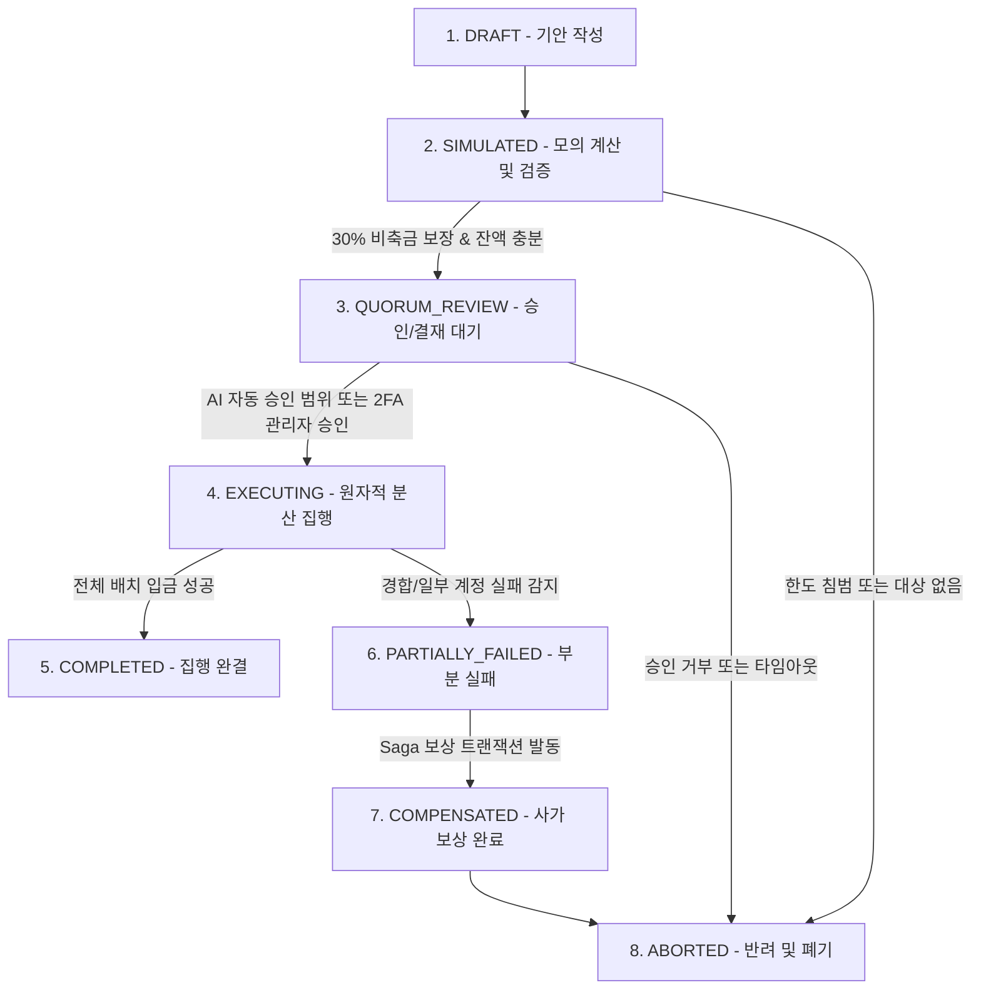

# 국고 세금 재순환 및 공공 재정 지출·환원 상세 기획서 (TREASURY REDISTRIBUTION SPEC)

> **v542 권위 보정 / CONDITIONAL FISCAL DESIGN:** 재정지출은 기존 WLD 이전만 가능하며 총통화량을 늘리지 않는다. 30% 보호준비금과 25M 유동성 목표는 합의된 재정 정책/재원 제약으로만 적용한다. 복지·기반시설·비상·소각 예산과 각 프로그램 지출비중을 중복 합산하지 않는다. 소각은 국고 입금/죽은 주소 이동이 아닌 canonical Mint 폐기증서가 필요하다. 최근 구현/운영 완료 상태는 원장·Test 검증 전 미확인. [v542 명세](ECONOMY_INTEGRITY_AND_DOCUMENTATION_RECONCILIATION_SPEC.ko.md) 우선.

> 버전: v2026.10.03.511  
> 상태: 프로덕션 구현 및 운영 적용 명세 (AUTHORITATIVE)  
> 기준일: 2026-10-03  
> 최신 커밋: fc9af624  
> 연계 문서: `docs/planning/ADMIN_TREASURY_MANAGEMENT_SPEC.ko.md`, `packages/database/migrations/224-admin-treasury-management.sql`, `packages/database/migrations/227-treasury-redistribution-and-subsidies.sql`

---

## 1. 배경 및 문제 정의

1. **세금 징수와 지출의 불균형 해소**:
   - 현재 월덕 머니버스 경제 시스템은 마켓플레이스 판매세(2%), 송금세, 주식 거래세(1%), 법인 소득세 등을 통해 중앙 국고(`VAULT_MAIN`)로 지속적인 세금 수입을 거두고 있습니다.
   - 그러나 거둬들인 국고가 사용자 및 가상경제 생태계로 환원되지 않고 금고에만 묶여 있을 경우, 통화 유통속도(Velocity of Money)가 급감하고 유저들의 체감 경제 활동 의욕이 저하되는 심각한 디플레이션 함정이 발생합니다.
2. **목표**:
   - "세금을 걷었으면 다시 공공의 이익과 시민의 후생으로 환원한다"는 건전한 재정 민주주의 원칙에 따라, 4대 공공 재정 지출 체계를 수립하고 이를 원자적 데이터베이스 트랜잭션 및 관리자 관제 타워 UI로 구현합니다.

---

## 2. 4대 복합 재정 지출 체계 및 집행 우선순위

| 우선순위 | 지출 구분 (tx_type) | 수혜 대상 | 집행 방식 | 주요 목적 | 지출 상한 (가용고 대비) |
|---|---|---|---|---|---|
| **P0 (최우선)** | **WELFARE_SUBSIDY** (취약계층 복지) | 순자산 하위 30% 및 신규 가입 14일 미만 시민 | 복지 심사 기반 보조금 지급 | 빈부격차 완화, 신규 유입자 안착 및 파산 방지 | 회당 최대 25% |
| **P1 (긴급)** | **MARKET_STIMULUS** (경기부양 유동성) | 시장 안정화 마켓 메이킹 풀 | 긴급 유동성 조성 및 LP 공급 | 시장 거래 침체 극복, 금융 충격 완화 | 회당 최대 20% |
| **P2 (정기)** | **CITIZEN_DIVIDEND** (시민 보편 배당) | 최근 7일 활동 시민 전원 | 1인당 정액 균등 자동 입금 | 국고 잉여 세수 환원, 기본소득 보장, 접속 동기 부여 | 회당 최대 35% |
| **P3 (자율)** | **COMMUNITY_FUNDING** (공공 프로젝트) | 공공 프로젝트 제안자/에스크로 | 사업 단위 승인 집행 | 도시 인프라 확충, 커뮤니티 콘텐츠 활성화 | 회당 최대 15% |

---

## 3. 재정 건전성 및 30% 안전 비축금 원칙 (Safe Reserve Invariant)

1. **30% 보호 비축금 (Protected Reserve)**:
   - 중앙 국고(`VAULT_MAIN`) 잔액의 **30%는 어떠한 경우에도 지출/환원할 수 없는 불가침 최소 준비금**으로 잠깁니다.
   - 허용 최대 지출액 수식:
     ```
     Max_Disbursement = Floor(Current_Balance * 0.70)
     Available_Budget = Max(0, Current_Balance - (Total_Historical_Peak * 0.30, Current_Balance * 0.30))
     ```
   - 지출 요청 시 잔액이 부족하거나 30% 한도선을 침범할 경우, 데이터베이스 레벨에서 `EX_INSUFFICIENT_SAFE_RESERVE` 예외를 발생시키고 트랜잭션을 롤백합니다.
2. **비상 금고(`VAULT_EMERGENCY`)의 분리**:
   - 주식 거래정지 원가 환급용 5천만 WLD 비축금 및 법적 예치금은 일반 재정 지출 대상에서 원천 배제됩니다.

---

## 4. 8단계 재정 집행 State Machine (State Transition Contract)

재정 지출은 단순 단발성 호출이 아니며, 엄격한 8단계 상태 머신을 통해 금융 무결성과 감사 추적성을 확보합니다.



### 상태별 정의 및 불변 규칙
1. **DRAFT (초안 작성)**: 지출 유형, 총 예산, 대상 선정 조건(쿼리) 설정. 아직 장부 영향 없음.
2. **SIMULATED (Dry-run 검증)**: 수혜자 목록 산출, 1인당 배당액 계산, 30% 비축금 침범 여부 모의 검증.
3. **QUORUM_REVIEW (결재 및 심의)**: 지출 규모별 승인 라인 확인 (AI 자동 승인 vs 2FA 인간 다중 서명).
4. **EXECUTING (원자적 분산 집행)**: DB 배치 단위 분개, 유저 캐시 증액, 국고 출금 트랜잭션.
5. **COMPLETED (집행 완결)**: 전 수혜자 입금 완료, 감사 영수증 해시 발행, 알림 디스패치.
6. **PARTIALLY_FAILED (부분 실패 감지)**: 유저 잠금 경합, 계정 동결 등으로 일부 지급 누락 발생 시 즉시 전환.
7. **COMPENSATED (사가 보상 롤백)**: Saga 보상 패턴 가동. 이미 차감된 국고 원상 복구 및 부분 지급분 정산 분개.
8. **ABORTED (종료 및 폐기)**: 감사 로그에 사유(거부, 실패, 타임아웃) 기록 후 동결.

---

## 5. 4구간 누진 부유세(Wealth Surtax) 및 역매수 소각(Buyback & Burn) 연동

국고의 유입과 유출은 선순환 경제 피드백 루프로 결합됩니다.

### 5.1 4구간 누진 부유세율 (주간 부과)
| 순자산 구간 (WLD) | 주간 세율 | 징수 방식 | 국고 귀속 계정 |
|---|---|---|---|
| **1구간 (1억 ~ 10억 미만)** | 0.05% / 주 | 토요일 00:00 KST 원자적 원천징수 | `VAULT_MAIN (복지 기금)` |
| **2구간 (10억 ~ 100억 미만)** | 0.12% / 주 | 토요일 00:00 KST 원자적 원천징수 | `VAULT_MAIN (배당 기금)` |
| **3구간 (100억 ~ 1000억 미만)** | 0.25% / 주 | 토요일 00:00 KST 원자적 원천징수 | `VAULT_MAIN (경기부양)` |
| **4구간 (1000억 이상 초거대고래)** | 0.50% / 주 | 토요일 00:00 KST 원자적 원천징수 | 50% 국고 귀속 / 50% 즉시 소각 |

### 5.2 국고 역매수 소각 (Buyback & Burn) 트리거
- **트리거 조건**: 국고 중앙 금고 잔액이 최근 30일 이동평균 대비 150%를 초과하여 심각한 통화 정체 우려 시.
- **소각 한도**: 초과 세수의 최대 30%를 시장 유통 WLD 역매수 후 블랙홀 주소(`0x000...DEAD`)로 영구 소각.
- **효과**: WLD 디플레이션 유도, 장기 보유자 가치 보존, 건전한 인플레이션 억제.

---

## 6. AI 거버넌스 조절 범위 vs 인간 관리자 2FA/TOTP 승인 한계선

| 구분 | AI 거버넌스 자동 조정 (Auto-Pilot) | 인간 관리자 필수 승인 (Human-in-the-Loop) |
|---|---|---|
| **배당/지원금 금액** | 1인당 기준액 기준 **±10% 이내** 동적 미세조정 | 1인당 ±10% 초과 변경 또는 총액 1억 WLD 초과 시 |
| **비축금 비율** | 30% 안전 비축금 기준선 수정 **절대 불가** | 수정 불가 (하드코딩 헌법적 불변식) |
| **긴급 지출 (Stimulus)** | 일일 최대 1천만 WLD 한도 내 유동성 공급 | 1천만 WLD 초과 경기부양 집행 시 |
| **인증 요건** | 내부 서명 키 및 정책 감사 로그 자동 기록 | **2FA/TOTP 스텝업 인증 + 운영자 2인 이상 Quorum** |
| **비상 셧다운 (Kill Switch)** | 비정상 이상 인출 감지 시 **즉시 자동 동결** 권한 | 동결 해제는 오직 슈퍼 관리자만 가능 |

---

## 7. 부분 실패 복구 사가 (Saga Compensation Pattern)

1. **배치 집행 단위**: 대규모 시민 배당 시 500명 단위 청크(Chunk)로 분할 트랜잭션 실행.
2. **청크 실패 시 대응**:
   - 실패한 청크 발생 시 즉시 `PARTIALLY_FAILED`로 전환.
   - 이미 입금 완료된 청크는 무효화하지 않고 확정(Committed).
   - 미지급 대상자 명단을 격리 테이블(`treasury_pending_retries`)에 적재.
   - 국고 총 차감액과 실제 지급 총액 간의 오차를 보상 분개(`SAGA_COMPENSATION_CREDIT`)로 국고에 즉각 환원.
   - 감사 알림(Discord Webhook)으로 누락 인원 및 오차 금액 전송.

---

## 8. 데이터베이스 및 원장 모델

### 8.1 테이블: `treasury_disbursements`
```sql
CREATE TABLE public.treasury_disbursements (
  id uuid PRIMARY KEY DEFAULT gen_random_uuid(),
  disbursement_type text NOT NULL, -- 'CITIZEN_DIVIDEND', 'COMMUNITY_FUNDING', 'WELFARE_SUBSIDY', 'MARKET_STIMULUS'
  total_amount_wld text NOT NULL,
  beneficiary_count integer NOT NULL DEFAULT 1,
  amount_per_beneficiary_wld text,
  status text NOT NULL DEFAULT 'DRAFT', -- 'DRAFT', 'SIMULATED', 'QUORUM_REVIEW', 'EXECUTING', 'COMPLETED', 'PARTIALLY_FAILED', 'COMPENSATED', 'ABORTED'
  admin_id uuid REFERENCES public.users(id),
  ai_governance_applied boolean NOT NULL DEFAULT false,
  safe_reserve_snapshot_wld text NOT NULL,
  audit_hash text,
  reason text NOT NULL,
  created_at timestamptz NOT NULL DEFAULT clock_timestamp(),
  completed_at timestamptz
);
```

### 8.2 원자적 프로시저: `treasury_disburse_citizen_dividend`
- 관리자 권한(`operator` 이상) 확인.
- 30% 비축금 침범 여부 엄격 검증 (`EX_INSUFFICIENT_SAFE_RESERVE`).
- 최근 활동 시민 수 집계 후 각 유저의 `cash_balance`에 1인당 배당액 원자적 가산.
- `system_treasury_vaults` 잔액 차감.
- `system_treasury_ledger`에 `CITIZEN_DIVIDEND` 분개 기록.
- `treasury_disbursements`에 집행 감사 증거 생성.

---

## 9. 관리자 및 사용자 서피스 사양

1. **관리자 관제 타워 (`/admin/treasury`)**:
   - 지출 탭(`Expenditure`)에 **"국고 환원금 집행(배당/지원금)"** 다이얼로그 연동.
   - 실시간 가용 예산(전체 잔액 - 30% 비축금) 시각화 및 한도 슬라이더.
   - 8단계 집행 상태 모니터링 배지 및 재시도/보상 버튼.
   - 최근 24시간 / 7일 / 30일 국고 지출 실시간 통계 집계.
2. **사용자 화면 (`/wallet`, `/`)**:
   - 지갑 수령 내역에 '🏛️ 국고 환원 지원금 (시민 배당)' 표기.
   - 경제 투명성 대시보드를 통해 국고 총액과 시민 환원 누적액, 부유세 징수액, 소각액 실시간 공개.
