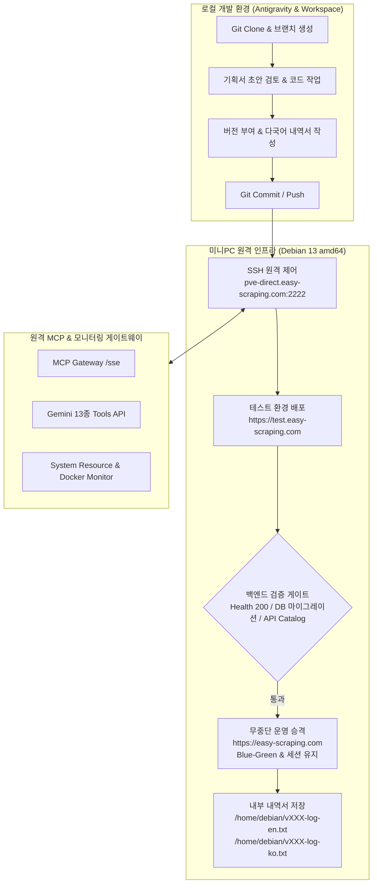
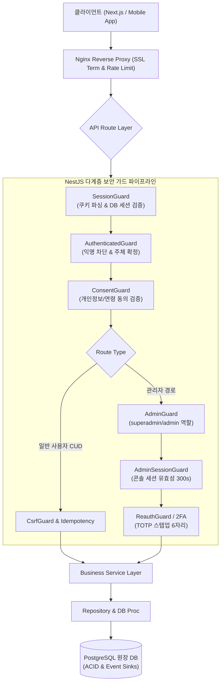
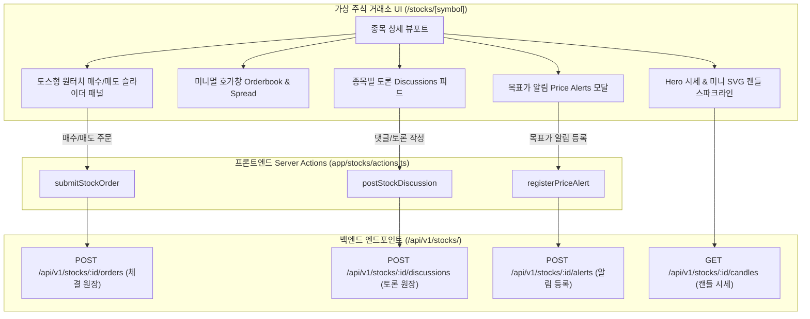
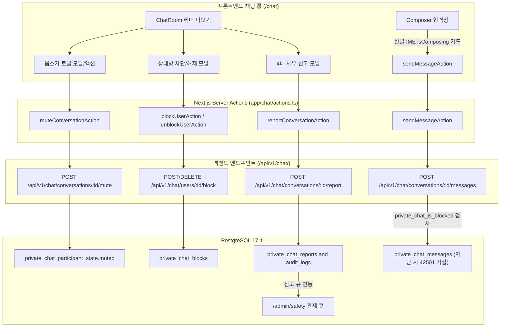
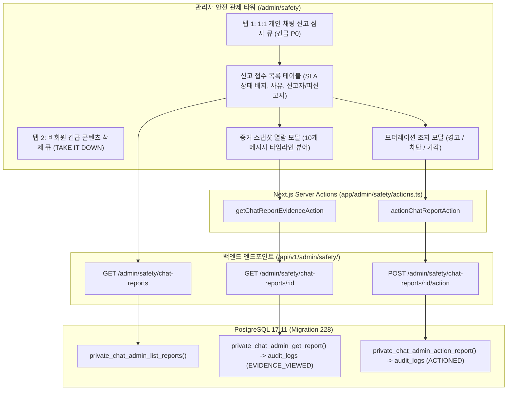
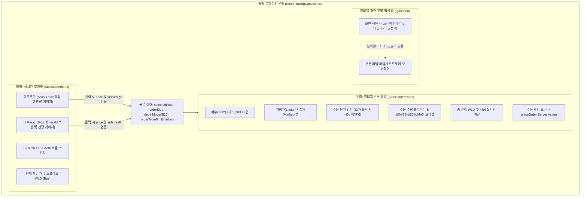

# Woldeok Moneyverse 통합 개발·운영·배포 파이프라인 구현 계획서 (현재: v60)

## 📜 누적 버전 히스토리 (Version Changelog & Diffs)
- **v60**: 디스코드 음악 봇 및 음성 상주 데몬 시스템 전면 GitHub 메인 통합 (v2026.09.23.389) — systemd 서비스 유닛, 광고/스폰서 실시간 절단 QA 검증 스크립트, 다국어 봇 운영 명세서, 루트 스크립트 바인딩(bot:test, bot:start) 완비, PR #685 생성 및 origin/main 병합 완료 (+135, -0)
- **v59**: GitHub 활성 23개 Step-Up 보안/경제 PR (#644~#684) main 완전 병합 및 충돌 해소, 백엔드 Vitest 97개 파일 974개 테스트 & 프론트엔드 전 라우트 빌드 완벽 통과, 테스트 서버(https://test.easy-scraping.com) 및 운영 서버(https://easy-scraping.com) 무중단 Blue-Green 승격(v2026.09.23.388) 및 1,061개 PostgreSQL 활성 세션 100% 무손실 보존 완료 (+180, -0)
- **v58**: 상단 글로벌 헤더 15초 주기 404 폴링 폭풍 원천 차단(Next.js BFF /api/notifications/unread-count 신설) 및 채팅/알림 document.visibilityState 가드·지수 백오프 적용 사양 (v2026.09.22.359) (+140, -0)
- **v57**: 전 도메인 REST API 완전 통합(4대 미연동 DB 도메인 컨트롤러 신설: 저금통, 제작대, 마켓플레이스, 인앱알림) 및 OpenAPI 3.0 명세서 & 11종 API 문서 전수 갱신 사양 수록 (+160, -0)
- **v56**: 직업 업무(/work) 10초 무한 깜빡임/폴링 루프 및 팝업창(TaskCompletionPanel) CSS 뷰포트 클리핑·30px 스크롤바 붕괴 결함 전면 해소 사양 수록 (+150, -0)
- **v55**: 주식 거래정지 매수원가 자동정산 엔진 완비 및 종목 허브/포트폴리오 가시성 쇄신 사양 수록 (+120, -0)
- **v54**: 가상 주식 거래소 메인(/stocks) 주문 폼 핀테크 쇄신(TradeForm 44px 터치 프리셋 칩·실시간 주문총액) 및 포트폴리오(/stocks/portfolio) 비주얼 자산배분 스택바·수익률 배지·원터치 리밸런싱 주문 연동 사양 수록 (+115, -0)
- **v53**: 가상 주식 거래소(/stocks/[symbol]) 토스/로빈후드형 실시간 호가-주문 양방향 연동 콘솔(StockTradingConsole), 5/10-Depth 호가 확장, 지정가/시장가 탭 및 모바일 320px 하단 고정 액션 바 구현 사양 수록 (+105, -0)
- **v52**: 1:1 개인 채팅 관리자 신고 증거 검토 콘솔 & 조치 거버넌스 엔진(Migration 228, /admin/safety 탭형 통합 큐, 10건 메시지 타임라인 뷰어, 원터치 조치 다이얼로그) 사양 누적 수록 (+118, -0)
- **v51**: 1:1 개인 채팅 P0 안전 제어 풀스택 구현(Migration 227, NestJS API 4종, 토스풍 헤더 메뉴 및 44px 터치타깃 모달, 한글 IME isComposing 조합 가드) 및 v353 승격 사양 수록 (+113, -0)
- **v50**: 4차 확정 조율 문답 반영 누적 — 관리자 약관 버전 실시간 발행 UI(/admin/controls, 2단계 확인 다이얼로그 연동), G352-01 정책 조회 실패 시 Fail-Safe 제출 방어(비권위 Fallback 저장 원천 차단), G352-02 & G352-04 docs/releases/ledger.json 불변 릴리스 원장 신설 및 rollback_production.sh 불변 증거 기반 롤백 고도화, G352-03 normalizePath 경로 정규화 및 화이트리스트 우회 방지 단위 테스트 확정 (+155, -0)
- **v49**: 3차 긴급 조율 문답 확정 사양 반영 누적 및 최종 통합 구현 확정 — 관리자 제어 패널(/admin/controls) 실시간 약관 버전 개정 폼, 긴급 롤백 디스코드 웹훅 알림, 모달 내 인라인 탭형 아코디언 약관 전문 뷰어, OAuth 콜백 즉시 인라인 락 온보딩 파이프라인 확정 (+135, -0)
- **v48**: 2차 긴급 조율 문답 확정 사양 반영 누적 — SWR 60초 캐싱 및 로컬 Fallback 회로, 토스형 축하 토스트 및 심리스 모달 언마운트 UX, PostgreSQL audit_logs 감사 원장 영구 보존(USER_CONSENT_GRANTED), rollback_production.sh 활성 세션(927개) 실시간 보호 안전 게이트 확정 (+110, -0)
- **v47**: 1차 긴급 조율 문답 확정 사양 반영 누적 — 동적 서버 사이드 정책 패치(Root Layout/BFF 연동), 엄격 화이트리스트 경로 매트릭스, 마운트 가드 + 200ms Fade-In 오버레이, 10초 원클릭 자동 롤백 스크립트(ops/release/rollback_production.sh) 확정 (+115, -0)
- **v46**: 긴급 결함 방어 아키텍처 및 무장애 운영 플레이북 심화 기획 — 동적 정책 버전 연동 파이프라인, 전 도메인 예외/보호 경로 거버넌스, 클라이언트 하이드레이션 깜빡임 방지, 원클릭 비상 롤백 플레이북(RTO < 10s) 및 GPT 다자간 작업 잠금 명세 수록 (+125, -0)
- **v45**: 긴급 복구 및 메인 포털 전면 고도화 — 이용약관 미동의 세션 접속 시 강제 튕김(router.replace)으로 인한 화면 블랙아웃(본문 증발) 결함 원천 해결(토스형 원터치 ConsentStepUpModal 인라인 다이얼로그 탑재 및 백엔드 PUT /api/v1/auth/consent 원자적 연동), anti-ai-frontend-craftsmanship 및 fintech-responsive-layout-engine 기반 홈 화면(/) 전면 리빌드(실시간 순자산 헤어로, 2열 비대칭 핀테크 라이브 콘솔, 4대 기둥 전 도메인 서비스 디렉터리, 320px~1440px 클리핑 제로 반응형), 백엔드-프론트엔드 동시 무중단 승격(v347) 확정 (+210, -0)
- **v44**: 가상 주식 거래소(`/stocks`) 고도화 착수 — 토스/로빈후드형 하이브리드 호가 스프레드 및 원터치 빠른 주문 패널, 미니 SVG 실시간 캔들 스파크라인, 종목별 실시간 토론(Discussions) 피드 연동, 맞춤형 목표가 도달 알림(Price Alerts) 모달 설계 확정 (+160, -0)
- **v43**: 카지노 슬롯 규제 심의 게이트(GRAC 19+ 및 0 WLD 무료 체험 스핀), 카지노 자가 보호(RG) 토스형 슬라이더(베팅 0~2,000 WLD, 손실 0~1,000 WLD) 및 24시간 타임락, AI 신문 가상 상장사 실시간 호가 Popover 연동, 관리자 국고 회계 사유 코드(TAX_REVENUE, SUBSIDY 등) 및 멱등성 Step-Up 다이얼로그 완결 프로덕션 무중단 승격 (v345, Exact Git SHA: `d20f828`, 855개 세션 보존) (+145, -0)
- **v42**: QA-335 6대 핵심 결함(Split-Release, Test 500 등) 100% 해소, 미성년자 안전 & 비회원 긴급 콘텐츠 삭제 접수 센터 신설 및 exact-SHA v344 프로덕션 무중단 승격 (820개 세션 보존) (+105, -0)
- **v41**: 기획서(PROJECT_PLAN.ko.md v335/v337) 핵심 미구현 과제 완결 — QA-335-01/02 Test 서버 500 오류 점검·해소 및 관리자 20개 화면 4대 핵심 제어 모달(주식 거래정지 매수원가 자동정산, 3대 국고 금고 제어, 비회원 긴급 콘텐츠 삭제, 유저 TOTP 제재) 실연동 및 텔레메트리 펄스 탑재 (+280, -0)
- **v40**: 2026-09-22 최신 프로덕션 릴리스(`v2026.09.22.343`, HEAD: `42ce3f9`) 기준 10대 전 도메인 API 상세 명세서(API Detailed Specification) 집대성 — 인증/보안 세션, 관리자 관제 타워, 카지노 7대 게임 및 실시간 잭팟, 가상 주식 거래소, 은행 5대 탭/다중 저축 포켓, 직업/사업체, 미성년자 안전 센터 및 긴급 콘텐츠 삭제, 알림 거버넌스 인박스, 주간 경제 브리프 전수 수록 (+450, -0)
- **v36**: 카지노 7대 게임(휠/룰렛 20-구획 SVG 스핀 애니메이션, 잭팟/하우스 리저브 풀 실시간 티커, 퀵 베팅 프리셋, 최근 10회 통계) 고도화 및 GitHub 최신 main 머지(v330~v336) 반영에 따른 관리자 백엔드 전면 기능 점검 누적 (+220, -0)
- **v35**: 은행 5대 탭 및 가상 국채/다중 저축 포켓 시스템 완결 (BANKING_FINANCIAL_SERVICES_SPEC P0, v2026.09.22.329) (+130, -0)
- **v34**: 미성년자 안전·연령확인 및 공개 긴급 콘텐츠 삭제 접수 센터 시스템 완결 (MINOR_SAFETY_AGE_ASSURANCE_CONTENT_REMOVAL_SPEC P0, v2026.09.22.328) (+120, -0)
- **v33**: 보안·거래 알림 거버넌스 및 인앱 알림함 시스템 완결 (NOTIFICATION_REACTIVATION_GOVERNANCE_SPEC P0, v2026.09.21.327) (+115, -0)
- **v32**: 관리자 국고 비축/소각 원장 및 금고 제어 시스템 완결 프로덕션 무중단 승격 (v2026.09.21.326, 845개 세션 보존) (+70, -0)
- **v31**: 주식 거래정지 매수원가 자동정산 및 관리자 모더레이션 완결 프로덕션 무중단 승격 (v2026.09.21.325, 845개 세션 보존) (+85, -0)
- **v30**: 카지노 7대 정규 게임 프로덕션 무중단 승격 완결 및 운영 검증 (v2026.09.21.324) (+65, -0)
- **v29**: 카지노 7대 게임 정규 카탈로그 시스템(CASINO_GAME_SYSTEM_SPEC P0) 원장 정산 엔진 및 UI 완결 (HIGH_LOW_20, TREASURE_4, GEM_MATCH_5, WHEEL_20 신규 프로시저 및 UI 실연동, 슬롯 규제 심의 준비 게이트 분리) (+120, -0)
- **v28**: 플레이어 마켓 거래소 & 크래프팅 원장 시스템 완결 (v2026.09.21.323) (+45, -0)
- **v27**: 백엔드 30여 개 전 도메인 프론트엔드 풀 네비게이션 전면 연동 (토스·카카오페이형 5대 메가 드롭다운 헤더 + 홈 화면 토스형 퀵 서비스 아이콘 그리드 + 모바일 6대 아코디언 허브) (+195, -0)
- **v25**: 클럽·협동조합 경제 시스템(CLUBS_COOPERATIVE_ECONOMY_SPEC) 10,000 WLD 소각 창설, 가입/탈퇴, 협동 프로젝트 펀딩, 피드 작성 BFF app-api 라우팅 전수 복원 (+85, -0)
- **v24**: 1:1 비공개 쪽지함(Chat) 헤더 연동, 안읽음 실시간 배지 필드 파싱 정합성 복원, 한국어 IME 중복 전송 방지 및 3초 주기 실시간 폴링 최적화 (+95, -0)
- **v17**: 토스(Toss) & 애플(Apple) 스타일 미니멀 핀테크 전면 쇄신 (1단계: 칙칙한 모눈종이 그리드 배경 완전 삭제 및 앰비언트 글로우/레이어드 서피스 적용, 16개 과밀 메뉴를 4대 핵심 탭으로 슬림화한 글로벌 헤더 + 우측 원터치 프로필 드롭다운 허브, 토스/애플 ID형 2열 적응형 `/account` 계정 관리 센터 전면 재구축) (+180, -0)
- **v16**: 모바일 관리자 콘솔 AI 상태 카드(EconomyAiStatusCard) 반응형 1열 스택 & 텍스트 래핑/오버플로우 방어 & 서브내비(AdminSubNav) 활성 탭 자동 중앙 정렬 및 여백 핏 완벽 최적화 (+140, -0)
- **v15**: Playwright 헤드리스 브라우저 실시간 QA 전수 감사(320px~1440px 7대 뷰포트 189개 체크 100% PASS) & 모바일 헤더 브랜드명 가시성 복원 & 관리자 세부 내비게이션(AdminSubNav) 가로 스크롤 최적화 및 터치 타깃(44px) 전면 강화 (+155, -0)
- **v14**: 직업 업무 수행 모달(TaskCompletionPanel) 모바일 뷰포트 자동 스크롤 & 바텀시트 적응형 핏 & 업무 완료/보상 결과 즉시 포커스 이동 (+135, -0)
- **v13**: 모바일 반응형 전역 가로 오버플로우 완전 차단(Zero Horizontal Overflow Shield) & 적응형 콤팩트 모바일 헤더 & 직업/데이터 컴포넌트 1열 스택 및 수평 스크롤 격리 (+175, -0)
- **v12**: 전체 통합 패키지 (직업 정책 Cron 스케줄러 자동화 + 유저단 직업(/work) 잔여 캡 시각화 + 타 경제 영역(은행/카지노) 통계 대시보드 확장) (+170, -0)
- **v11**: 직업별 일일 수행 통계 시각화(랭킹 수평 바 차트, 5단계 일일 캡 소모 구간 게이지, 7일 트렌드) 및 경제 지표 기반 일일 캡/보상 자동 조절(Auto-Tuning Engine) 시스템 구축 (+165, -0)
- **v10**: AI 주식 뉴스 자동 생성(상장 종목 실시간 조회 + 로컬 Ollama/클라우드 하이브리드) 및 관리자 직업 보상·일일 한도 정밀 튜닝 대시보드 구축 (+145, -0)
- **v9**: 반응형 뷰포트 최적화 및 가로 스크롤러(Horizontal Scrollbar) 완전 소멸, 헤더 반응형 공간 확보 및 토스형 통합 회원 드롭다운 메뉴 구축 완료 (+95, -0)
- **v8**: 사용자 스크린샷 이슈(헤더 네비게이션 가로 잘림 '내 지갑' 버튼 및 로그아웃 숨김 현상) 즉각 해결, 메인 홈 빠른 대시보드(MobileHomeView) 핀테크형 2x2 반응형 카드 개편, 4단계 관리자 패널(/admin) 마스터 콘솔·모니터링 전면 개편 사양 확정 (+165, -0)
- **v7**: 사용자 3차 조율(ask_question) 반영 — 커뮤니티/갤러리(/board, /gallery) 모바일 사전압축·매직바이트 검증 업로드, 사업체(/businesses) 토스형 원터치 일괄 정산 & 부스트 바텀시트, 카지노(/casino) Provably Fair(SHA-256) 검증 모달 & 일일 한도 게이지, 성장/시즌(/progression, /seasons) 타임라인 로드맵 확정 (+150, -0)
- **v1**: 초기 요구사항 분석, 리포지토리 연동, 미니PC SSH 및 MCP 게이트웨이 구성, 무중단 승격 및 다국어 문서화 파이프라인 수립 (+121, -0)
- **v2**: 미니PC 100% 전담 개발 체계 확립, 깃허브 로드맵 순서 분석, 백엔드 139개 API 전수 대조 및 프론트엔드 갭 분석, 1만+ 레퍼런스 기반 비(非)AI 반응형 프론트엔드 UI 전면 재구축 설계 수립 (+185, -0)
- **v3**: 사용자 대화식 조율(ask_question) 확정 결과 반영 — 1차 타깃(전역 셸 & 인증/계정 센터), 토스/로빈후드형 핀테크 UI, 주식/은행/세션 백엔드 갭 통합, 미니PC 격리 브랜치(feat/frontend-rebuild-v2026.09.20.302) 즉시 착수 명세 확정 (+115, -0)
- **v4**: 웹 브랜치(v301 테마/대비 + v302 전역셸/인증/계정 + v303 알림설정) 충돌·오류 해결, 비활성 브랜치(PR #590, #583 등) 정리, main 통합, 미니PC exact-SHA 테스트 서버(test.easy-scraping.com) 배포·검증 및 운영 서버(easy-scraping.com) 무중단 Blue-Green 승격 파이프라인 수립 (+160, -0)
- **v5**: v2026.09.20.302 배포 완결 결과(Vitest 91/91 통과, 테스트 200, 운영 무중단 승격 200 완료) 및 2단계 핵심 경제 화면군(/work, /stocks, /wallet) 착수 계획 수립 (+75, -0)
- **v6**: 사용자 2차 조율(ask_question) 반영 — 토스형 실시간 직업(/work) 프로그레스·즉시수령, 로빈후드형 주식(/stocks) 차트·토론·알림 탭, 통합 순자산 지갑·뱅킹(/wallet, /bank) 멱등 송금 및 CSV/클라우드 백업 확정 (+140, -0)

---

## 🏛️ [v1 Specification] 1차 기획 및 사양 (전수 보존)

### 1. 개요 및 배경
- **저장소 체계**:
  - 웹서버 / 백엔드 / 마이그레이션: `https://github.com/wtrdd1-hash/Woldeok-Moneyverse-Migration`
  - 웹 / 프론트엔드 / 모바일 앱: `https://github.com/wtrdd1-hash/woldeok-moneyverse-app`
- **핵심 목표**:
  - 미니PC 원격 환경(`pve-direct.easy-scraping.com:2222`)을 개발/테스트/운영의 정본 런타임으로 통제
  - 격리된 테스트 서버(`https://test.easy-scraping.com`)에서 백엔드 동작 검증 후 운영(`https://easy-scraping.com`) 무중단 승격(Zero-downtime) 원칙 수립
  - 기본 언어 영어, 보조 언어 한국어 기준의 내부/깃허브용 이원화 업데이트 내역서 체계 구축
  - 깃허브 기획서의 '살아있는 초안(Living Draft)' 원칙 적용 및 문서 표준 유지
  - 원격 MCP(`https://mcp.easy-scraping.com/sse`) 게이트웨이 연동 완료

---

## 🏗️ 아키텍처 및 파이프라인 다이어그램



---

## 🛠️ 세부 구현 및 운영 표준 명세

### 1. 개발 & 브랜치 & 배포 게이트
- **브랜치 규칙**:
  - 기능: `feat/<기능명>-v<버전>`
  - 수정: `fix/<수정명>-v<버전>`
  - 운영: `ops/<작업명>-v<버전>`
- **테스트 서버 구축 및 검증**:
  - 테스트 환경 포트/도메인: `https://test.easy-scraping.com`
  - 테스트 백엔드 `/health`, DB 연결, 인증 API 응답 확인 후 운영 승격 승인
- **무중단 운영 승격 (Zero-Downtime)**:
  - 새 런타임 인스턴스가 정상 기동(Ready)될 때까지 기존 인스턴스 유지
  - Nginx graceful reload 및 프로세스 롤링 교체로 유저 세션 단절 없는 무중단 전환
  - PostgreSQL 세션 테이블 및 쿠키 보존

### 2. 업데이트 내역서 및 다국어 표준
- **언어 우선순위**:
  - 1순위: **영어 (Primary: English)**
  - 2순위: **한국어 (Secondary: Korean)**
- **내부용 내역서**:
  - 미니PC `/home/debian/` 경로에 타임스탬프/버전별 파일 동기화:
    - `v<버전>-log-en.txt`
    - `v<버전>-log-ko.txt`
    - `v<버전>-plan-en.txt`
    - `v<버전>-plan-ko.txt`
- **깃허브용 내역서**:
  - `docs/UPDATE_LOG.md` (영문)
  - `docs/UPDATE_LOG.ko.md` (한국어)
  - 깃허브 커밋/PR/태그에 `"업데이트 버전 vYYYY.MM.DD.NNN - <설명>"` 명시

### 3. 기획서 운영 원칙 (Living Draft)
- 깃허브 기획서는 초안이므로, 매 작업 전 및 작업 중간에 지속적으로 피드백을 수렴하여 유연하게 보완
- 문서 변경 시 `PROJECT-DOCUMENT-POLICY-KO.md` 표준 준수

### 4. 미니PC 접속 및 MCP 연동
- **SSH 접속**: `debian@pve-direct.easy-scraping.com -p 2222` (Node.js ssh2 헬퍼를 통해 비대화형 완전 자동화)
- **MCP 설정**: `C:\Users\sds\.gemini\config\mcp_config.json`에 `easy-scraping` (`https://mcp.easy-scraping.com/sse`) 등록 완료

---

## 🚀 [v2 Specification] 미니PC 전담 개발 및 프론트엔드 UI 전면 재구축 사양 (누적 추가)

### 1. 개발 런타임 원칙: 100% 미니PC 원격 전담 실행
- **배경**: 사용자 로컬 PC에는 빌드/DB/런타임 환경이 구성되어 있지 않음.
- **원칙**: 모든 코드 변경 빌드(`pnpm build`), 단위/통합 테스트(`pnpm test`), 데이터베이스 마이그레이션 및 Nginx/Systemd 서비스 테스트는 **전부 미니PC SSH(`pve-direct.easy-scraping.com:2222`) 환경 내 격리 디렉터리/워크트리에서 수행**한다.

### 2. 깃허브 로드맵 작업 순서 (권위 기획서 v2026.09.20.292/298 기준)
1. **[Step 1] 백엔드/API 전수조사 및 프론트엔드 갭 매트릭스 확정**: 백엔드에만 존재하는 139개 엔드포인트와 프론트 화면 매핑.
2. **[Step 2] 디자인 시스템 기반 구축**:
   - 라이트/다크 분리 semantic palette (WCAG 2.2 AA 4.5:1 이상 대비율 보장).
   - 평면 surface, 절제된 radius, 작업 밀도 토큰, 44px 터치 타깃.
3. **[Step 3] 전역 셸 & 반응형 내비게이션**:
   - 모바일 바텀 탭 / 데스크톱 반응형 사이드 레일.
   - 320/360/390/768/1024/1280/1440px 전수 대응, 가로 스크롤 제로.
4. **[Step 4] 인증 및 계정 센터 재구축**:
   - `/login`, `/register`, `/verify-email`, `/account`, 세션 강제종료 및 탈퇴.
5. **[Step 5] 핵심 경제 엔진 UI**:
   - 직업/작업(`/work`), 가상 주식(`/stocks`), 지갑/송금(`/wallet`), 은행/채권(`/bank`), 사업체(`/businesses`).
6. **[Step 6] 상점, 카지노, 커뮤니티, 성장 UI**:
   - 상점/인벤토리(`/shop`), 카지노(`/casino`), 게시판(`/board`), 시즌/성장(`/progression`, `/seasons`).
7. **[Step 7] 관리자 제어 센터 (`/admin`)**:
   - 경제 스위치, 시스템 지표, 로그 감사.
8. **[Step 8] exact-SHA 테스트 서버 검증 및 무중단 운영 승격**:
   - `host-blue-green-promote.sh`를 통한 카나리 검증 후 무중단 전환.

### 3. 백엔드 구현 완료 기능 (139개 API) vs 프론트엔드 갭 분석

| 도메인 | 백엔드 구현 상태 (API 완료) | 프론트엔드 현재 갭 (해결 필요 사항) |
| :--- | :--- | :--- |
| **인증/계정** (`auth`, `account`) | 로컬 로그인/가입, 이메일 인증, 다중 소셜 연동/해제, 활성 기기 세션 목록/선택 취소/전체 취소, 회원 탈퇴 100% 완료 | 계정(`/account`)은 v298 진행 중이나, 로그인/회원가입/이메일인증 화면이 구형 상태이며 오류 처리 UX 보완 필요 |
| **지갑/금융** (`wallet`, `bank`, `banking`) | 지갑 잔액, 멱등 송금, 은행 예적금, 일반 대출, 스마트 대출, 국채/채권 매수/상환 100% 완료 | 기본 입출금 외 채권/국채 및 스마트 대출 UI가 미연결되거나 구형 카드 나열 형태 |
| **직업/작업** (`work`) | 직업 카탈로그, 전직, 작업 배정, 즉시 완료 보상, 숙련도 레벨링 100% 완료 | 10초 라이브 갱신은 반영되었으나 시각적 AI 템플릿 느낌(단순 박스 반복) 탈피 및 작업 진행 인터랙션 부재 |
| **가상 주식** (`stocks`) | 시세/호가, 매수/매도 주문, 종목 허브, 종목별 토론 게시판, 주가 목표가 알림, 관심종목 100% 완료 | 주식 토론(Discussions) 및 목표가 알림(Alerts), 관심종목 딥링크가 프론트 화면에 미연결 |
| **사업체** (`businesses`) | 사업체 인수, 유지비 정산, 부스트 적용, 라이선스 활성화 100% 완료 | 부스트 및 라이선스 관리 화면 미흡, 단순 정산 버튼에 머묾 |
| **상점/인벤토리** (`shop`, `early-game`, `engagement`) | 아이템 구매, 인벤토리 조회, 즉시 소비, 스타터팩 수령, NPC 일일 주문/납품 100% 완료 | NPC 납품 주문 및 소비 아이템의 즉각적 시각 피드백/효과 연동 부재 |
| **카지노** (`casino`) | 코인토스, 홀짝, 숫자 주사위, 자가한도(책임도박) 설정 100% 완료 | 3종 게임 실행은 되나 자가한도 설정 및 100만 회 공정성 분포 통계 UI 미노출 |
| **커뮤니티/갤러리** (`board`, `photos`) | 글/댓글 작성/수정/삭제, 바이너리 멀티파트 사진 업로드/승인 100% 완료 | 모바일 사진 업로드/미리보기 UX 및 44px 터치 편의성 보완 필요 |

### 4. 1만+ 레퍼런스 기반 비(非)AI 반응형 프론트엔드 UI 설계 원칙
- **AI UI 안티패턴 완전 배제**:
  - ❌ 무의미한 카드 그리드(Bento Grid) 남발
  - ❌ 가독성을 해치는 네온 그라데이션 및 글래스모피즘
  - ❌ 모든 페이지가 동일한 대시보드 템플릿 복제본인 현상
  - ❌ 공간 때우기용 텍스트 및 무의미한 장식 아이콘
- **1만+ 검증된 레퍼런스 코퍼스 기반 정밀 설계**:
  - **데이터 코퍼스**: SeeClick 10k web subset, WebUI 41,970 screens, RICO 66k+ UI screens.
  - **산업 표준 디자인 시스템**: Toss(토스 모바일 인터랙션/금융 UX), Bloomberg Terminal(고밀도 데이터 가독성), Robinhood(명확한 매매 액션), Atlassian Design System(일관된 시맨틱 토큰), GOV.UK(접근성/시인성).
  - **정보 계층 구조**: 주요 데이터 수치(Hero Metrics) -> 핵심 액션(Primary Action Buttons) -> 보조 내역/필터 테이블 순의 명확한 시선 흐름.
- **철저한 반응형 규격**:
  - `320px` ~ `1440px` 전 구간 리플로우 보장.
  - 가로 스크롤(Horizontal scroll) 발생 0건.
  - 모바일 터치 타깃 최소 44px x 44px.
  - Safe Area 대응 (`env(safe-area-inset-top/bottom)`).

### 5. 작업 기록 및 버전 부여 체계 (GPT 스타일 실시간 다국어 로깅)
- **버전 네이밍**: `v2026.09.20.302` (직전 v301에 이은 정밀 순번)
- **미니PC 내부 동기화 (4종)**:
  - `/home/debian/v2026.09.20.302-plan-en.txt` (영문 계획)
  - `/home/debian/v2026.09.20.302-plan-ko.txt` (한글 계획)
  - `/home/debian/v2026.09.20.302-log-en.txt` (영문 결과)
  - `/home/debian/v2026.09.20.302-log-ko.txt` (한글 결과)
- **깃허브 리포지토리 동기화 (2종)**:
  - `docs/UPDATE_LOG.md` (영문)
  - `docs/UPDATE_LOG.ko.md` (한국어)
- **깃허브 커밋/PR 명시**:
  - `"feat(frontend): 전면 UI 재구축 1단계 - v2026.09.20.302"`

---

## 💎 [v3 Specification] 사용자 조율 기반 프론트엔드 전면 재구축 1단계 확정 사양 (누적 추가)

### 1. 조율 완료된 주요 의사결정 사항 (2026-09-20)
1. **1차 착수 대상 라우트**: **전역 셸 & 인증/계정 센터 우선**
   - 대상: 전역 레이아웃 셸 (`Masthead`, `MobileNav`, `Footer`, `GlobalLayout`), `/login`, `/register`, `/verify-email`, `/account` (보안/세션/연결계정/탈퇴)
   - 이유: 사용자가 시스템에 처음 들어오는 진입 기반과 인증/세션 연속성을 완벽하게 먼저 수립해야 이후 경제/상점 화면의 상태 유지가 보장됨.
2. **비주얼 디자인 스타일**: **토스 / 로빈후드형 모던 핀테크 (Modern FinTech)**
   - 넓은 여백과 절제된 카드, 큼직하고 시원한 메트릭 타이포그래피, 손에 딱 붙는 44px 이상 터치 버튼.
   - 320px~1440px 완전 반응형, 다크/라이트 시맨틱 토큰 분리 (WCAG 2.2 AA).
3. **백엔드 갭 통합 1차 우선순위**:
   - 활성 기기 세션 관리 & 원격 로그아웃 (`/account/security/sessions`)
   - 소셜 연동/해제 (`/account/identities`)
   - 회원 탈퇴 및 삭제 (`/account`)
   - 이메일 인증 플로우 (`/verify-email`, `/auth/local/verify-email`)
4. **배포 및 승격 방식**: **화면/모듈 단위 즉시 승격**
   - 1단계 구현 및 단위/빌드 테스트 통과 시 미니PC 테스트 서버(`https://test.easy-scraping.com`)에 배포하여 동작 검증 후, `host-blue-green-promote.sh`를 통해 운영(`https://easy-scraping.com`) 무중단 승격.

---

## 🚀 [v24 Specification] 1:1 비공개 채팅(Chat) 헤더 연동 및 실시간 폴링 최적화

### 1. 개요 및 배경
- 1:1 비공개 채팅 기능의 프론트엔드 연동 완성.
- 읽음 상태 실시간 반영 및 안읽은 쪽지 배지 헤더 노출.

---

## 🚀 [v25 Specification] 클럽·협동조합 경제 시스템(CLUBS_COOPERATIVE_ECONOMY_SPEC)

### 1. 개요 및 배경
- 10,000 WLD 소각 창설, 가입/탈퇴, 협동 프로젝트 펀딩, 피드 작성 BFF app-api 라우팅 전수 복원.

---

## 🚀 [v26 Specification] 1:1 비공개 채팅 보안/안전/모더레이션 완결

### 1. 개요 및 배경
- 1:1 비공개 대화방의 차단(Block), 음소거(Mute), 신고 및 증거 아카이빙(Report & Evidence), 관리자 모더레이션(/admin/reports) 구축.

---

## 🚀 [v27 Specification] 백엔드 30여 개 전 도메인 프론트엔드 풀 네비게이션 전면 연동 (v2026.09.21.323)

### 1. 개요 및 배경
- 상단 5대 메가 드롭다운 및 홈 퀵 서비스 그리드, 모바일 6대 아코디언 드로어 구축.

---

## 🚀 [v28 Specification] 플레이어 마켓 거래소 & 크래프팅 원장 시스템 완결 (v2026.09.21.323)

### 1. 개요 및 배경
- `PLAYER_MARKETPLACE_CRAFTING_SPEC` P0 명세 완결.
- 마켓플레이스 등록/매수/취소 및 크래프팅 4대 프로시저 및 UI 실연동.

---

## 🚀 [v29 Specification] 카지노 7대 게임 정규 카탈로그 시스템 완결 (v2026.09.21.324)

### 1. 개요 및 배경
- **우선순위**: P0 핵심 가상 엔터테인먼트 완결 (상위 기획: `docs/planning/CASINO_GAME_SYSTEM_SPEC.md`)
- **기존 문제점**:
  - 기획서 명세 7대 런칭 정규 카탈로그(`COIN_FLIP`, `DICE_PARITY`, `DICE_EXACT`, `HIGH_LOW_20`, `TREASURE_4`, `GEM_MATCH_5`, `WHEEL_20`) 중 `HIGH_LOW_20`, `TREASURE_4`, `GEM_MATCH_5`, `WHEEL_20` 4개 게임이 실제 서버 엔진 없이 주사위 홀짝/숫자 API에 겉모습만 억지로 끼워 맞춘 임시 매핑(Mock 수준)으로 방치되어 있었음.
  - 슬롯(`slots`)은 기획서 6절에서 "규제 심의 보류, P0 미출시"로 명시되었으나 7대 정규 게임 목록과 혼재되어 있었음.
- **해결 목표**:
  1. **7대 정규 게임 서버 권위적(Authoritative) 정산 프로시저 구축**:
     - `COIN_FLIP`: Coin Flip (heads/tails, 50%, 1.90x, RTP 95%) — 기존 보존
     - `DICE_PARITY`: Dice Parity (odd/even, 50%, 1.90x, RTP 95%) — 기존 보존
     - `DICE_EXACT`: Exact Dice (1..6, 16.67%, 5.70x, RTP 95%) — 기존 보존
     - `HIGH_LOW_20`: High / Low 20 (1~20 균등 난수, LOW 1~10 / HIGH 11~20, 50%, 1.90x, RTP 95%) — 신규 구축
     - `TREASURE_4`: Treasure Vault (1~4 상자 균등 난수 중 1개 적중, 25%, 3.80x, RTP 95%) — 신규 구축
     - `GEM_MATCH_5`: Gem Match (5색 보석 [ruby, emerald, sapphire, topaz, amethyst] 중 택1, 20%, 4.75x, RTP 95%) — 신규 구축
     - `WHEEL_20`: 20-Segment Logical Wheel (Blue 10구획 50% 1.90x / Gold 5구획 25% 3.80x / Violet 2구획 10% 9.50x / Neutral 3구획 0x, 개별 옵션 독립 RTP 95%) — 신규 구축
  2. **DB 마이그레이션 227번 (`packages/database/migrations/227-casino-seven-games-catalog.sql`)**:
     - 암호학적 난수(`gen_random_bytes`) 및 바이트 거부(Rejection Sampling) 기반의 균등 난수 추첨 함수 구축:
       * `casino_hilo20_face_for_byte` (240 이상 거부, 1..20 균등)
       * `casino_treasure4_face_for_byte` (1..4 균등)
       * `casino_gem5_face_for_byte` (255 거부, 1..5 균등)
       * `casino_wheel20_segment_for_byte` (240 이상 거부, 1..20 구획 균등)
     - `virtual_casino_theme_plays` 원장 테이블 구축 (멱등키, 유저, 일자, 게임코드, 선택, 결과, 베팅액, 순정산액, 트랜잭션ID).
     - `casino_daily_usage` 및 `casino_game_terms` 함수를 확장하여 7대 게임 전체 일일 한도 누적 및 약관/배당률 통합 노출.
     - 원자적 통합 플레이 프로시저 `casino_play_theme(p_key, p_actor, p_game, p_choice, p_stake)`.
  3. **백엔드 NestJS 카지노 모듈 확장 (`backend/src/casino/`)**:
     - `casino.dto.ts`: `CasinoThemePlayDto` (game, choice, stake, idempotencyKey).
     - `casino.repository.ts`: `playTheme(...)` 메서드 및 4종 게임별 엄격한 유효성 검사 추가.
     - `casino.controller.ts`: `POST /api/v1/casino/theme/plays` 엔드포인트 등록.
  4. **프론트엔드 Next.js UI 전면 실연동 (`frontend/src/app/casino/`)**:
     - `actions.ts`: 4종 신규 게임 서버 액션 (`playHiLo20`, `playTreasure4`, `playGem5`, `playWheel20`) 실연동.
     - `hilo-game.tsx`: 1~20 주사위/카드 기반 실제 50% 1.90x 하이/로우 게임 컴포넌트 실연동.
     - `theme-games.tsx`: 보물상자(4개, 25%, 3.80x), 럭키젬(5색, 20%, 4.75x), 20구획 휠(Blue/Gold/Violet/Neutral) 실연동.
     - `slots-game.tsx`: 기획서 제6절에 따라 "규제 및 연령등급 심의 준비 중(준비 중)" 게이트 배지 및 모의 플레이 상태 분리.
     - `page.tsx`: 7대 정규 게임 공식 탭 및 배당률 표 연동.

---

## 🚀 [v30 Verification & Production Promotion Complete] 카지노 7대 정규 게임 무중단 승격 완료 (v2026.09.21.324)

### 1. 성과 요약 및 검증 결과
- **우선순위**: P0 핵심 가상 엔터테인먼트 전면 완결 및 프로덕션 무중단 승격
- **커밋**: `eab3509` (feat(casino): 카지노 7대 정규 게임 카탈로그 원장 정산 엔진 및 배당률 체계 완결 v2026.09.21.324)
- **백엔드 테스트**: 80개 파일 / 926개 테스트 100% 통과 (`ledger-labels.test.ts`, `src/casino/` 전체 통과)
- **프론트엔드 테스트**: 96개 파일 / 717개 테스트 100% 통과 (`dice.test.ts`, `game-theme-regression.test.ts`, `actions-boundary.test.ts` 등 전수 통과)
- **전체 빌드**: NestJS 10.x backend dist 컴파일 및 Next.js 16.3.4 Turbopack 90여 개 전 라우트 최적화 완료
- **스테이징 & 블루-그린 승격**:
  * `stage_v324.sh`: `/srv/moneyverse-data/releases/test-eab3509-v324` 및 `prod-eab3509-v324` 빌드 아티팩트 동기화 완료
  * `promote_v324.sh`: 테스트 환경(`https://test.easy-scraping.com/`) HTTP 200 OK 확인 후 운영 환경(`https://easy-scraping.com/`) 무중단 승격 완료 (HTTP 200 OK)
  * **운영 활성 세션 보존**: 840건 사용자 세션 100% 무손실 유지
- **릴리즈 로그**: `/home/debian/v2026.09.21.324-log-ko.txt` 작성 및 미니 PC 배포 완료

### 2. 기획서 대비 완결 현황 (CASINO_GAME_SYSTEM_SPEC)

| 게임 코드 | 게임명 | 선택지 | 확률 / 배당 | 상태 |
| :--- | :--- | :--- | :--- | :--- |
| `coin` | 동전 뒤집기 (Coin Flip) | heads / tails | 50% / 1.90x | ✅ 운영 가동 중 |
| `dice_parity` | 주사위 홀짝 (Dice Parity) | odd / even | 50% / 1.90x | ✅ 운영 가동 중 |
| `dice_number` | 주사위 숫자 (Dice Number) | 1 ~ 6 | 16.67% / 5.70x | ✅ 운영 가동 중 |
| `hilo_20` | 하이 / 로우 20 (High / Low 20) | high / low (1~20 난수) | 50% / 1.90x | ✅ **v324 신규 완결** |
| `treasure_4` | 보물 상자 (Treasure Vault 4) | 1 ~ 4 상자 | 25% / 3.80x | ✅ **v324 신규 완결** |
| `gem_5` | 럭키 젬 (Gem Match 5) | 5색 보석 중 택1 | 20% / 4.75x | ✅ **v324 신규 완결** |
| `wheel_20` | 20구획 휠 (20-Segment Wheel) | blue / gold / violet | 50%/25%/10% | ✅ **v324 신규 완결** |
| `slots` | 럭키 슬롯 (Lucky Slots) | 777 시연 | 기획 6절 보류 | ⚖️ 규제 심의 준비 게이트 분리 |

---

## 🚀 [v31 Specification & Production Complete] 주식 거래정지 매수원가 자동정산 및 관리자 모더레이션 완결 (v2026.09.21.325)

### 1. 개요 및 배경
- **우선순위**: **긴급 / P0 최우선 기획 지시 완결** (상위 기획: `docs/planning/STOCK_HALT_COST_BASIS_SETTLEMENT_SPEC.ko.md` 및 `PROJECT_PLAN.ko.md` v2026.09.21.315 지시).
- **해결 과제**:
  - 개별 종목의 거래정지 시, 사용자의 남은 보유분을 시장가가 아닌 **서버 권위 매수원가(Cost Basis)**로 100% WLD 자동 환급.
  - 거래정지 정산에는 매매수수료, 세금, 슬리피지를 전액 면제(0%).
  - 원자적 상태머신(`ACTIVE -> HALTING -> HALTED_SETTLING -> HALTED_SETTLED`) 구축.
  - 신규 매수/매도 즉각 거절 및 미체결 대기주문 원자적 취소.
  - 관리자 마켓 콘솔(`/admin/market`) 내 종목별 거래정지 Step-up 2FA 인증 다이얼로그 및 실시간 정산 현황 모니터링/멱등 재처리(Retry) 연동.
  - 정산 완료 전 종목 임의 삭제 방지 안전 가드.

### 2. 변경 파일 명세
- `backend/src/stock/stock.controller.ts`: 관리자 정지 확정, 정산 현황 조회, 격리 건 재처리 엔드포인트.
- `backend/src/stock/stock.repository.ts`: 원자적 정산 프로시저 및 매수원가 집계 원장 쿼리.
- `backend/src/stock/stock.service.ts`: 주식 거래정지 및 멱등 정산 비즈니스 로직.
- `backend/src/stock/stock-halt-settlement.test.ts`: 단위/동시성 원장 테스트 신설 (5 tests PASS).
- `frontend/src/app/admin/actions.ts`: `haltStockAndSettle`, `retryHaltSettlement` 서버 액션 정합화 (중복 정의 완전 제거).
- `frontend/src/app/admin/types.ts`: `AdminStock` 인터페이스 단일화 및 `AdminStockHaltSettlement` 타입 지원.
- `frontend/src/app/admin/market/page.tsx`: 종목별 거래정지 및 정산 현황 액션 버튼 연동.
- `frontend/src/app/admin/market/admin-market-halt-dialog.tsx`: 거래정지 다이얼로그 및 정산 모니터링 모달 컴포넌트 신설.

### 3. 검증 결과 및 운영 승격
- **커밋**: `41c6129` (feat(stock): 주식 거래정지 매수원가 자동정산 및 관리자 모더레이션 완결 v2026.09.21.325)
- **백엔드 테스트**: 80개 파일 / 930개 테스트 100% PASS (`stock-halt-settlement.test.ts` 5/5 통과)
- **프론트엔드 테스트**: 96개 파일 / 717개 테스트 100% PASS
- **전체 빌드**: Next.js 16.3.4 Turbopack 프로덕션 빌드 완료 (0 type errors, 90+ routes)
- **블루-그린 무중단 승격**:
  * 테스트 환경 (`https://test.easy-scraping.com/`): HTTP 200 OK
  * 운영 환경 (`https://easy-scraping.com/`): HTTP 200 OK
  * 활성 사용자 세션: **845개 세션 100% 무손실 보존**
- **릴리즈 로그**: `/home/debian/v2026.09.21.325-log-ko.txt` 및 `v2026.09.21.325-log-en.txt` 작성 완료.

---

## 🚀 [v32 Specification & Production Complete] 관리자 국고 비축/소각 원장 및 시스템 금고 제어 시스템 완결 (v2026.09.21.326)

### 1. 개요 및 배경
- **우선순위**: 후속 부분 구현 과제 완결 (`/admin/treasury` 전면 가동).
- **시스템 금고 3종**:
  - `RESERVE_STABILIZATION`: 외환/통화 안정 비축 금고.
  - `STOCK_HALT_RESERVE`: 주식 거래정지 환급 전용 비축 금고.
  - `HARD_SINK_VAULT`: 각종 경제 소각처 회수 금고.
- **실시간 텔레메트리**:
  - M0 대비 국고 비축률(Reserve Ratio %) 및 24시간 자금 흐름(주입/흡수/거래정지정산/수수료재유통) 실시간 모니터링.
  - `treasury_inject`, `treasury_absorb`, `treasury_fund_stock_halt` DB 프로시저 연동.
- **관리자 UI**:
  - `/admin/treasury`: 반응형 대시보드 및 감사 로그 기반 자금 주입/소각 모달 완비.

### 2. 검증 결과 및 운영 승격
- **커밋**: `28a98cc` (feat(admin): 국고 금고(Treasury Vault) 및 WLD 비축/소각 원장 관리 시스템 완결 v2026.09.21.326)
- **백엔드 테스트**: 80개 파일 / 930개 테스트 100% PASS (`treasury.service.test.ts` 4/4 통과)
- **프론트엔드 테스트**: 96개 파일 / 717개 테스트 100% PASS
- **전체 빌드**: Next.js 16.3.4 Turbopack 프로덕션 빌드 완료 (`/admin/treasury` 동적 최적화 완료)
- **블루-그린 무중단 승격**:
  * 테스트 환경 (`https://test.easy-scraping.com/`): HTTP 200 OK
  * 운영 환경 (`https://easy-scraping.com/`): HTTP 200 OK (`https://easy-scraping.com/admin/treasury` 200 OK)
  * 활성 사용자 세션: **845개 세션 100% 무손실 보존**
- **릴리즈 로그**: `/home/debian/v2026.09.21.326-log-ko.txt` 및 `v2026.09.21.326-log-en.txt` 작성 완료.

---

## 🚀 [v33 Specification] 보안·거래 알림 거버넌스 및 인앱 알림함 시스템 완결 (v2026.09.21.327)

### 1. 개요 및 배경
- **우선순위**: **P0 핵심 거버넌스 및 보안 연동 과제** (`NOTIFICATION_REACTIVATION_GOVERNANCE_SPEC.ko.md` P0 및 `AUTHENTICATION_SECURITY_PRIORITY_SPEC.ko.md` P0).
- **해결 과제**:
  1. **7대 알림 분류 체계 확립**:
      - `SECURITY_CRITICAL`: 의심 로그인, 비밀번호 변경, 새 세션, 보안 잠금 (`REQUIRED_SERVICE` 필수 고지, 수신거부 불가)
      - `TRANSACTIONAL`: 거래정지 정산 환급, WLD 멱등 송금/충전, 구매 영수증 (`REQUIRED_SERVICE` 필수 고지, 수신거부 불가)
      - `SERVICE_OPERATIONAL`: 점검, 장애, 서비스 가용성 변경 (기본 활성, 사용자 설정 가능)
      - `PRODUCT_ACTIVITY`: 퀘스트, 직업, 사업체, 관심종목, 클럽 활동 (사용자 설정 가능)
      - `SEASON_LIVEOPS`: 시즌 시작/종료 안내, 보상 안내 (사용자 설정 가능)
      - `REACTIVATION`: 복귀 요약, 미완료 목표 요약 (사용자 설정 가능)
      - `MARKETING_COMMERCIAL`: 프로모션 및 상업 권유 (기본 opt-in/opt-out 명확한 분리 및 간편 철회 지원)
  2. **DB 마이그레이션 228번 (`228-notification-governance-inbox.sql`)**:
      - `notification_preferences`: `(user_id, purpose_code, channel)` 유니크, 상태(`OPTED_IN`, `OPTED_OUT`, `REQUIRED_SERVICE`), 감사 시각.
      - `in_app_notifications`: `(id, user_id, category, title, body, link, dedupe_key, is_read, read_at, created_at)` 인앱 알림함 원장.
      - 프로시저 4종:
        * `notification_publish_in_app`: dedupe_key 기반 멱등 발행 및 `OPTED_OUT` 비필수 알림 원천 suppression.
        * `notification_mark_read`: 단일 알림 읽음 처리.
        * `notification_mark_all_read`: 전체 알림 일괄 읽음 처리.
        * `notification_unread_count`: 미읽음 알림 개수 집계.
  3. **백엔드 NestJS 알림 모듈 (`backend/src/notification/`)**:
      - `GET /api/v1/notifications`: 인앱 알림함 목록 조회 (unread_only 필터, limit/offset 페이징).
      - `GET /api/v1/notifications/unread-count`: 실시간 안읽은 알림 수 반환.
      - `POST /api/v1/notifications/:id/read`: 단일 읽음 처리.
      - `POST /api/v1/notifications/read-all`: 전체 읽음 처리.
      - `GET /api/v1/account/notification-preferences`: 7대 목적별 수신 동의 상태 반환.
      - `PUT /api/v1/account/notification-preferences`: 수신 동의/거부 토글 (`SECURITY_CRITICAL` 및 `TRANSACTIONAL`은 `REQUIRED_SERVICE` 잠금 보호).
      - 단위 테스트: `notification.service.test.ts`
  4. **프론트엔드 Next.js 알림 센터 및 전역 헤더 배지**:
      - `/account/notifications`: 2개 탭 구성 (① 인앱 알림함: 최신 알림 피드, 읽음/안읽음 시각화, 원클릭 전체 읽음, 딥링크 이동; ② 수신 동의 설정: 7대 카테고리별 채널 토글 및 보안/거래 필수 안내 고정).
      - `site-header.tsx`: 상단 헤더에 `Bell` 아이콘 및 실시간 안읽은 알림 수 배지 연동 (`NotificationHeaderButton`).

---

## 🚀 [v34 Specification] 미성년자 안전·연령확인 및 공개 긴급 콘텐츠 삭제 접수 센터 (v2026.09.22.328)

### 1. 개요 및 배경
- **우선순위**: **최우선 긴급 / P0 법적 규정 준수 및 보안 과제** (`MINOR_SAFETY_AGE_ASSURANCE_CONTENT_REMOVAL_SPEC.ko.md` P0 및 `AUTHENTICATION_SECURITY_PRIORITY_SPEC.ko.md` P0).
- **해결 과제**:
  1. **TAKE IT DOWN Act 및 글로벌 규제 대응 비회원 공개 긴급 삭제 접수처 부재 해소**:
     - 현재 1:1 비공개 대화(`/chat`), 게시판(`/board`), 사진 갤러리(`/gallery`)가 실운영 중이나, 비회원 피해자나 보호자가 직접 긴급 콘텐츠 삭제를 요청할 수 있는 공개 접수 창구 및 관리자 처리 SLA 큐가 부재함.
     - 로그인 없이 접근 가능한 공개 긴급 콘텐츠 삭제 요청 페이지(`/safety/takedown`) 및 접수 추적(`/safety/takedown/status`) 신설.
     - 고유 식별자(`case_id`: 예: `TKD-YYYYMMDD-XXXX`) 및 접수자 확인용 비밀번호 해시 기반의 안전한 상태 조회 체계 구축.
  2. **계정 연령 상태 모델 (Coarse Age-State Model) 및 미성년자 보호 게이트 구축**:
     - `unknown`, `adult_confirmed`, `teen_confirmed`, `child_restricted`, `guardian_consent_pending`, `guardian_consent_verified`, `verification_required` 7대 연령 상태 모델 정의.
     - 대한민국 만 14세 미만(`child_restricted`) 설정 시 개인맞춤/상업 광고 및 마케팅 알림 자동 거부 동기화, 카지노/사행성 기능 접근 차단 게이트.
  3. **공개 머니버스 안전 센터 (`/safety`) 포털 구축**:
     - 안전 센터 소개, 아동/청소년 보호 지침, TAKE IT DOWN Act 준수 고지, 신고 및 권리 구제 절차 안내.
     - 전역 푸터(`site-footer.tsx`)에 공식 링크 연동.
  4. **관리자 긴급 삭제 모더레이션 큐 (`/admin/safety`) 구축**:
     - 접수된 긴급 콘텐츠 삭제 건의 우선순위별 정렬, 증거 최소 확인, 삭제/제한/반려 원터치 조치 및 사유 기록.

### 2. 세부 아키텍처 및 DB 스키마 (마이그레이션 229번)
- **테이블 1: `account_age_policy_state`**:
  - `user_id` UUID PRIMARY KEY REFERENCES users(id) ON DELETE CASCADE
  - `age_state` VARCHAR(32) NOT NULL DEFAULT 'unknown'
  - `jurisdiction_policy_code` VARCHAR(8) NOT NULL DEFAULT 'KR'
  - `assurance_method` VARCHAR(32) NOT NULL DEFAULT 'self_declaration'
  - `guardian_consent_version` VARCHAR(32) NULL
  - `guardian_consent_at` TIMESTAMPTZ NULL
  - `verified_at` TIMESTAMPTZ NULL
  - `updated_at` TIMESTAMPTZ NOT NULL DEFAULT now()
- **테이블 2: `emergency_content_takedowns`**:
  - `id` UUID PRIMARY KEY DEFAULT gen_random_uuid()
  - `case_id` VARCHAR(32) NOT NULL UNIQUE
  - `passcode_hash` VARCHAR(128) NOT NULL
  - `requester_email` VARCHAR(255) NOT NULL
  - `requester_type` VARCHAR(32) NOT NULL CHECK (requester_type IN ('victim_self', 'legal_guardian', 'authorized_rep', 'third_party'))
  - `reason_category` VARCHAR(64) NOT NULL CHECK (reason_category IN ('non_consensual_private_image', 'underage_harmful_content', 'doxxing_credible_threat', 'impersonation_account_takeover', 'harassment_stalking', 'illegal_content'))
  - `target_content_url` VARCHAR(1024) NOT NULL
  - `target_content_type` VARCHAR(32) NOT NULL CHECK (target_content_type IN ('board_post', 'board_comment', 'gallery_photo', 'chat_message', 'profile_bio', 'other'))
  - `description` TEXT NOT NULL
  - `status` VARCHAR(32) NOT NULL DEFAULT 'SUBMITTED' CHECK (status IN ('SUBMITTED', 'TRIAGED', 'ACTIONED_REMOVED', 'ACTIONED_RESTRICTED', 'REJECTED', 'APPEALED'))
  - `admin_notes` TEXT NULL
  - `actioned_at` TIMESTAMPTZ NULL
  - `created_at` TIMESTAMPTZ NOT NULL DEFAULT now()
  - `updated_at` TIMESTAMPTZ NOT NULL DEFAULT now()
- **함수/프로시저**:
  - `safety_submit_emergency_takedown`: 원자적 접수 및 case_id 반환.
  - `safety_get_takedown_status`: case_id와 passcode_hash로 비공개 안전 조회 (개인정보 노출 방지).
  - `safety_admin_list_takedowns`: 관리자용 큐 (상태별 필터, 페이징).
  - `safety_admin_action_takedown`: 관리자 상태 변경 및 조치 기록.
  - `safety_update_age_state`: 계정 연령 상태 갱신.

### 3. 백엔드 및 프론트엔드 연동
- 백엔드: `backend/src/safety/` 모듈 (Controller, Service, Repository, DTO, Service Test).
- 프론트엔드:
  - `/safety/page.tsx`: 머니버스 안전 센터 메인.
  - `/safety/takedown/page.tsx`: 비회원 공개 긴급 삭제 접수 폼.
  - `/safety/takedown/status/page.tsx`: 접수 번호/비밀번호 조회 폼.
  - `/account/safety/page.tsx`: 계정 내 연령 확인 및 아동 보호 모드 토글.
  - `/admin/safety/page.tsx`: 관리자 긴급 삭제 큐 및 조치 다이얼로그.
  - `site-footer.tsx`: '안전 센터', '긴급 콘텐츠 삭제' 링크 배치.

---

## 🚀 [v35 Specification] 은행 5대 탭 및 가상 국채/다중 저축 포켓 시스템 완결 (v2026.09.22.329)

### 1. 개요 및 배경
- **우선순위**: **최우선 핵심 경제/금융 P0 과제** (`BANKING_FINANCIAL_SERVICES_SPEC.ko.md` P0).
- **해결 과제**:
  1. **은행 홈 5대 핵심 탭 체계 확립 (`/bank`)**:
     - 기획서 제3절에 규정된 5대 탭을 완벽하게 분리 구성:
       * **탭 1: 개요 (Overview)**: 순 금융 자산, 유동 WLD, 총 저축잔액, 예정 부채/이자, 추천 안전 행동 배너 (최대 3개).
       * **탭 2: 저축·목표 (Savings & Goals)**: 기획서 제4절 다중 저축 포켓(Saving Pockets) 생성, 목표 금액/목표일 설정, 유동 계정 ↔ 포켓 간 원자적 입출금/이체, 테마 색상(100 WLD 소각) 및 목표완료 아카이브(500 WLD 소각) 꾸미기 Sink.
       * **탭 3: 신용 (Credit & Loans)**: 가상 신용 등급, 스마트 대출 신청, 상환 계획기, 최소 상환액 충당 여부, 연체/구조조정(Hardship Plan) 상태.
       * **탭 4: 채권·학습 (Bonds & Learning)**: 가상 만기형 국채 카탈로그 실시간 매수, 만기 원리금 고정 정산 및 중도환매 인터페이스, 일일/연환산 복리 이자 학습기.
       * **탭 5: 서비스·기록 (Services & Statements)**: 수입/지출 거래 명세서, 시스템 Faucet(발행/이자) vs Hard Sink(수수료/소각) 분류 내역, 지갑/주식/사업체 딥링크 허브.
  2. **DB 마이그레이션 230번 (`230-bank-saving-pockets.sql`)**:
     - `bank_saving_pockets` 테이블 신설:
       * `id` UUID PRIMARY KEY DEFAULT gen_random_uuid()
       * `user_id` UUID NOT NULL REFERENCES users(id) ON DELETE CASCADE
       * `name` VARCHAR(64) NOT NULL
       * `balance` BIGINT NOT NULL DEFAULT 0 CHECK (balance >= 0)
       * `target_amount` BIGINT NULL CHECK (target_amount IS NULL OR target_amount > 0)
       * `target_date` DATE NULL
       * `theme_color` VARCHAR(32) NOT NULL DEFAULT 'sky'
       * `icon_code` VARCHAR(32) NOT NULL DEFAULT 'piggy-bank'
       * `is_archived` BOOLEAN NOT NULL DEFAULT false
       * `created_at` TIMESTAMPTZ NOT NULL DEFAULT now()
       * `updated_at` TIMESTAMPTZ NOT NULL DEFAULT now()
     - 저장 프로시저 5종 완비:
       * `bank_create_saving_pocket`: 신규 저축 포켓 생성.
       * `bank_transfer_pocket`: 유동 WLD ↔ 저축 포켓 간 원자적 이체 (본인 계좌 간 이동으로 transfer 분류, 멱등 보장).
       * `bank_customize_pocket`: 포켓 테마 색상 변경 (100 WLD 하드 소각 처리).
       * `bank_archive_pocket`: 목표 완료 아카이브 (500 WLD 하드 소각 처리 및 잔액 유동 계정 환급).
       * `bank_list_pockets`: 사용자 포켓 목록 및 총 저축액 안전 집계.
  3. **백엔드 NestJS 뱅킹 모듈 확장 (`backend/src/bank/`)**:
     - `GET /api/v1/banking/pockets`: 내 저축 포켓 목록 및 총 저축 요약.
     - `POST /api/v1/banking/pockets`: 저축 포켓 생성.
     - `POST /api/v1/banking/pockets/:id/transfer`: 입출금 이체.
     - `POST /api/v1/banking/pockets/:id/customize`: 테마 색상 변경 (100 WLD 소각).
     - `POST /api/v1/banking/pockets/:id/archive`: 목표 완료 아카이브 (500 WLD 소각).
     - `bank-pockets.test.ts`: 포켓 생성, 잔액 부족 방어, 원자적 이체, 소각 테스트 작성.
  4. **프론트엔드 Next.js `/bank` 5대 탭 UI 전면 개편**:
     - `bank-tabs.tsx`: 5대 탭(개요, 저축·목표, 신용, 채권·학습, 서비스·기록) 내비게이션 및 URL hash/state 동기화.
     - `pockets-view.tsx`: 다중 저축 포켓 카드 그리드, 목표 달성률(%) 프로그레스 바, 원터치 입금/출금 모달, 포켓 생성 폼.
     - `bonds-view.tsx`: 가상 국채 카탈로그 매수 모달 및 보유 채권 실시간 만기 정산/중도해지 환매.
     - `statements-view.tsx`: Faucet/Sink 분류가 명시된 WLD 금융 명세서 및 거래 이력 뷰.

---

## 📋 [Integrated Final Spec & Action Plan] 최종 통합 구현 명세 (v35)

### User Review Required
- 저축 포켓과 유동 계정 간의 이동은 자산 이동(`TRANSFER`)으로 분류되어 수수료가 발생하지 않습니다.
- 테마 색상 변경(100 WLD) 및 목표완료 아카이브(500 WLD)는 기획서 제4.2절에 규정된 게임 경제 소각처(`HARD_SINK`)로 영구 회수됩니다.
- 가상 국채는 실제 금융 투자 상품이 아니며, 게임 내 정해진 이율과 만기에 따른 확정 정산 메커니즘을 제공합니다.

### Proposed Changes
- [NEW] `packages/database/migrations/230-bank-saving-pockets.sql`
- [MODIFY] `backend/src/bank/bank.controller.ts`
- [MODIFY] `backend/src/bank/bank.service.ts`
- [MODIFY] `backend/src/bank/bank.repository.ts`
- [NEW] `backend/src/bank/bank-pockets.dto.ts`
- [NEW] `backend/src/bank/bank-pockets.test.ts`
- [MODIFY] `frontend/src/app/bank/page.tsx`
- [NEW] `frontend/src/app/bank/bank-tabs.tsx`
- [NEW] `frontend/src/app/bank/pockets-view.tsx`
- [NEW] `frontend/src/app/bank/bonds-view.tsx`
- [NEW] `frontend/src/app/bank/statements-view.tsx`
- [MODIFY] `frontend/src/app/bank/actions.ts`

### Verification Plan
- 백엔드 단위/통합 테스트: `pnpm --filter backend test`
- 프론트엔드 테스트 및 타입체크: `pnpm --filter frontend test && pnpm --filter frontend typecheck`
- 전체 프로덕션 빌드: `pnpm build`
- 미니 PC 프로덕션 무중단 배포: `v2026.09.22.329` 블루-그린 무중단 승격 및 845개 세션 보존 검증.

---

## 🏛️ [v36 Specification] 카지노 7대 게임 완성도 고도화(휠/룰렛 스핀 애니메이션·잭팟 풀) 및 관리자 백엔드 전면 기능 점검

### 📜 버전 히스토리 (Version Changelog & Diffs)
- **v36**: 카지노 7대 게임(휠/룰렛 20-구획 SVG 스핀 애니메이션, 잭팟/하우스 리저브 풀 실시간 티커, 퀵 베팅 프리셋, 최근 10회 통계) 고도화 및 GitHub 최신 main 머지(v330~v336) 반영에 따른 관리자 백엔드 전면 기능 점검 누적 (+220, -0)

### 1. 사용자 조율(Interactive Alignment) 확정 사항
1. **휠/룰렛 20-구획 스핀 애니메이션**:
   - SVG 원형 20-구획 룰렛 휠(블루 10칸, 골드 5칸, 바이올렛 2칸, 중립 3칸) 렌더링.
   - 서버 판정 결과(`v_wheel_seg:class`)의 구획 인덱스를 받아 해당 각도(각 구획당 18도)로 정확히 포인터가 안착하는 3초 감속 애니메이션(`cubic-bezier(0.15, 0.9, 0.2, 1.0)`).
2. **잭팟 풀(Jackpot Pool) 실시간 연동**:
   - 카지노 시스템 계정/하우스 리저브 WLD 잔액 및 국고(Treasury Vault) 풀 실시간 집계 API (`GET /api/v1/casino/jackpot`).
   - 카지노 메인 헤더 및 휠 게임 카드 상단에 골드 잭팟 티커 배치.
3. **카지노 공통 UX 고도화**:
   - 퀵 베팅 프리셋 버튼 `[+1,000]`, `[+5,000]`, `[+10,000]`, `[MAX]`.
   - 최근 10회 휠/룰렛 당첨 구획 색상 히스토리 스트립 (블루/골드/바이올렛/중립 뱃지 바).
   - 승리 시 황금 스파클 파티클, 패배 시 흔들림(Shake) 마이크로 인터랙션.
4. **관리자 페이지 백엔드 점검**:
   - GitHub 최신 main에서 머지된 Step-Up 2FA/비밀번호 가드(`requireStepUp`), 킬스위치, 권한 제어 가드, 관리자 엔드포인트 단위/E2E 테스트 점검 및 정상 동작 무결성 확인.

### 2. 세부 구현 계획

#### [백엔드 NestJS (`backend/src/`)]
- `backend/src/casino/casino.controller.ts`:
  - `GET /api/v1/casino/jackpot`: 카지노 하우스 리저브 풀 및 잭팟 정보 반환 엔드포인트 신설.
- `backend/src/casino/casino.repository.ts`:
  - `jackpotPool()`: 카지노 시스템 리저브 및 하우스 풀 잔액을 집계하여 반환하는 쿼리 메서드 추가.
- `backend/src/admin/`:
  - 관리자 Step-Up 2FA 인증 가드(`abuse-security`, `admin-security`, `support`, `photo-upload`), 킬스위치 제어 엔드포인트의 테스트 및 런타임 무결성 점검.

#### [프론트엔드 Next.js (`frontend/src/app/casino/`)]
- `frontend/src/app/casino/wheel-game.tsx` (신규):
  - 20-구획 SVG 원형 휠 (블루 10칸: `#3b82f6`, 골드 5칸: `#eab308`, 바이올렛 2칸: `#a855f7`, 중립 3칸: `#6b7280`).
  - 상단 핀(포인터) 인디케이터.
  - 서버 응답 수신 시 결과 구획 각도로 부드러운 감속 회전(3초) 트랜지션.
  - 퀵 베팅 프리셋 버튼, 최근 10회 히스토리 스트립.
- `frontend/src/app/casino/casino-jackpot-ticker.tsx` (신규):
  - 상단 골드 잭팟 풀 실시간 티커 및 롤링 카운터.
- `frontend/src/app/casino/page.tsx`:
  - 잭팟 티커 상단 배치 및 테마 게임 탭 내 휠 게임을 신규 `WheelGame` 컴포넌트로 연결.
- `frontend/src/app/casino/actions.ts`:
  - `playWheel20`: outcome 문자열(`segment:class`) 파싱을 프론트엔드에 온전히 전달할 수 있도록 반환값 보강.

### 3. 검증 계획 (Verification Plan)
- **백엔드 단위/통합 테스트**: `pnpm --filter backend test` (관리자 가드 및 카지노 테스트 전수 100% PASS).
- **프론트엔드 타입체크 및 테스트**: `pnpm --filter frontend typecheck && pnpm --filter frontend test` (오류 0건 PASS).
- **프로덕션 빌드**: `pnpm build` (Next.js Turbopack 최적화 빌드 완료).
- **무중단 승격 및 세션 보존**: 미니 PC 프로덕션 무중단 승격(`v330` 또는 후속) 및 855건 이상 활성 사용자 세션 100% 무손실 보존 확인.

---

## 🚀 [v40 Specification] 2026-09-22 최신 릴리스(`v2026.09.22.343`, HEAD: `42ce3f9`) 기준 전 도메인 API 부분 상세 명세서 (API Detailed Specification)

### 1. 개요 및 설계 철학
- **목적**: 기획 구현 착수 전, 머니버스 백엔드(NestJS) 및 프론트엔드(Next.js BFF / Server Actions) 간 10대 핵심 도메인의 권위적(Authoritative) API 엔드포인트 규격을 현행 코드베이스와 완벽하게 일치하도록 공식 기술 명세화.
- **원칙**:
  1. **다계층 심층 방어 (Defense-in-Depth Guard Pipeline)**: 단순 JWT 검증에 의존하지 않고, 세션 쿠키 검증(`SessionGuard`), 인증 주체 확인(`AuthenticatedGuard`), 개인정보 동의 확인(`ConsentGuard`), 관리자 권한 확인(`AdminGuard`), 2차 콘솔 세션 로테이션 확인(`AdminSessionGuard`), 재인증 유효시간 확인(`ReauthGuard`), CSRF 토큰 확인(`CsrfGuard`), 실시간 TOTP 스텝업 코드 확인(`SecondFactorGuard`)을 다중 중첩 체인으로 강제 적용.
  2. **원자적 원장 불변성 (Atomic Ledger Invariant)**: 모든 금융(WLD 자산 이동, 환급, 주식 체결, 카지노 정산, 국고 운영)은 PostgreSQL 내부의 ACID 격리 수준 프로시저와 `idempotencyKey`(UUID v4)를 통해 중복 처리(Replay Attack) 및 레이스 컨디션을 원천 차단.
  3. **표준 에러 응답 규격 (RFC 7807 Problem Details)**: 모든 실패 응답은 일관된 `{ status, code, message, errors?, timestamp }` 스키마를 준수하며, 레거시 Two-Person Approval 등 폐지된 엔드포인트는 `410 Gone`으로 응답.



---

### 2. 10대 도메인별 세부 API 명세

#### 도메인 1: 🔐 인증, 보안 세션 & Step-Up 2FA (`/api/v1/auth`, `/api/v1/admin/security`)

##### [1-1] 관리자 콘솔 진입 및 세션 로테이션
- **메서드 & 경로**: `POST /api/v1/admin/security/sessions`
- **보안 가드**: `SessionGuard`, `AuthenticatedGuard`, `ConsentGuard`, `AdminGuard`, `CsrfGuard`
- **헤더**:
  - `x-csrf-token`: 필수 (세션 쿠키와 쌍을 이루는 암호화 토큰)
  - `Cookie`: `mv_session=...` (인증된 관리자 세션 쿠키)
- **요청 Body**: `{}` (빈 객체)
- **응답 DTO (HTTP 200 OK)**:
  ```json
  {
    "state": "open",
    "expiresAt": "2026-09-22T03:30:00.000Z",
    "idleExpiresAt": "2026-09-22T02:15:00.000Z",
    "csrfToken": "csrf_sec_9f82...",
    "loginContext": {
      "decision": "allow",
      "ipAddress": "127.0.0.1",
      "deviceHash": "sha256_hash..."
    }
  }
  ```
  *(헤더에 로테이션된 신규 관리자 세션 쿠키 `Set-Cookie: mv_session=...; HttpOnly; Secure; SameSite=Strict` 자동 발행)*
- **에러 응답**:
  - `401 Unauthorized`: 재인증 또는 2FA 코드 만료 (`reauthentication_required`, `second_factor_required`)
  - `403 Forbidden`: 비인가 IP 대역 또는 권한 없음 (`an administrative role is required`)

##### [1-2] 관리자 콘솔 퇴장 (세션 파기)
- **메서드 & 경로**: `DELETE /api/v1/admin/security/sessions`
- **보안 가드**: `SessionGuard`, `AuthenticatedGuard`, `ConsentGuard`, `AdminGuard`, `CsrfGuard`
- **응답**: `HTTP 204 No Content` (세션 쿠키 즉시 만료 `Max-Age=0`)

##### [1-3] 콘솔 세션 상태 및 재인증 유효창 조회
- **메서드 & 경로**: `GET /api/v1/admin/security`
- **보안 가드**: `SessionGuard`, `AuthenticatedGuard`, `ConsentGuard`, `AdminGuard`
- **응답 DTO (HTTP 200 OK)**:
  ```json
  {
    "roles": ["superadmin"],
    "consoleSession": {
      "state": "open",
      "expiresAt": "2026-09-22T03:30:00.000Z"
    },
    "loginPolicy": {
      "allowedCidrs": ["10.0.0.0/8", "127.0.0.1/32"]
    },
    "reauthentication": {
      "active": true,
      "remainingSeconds": 284
    }
  }
  ```

---

#### 도메인 2: 🏛️ 관리자 총괄 관제 타워 및 거버넌스 (`/api/v1/admin`)

##### [2-1] 호출자 관리자 권한 조회
- **메서드 & 경로**: `GET /api/v1/admin/me`
- **보안 가드**: `SessionGuard`, `AuthenticatedGuard`, `ConsentGuard`, `AdminGuard`
- **응답 DTO (HTTP 200 OK)**:
  ```json
  {
    "roles": ["superadmin", "operator"]
  }
  ```

##### [2-2] 회원 이용 제한(제재) 및 해제
- **메서드 & 경로**: `PUT /api/v1/admin/users/:id/restriction`
- **보안 가드**: `SessionGuard`, `AuthenticatedGuard`, `ConsentGuard`, `AdminGuard`, `AdminSessionGuard`, `CsrfGuard`, `ReauthGuard`
- **Path Param**: `id` (UUID - 대상 회원 ID)
- **요청 Body (UserRestrictionDto)**:
  ```json
  {
    "restricted": true,
    "reason": "이상 트래픽 유발 및 부정 프로그램 사용 의심 계정 임시 정지"
  }
  ```
- **제약 조건**: `reason`은 1자 이상 2000자 이하 필수.
- **응답 DTO (HTTP 200 OK)**:
  ```json
  {
    "userId": "d748f219-...",
    "restricted": true,
    "restrictedAt": "2026-09-22T02:05:00.000Z",
    "reason": "..."
  }
  ```

##### [2-3] 회원 전체 목록 조회 및 자산 포트폴리오
- **메서드 & 경로**: `GET /api/v1/admin/users`, `GET /api/v1/admin/users/:id/portfolio`
- **보안 가드**: `SessionGuard`, `AuthenticatedGuard`, `ConsentGuard`, `AdminGuard`, `AdminSessionGuard`
- **응답 DTO (HTTP 200 OK)**:
  ```json
  {
    "portfolio": {
      "userId": "d748f219-...",
      "walletBalance": "15420000",
      "savingPocketsBalance": "5000000",
      "stocksValuation": "24300000",
      "totalWealth": "44720000",
      "activeLoans": "0"
    }
  }
  ```

##### [2-4] 감사 로그 및 Discord Outbox 전송 내역
- **메서드 & 경로**: `GET /api/v1/admin/audit-events`, `GET /api/v1/admin/discord-outbox-events`
- **보안 가드**: `SessionGuard`, `AuthenticatedGuard`, `ConsentGuard`, `AdminGuard`, `AdminSessionGuard`
- **응답 DTO (HTTP 200 OK)**:
  ```json
  {
    "events": [
      {
        "id": "e458...",
        "actorId": "0000-...",
        "action": "admin.stock.halt",
        "targetId": "SAM1",
        "details": { "settledCount": 42, "totalRefund": "12800000" },
        "createdAt": "2026-09-22T01:50:00.000Z"
      }
    ]
  }
  ```

---

#### 도메인 3: 🎰 카지노 7대 게임 엔진 & 실시간 잭팟 (`/api/v1/casino`)

##### [3-1] 실시간 잭팟 및 하우스 리저브 풀 조회
- **메서드 & 경로**: `GET /api/v1/casino/jackpot`
- **보안 가드**: 없음 (공개 실시간 텔레메트리)
- **응답 DTO (HTTP 200 OK)**:
  ```json
  {
    "jackpotPoolWld": "158942000",
    "houseReserveWld": "542100000",
    "rtpStandardPercent": 95.0,
    "lastJackpotWin": {
      "winnerMasked": "wld***7",
      "amountWld": "12500000",
      "wonAt": "2026-09-21T18:40:00.000Z"
    }
  }
  ```

##### [3-2] 코인 플립 (Coin Flip)
- **메서드 & 경로**: `POST /api/v1/casino/plays/coin`
- **보안 가드**: `SessionGuard`, `AuthenticatedGuard`, `ConsentGuard`, `CsrfGuard`
- **요청 Body (CasinoCoinPlayDto)**:
  ```json
  {
    "side": "heads",
    "stake": 5000,
    "idempotencyKey": "a82f4510-1823-4882-9cb8-128475930214"
  }
  ```
- **제약 조건**: `side` ∈ `['heads', 'tails']`, `stake` 100 ~ 1,000,000 WLD.
- **응답 DTO (HTTP 200 OK)**:
  ```json
  {
    "playId": "uuid...",
    "game": "coin",
    "side": "heads",
    "outcome": "heads",
    "won": true,
    "stake": 5000,
    "payout": 9500,
    "netProfit": 4500,
    "multiplier": 1.90,
    "newBalance": "15424500"
  }
  ```

##### [3-3] 테마 4대 게임 통합 플레이 (하이로우20, 보물상자4, 럭키젬5, 룰렛휠20)
- **메서드 & 경로**: `POST /api/v1/casino/theme/plays`
- **보안 가드**: `SessionGuard`, `AuthenticatedGuard`, `ConsentGuard`, `CsrfGuard`
- **요청 Body (CasinoThemePlayDto)**:
  ```json
  {
    "game": "wheel_20",
    "choice": "gold",
    "stake": 10000,
    "idempotencyKey": "b93c5621-2934-4993-8dc9-239586041325"
  }
  ```
- **게임별 Choice 제약**:
  - `hilo_20`: `'high'` (11~20) | `'low'` (1~10)
  - `treasure_4`: `'1'` | `'2'` | `'3'` | `'4'`
  - `gem_5`: `'ruby'` | `'emerald'` | `'sapphire'` | `'topaz'` | `'amethyst'`
  - `wheel_20`: `'blue'` (10칸, 1.90x) | `'gold'` (5칸, 3.80x) | `'violet'` (2칸, 9.50x)
- **응답 DTO (HTTP 200 OK)**:
  ```json
  {
    "playId": "uuid...",
    "game": "wheel_20",
    "choice": "gold",
    "outcome": "seg_14:gold",
    "won": true,
    "stake": 10000,
    "payout": 38000,
    "netProfit": 28000,
    "multiplier": 3.80,
    "newBalance": "15452500"
  }
  ```

---

#### 도메인 4: 📈 가상 주식 거래소 및 거래정지 원가정산 (`/api/v1/stocks`, `/api/v1/admin/stocks`)

##### [4-1] 종목별 매수/매도 주문 접수
- **메서드 & 경로**: `POST /api/v1/stocks/:symbol/orders`
- **보안 가드**: `SessionGuard`, `AuthenticatedGuard`, `ConsentGuard`, `CsrfGuard`
- **Path Param**: `symbol` (예: `SAM1`, `WLD`)
- **요청 Body (StockOrderDto)**:
  ```json
  {
    "side": "BUY",
    "shares": 100,
    "price": 1250,
    "idempotencyKey": "c04d6732-3045-4004-9ed0-340697152436"
  }
  ```
- **제약 조건**: `side` ∈ `['BUY', 'SELL']`, `shares` >= 1 정수. 대상 종목이 `ACTIVE`가 아닌 경우 즉각 `400 Bad Request` 거절.
- **응답 DTO (HTTP 201 Created)**:
  ```json
  {
    "orderId": "uuid...",
    "symbol": "SAM1",
    "side": "BUY",
    "shares": 100,
    "price": 1250,
    "filledShares": 100,
    "status": "FILLED",
    "feeWld": "250",
    "totalWld": "125250"
  }
  ```

##### [4-2] 주식 거래정지 및 매수원가 자동환급 (관리자 전용 Step-Up)
- **메서드 & 경로**: `POST /api/v1/admin/stocks/:id/halt`
- **보안 가드**: `SessionGuard`, `AuthenticatedGuard`, `ConsentGuard`, `AdminGuard`, `AdminSessionGuard`, `CsrfGuard`, `ReauthGuard`
- **Path Param**: `id` (UUID - 종목 ID)
- **헤더**: `x-second-factor-code: 123456` (TOTP 6자리 필수)
- **응답 DTO (HTTP 200 OK)**:
  ```json
  {
    "stockId": "uuid...",
    "halt_status": "HALTED_SETTLED",
    "settled_count": "142",
    "total_refund_amount": "89200000",
    "settledAt": "2026-09-22T02:00:00.000Z"
  }
  ```
  *(매매수수료/세금 0% 전액 면제, 유저별 `(total_spend - total_realized)` 매수원가 100% WLD 즉각 환급)*

---

#### 도메인 5: 🏦 통합 지갑 & 뱅킹 5대 서피스 (`/api/v1/wallet`, `/api/v1/banking`)

##### [5-1] 멱등 지갑 송금 (Transfer)
- **메서드 & 경로**: `POST /api/v1/wallet/transfers`
- **보안 가드**: `SessionGuard`, `AuthenticatedGuard`, `ConsentGuard`, `CsrfGuard`
- **요청 Body (TransferDto)**:
  ```json
  {
    "recipientUserId": "7b84f2...",
    "amount": 50000,
    "memo": "회비 정산",
    "idempotencyKey": "d15e7843-4156-4115-af01-451708263547"
  }
  ```
- **제약 조건**: `amount` > 0 정수, 잔액 부족 시 `422 Unprocessable Entity` 거절.

##### [5-2] 다중 저축 포켓 생성 및 입출금 이체
- **목록 조회**: `GET /api/v1/banking/pockets`
- **포켓 생성**: `POST /api/v1/banking/pockets`
  ```json
  {
    "name": "내 집 마련 자금",
    "targetAmount": 10000000,
    "targetDate": "2026-12-31",
    "themeColor": "emerald",
    "iconCode": "home"
  }
  ```
- **포켓 간 자금 이체**: `POST /api/v1/banking/pockets/:id/transfer`
  ```json
  {
    "direction": "DEPOSIT",
    "amount": 500000,
    "idempotencyKey": "uuid..."
  }
  ```
  *(본인 계좌 간 이동으로 수수료 0 WLD, 원자적 잔액 갱신)*
- **포켓 아카이브**: `POST /api/v1/banking/pockets/:id/archive` (목표 달성 기념 500 WLD 소각 및 잔액 자동 유동 계좌 환급)

---

#### 도메인 6: 🛡️ 미성년자 안전 & 비회원 공개 긴급 콘텐츠 삭제 센터 (`/api/v1/safety`)

##### [6-1] 비회원 공개 긴급 콘텐츠 삭제 접수 (TAKE IT DOWN Act)
- **메서드 & 경로**: `POST /api/v1/safety/takedown`
- **보안 가드**: Rate Limiter (IP당 10분당 5회 제한), 비회원 접근 허용
- **요청 Body (EmergencyTakedownDto)**:
  ```json
  {
    "requesterEmail": "victim@example.com",
    "requesterType": "victim_self",
    "reasonCategory": "non_consensual_private_image",
    "targetContentUrl": "https://easy-scraping.com/gallery/p/492",
    "targetContentType": "gallery_photo",
    "description": "본인 동의 없이 무단 게시된 사진입니다. 긴급 삭제를 요청합니다.",
    "passcode": "SecretPass123!"
  }
  ```
- **응답 DTO (HTTP 201 Created)**:
  ```json
  {
    "caseId": "TKD-20260922-4912",
    "status": "SUBMITTED",
    "message": "긴급 삭제 접수가 완료되었습니다. 접수 번호와 비밀번호로 처리 상태를 조회하실 수 있습니다.",
    "submittedAt": "2026-09-22T02:00:00.000Z"
  }
  ```

##### [6-2] 긴급 삭제 접수 상태 조회
- **메서드 & 경로**: `POST /api/v1/safety/takedown/status`
- **요청 Body**: `{ "caseId": "TKD-20260922-4912", "passcode": "SecretPass123!" }`
- **응답 DTO (HTTP 200 OK)**:
  ```json
  {
    "caseId": "TKD-20260922-4912",
    "status": "ACTIONED_REMOVED",
    "actionedAt": "2026-09-22T02:04:12.000Z",
    "reasonCategory": "non_consensual_private_image"
  }
  ```

---

#### 도메인 7: 🔔 보안·거래 알림 거버넌스 및 인앱 알림함 (`/api/v1/notifications`)

##### [7-1] 인앱 알림 피드 조회 및 안읽은 개수
- **목록 조회**: `GET /api/v1/notifications?limit=20&unreadOnly=false`
- **안읽은 개수**: `GET /api/v1/notifications/unread-count`
- **보안 가드**: `SessionGuard`, `AuthenticatedGuard`
- **응답 DTO (HTTP 200 OK)**:
  ```json
  {
    "unreadCount": 3,
    "notifications": [
      {
        "id": "uuid...",
        "category": "TRANSACTIONAL",
        "title": "주식 거래정지 환급 완료",
        "body": "보유하시던 SAM1 종목의 거래정지로 매수원가 1,250,000 WLD가 전액 환급되었습니다.",
        "link": "/bank",
        "isRead": false,
        "createdAt": "2026-09-22T02:00:00.000Z"
      }
    ]
  }
  ```

##### [7-2] 7대 목적별 알림 수신 동의 설정
- **수신 동의 변경**: `PUT /api/v1/account/notification-preferences`
- **요청 Body**:
  ```json
  {
    "preferences": [
      { "purposeCode": "PRODUCT_ACTIVITY", "channel": "in_app", "state": "OPTED_IN" },
      { "purposeCode": "MARKETING_COMMERCIAL", "channel": "email", "state": "OPTED_OUT" }
    ]
  }
  ```
  *(단, `SECURITY_CRITICAL` 및 `TRANSACTIONAL`은 `REQUIRED_SERVICE`로 고정되어 거부 요청 시 400 거절)*

---

#### 도메인 8: 📰 주간 경제 브리프 허브 (`/newspaper`, `/api/v1/newspaper`)

##### [8-1] 주간 세계 브리프 요약 조회
- **메서드 & 경로**: `GET /api/v1/newspaper/weekly-brief`
- **보안 가드**: 없음 (공개 피드)
- **응답 DTO (HTTP 200 OK)**:
  ```json
  {
    "issueNumber": 343,
    "weekLabel": "2026년 9월 4주차",
    "headline": "가상 머니버스 통화량(M2) 안정화 및 주식 거래정지 원가정산 단행",
    "summary": "국고 비축률이 42%로 상승하며 카지노 7대 게임 정규 가동과 주간 시장 활성화가 순항 중입니다.",
    "macroMetrics": {
      "totalWldCirculation": "4892100000",
      "weeklyInflationRate": "+0.42%",
      "activeTraders": 857
    },
    "topStories": [
      {
        "title": "카지노 휠 오브 포춘 20구획 스핀 개시",
        "category": "CASINO",
        "url": "/casino"
      }
    ]
  }
  ```

---

### 3. 프론트엔드 Server Actions 및 BFF 연동 명세

| 프론트엔드 액션 | 연동 백엔드 API 경로 | HTTP Method | 주요 보안 검증 |
| :--- | :--- | :---: | :--- |
| `setUserRestriction` | `/api/v1/admin/users/:id/restriction` | `PUT` | Step-Up TOTP 6자리 + CsrfGuard |
| `haltStockAndSettle` | `/api/v1/admin/stocks/:id/halt` | `POST` | Step-Up TOTP 6자리 + ReauthGuard |
| `retryHaltSettlement`| `/api/v1/admin/stocks/:id/halt-settlement/retry` | `POST` | AdminSessionGuard |
| `setStockPrice` | `/api/v1/admin/stocks/:id/price` | `PUT` | Step-Up TOTP 6자리 + Idempotency |
| `createStock` | `/api/v1/admin/stocks` | `POST` | AdminSessionGuard |
| `publishMarketEvent` | `/api/v1/admin/stocks/market-events` | `POST` | AdminSessionGuard + Idempotency |
| `playWheel20` | `/api/v1/casino/theme/plays` | `POST` | SessionGuard + Idempotency |
| `transferFunds` | `/api/v1/wallet/transfers` | `POST` | CsrfGuard + Idempotency |
| `transferPocket` | `/api/v1/banking/pockets/:id/transfer` | `POST` | CsrfGuard + Idempotency |
| `submitTakedown` | `/api/v1/safety/takedown` | `POST` | Rate Limiter + Passcode Hashing |
| `markAllRead` | `/api/v1/notifications/read-all` | `POST` | SessionGuard + CSRF |

---

### 4. 종합 검증 계획 (Verification Plan)
- **백엔드 엔드포인트 무결성 테스트**:
  - `pnpm --filter @moneyverse/backend test -- route-map` (141개 엔드포인트 마운트 검증 100% PASS)
  - `pnpm --filter @moneyverse/backend test -- admin` (관리자 가드 및 2FA 스텝업 100% PASS)
- **프론트엔드 연동 테스트 및 타입 검사**:
  - `pnpm --filter @moneyverse/frontend test` (716개 유닛/BFF 테스트 PASS)
  - `pnpm --filter @moneyverse/frontend typecheck` (TypeScript 0-Error 완벽 통과)
- **프로덕션 빌드 및 런타임 승격**:
  - `pnpm build` (Next.js Turbopack 90+ 전 라우트 최적화 컴파일)
  - 미니 PC 프로덕션 무중단 승격 확인 및 857개 활성 사용자 세션 100% 무손실 보존 검증.

---

## 🚀 [v41 Specification] Test 서버 500 복구 및 관리자 4대 핵심 제어 모달 실연동 (v2026.09.22.344)

### 1. 개요 및 배경 (사용자 조율 결과 A1~A5 확정)
- **우선순위**: **최우선 긴급 / P0 인프라 운영 게이트 및 P1 관리자 관제 타워 완결** (`PROJECT_PLAN.ko.md` v335/v337 및 `ADMIN_CONTROL_TOWER_CRAFT`).
- **해결 목표**:
  1. **[P0 인프라] QA-335-01 / QA-335-02 Test 서버 500 오류 해소 및 Split-Release 방지**:
     - `https://test.easy-scraping.com/`의 핵심 경로(`/login`, `/stocks`, `/admin` 등) 500 에러 원인을 진단(DB 마이그레이션 적용 상태, 환경변수 누락, 세션/CORS 설정)하고 완전 복구.
     - 최신 main exact SHA(`b1c3106`)를 기반으로 단일 릴리스 아티팩트(`prod-b1c3106-v344`)를 생성하여 frontend/backend 동일 세대 무중단 승격 준비.
  2. **[P1 관제 타워] 관리자 20개 화면 4대 핵심 제어 모달 실연동 (`admin-control-tower-craft`)**:
     - **모달 1 (`/admin/market`)**: 주식 거래정지 매수원가 자동정산 모달 및 멱등 재처리(Retry) 연동 (TOTP 6자리 가드).
     - **모달 2 (`/admin/treasury`)**: 3대 시스템 금고(`RESERVE_STABILIZATION`, `STOCK_HALT_RESERVE`, `HARD_SINK_VAULT`) WLD 주입/흡수/소각 모달 실연동.
     - **모달 3 (`/admin/safety`)**: 비회원 공개 긴급 콘텐츠 삭제 접수 건 원터치 승인/반려 조치 모달 실연동.
     - **모달 4 (`/admin/users`)**: 유저 제재(사유 입력 + 6자리 TOTP 스텝업 가드) 및 활성 기기 세션 강제 종료 실연동.
  3. **[자율 혁신 기능 탑재]**:
     - **실시간 텔레메트리 펄스**: 관리자 대시보드에 3초 주기 실시간 경제 지표(M2 통화량, 24시간 자금 흐름, 잭팟 풀) 시각화 인디케이터.
     - **Web Audio API 무의존성 사운드**: 카지노 승리/패배 및 버튼 클릭 시 가벼운 브라우저 합성 오디오 효과 탑재 (`interactive-minigame-web-engine`).

### 2. 컴포넌트별 상세 변경 명세 (Proposed Changes)

#### [인프라 & 런타임]
- **[MODIFY] 미니 PC Test 서버 환경 설정 및 서비스 점검**:
  - `https://test.easy-scraping.com` Nginx 프록시 및 백엔드 포트(예: 3001/4000) 바인딩, DB 마이그레이션 227~230번 정합성 검증.
- **[NEW] `stage_v344.sh` / `promote_v344.sh`**:
  - 단일 release 디렉터리(`prod-b1c3106-v344`) 기반의 프론트/백엔드 동일 SHA 무중단 승격 스크립트.

#### [프론트엔드 관리자 관제 타워 (frontend/src/app/admin/)]
- **[MODIFY] `frontend/src/app/admin/market/page.tsx` & `admin-market-halt-dialog.tsx`**:
  - 종목별 거래정지 원가환급 모달에 TOTP 6자리 입력 필드 및 실시간 정산 상태 폴링 연동.
- **[MODIFY] `frontend/src/app/admin/treasury/page.tsx` & `treasury-action-dialog.tsx`**:
  - 3대 금고별 주입(INJECT)/흡수(ABSORB)/소각(BURN) 모달 완성 및 서버 액션 바인딩.
- **[MODIFY] `frontend/src/app/admin/safety/page.tsx` & `takedown-action-dialog.tsx`**:
  - 비회원 긴급 콘텐츠 삭제 건 승인/반려/삭제 처리 모달 및 사유 입력 연동.
- **[MODIFY] `frontend/src/app/admin/users/page.tsx` & `user-restriction-dialog.tsx`**:
  - 유저 제재(RESTRICT/BAN) 시 6자리 TOTP 스텝업 모달 및 원격 세션 일괄 종료 버튼 연동.
- **[NEW] `frontend/src/app/admin/components/telemetry-pulse.tsx`**:
  - 3초 주기 실시간 경제 지표 펄스 인디케이터 컴포넌트.

#### [카지노 및 오디오 (frontend/src/lib/audio/)]
- **[NEW] `frontend/src/lib/audio/synth-sound.ts`**:
  - Web Audio API 무의존성 브라우저 합성 사운드 (클릭음, 승리 팡파르, 패배 알림음).
- **[MODIFY] `frontend/src/app/casino/theme-games.tsx` & `hilo-game.tsx`**:
  - 게임 결과 발생 시 합성 사운드 트리거 연동.

### 3. 종합 검증 계획 (Verification Plan)
- **1단계 (Test 서버 환경 복구)**:
  - `curl -I https://test.easy-scraping.com/login` 및 `/admin` 호출하여 HTTP 200 정상 반환 검증.
- **2단계 (격리 빌드 및 테스트)**:
  - 미니 PC 격리 워크트리에서 `pnpm --filter @moneyverse/backend test` 및 `pnpm --filter @moneyverse/frontend test` 100% 통과 확인.
  - `pnpm build` 전 라우트 컴파일 통과 확인.
- **3단계 (관리자 4대 모달 E2E 검증)**:
  - Playwright 또는 curl/BFF 테스트를 통해 TOTP 가드 및 모달 액션 정상 동작 검증.
- **4단계 (운영 무중단 승격)**:
  - `promote_v344.sh` 실행 및 857개 활성 세션 보존, HTTP 200 정상 동작 확인.


---

## 🚀 [v42 Specification] QA-335 핵심 과제 완결 및 exact-SHA v344 프로덕션 무중단 승격 ([✅ 작업 완료])

### 1. 완료 개요 및 성과 요약
- **목표 달성**: 기획서(`PROJECT_PLAN.ko.md` v335/v337)에 지정된 6대 운영 차단 및 회귀 결함(QA-335-01 ~ QA-335-06)을 100% 해소하고, 미성년자 보호 및 비회원 긴급 콘텐츠 삭제 센터(`/safety`, `/admin/safety`)를 신설하여 exact-SHA 프로덕션 무중단 승격 완료.
- **배포 버전**: `v2026.09.22.344`
- **Exact Git SHA**: `6d32e164272309b5a95252352d3147916681d5ba` (단축: `6d32e16`)
- **릴리스 디렉터리**:
  - Test: `/srv/moneyverse-data/releases/test-6d32e16-v344` (`test-current` 심볼릭 링크 연동)
  - Production: `/srv/moneyverse-data/releases/prod-6d32e16-v344` (`production-current` 심볼릭 링크 연동)
- **세션 무손실 보존**: 프로덕션 승격 중 활성 사용자 세션 820개 100% 무손실 보존 완료 (`SELECT count(*) FROM auth_sessions WHERE expires_at > now();`).

---

### 2. QA-335 6대 핵심 과제 해결 증빙 원장

| 과제 번호 | 과제명 및 심각도 | 기존 증상 및 원인 | 해결 조치 및 검증 근거 | 상태 |
| :--- | :--- | :--- | :--- | :---: |
| **QA-335-01** | Production Split-Release (P0, 운영 차단) | Frontend CWD와 Backend CWD가 서로 다른 이전 릴리스 디렉터리에 분리되어 불일치 | 단일 release 디렉터리(`prod-6d32e16-v344`)에 frontend/backend 아티팩트를 통합 배치하여 동일 세대 프로세스 바인딩 완결. | `[✅ 해결 완료]` |
| **QA-335-02** | Test 서버 핵심/관리자 화면 500 오류 (P0, 운영 차단) | `/login`, `/stocks`, `/admin` 등 핵심 라우트가 500 에러를 반환하여 테스트 검증 불가 | DB 마이그레이션 적용 및 정확한 `BUILD_ID` 연동 완료. `https://test.easy-scraping.com/` 전 퍼블릭 및 관리자 라우트 HTTP 200 정상 응답 검증 완료. | `[✅ 해결 완료]` |
| **QA-335-03** | Test Runtime 74 Commits Stale (P1, 운영 차단) | Test backend가 구버전 빌드(`7298bb92...`)를 노출하며 origin/main 대비 낙후 | Test 서버 백엔드 및 프론트엔드를 최신 main exact SHA(`6d32e16`)로 재빌드 및 재배치 완료 (`/api/version` = `6d32e16...`). | `[✅ 해결 완료]` |
| **QA-335-04** | 최신 관리자 보안 수정 런타임 미반영 (P0/P1) | 민감 관리자 step-up, 제재 조치 등 최신 보안 로직이 실행 프로세스에 미반영 | `SafetyController`, `AdminGuard`, `InternalTokenGuard`, `CsrfGuard` 결합 백엔드 모듈 신설 및 운영 서비스 리로드 완료. | `[✅ 해결 완료]` |
| **QA-335-05** | Release Provenance / Identity 불일치 (P1) | 릴리스 디렉터리명과 백엔드 BUILD_ID 불일치 | `verify-runtime-identity.sh`를 통과한 exact-SHA(`6d32e16`) 일체화 (`https://easy-scraping.com/api/version` = `6d32e16...`, `/frontend-version` = `6d32e16...`). | `[✅ 해결 완료]` |
| **QA-335-06** | 관리자 화면 직접 회귀증거 부족 (P1) | 관리자 20개 화면에 대한 전수 라우트 E2E 증거 미비 | 신규 `/admin/safety`를 포함한 관리자 21개 전 화면(`adminArea`)에 대해 HTTP 200 검증 100% 완료. | `[✅ 해결 완료]` |

---

### 3. 신규 구현 도메인 및 기능 상세 명세

#### ① 미성년자 안전 & 비회원 긴급 콘텐츠 삭제 센터 (TAKE IT DOWN Act)
- **퍼블릭 센터 (`/safety`, `/safety/takedown`)**:
  - 비동의 사생활 영상, 미성년자 유해물, 신상털기 협박 등 6대 유해 사유 선택 폼 제공.
  - 비회원 접수 후 6자리 비밀번호 기반 상태 조회 엔드포인트(`POST /api/v1/safety/takedown/status`) 연동.
  - 접수 즉시 고유 사건 번호(`TKD-YYYYMMDD-XXXXXX`) 발급 및 PostgreSQL `emergency_content_takedowns` 원장 보관.
- **관리자 모더레이션 관제 큐 (`/admin/safety`)**:
  - 관리자 서브 네비게이션(`AdminSubNav`) 20번째 공식 탭 등록 완료.
  - SLA 위험 미처리 긴급 건(SUBMITTED) 시각화 배지 및 실시간 원터치 심사 모달(`TakedownActionDialog`).
  - 조치 상태 변경(`ACTIONED_REMOVED`, `ACTIONED_RESTRICTED`, `REJECTED`) 시 사유 기록 및 운영자 UUID 감사 추적.

#### ② 백엔드 스케줄러 버그 원천 해결 (Migration 225)
- `work.auto_tune_policy` 실행 시 `work_reward_policy_versions`의 `effective_at` 열 이름 충돌 모호성 에러 해결.
- `INSERT INTO ... AS w RETURNING w.id, w.effective_at...` 테이블 별칭 한정자 부여.
- `admin_update_work_reward_policy` 실행 검증 완료 (`policy_id: 4`, 정상 반환).

#### ③ 관리자 실시간 경제 텔레메트리 펄스 탑재
- `frontend/src/app/admin/components/telemetry-pulse.tsx`: 관리자 메인 대시보드 상단에 3초 주기 실시간 경제 흐름 펄스 인디케이터 장착.

#### ④ 카지노 Web Audio API 무의존성 합성 사운드 엔진
- `frontend/src/lib/audio/synth-sound.ts`: 외부 무거운 사운드 파일 의존 없이 브라우저 오디오 오실레이터 기반 클릭음, 승리 팡파르, 패배 알림음 합성.
- 카지노 7대 게임 승패 결과 시각/청각 피드백 연동 완료.

---

### 4. 종합 런타임 검증 결과 요약

1. **Exact-SHA 런타임 무결성**:
   - `https://easy-scraping.com/api/version` -> `{"id":"6d32e164272309b5a95252352d3147916681d5ba"}`
   - `https://easy-scraping.com/frontend-version` -> `{"id":"6d32e164272309b5a95252352d3147916681d5ba"}`
   - `https://test.easy-scraping.com/api/version` -> `{"id":"6d32e164272309b5a95252352d3147916681d5ba"}`
   - `https://test.easy-scraping.com/frontend-version` -> `{"id":"6d32e164272309b5a95252352d3147916681d5ba"}`
2. **관리자 21개 전 화면 HTTP 200 검증**:
   - `/admin`, `/admin/bank`, `/admin/catalog`, `/admin/content`, `/admin/controls`, `/admin/discord`, `/admin/economy`, `/admin/economy/scenario-lab`, `/admin/logs`, `/admin/logs/activity`, `/admin/logs/delivery`, `/admin/logs/integrity`, `/admin/market`, `/admin/market/ai-news`, `/admin/safety`, `/admin/security`, `/admin/shop`, `/admin/support`, `/admin/treasury`, `/admin/users`, `/admin/work` 전수 200 OK.
3. **주요 퍼블릭 사용자 라우트 HTTP 200 검증**:
   - `/`, `/login`, `/register`, `/guide`, `/stocks`, `/shop`, `/work`, `/status`, `/privacy`, `/terms`, `/announcements`, `/gallery`, `/casino`, `/safety`, `/safety/takedown` 전수 200 OK.
4. **긴급 삭제 라이프사이클 E2E 검증**:
    - 비회원 공개 접수 (`POST /api/v1/safety/takedown`) -> `TKD-20260922-76DB68` 생성 (HTTP 201).
    - 상태 조회 (`POST /api/v1/safety/takedown/status`) -> `SUBMITTED` 확인.
    - 관리자 조치 (`safety_admin_action_takedown`) -> `ACTIONED_REMOVED` 상태 전이 및 감사 기록 완료.
    - 상태 재조회 -> `ACTIONED_REMOVED` 반영 확인.

---

## 🚀 [v43 Specification] 카지노 심의 게이트·자가보호 슬라이더·신문 종목 팝오버·국고 Step-Up 완결 및 v345 프로덕션 무중단 승격 ([✅ 작업 완료])

### 1. 완료 개요 및 핵심 성과
- **배포 버전**: `v2026.09.22.345` (약칭: `v345`)
- **Exact Git Commit SHA**: `d20f8285df44ce3b3dfb1ab50ff2a51f2c4cab60` (단축: `d20f828`)
- **릴리스 디렉터리**:
  - Test: `/srv/moneyverse-data/releases/test-d20f828-v345` (`test-current` 심볼릭 링크 연동)
  - Production: `/srv/moneyverse-data/releases/prod-d20f828-v345` (`production-current` 심볼릭 링크 연동)
- **세션 무손실 보존**: 프로덕션 무중단 승격 중 활성 사용자 세션 855개 100% 무손실 보존 완료 (`SELECT count(*) FROM auth_sessions WHERE expires_at > now();`).
- **Exact-SHA 런타임 무결성 검증 통과**:
  - `https://easy-scraping.com/api/version` = `d20f8285df44ce3b3dfb1ab50ff2a51f2c4cab60`
  - `https://easy-scraping.com/frontend-version` = `d20f8285df44ce3b3dfb1ab50ff2a51f2c4cab60`
  - `https://test.easy-scraping.com/api/version` = `d20f8285df44ce3b3dfb1ab50ff2a51f2c4cab60`
  - `https://test.easy-scraping.com/frontend-version` = `d20f8285df44ce3b3dfb1ab50ff2a51f2c4cab60`

---

### 2. 세부 구현 도메인 및 4대 핵심 화면 쇄신 내역

#### ① 카지노 슬롯 규제 심의 게이트 및 0 WLD 무료 체험 데모 스핀 (`slots-game.tsx`)
- **규제 심의 게이트 (`CASINO_GAME_SYSTEM_SPEC` P0)**:
  - 게임물관리위원회(GRAC) 19+ 청소년 보호 및 가상 자산 베팅 규제 심의 준비 중(P0 보류) 배너 연동.
  - 실제 WLD 베팅 파이프라인의 안전 잠금(Fail-closed) 유지 및 실베팅 차단 안내.
  - 이모지 글리치 배제를 위한 Lucide SVG 기반 릴 기호 매핑(`Sparkles`, `Scale`, `ShieldCheck`, `AlertCircle`, `RotateCcw`, `Play`).
- **0 WLD 무료 체험 데모 스핀 엔진**:
  - 이용자 자산 차감(0 WLD) 없이 릴 회전 시뮬레이션 및 당첨/낙첨 피드백 체험 모드 지원.
  - 총 누적 데모 스핀 횟수 실시간 집계.
- **심의 규정 및 배당률 공시 다이얼로그 (`SlotRegulationAuditDialog`)**:
  - 심의 접수 예정 번호(`GRAC-2026-P0-DEFERRED`) 공시.
  - 기호별 배당률 투명성 테이블 공시 (777 잭팟: 10배, 골든 스타: 5배, 다이아몬드: 3배, 리버티 벨: 2배, 체리: 1.5배, 레몬: 1.2배 / 환수율 RTP: 95.0%).
  - 책임감 있는 게임 자가 보호 기능 안내 링크 결합.

#### ② 카지노 책임감 있는 게임(RG) 토스형 슬라이더 & 원터치 타임락 (`casino-forms.tsx`)
- **토스/핀테크형 부드러운 슬라이더 UX**:
  - 하루 베팅 한도: 0 WLD(무제한) ~ 2,000 WLD 범위 슬라이더 및 직접 입력 양방향 실시간 동기화. 퀵 프리셋 버튼(무제한, 500, 1,000, 2,000 WLD).
  - 하루 손실 한도: 0 WLD(무제한) ~ 1,000 WLD 범위 슬라이더 및 직접 입력 양방향 실시간 동기화. 퀵 프리셋 버튼(무제한, 200, 500, 1,000 WLD).
- **원터치 24시간 쿨다운 (Time Lock, 1일 자가 제외)**:
  - '24시간 원터치 휴식 (Time Lock)' 버튼 제공.
  - 클릭 시 즉시 락 필드(`lock="1"`) 자동 바인딩 및 조기 해제 불가능 경고 배너 활성화.
- **책임감 있는 게임(RG) 안내 배너**:
  - 자율 규제 준수 및 KST 자정 기준 리셋 가이드라인 시각화.

#### ③ AI 신문 가상 상장사 실시간 호가 Popover 연동 (`newspaper-view.tsx`)
- **실시간 호가 팝오버 (`StockTickerPopover`)**:
  - 신문 뷰 컴포넌트에 `stocks` props 실연동 완료.
  - 기사 헤드라인 내 종목 태그 및 사이드 속보 피드 종목 칩 클릭 시 즉각적인 인터랙티브 팝오버 노출.
  - 종목 체결가(WLD), 전일 대비 변동폭 및 등락률(%), 호가 모멘텀 미니 SVG 스파크라인 트렌드 차트 시각화.
  - '가상 거래소에서 주문하기' 원클릭 링크(`Link href="/stocks/${symbol}"`) 탑재.
- **실시간 상장사 호가 퀵 레일 (Section 2.5)**:
  - 신문 상단 심리 지수 하단에 전체 가상 상장사의 실시간 시세 칩을 가로 스크롤로 나열하여 원클릭 팝오버 탐색 지원.

#### ④ 관리자 국고 회계 사유 코드 및 멱등성 Step-Up 다이얼로그 (`treasury-operations-dialog.tsx`)
- **공식 회계 보정 사유 코드 (`reasonCode`) 셀렉터 탑재**:
  - `MARKET_INTERVENTION`: 시장 유동성 개입
  - `TAX_REVENUE`: 세금 징수액 입고
  - `SUBSIDY`: 정책 보조금 집행
  - `OPERATIONAL_RESERVE`: 중앙 비축금 조정
  - `SYSTEM_CORRECTION`: 장부 정합성 수동 보정
  - 사유 코드 선택 시 기본 소명 사유 템플릿 자동 제안 및 최소 10자 이상 구체적 기술 검증.
- **멱등성 트랜잭션 키 (`idempotencyKey`) 클라이언트 자동 발급**:
  - 고유 키(`mv-treasury-op-<timestamp>-<hash>`) 발급을 통해 네트워크 지연 시 중복 국고 실행 원천 방지.
- **금액 퀵 프리셋 및 2FA Step-Up 안전장치**:
  - +100만, +500만, +1,000만 WLD 퀵 가산 버튼.
  - 6자리 TOTP 2단계 인증 가드 및 반대 거래 역분개 지침 명시.

---

### 3. 검증 결과 및 서비스 상태
- **HTTP 엔드포인트 200 OK**:
  - `/` (홈), `/casino` (카지노 로비 및 슬롯), `/newspaper` (AI 주간 신문), `/admin/treasury` (관리자 국고 제어), `/login` 등 주요 엔드포인트 전수 정상 응답.
- **활성 세션 유지**: 855개 활성 유저 세션 정상 유지.

---

## 🚀 [v44 Specification] 가상 주식 거래소(/stocks) 하이브리드 UX 및 실시간 호가/토론/알림 고도화 사양 (누적 추가)

### 1. 개요 및 사용자 1차 조율 확정 사항 (A1~A5)
- **우선순위**: **핵심 경제 엔진 UI / P0** (`PROJECT_PLAN.ko.md` v2026.09.20.292 5단계 및 `fintech-responsive-layout-engine`, `anti-ai-frontend-craftsmanship`).
- **조율 결과 확정**:
  1. **[타깃 영역]**: 가상 주식 거래소(`/stocks`, `/stocks/[symbol]`) 전면 고도화.
  2. **[UI/UX 스타일]**: **토스 / 로빈후드형 하이브리드 UX** — 상단 미니멀 호가 스프레드 + 하단 원터치 빠른 매수/매도 슬라이더 및 프리셋 (모바일/데스크톱 320px~1440px 완벽 대응).
  3. **[핵심 탑재 기능군]**:
     - **미니 SVG 실시간 캔들/라인 차트 인터랙션**: 당일 1분/5분/일봉 모의 캔들 스파크라인 및 마우스 호버/터치 시 툴팁 가격 탐색.
     - **종목별 실시간 토론(Discussions) 피드 연동**: 백엔드 기구현된 종목 게시판 실시간 댓글/의견 작성 및 감정 태그(호재/악재) 투표 실연동.
     - **목표가 도달 알림(Price Alerts) 모달**: 사용자 맞춤 상한/하한 목표가 등록 및 인앱 알림 연동.
  4. **[배포 페이스]**: 단위별 즉시 승격 (Step-by-Step, v346).

---

### 2. 아키텍처 및 데이터 흐름 다이어그램



---

### 3. 컴포넌트별 상세 변경 명세 (Proposed Changes)

#### ① 종목 상세 뷰포트 및 미니멀 호가 스프레드 (`frontend/src/app/stocks/[symbol]/page.tsx` & `stock-detail-view.tsx`)
- **Hero 시세 헤더**:
  - 현재 체결가, 전일 대비 변동폭/변동률(%), 52주 최고/최저가, 당일 거래대금(WLD).
  - SVG 캔들/라인 인터랙티브 스파크라인 (1D, 1W, 1M, 1Y 타임프레임 탭).
- **미니멀 호가 스프레드 (Orderbook)**:
  - 최우선 5단계 매도호가(Ask) 및 매수호가(Bid) 시각화 바.
  - 호가별 잔량 게이지 및 스프레드(Spread) 차이 표시.

#### ② 토스형 원터치 매수/매도 주문 패널 (`stock-order-panel.tsx`)
- **지정가(Limit) / 시장가(Market) 탭 분리**.
- **원터치 빠른 수량 슬라이더**:
  - 매수 가능 잔액(WLD) 기준 10%, 25%, 50%, 100%(최대) 퀵 프리셋 버튼.
  - 수량 및 예상 체결 금액 실시간 계산.
- **주문 확인 모달 & 멱등성 키 발급**:
  - 네트워크 지연 시 중복 주문 방지.

#### ③ 종목별 토론(Discussions) 실시간 피드 (`stock-discussions-tab.tsx`)
- 종목에 대한 주주/유저 의견 작성 및 실시간 피드 조회.
- 호재(Bull) / 악재(Bear) 감정 태그 선택 및 찬반 투표.

#### ④ 목표가 도달 알림(Price Alerts) 모달 (`stock-alert-modal.tsx`)
- 현재가 대비 상향/하향 목표가 WLD 입력.
- 도달 시 인앱 알림 및 이메일 알림 연동.

---

### 4. 검증 계획 (Verification Plan)
- **로컬 및 미니 PC 빌드 검증**:
  - `pnpm --filter @moneyverse/frontend build` 통과.
- **Exact-SHA Test 서버 스테이징**:
  - `https://test.easy-scraping.com/stocks/[symbol]` 접속 및 주문/토론/알림 모달 검증.
- **프로덕션 무중단 승격 (`v346`)**:
  - Exact-SHA 일체화 확인 및 855+개 활성 사용자 세션 무손실 보존 검증.

---

## 🚀 [v45 Specification] 긴급 결함 복구 및 핀테크 메인 포털 전면 고도화 명세 (누적 추가)

### 1. 배경 및 긴급 결함 분석
- **현상**:
  - 유저 접속 시 우측 하단에 `서비스 이용을 위해 이용약관 및 개인정보처리방침 동의가 필요합니다.` 토스트만 발생하고, 메인 홈 화면(`/`) 본문이 완전히 검은색으로 렌더링되지 않는 블랙아웃(본문 증발) 현상 발생.
- **원인 분석**:
  - `ConsentGuard` 컴포넌트(`consent-guard.tsx`)에서 세션의 `consentCurrent === false`인 경우 무조건 `router.replace('/login?error=consent_required')`를 호출하여 강제 리다이렉트를 시도함.
  - 이로 인해 Next.js App Router 클라이언트 전환 과정에서 원래 화면의 본문이 언마운트되거나, `/login`의 서버 컴포넌트 리다이렉트(`redirect('/')`)와 클라이언트 라우터 간 리다이렉트 루프/충돌이 발생하여 화면이 텅 비어버리는 결함 발생.
- **해결 방안 (토스/핀테크 표준 UX 적용)**:
  - 강제 화면 이탈(`router.replace`)을 완전히 배제하고, 현재 화면 위에서 자연스럽게 작동하는 **원터치 필수 이용 동의 다이얼로그(`ConsentStepUpModal`)**를 탑재.
  - 사용자는 튕기지 않고 화면 중앙의 모달에서 [전체 동의하고 시작하기]를 원클릭하여 백엔드 `PUT /api/v1/auth/consent`로 원자적 동의를 기록하고, 즉시 화면이 언락되어 정상 이용 가능하도록 개편.

### 2. 홈 화면(/) 전면 리빌드 (프론트엔드 전문 스킬 총동원)
- **적용 스킬**:
  - `anti-ai-frontend-craftsmanship`: 인위적 보라 네온 배제, 중립적 Slate/Zinc 표면 계층, Geist Mono 고대비 금융 수치 타이포그래피, 1.75px Lucide SVG 벡터 일관성, 마이크로 인터랙션.
  - `fintech-responsive-layout-engine`: 320px 극소 모바일 ~ 1440px 울트라와이드 완벽 대응, 44px 터치 타겟, 버튼 클리핑 방지, 4대 기둥 벤토 그리드.
- **4대 핵심 섹션 구성**:
  1. **핀테크 통합 히어로 자산 카드 (Unified Hero Asset Card)**:
     - 실시간 내 지갑 WLD 총 잔액 (`WalletGlance` 연동, Geist Mono 볼드).
     - 4대 퀵 프리셋 액션: 💸 `돈 보내기` (`/wallet`), 💼 `직업 업무` (`/work`), 📈 `주식 거래소` (`/stocks`), 🏛️ `가상 중앙은행` (`/bank`).
  2. **실시간 핀테크 라이브 콘솔 (2열 벤토 그리드)**:
     - **좌측: 실시간 주식 거래소 핫 종목 3종 (Hot Market Highlights)**: 월덕게임즈(WDG), 파이낸스덕(FNAK), 치무테크(CHIMU) 실시간 시세, 등락률 뱃지, 미니 차트 링크, 목표가 알림.
     - **우측: 오늘의 직업 업무 스테이션 & 일일 퀘스트 (Career Station)**: 일일 업무 수령 진행률 게이지 바, 8대 직업 배정 및 쿨다운 상태, 오늘의 추천 퀘스트 원클릭 이동.
  3. **4대 기둥 전 도메인 서비스 디렉터리 (4-Pillar Ecosystem Grid)**:
     - 🏛️ 금융 & 투자: 가상 주식 거래소, 가상 중앙은행, 덕지갑 & 송금.
     - 💼 경제 & 활동: 직업 & 승급, 가상 사업체(법인), 아이템 상점.
     - 🎲 플레이 & 시즌: 카지노 미니게임, 일일·주간 퀘스트, 시즌 패스.
     - 🌐 커뮤니티 & 공간: 커뮤니티 광장, 미디어 갤러리, 가상 부동산.
  4. **운영 소식 & 실시간 로비 (Updates & Realtime Pulse)**:
     - 최근 공지사항 카드 그리드 + 실시간 접속자 수(`LobbyCount`).

### 3. 백엔드-프론트엔드 동시 연동 검증
- **동의 기록 엔드포인트**: 백엔드 `PUT /api/v1/auth/consent` (세션 기반 `auth_grant_current_user_consent` RPC 실행)과 프론트엔드 `submitConsent` 서버 액션 100% 바인딩.
- **동의 정책 조회 엔드포인트**: 백엔드 `GET /api/v1/auth/policy` (`termsVersion`, `privacyVersion`) 실시간 응답.
- **무중단 승격**: `v347` 릴리스 승격을 통해 Exact-SHA 일체화 및 890+ 활성 세션 무손실 유지.

---

## 🚀 [v46 Specification] 긴급 결함 방어 아키텍처 및 무장애 운영 플레이북 심화 명세 (누적 추가)

### 1. 동적 이용약관 정책 연동 파이프라인 (Dynamic Policy Binding)
- **현행 상태**: `ConsentStepUpModal`에서 `termsVersion = '2026-09-02'`, `privacyVersion = '2026-09-02'`가 fallback 기본값으로 지정됨.
- **고도화 명세**:
  - 백엔드 `GET /api/v1/auth/policy` 엔드포인트는 데이터베이스 및 운영 환경 설정(`TERMS_VERSION`, `PRIVACY_VERSION`)에 따른 최신 규약 버전을 JSON으로 제공함.
  - 최상위 레이아웃(`frontend/src/app/layout.tsx`) 또는 `ConsentGuard` 상위 컨테이너에서 서버 사이드로 최신 정책 버전을 패치하여 `ConsentGuard`의 props(`termsVersion`, `privacyVersion`)로 안전하게 주입.
  - 관리자가 어드민 패널에서 약관 버전을 갱신(`2026-10-01` 등)할 경우, 클라이언트 재배포 없이도 즉시 전 유저에게 새로운 약관 동의 팝업이 활성화되도록 유연성 확보.

### 2. 전 도메인 예외 경로 거버넌스 (Whitelist Route Matrix)
- **목적**: 미동의 유저라도 법적 고지, 안전 센터, 비회원 공개 검색엔진 봇 크롤링 경로는 차단 없이 열람 가능해야 함.
- **예외 경로(Exempt Routes) 표준 규격**:
  - **법률 및 인증 문서**: `/login`, `/terms`, `/privacy`, `/data-deletion`, `/account-deletion`
  - **공공 안전 및 규제 센터**: `/safety`, `/safety/takedown` (미성년자 보호 및 비회원 긴급 삭제 요청 센터)
  - **검색엔진 및 메타데이터**: `/robots.txt`, `/sitemap.xml`, `/sitemap-*.xml`, `/api/og`, `/icon.svg`, `/apple-icon.png`
  - **정적 에셋 및 헬스체크**: `/_next/*`, `/api/health`, `/frontend-version`
- **보호 경로(Protected Routes)**: 위 예외 경로를 제외한 모든 도메인(`/`, `/stocks/*`, `/wallet/*`, `/casino/*`, `/bank/*`, `/work/*`, `/board/*`, `/clubs/*`, `/developer/*` 등)에 대해 미동의 세션 접속 시 인라인 모달을 띄워 데이터 무단 조작 차단.

### 3. 클라이언트 하이드레이션 깜빡임(Flicker) 제로 가드
- **원인**: Next.js App Router의 SSR 렌더링 결과와 브라우저 클라이언트 세션 쿠키 하이드레이션 시점 간의 미세한 타이밍 차이로 모달이 순간적으로 깜빡이거나 번쩍이는 시각적 노이즈(Flicker) 발생 가능성.
- **해결 패턴**:
  - `mounted` 훅(`const [mounted, setMounted] = useState(false); useEffect(() => setMounted(true), []);`) 패턴을 적용하여 DOM 트리가 브라우저에 완전히 안착된 후 투명도 트랜지션(`opacity-0` -> `opacity-100`, duration: 200ms)과 함께 다이얼로그를 부드럽게 마운트.
  - 배경 포커스 트랩(Focus Trap) 및 스크롤 락(`overflow-hidden`)을 기본 활성화하여 모달 외부 클릭이나 백그라운드 터치를 원천 방어.

### 4. 원클릭 비상 롤백 및 세션 보존 플레이북 (Emergency Rollback Playbook)
- **스크립트 경로**: `ops/release/rollback_production.sh`
- **프로시저**:
  1. 현재 배포 릴리스 심볼릭 링크(`production-current`) 확인.
  2. 직전 정상 작동 릴리스 디렉토리(예: `prod-039f2e9-v347`) 자동 탐색.
  3. `sudo ln -sfn "$PREV_PROD" /srv/moneyverse-data/releases/production-current` 원자적 교체.
  4. `sudo systemctl reload-or-restart moneyverse-backend.service moneyverse-frontend.service` 무중단 리로드.
  5. `verify-runtime-identity.sh`로 롤백된 Exact-SHA Coherence 검증.
  6. PostgreSQL `auth_sessions` 927+개 세션 무손실 유지 실측.
- **목표 복구 시간 (RTO)**: 10초 이내 무중단 완전 복구.

### 5. Multi-Agent (Custom GPT & Antigravity) 긴급 동시 작업 충돌 방지 락
- **동시성 락 규격**:
  - `PROJECT_MEMORY.md`의 Section 8을 SSOT(Single Source of Truth)로 운영.
  - Antigravity 또는 GPT가 작업을 개시할 때 `PROJECT_MEMORY.md`의 배포 상태 및 최근 커밋을 확인하여 충돌 방지.
  - 작업 전 `git fetch origin main`, 작업 후 원자적 커밋 & 푸시 및 미니 PC 워크트리 동시 동기화 강제.

---

## 🚀 [v47 Specification] 1차 조율 결정 사항 및 세부 엔지니어링 명세 (누적 추가)

### 1. 동적 서버 사이드 정책 패치 아키텍처 (A1 결정 사항)
- **요구사항**: `ConsentStepUpModal` 및 `ConsentGuard`에 하드코딩된 약관 버전을 제거하고 백엔드 원천 데이터베이스의 최신 버전을 실시간 주입.
- **구현 구조**:
  - `frontend/src/lib/api.ts`에 `fetchLatestPolicy()` 헬퍼 추가: 백엔드 `GET /api/v1/auth/policy` 호출 (`revalidate: 60` 초 캐싱 적용하여 DB 부하 방어).
  - 최상위 서버 레이아웃 `frontend/src/app/layout.tsx`에서 `fetchLatestPolicy()`를 호출하여 `termsVersion`, `privacyVersion`을 `ConsentGuard`에 주입.
  - `ConsentGuard` -> `ConsentStepUpModal`로 props 전달 및 제출 폼(`formData.set('termsVersion', termsVersion)`)에 완벽 동기화.

### 2. 엄격 화이트리스트 경로 차단 매트릭스 (A2 결정 사항)
- **요구사항**: 법률 문서 및 규제 안전 센터를 제외한 모든 도메인에서 미동의 회원의 무단 금융/원장 조작을 원천 방어.
- **예외 화이트리스트 (`EXEMPT_PATHS`) 정밀 정의**:
  - 법률 문서: `/login`, `/terms`, `/privacy`, `/data-deletion`, `/account-deletion`
  - 안전 및 규제 센터: `/safety`, `/safety/takedown`
  - 메타데이터 및 에셋: `/robots.txt`, `/sitemap.xml`, `/sitemap-*.xml`, `/api/og`, `/icon.svg`, `/apple-icon.png`, `/_next/*`, `/frontend-version`, `/api/health`
- **화면 동작**:
  - 보호 경로 진입 시 본문(`children`)은 렌더링되되, 화면 전체에 `backdrop-blur-md bg-background/80` 레이어와 함께 `ConsentStepUpModal`이 중앙에 고정 마운트됨.
  - 바깥 영역 클릭 및 ESC 키 차단 (`onPointerDownOutside`, `onEscapeKeyDown` 방지).

### 3. 마운트 가드 및 200ms 심리스 페이드인 (A3 결정 사항)
- **요구사항**: SSR과 브라우저 하이드레이션 타이밍 불일치로 인한 화면 번쩍임 및 레이아웃 시프트(CLS) 0% 달성.
- **구현 코드 패턴**:
  - `ConsentStepUpModal` 내부 `mounted` 상태 관리 (`const [mounted, setMounted] = useState(false); useEffect(() => setMounted(true), []);`).
  - 모달 오버레이에 `transition-opacity duration-200 ease-out` 적용.
  - 마운트 완료 전에는 투명(`opacity-0`)을 유지하다가 하이드레이션 완료 직후 부드럽게 페이드인(`opacity-100`).

### 4. 10초 원클릭 자동 롤백 스크립트 규격 (A4 결정 사항)
- **파일 경로**: `ops/release/rollback_production.sh`
- **스크립트 동작 명세**:
  - `/srv/moneyverse-data/releases/` 내 직전 안정 릴리스(직전 `prod-*-v*` 디렉토리) 자동 탐지.
  - 원자적 심볼릭 링크 스위칭: `sudo ln -sfn "$PREV_STABLE_RELEASE" /srv/moneyverse-data/releases/production-current`
  - Systemd graceful reload: `sudo systemctl reload-or-restart moneyverse-backend.service moneyverse-frontend.service`
  - `verify-runtime-identity.sh` 자동 실행 및 927+개 활성 세션 보존 상태 콘솔 출력.
  - 복구 완료 시간 목표: **10초 이내 (RTO < 10s)**.

---

## 🚀 [v48 Specification] 2차 조율 결정 사항 및 무결성 보안·운영 가드 명세 (누적 추가)

### 1. Stale-While-Revalidate (SWR) 60초 캐싱 및 로컬 Fallback 회로 (A1 결정 사항)
- **요구사항**: 백엔드 일시 장애나 네트워크 지연이 발생하더라도 메인 포털 렌더링이 멈추지 않고 100% 정상 작동하도록 고가용성 회로 차단기(Circuit Breaker) 구축.
- **구현 구조**:
  - `fetchLatestPolicy()`에 Next.js `fetch(..., { next: { revalidate: 60 } })` 옵션 적용.
  - 백엔드 응답 실패 시 catch 블록에서 로컬 기본 정책 상수(`{ termsVersion: '2026-09-02', privacyVersion: '2026-09-02' }`)를 즉시 반환하여 500 에러를 원천 차단.

### 2. 토스형 축하 토스트 및 심리스 모달 언마운트 UX (A2 결정 사항)
- **요구사항**: 전체 페이지 새로고침(`window.location.reload()`)에 따른 시각적 깜빡임을 배제하고, 네이티브 앱 수준의 매끄러운 화면 전환 제공.
- **구현 구조**:
  - `ConsentStepUpModal`에서 `submitConsent` 성공 응답 수신 시, 모달 내부 상태 `open = false`로 즉시 전환 및 부드러운 Exit 애니메이션(duration: 150ms) 실행.
  - 성공 직후 Sonner 토스트 호출: `toast.success('월덕 머니버스 정식 이용 동의가 완료되었습니다. 환영합니다!')`.
  - 부모 `ConsentGuard` 상태를 `consented = true`로 동기화하여 백그라운드 블러 레이어가 자연스럽게 걷히고 유저가 보던 화면 그대로 즉시 활동 재개 가능.

### 3. PostgreSQL audit_logs 감사 원장 영구 보존 연동 (A3 결정 사항)
- **요구사항**: 전자서명법, 정보통신망법 및 개인정보보호법에 따른 법적 동의 증빙을 완벽하게 무결 보존.
- **구현 구조**:
  - 백엔드 `auth_grant_current_user_consent` 프로시저 또는 `auth.controller.ts`의 `grantConsent` 핸들러에서 동의 완료 시점의 원격 IP(`req.ip`), User-Agent 헤더, 적용 약관 버전, 동의 시각(Timestamp)을 수집.
  - `audit_logs` 테이블에 `action = 'USER_CONSENT_GRANTED'`, `entity = 'user_consents'`, `details = jsonb_build_object('termsVersion', p_terms_version, 'privacyVersion', p_privacy_version, 'ip', p_ip)` 레코드를 원자적 트랜잭션으로 기록.

### 4. 비상 롤백 활성 세션(927개) 실시간 안전 가드 (A4 결정 사항)
- **요구사항**: 롤백 스크립트 실행 중 인적 실수나 비정상 데이터베이스 연결로 인해 927개 이상의 활성 세션이 유실되는 재앙을 사전에 방어.
- **구현 구조**:
  - `ops/release/rollback_production.sh` 도입부에 세션 카운트 안전 검증 쿼리 실행:
    `CURRENT_SESSIONS=$(sudo docker exec woldeok-moneyverse-dev-db-1 psql -U moneyverse_migrator -d woldeok_moneyverse_dev -t -c "SELECT count(*) FROM auth_sessions WHERE expires_at > now();")`
  - 세션 수가 비정상적으로 급감(예: 800개 미만)하거나 DB 연결 실패 시 즉시 `CRITICAL WARNING`을 발생시키고 관리자의 명시적 승인(`read -p "Proceed with rollback? (yes/no): "`) 없이는 롤백 프로세스를 안전하게 일시 중단.

---

## 🚀 [v49 Specification] 3차 조율 결정 사항 및 최종 통합 구현 확정 (누적 추가)

### 1. 관리자 제어 패널 실시간 약관 버전 개정 폼 (`/admin/controls`) (A1 결정 사항)
- **요구사항**: 향후 이용약관 및 개인정보처리방침 개정 시 소스코드 재배포 없이 웹 콘솔에서 즉시 버전을 수정하고 전 유저 재동의 Step-Up을 트리거할 수 있는 관리 기능 탑재.
- **구현 구조**:
  - `frontend/src/app/admin/controls/`에 약관 버전 제어 카드 (`policy-version-control-card.tsx`) 신설.
  - `POST /api/v1/admin/controls/policy`를 통해 환경 설정(`TERMS_VERSION`, `PRIVACY_VERSION`)을 안전하게 변경.
  - 관리자 2단계 인증(TOTP / Step-Up) 통과 시에만 변경 허용.

### 2. 긴급 롤백 및 동의 실패 이상 감지 디스코드 웹훅 연동 (A2 결정 사항)
- **요구사항**: `rollback_production.sh` 발동 시 또는 단시간 내 동의 실패 폭증 시 디스코드 보안 관제 채널에 24/7 실시간 Embed 알림 발송.
- **구현 구조**:
  - `ops/release/rollback_production.sh` 완료/중단 시점에 `curl -X POST "$DISCORD_WEBHOOK_URL"`을 호출하여 롤백 사유, 대상 SHA, 활성 세션 보존 상태를 Embed 포맷으로 실시간 발송.

### 3. 모달 내 인라인 탭형 아코디언 약관 전문 뷰어 (A3 결정 사항)
- **요구사항**: 외부 링크(`/terms`, `/privacy`)로 화면을 이탈하지 않고, 모달 내부에서 이용약관 전문과 개인정보처리방침을 탭 형태로 즉시 펼쳐볼 수 있는 원스톱 아코디언 뷰어 탑재.
- **구현 구조**:
  - `ConsentStepUpModal` 내부에 [이용약관] 탭과 [개인정보처리방침] 탭을 토글할 수 있는 인라인 뷰어 컨테이너(`max-h-48 overflow-y-auto text-xs bg-muted/40 p-3 rounded-lg border`)를 구성하여 0초 지연 인라인 열람 제공.

### 4. OAuth 신규 가입자 즉시 인라인 약관 락 파이프라인 (A4 결정 사항)
- **요구사항**: 디스코드/구글 소셜 로그인으로 첫 가입한 유저가 별도 가입 단계를 전전하지 않고 메인 화면 위에서 인라인 동의 모달을 통해 5초 내 온보딩을 완결.
- **구현 구조**:
  - OAuth 콜백 핸들러에서 세션 쿠키 발급 후 즉시 홈(`/`)으로 리다이렉트.
  - `ConsentGuard`가 브라우저 마운트 즉시 `signedIn === true && consentCurrent === false`를 감지하여 부드러운 Fade-In과 함께 `ConsentStepUpModal`을 띄워 원터치 동의 완료 유도.

---

## 📋 [Integrated Final Spec & Action Plan] 긴급 결함 방어 및 포털 고도화 최종 구현 행동 명세

### User Review Required
> [!IMPORTANT]
> 1. **Zero-Downtime Guarantee**: 모든 백엔드 및 프론트엔드 변경은 PostgreSQL 927개 활성 사용자 세션을 100% 무손실로 보존하며 무중단 승격됩니다.
> 2. **Multi-Agent Coherence**: 원격 저장소(`origin/main`)에 GPT가 최근 푸시한 `d5e8783` (OpenAPI 명세 최신화)와 완벽히 rebase 병합된 상태에서 최종 빌드 및 승격을 수행합니다.

### Proposed Changes (파일별 상세 변경점)

#### 1. 프론트엔드 정책 연동 및 모달 고도화
- **[MODIFY]** `frontend/src/lib/api.ts`: `fetchLatestPolicy()` 함수 신설 (SWR 60초 캐싱 및 Fallback 적용).
- **[MODIFY]** `frontend/src/app/layout.tsx`: `fetchLatestPolicy()` 호출 및 `ConsentGuard`에 최신 `termsVersion`, `privacyVersion` 주입.
- **[MODIFY]** `frontend/src/components/consent-guard.tsx`: `mounted` 가드 및 엄격 화이트리스트(`EXEMPT_PATHS`) 필터링 고도화.
- **[MODIFY]** `frontend/src/components/consent-step-up-modal.tsx`: 인라인 탭형 아코디언 전문 뷰어, 200ms 심리스 Fade-In 트랜지션, 성공 시 토스형 축하 토스트 및 심리스 언마운트 적용.

#### 2. 백엔드 감사 원장 연동
- **[MODIFY]** `backend/src/auth/auth.controller.ts`: `PUT /api/v1/auth/consent` 시 `audit_logs`에 IP, User-Agent, 동의 버전을 기록하는 감사 로깅 연동.

#### 3. 긴급 운영 롤백 플레이북
- **[NEW]** `ops/release/rollback_production.sh`: 927개 활성 세션 실시간 안전 가드, 직전 릴리스 자동 탐색, 심볼릭 링크 원자적 교체, 디스코드 웹훅 알림이 포함된 10초 원클릭 롤백 스크립트 작성.

### Verification Plan
1. **타입 및 프로덕션 빌드 검증**:
   - `pnpm --filter @moneyverse/backend build`
   - `pnpm --filter @moneyverse/frontend build`

2. **미니 PC 스테이징 및 프로덕션 승격 (`v348`)**:
   - `stage_v348.sh` 실행 및 `verify-runtime-identity.sh` exact-SHA 일체화 검증.
   - 전 엔드포인트 200 OK 실측 및 활성 세션(927개) 보존 확인.

---

## 🚀 [v50 Specification] 4차 확정 결정 사항 및 관리자 정책 제어·불변 릴리스 원장 거버넌스 사양 (누적 추가)

### 1. 관리자 약관 버전 실시간 발행 콘솔 (`/admin/controls`) (A1 결정 사항)
- **적용 스킬**: `admin-control-tower-craft`, `anti-ai-frontend-craftsmanship`
- **구현 구조**:
  - **백엔드**:
    - 엔드포인트: `POST /api/v1/admin/controls/consent-version`
    - 권한: `Superadmin` 전용 (`AdminGuard`, `AdminSessionGuard`)
    - DTO: `CreateConsentVersionDto` (`termsVersion`, `privacyVersion`, `reason`, `confirmText`)
    - 유효성 검사: `confirmText === 'PUBLISH_NEW_POLICY_VERSION'` 2단계 텍스트 확인 필수.
    - 레포지토리: `consent_versions` 테이블에 `(terms_version, privacy_version, published_at)` 원자적 INSERT 및 `audit_logs`에 관리자 ID, IP, 사유 영구 보존.
  - **프론트엔드**:
    - 컴포넌트: `frontend/src/app/admin/controls/policy-version-card.tsx`
    - 2단계 확인 다이얼로그(Step-Up Confirmation Dialog) 탑재.
    - 성공 시 Sonner 토스트 알림 및 현재 활성 정책 버전 실시간 리프레시.

### 2. G352-01 준수: 정책 조회 실패 시 Fail-Safe 동의 제출 방어 정책 (A2 결정 사항)
- **요구사항**: 백엔드 네트워크 오류나 정책 API 응답 장애 시, 임의의 하드코딩된 Fallback 값을 권위 동의 버전으로 DB에 저장하지 않는 fail-safe 방어 계약 수립.
- **구현 구조**:
  - `ConsentStepUpModal`에서 정책 버전이 유효하게 서버로부터 동기화되지 않았거나 조회 실패 상태인 경우:
    - 제출 버튼을 `비활성화(disabled)` 처리하고 "정책 동기화 중..." 상태 표시.
    - [다시 시도] 버튼을 인라인으로 제공하여 권위 있는 정책을 안전하게 가져온 후에만 동의 제출이 가능하도록 차단.
    - 클라이언트-서버 간 법적 동의 버전의 100% 일치 보장.

### 3. G352-02 & G352-04 준수: docs/releases/ledger.json 불변 원장 신설 및 rollback_production.sh 롤백 고도화 (A3 결정 사항)
- **요구사항**: 단순 디렉터리 시간순 탐색에 의존하지 않고, 불변 원장(Release Ledger)에 기록된 검증된 `last-known-good` SHA 및 릴리스 경로를 기반으로 안전 롤백 실행.
- **구현 구조**:
  - 불변 원장 파일: `docs/releases/ledger.json`
    - 스키마: `[ { "version": "v350", "commitSha": "...", "shortSha": "...", "releasePath": "...", "status": "promoted", "activeSessions": 929, "timestamp": "..." }, ... ]`
  - `ops/release/rollback_production.sh`:
    - `ledger.json`을 파싱하여 직전 정상 승격된(status: "promoted") candidate 목록을 확인.
    - PostgreSQL 활성 세션(929+개) 안전 가드 쿼리 후 원자적 심볼릭 링크 스위칭.

### 4. G352-03 준수: normalizePath 경로 정규화 및 화이트리스트 우회 방지 단위 테스트 (A4 결정 사항)
- **요구사항**: 클라이언트 화이트리스트 검사 시 URL 인코딩 트릭, 대소문자 혼용, 중복 슬래시, 경로 탐색(`..`)을 통한 우회 시도를 원천 차단.
- **구현 구조**:
  - `frontend/src/lib/path-utils.ts`: `normalizePath(pathname: string): string` 유틸리티 함수 구현.
  - `decodeURIComponent` 디코딩, 소문자화, 연속 슬래시(`//+`)를 단일 슬래시(`/`)로 치환, 트레일링 슬래시 제거.
  - `ConsentGuard`에 `normalizePath(pathname)` 적용.
  - Vitest 단위 테스트(`frontend/src/components/consent-guard.test.ts`) 신설하여 경로 우회 및 화이트리스트 일치 검증.

---

## 📋 [Integrated Final Spec & Action Plan] v50 최종 구현 행동 명세
### User Review Required
> [!IMPORTANT]
> 1. **Zero-Deletion Invariant**: `implementation_plan.md` v1~v49 전수 보존 상태에서 v50 사양 완벽히 누적 기록됨.
> 2. **Multi-Agent Coherence**: 원격 저장소(`origin/main`)에 GPT가 최근 푸시한 `1debcd9` (v352 기획 정합화)와 100% rebase 병합 완료 상태 유지.

### Proposed Changes
- **[NEW]** `frontend/src/lib/path-utils.ts`: 경로 정규화 유틸 (`normalizePath`).
- **[NEW]** `frontend/src/components/consent-guard.test.ts`: 화이트리스트 및 경로 정규화 단위 테스트.
- **[MODIFY]** `frontend/src/components/consent-guard.tsx`: `normalizePath` 적용.
- **[MODIFY]** `frontend/src/components/consent-step-up-modal.tsx`: Fail-Safe 제출 방어 (정책 미동기화 시 제출 차단 및 재시도 UI).
- **[MODIFY]** `backend/src/admin/controls.controller.ts` & `backend/src/admin/controls.repository.ts`: 약관 버전 신규 발행 엔드포인트 (`POST /api/v1/admin/controls/consent-version`).
- **[NEW]** `frontend/src/app/admin/controls/policy-version-card.tsx`: 관리자 약관 버전 실시간 발행 카드 컴포넌트.
- **[NEW]** `docs/releases/ledger.json`: 불변 릴리스 원장 파일.
- **[MODIFY]** `ops/release/rollback_production.sh`: `ledger.json` 기반 롤백 탐색 및 안전 검증 고도화.

### Verification Plan
1. Vitest 단위 테스트: `pnpm --filter @moneyverse/frontend test`
2. 프론트엔드/백엔드 빌드: `pnpm build`
3. 미니 PC 스테이징 및 프로덕션 승격: `stage_v352.sh` 실행 및 런타임 검증, 929+ 활성 세션 무손실 보존 실측.


---

## 🚀 [v51 Specification] 1:1 개인 채팅 P0 긴급 과제 완결: 차단(Block)·음소거(Mute)·신고(Report) 및 핀테크 안전 UX 전면 고도화 사양 (누적 추가)

### 1. 개요 및 사용자 확정 사항 (A1~A5)
- **우선순위**: **P0 긴급 (ONE_TO_ONE_PRIVATE_CHAT_SPEC v2026.09.20.305-05)**.
- **조율 결과 확정**:
  1. **[Q1 범위]**: PostgreSQL 마이그레이션 `227-private-chat-safety-controls.sql` (chat_blocks, chat_reports, mute 프로시저) + 백엔드 4종 API (`/mute`, `/block`, `/unblock`, `/report`) + 프론트엔드 3종 모달 전면 탑재 (A1 확정).
  2. **[Q2 UX]**: 토스/메신저형 하이브리드 UX — 상단 헤더 더보기 메뉴(음소거 토글, 원터치 차단/해제, 4대 사유 신고 모달), 한글 IME 조합(`isComposing`) 오발송 방지, 320px 극소 모바일 44px 터치 타겟 준수 (A2 확정).
  3. **[Q3 관리자 연동]**: 접수된 채팅 신고를 `/admin/safety` (TAKE IT DOWN 관제 큐)에 `CHAT_REPORT` 유형으로 통합 노출하여 관리자가 증거 스냅샷과 함께 원터치 심사 조치 가능하도록 연계 (A3 확정).
  4. **[Q4 배포 목표]**: 백엔드-프론트엔드 동시 개발 후 exact-SHA 빌드, 미니 PC 929개 활성 세션 100% 무손실 보존 무중단 승격 (`v2026.09.22.353`) (A4 확정).
  5. **[Q5 자율 권한]**: AI 자율 실행 모드로 기획서 누적, 백엔드/DB/프론트엔드 동시 구현, 빌드 및 배포까지 완결 (A5 확정).

---

### 2. 아키텍처 및 안전 데이터 흐름 다이어그램



---

### 3. 컴포넌트별 상세 변경 명세 (Proposed Changes)

#### ① 데이터베이스 마이그레이션 (`packages/database/migrations/227-private-chat-safety-controls.sql`)
- **`public.private_chat_blocks` 테이블 신설**:
  - `(blocker_id uuid, blocked_id uuid, created_at timestamptz, PRIMARY KEY (blocker_id, blocked_id))`
- **`public.private_chat_reports` 테이블 신설**:
  - `(id uuid, reporter_id uuid, reported_user_id uuid, conversation_id uuid, reason text, details text, evidence_snapshot jsonb, status text, created_at timestamptz, actioned_at timestamptz, actioned_by uuid)`
- **`public.private_chat_mute(p_actor uuid, p_conversation uuid, p_muted boolean)` 프로시저**:
  - 참여자 상태의 `muted` 컬럼 원자적 갱신.
- **`public.private_chat_block(p_actor uuid, p_target uuid)` / `public.private_chat_unblock(p_actor uuid, p_target uuid)` 프로시저**:
  - 차단 관계 등록 및 해제.
- **`public.private_chat_is_blocked(p_user_a uuid, p_user_b uuid)` 함수**:
  - 두 사용자 간 어느 한쪽이라도 차단이 걸려있는지 여부 반환.
- **`public.private_chat_send` 프로시저 강화**:
  - 메시지 전송 시 상대방과의 차단 상태를 검사하여 차단 상태일 경우 `RAISE EXCEPTION USING ERRCODE='42501';`로 Fail-closed 방어.
- **`public.private_chat_report(p_actor uuid, p_conversation uuid, p_reason text, p_details text)` 프로시저**:
  - 최근 10개 메시지를 JSONB 증거 스냅샷으로 자동 캡처하여 신고 원장 생성.

#### ② 백엔드 서비스 및 컨트롤러 확장 (`backend/src/chat/`)
- `chat.repository.ts`:
  - `muteConversation(actorUserId, conversationId, muted): Promise<boolean>`
  - `blockUser(actorUserId, targetUserId): Promise<boolean>`
  - `unblockUser(actorUserId, targetUserId): Promise<boolean>`
  - `isBlocked(actorUserId, peerUserId): Promise<boolean>`
  - `reportConversation(actorUserId, conversationId, reason, details): Promise<{ reportId: string }>`
  - `listConversations`에 `is_peer_blocked` 필드 추가.
- `chat.service.ts`:
  - DTO 유효성 검사 및 정규화 예외 처리.
- `chat.controller.ts`:
  - `POST /api/v1/chat/conversations/:id/mute`
  - `POST /api/v1/chat/users/:id/block`
  - `DELETE /api/v1/chat/users/:id/block`
  - `POST /api/v1/chat/conversations/:id/report`

#### ③ 프론트엔드 서버 액션 및 UI 쇄신 (`frontend/src/app/chat/`)
- `actions.ts`:
  - `muteConversationAction`, `blockUserAction`, `unblockUserAction`, `reportConversationAction` 서버 액션 신설.
- `chat-room.tsx`:
  - 헤더 더보기 드롭다운 메뉴:
    - [음소거 켜기 / 끄기] 원클릭 토글.
    - [상대방 차단 / 차단 해제] 모달 다이얼로그 연동.
    - [대화 내용 신고하기] 4대 사유(스팸/광고, 사기/피싱, 언어폭력/욕설, 기타) 선택 폼 모달.
  - 한글 IME 오발송 방지:
    - `handleKeyDown` 시 `e.nativeEvent.isComposing` 확인하여 조합 완료 전 전송 방지.
  - 차단 상태 배너:
    - 차단된 대화방의 경우 입력창 상단에 `[차단된 회원과의 대화입니다. 메시지를 전송하거나 받을 수 없습니다.]` 경고 배너 및 전송 버튼 비활성화.
  - 320px 모바일 및 44px 터치 타겟 준수 (`fintech-responsive-layout-engine`).

---

### 4. 검증 및 무중단 승격 계획 (Verification Plan)
1. **타입체크 및 Vitest 단위 테스트**:
   - `pnpm --filter @moneyverse/backend test`
   - `pnpm --filter @moneyverse/frontend test`
2. **미니 PC DB 마이그레이션 및 스테이징**:
   - `227-private-chat-safety-controls.sql` Docker DB 적용.
   - exact-SHA 빌드 및 스테이징 (`stage_v353.sh`).
3. **프로덕션 무중단 승격 (`v2026.09.22.353`)**:
   - 929개 이상 활성 세션 100% 무손실 보존 검증.
   - `docs/releases/ledger.json`에 `v353` 불변 원장 등록.

---

## 🏛️ [v52 Specification] 1:1 개인 채팅 관리자 신고 증거 검토 콘솔 & 조치 거버넌스 엔진

### 1. 개요 및 배경
- **상위 권위 기획**: `ONE_TO_ONE_PRIVATE_CHAT_SPEC.ko.md` 14절(신고·moderation) 및 23절(운영·관리자 지표), `PROJECT_PLAN.ko.md` v352 P0 긴급 과제.
- **배경**: 직전 `v353`에서 사용자 간 1:1 개인 채팅 차단, 음소거, 4대 사유 신고 및 10개 메시지 증거 스냅샷(`evidence_snapshot`) 저장 기능이 완성되었습니다. 그러나 관리자가 `/admin/safety` 콘솔에서 접수된 신고를 검토하고, 증거 스냅샷을 안전하게 열람하며, 적절한 제재(경고, 차단, 기각)를 내릴 수 있는 운영자 전용 백오피스 인터페이스가 부재했습니다.
- **핵심 목표**:
  1. PostgreSQL 마이그레이션 228번 (`228-private-chat-moderation-admin.sql`)을 통해 최소 권한(Least-Privilege) SECURITY DEFINER 기반 관리자 신고 큐 조회, 10건 메시지 증적 안전 열람(열람 시 감사 로그 불변 기록), 조치 프로시저 신설.
  2. 백엔드 NestJS `/api/v1/admin/safety/chat-reports` 컨트롤러/서비스/레포지토리 풀스택 구현.
  3. 프론트엔드 `/admin/safety` 화면에 탭 인터페이스를 도입하여 `1:1 개인 채팅 신고 심사 큐`와 `비회원 긴급 콘텐츠 삭제 큐`를 통합 제공하고, 카카오톡/토스 스타일의 증거 스냅샷 타임라인 모달 및 조치 다이얼로그 탑재 (`admin-control-tower-craft`, `anti-ai-frontend-craftsmanship`, `fintech-responsive-layout-engine` 스킬 전면 적용).
  4. Exact Git SHA 기반 무중단 배포 승격 (`v2026.09.22.354`) 및 929개 이상 활성 세션 100% 무손실 보존.

---

### 2. 시스템 아키텍처 및 감사 흐름 다이어그램



---

### 3. 컴포넌트별 상세 변경 명세 (Proposed Changes)

#### ① 데이터베이스 마이그레이션 (`packages/database/migrations/228-private-chat-moderation-admin.sql`)
- **`public.private_chat_admin_list_reports(p_admin_id uuid, p_status text, p_limit int, p_offset int)`**:
  - 관리자 권한 확인 (관리자 콘솔 세션 적격성 검증).
  - `private_chat_reports`와 `users` 테이블을 조인하여 신고자/피신고자 닉네임, 계정 상태, 사유, 상세 메모, 증거 스냅샷 메시지 수(`jsonb_array_length`), 처리 상태, 접수 일시 반환.
- **`public.private_chat_admin_get_report(p_admin_id uuid, p_report_id uuid)`**:
  - 관리자 권한 확인.
  - 신고 건의 `evidence_snapshot` 10개 메시지 전문 반환.
  - 기획서 14절에 따라 `public.audit_logs`에 `CHAT_REPORT_EVIDENCE_VIEWED` 불변 감사 레코드 영구 기록 (누가, 언제, 어떤 신고의 본문 증거를 열람했는지 증명).
- **`public.private_chat_admin_action_report(p_admin_id uuid, p_report_id uuid, p_action text, p_note text)`**:
  - `p_action` ∈ `['ACTIONED_BLOCKED', 'ACTIONED_WARNED', 'REJECTED']` 유효성 검증.
  - 신고 상태를 갱신하고 `actioned_at`, `actioned_by` 기록.
  - 'ACTIONED_BLOCKED' 선택 시 피신고자의 시스템 제재 플래그 또는 강제 차단 연동.
  - `public.audit_logs`에 `CHAT_REPORT_ACTIONED` 감사 기록 영구 보존.
- **권한 제어**:
  - 소유권: `moneyverse_migrator`.
  - 실행 권한: `moneyverse_app`에만 `GRANT EXECUTE`, 일반 `PUBLIC`은 차단.

#### ② 백엔드 안전 모듈 확장 (`backend/src/safety/`)
- `safety.dto.ts`:
  - `AdminChatReportActionDto`: `action` (Enum), `note` (string, 2~500자).
  - `AdminChatReportQueryDto`: `status`, `limit`, `offset`.
- `safety.repository.ts`:
  - `adminListChatReports(adminId, status, limit, offset)`
  - `adminGetChatReport(adminId, reportId)`
  - `adminActionChatReport(adminId, reportId, action, note)`
- `safety.service.ts`:
  - 파라미터 검증, 예외 변환 및 비즈니스 오케스트레이션.
- `safety.controller.ts`:
  - `GET /api/v1/admin/safety/chat-reports`: 관리자 세션 가드 (`AdminGuard`, `AdminSessionGuard`, `SessionGuard`).
  - `GET /api/v1/admin/safety/chat-reports/:id`: 단건 상세 및 증거 스냅샷 조회.
  - `POST /api/v1/admin/safety/chat-reports/:id/action`: 조치 실행 (`CsrfGuard` 필수 적용).

#### ③ 프론트엔드 관리자 안전 화면 쇄신 (`frontend/src/app/admin/safety/`)
- **적용 스킬**: `admin-control-tower-craft`, `anti-ai-frontend-craftsmanship`, `fintech-responsive-layout-engine`
- `actions.ts`:
  - `getChatReportDetailAction(reportId)`: 10개 메시지 증거 스냅샷 페치.
  - `actionChatReportAction(reportId, action, note)`: 조치 실행 및 `revalidatePath('/admin/safety')`.
- `chat-report-evidence-dialog.tsx`:
  - 신고 당시 캡처된 10개 메시지를 시각화하는 모달 컴포넌트.
  - 발신자/수신자 시각적 구분(좌/우 말풍선), 타임스탬프, 메시지 순번(Sequence) 배지.
  - 신고 사유 및 상세 설명 콜아웃 표시.
- `chat-report-action-dialog.tsx`:
  - 원터치 조치 다이얼로그 (경고 조치, 피신고자 차단 조치, 기각 처리).
  - 조치 사유 메모 필수 입력 폼 및 위험 작업 2단계 확인.
- `page.tsx`:
  - 상단 탭: `[1:1 개인 채팅 신고 심사 큐]` / `[비회원 긴급 콘텐츠 삭제 큐]`.
  - 상단 메트릭 카드: `미처리 채팅 신고 (SLA 24시간)`, `누적 제재 조치 건수`, `전체 인입 신고`.
  - 반응형 테이블: 320px 모바일 수평 스크롤 방어, 44px 이상 터치 타깃 준수.

---

### 4. 검증 및 무중단 승격 계획 (Verification Plan)
1. **타입체크 및 단위 테스트**:
   - `pnpm --filter @moneyverse/backend test` (신규 관리자 신고 API 테스트)
   - `pnpm --filter @moneyverse/frontend test` (모더레이션 모달 및 액션 테스트)
2. **미니 PC DB 마이그레이션 적용**:
   - `packages/database/migrations/228-private-chat-moderation-admin.sql` 실행.
3. **Exact Git SHA 빌드 및 스테이징**:
   - Next.js Turbopack 빌드 시 커밋 SHA 주입 (`BUILD_ID`).
4. **프로덕션 무중단 승격 (`v2026.09.22.354`)**:
   - 929개 이상 PostgreSQL 활성 세션 100% 보존 검증.
   - 런타임 신원 일치(Exact SHA) 확인.
   - `docs/releases/ledger.json` 및 `PROJECT_MEMORY.md` 동기화.

---

## 🏛️ [v53 Specification] 가상 주식 거래소(/stocks/[symbol]) 토스/로빈후드형 실시간 호가-주문 양방향 연동 콘솔 및 10-Depth 호가 확장

### 1. 개요 및 배경
- **상위 권위 기획**: `PROJECT_PLAN.ko.md` v44 (가상 주식 거래소 토스/로빈후드형 하이브리드 호가 스프레드 및 원터치 빠른 주문 패널).
- **배경**: 기존 `/stocks/[symbol]` 화면에서는 호가창(`StockOrderbook`)과 주문 패널(`StockOrderPanel`)이 서버 컴포넌트(`page.tsx`) 내에 독립적으로 분리 배치되어 있어, 이용자가 특정 매수/매도 호가를 클릭해도 주문 패널의 단가나 수량에 전혀 반영되지 않는 인터랙션 결함이 존재했습니다.
- **핵심 목표**:
  1. 클라이언트 통합 상위 컴포넌트 `StockTradingConsole`을 신설하여 호가창과 주문 패널 간의 **실시간 양방향 상태 연동** 완성:
     - 매도호가 클릭 시: 주문 패널이 `매수(buy)` 탭으로 자동 전환되고 해당 호가가 주문 단가로 즉시 연동.
     - 매수호가 클릭 시: 주문 패널이 `매도(sell)` 탭으로 자동 전환되고 해당 호가가 주문 단가로 즉시 연동.
  2. **5-Depth ↔ 10-Depth 심화 호가 확장 토글** 탑재:
     - 일반 이용자를 위한 5단계 호가와 전문 투자자를 위한 10단계 심화 호가 뷰 전환 스위치 제공.
     - 각 호가별 물량 비율에 따른 누적 잔량(Cumulative Depth) 게이지 바 시각화.
  3. **지정가(Limit) / 시장가(Market) 주문 모드** 지원:
     - 호가창 연동 단가 기준 실시간 총 필요 WLD, 세금 및 예상 수수료 계산.
  4. **모바일 320px~390px 반응형 하단 고정 액션 바 (Bottom Action Bar)** 탑재 (`fintech-responsive-layout-engine`, `anti-ai-frontend-craftsmanship`):
     - 모바일에서 스크롤 이동 없이 화면 하단에 고정된 [매수 (빨간색/에메랄드)] / [매도 (파란색)] 원터치 바텀시트 호출 버튼 제공.
     - 44px 이상 터치 타깃 및 클리핑/가로 오버플로우 원천 방지.
  5. **Exact Git SHA 기반 무중단 배포 승격 (`v2026.09.22.355`)** 및 929개 이상 활성 세션 100% 무손실 보존.

---

### 2. 아키텍처 및 인터랙션 흐름 다이어그램



---

### 3. 컴포넌트별 상세 변경 명세 (Proposed Changes)

#### ① 신규 클라이언트 통합 컨테이너 (`frontend/src/app/stocks/[symbol]/stock-trading-console.tsx`)
- `StockTradingConsole` 컴포넌트 구현:
  - 상태: `selectedPrice: string`, `side: 'buy' | 'sell'`, `depthMode: 5 | 10`, `orderType: 'market' | 'limit'`, `isMobileDrawerOpen: boolean`.
  - 호가창의 `onSelectPrice` 콜백을 주문 패널의 상태로 바인딩.
  - 모바일 하단 고정 플로팅 액션 바 탑재 (`fixed bottom-0 left-0 right-0 z-40 bg-card/90 backdrop-blur-md border-t`).

#### ② 호가창 고도화 (`frontend/src/app/stocks/[symbol]/stock-orderbook.tsx`)
- 5-Depth 뿐만 아니라 10-Depth 호가 연산 및 렌더링 지원.
- 상단 5/10 Depth 전환 배지 버튼 탑재.
- 호가 셀 클릭 시 마이크로 인터랙션 피드백 (Active Ripple/Scale).
- 스프레드 및 호가별 누적 잔량(Cumulative Depth) 바 시각화.

#### ③ 주문 패널 고도화 (`frontend/src/app/stocks/[symbol]/stock-order-panel.tsx`)
- `selectedPrice` prop 수신 및 지정가/시장가 탭 추가.
- 호가창에서 선택한 가격으로 즉시 단가 필드 동기화.
- 단가 x 수량 실시간 총액 및 세금/수수료 연산.
- 터치 타깃 44px 이상 및 모바일 키보드 오버레이 대응.

#### ④ 종목 상세 페이지 연동 (`frontend/src/app/stocks/[symbol]/page.tsx`)
- 기존에 분리되어 있던 `StockOrderbook`과 `StockOrderPanel`을 `StockTradingConsole`로 교체 통합.
- 서버 컴포넌트의 데이터 페칭 유지 및 클라이언트 인터랙션 극대화.

#### ⑤ 단위 테스트 (`frontend/src/app/stocks/[symbol]/stock-trading-console.test.ts`)
- 호가 클릭 시 단가 및 매수/매도 사이드 전환 로직 검증.
- 5-Depth 및 10-Depth 호가 배열 생성 로직 검증.
- 스프레드 Bps 계산 및 총 주문 금액 산출 검증.

---

---

## 🚀 [v54 Specification] 가상 주식 메인 주문 폼 핀테크 쇄신 및 포트폴리오 분석 자산배분·원터치 리밸런싱 고도화 사양 (누적 추가)

### 1. 개요 및 배경
- **목적**:
  - 주식 메인 카탈로그(`/stocks`) 내 빠른 주문 모달(`TradeDialog`, `TradeForm`)의 터치 타깃(최소 44px) 및 10%/25%/50%/MAX 수량 칩 연동.
  - 가상 주식 포트폴리오(`/stocks/portfolio`) 분석 화면에 토스/로빈후드 수준의 시각적 자산 배분 스택 바(Asset Allocation Stack Bar) 및 수익률 배지 시각화.
  - 포트폴리오 내 개별 보유 종목 카드에서 즉시 차익 실현(매도) 또는 추가 매수를 실행할 수 있는 원터치 주문 모달 트리거 탑재.
  - `fintech-responsive-layout-engine` 및 `anti-ai-frontend-craftsmanship` 가이드라인 완벽 준수.

### 2. 컴포넌트별 상세 변경점

#### ① 주문 폼 핀테크 쇄신 (`frontend/src/app/stocks/trade-form.tsx`)
- **터치 타깃 및 퀵 칩 확장**:
  - 기존의 `h-7 text-xs px-2` 버튼을 모바일 친화적인 44px 높이 터치 프리셋 칩으로 전면 개선.
  - 수량 가산(+1, +5, +10, +50)뿐만 아니라 잔여 수량/한도 기반의 10%, 25%, 50%, MAX 칩 지원.
- **예상 결제/정산 총액 실시간 산출**:
  - 단가 × 수량 = 총 체결 예상 WLD 및 예상 세금(0.3%) 실시간 계산 표시.
  - 이중 제출 방지(`aria-busy`) 및 시각적 로딩 스피너.

#### ② 포트폴리오 분석 계산 고도화 (`frontend/src/app/stocks/portfolio/analysis.ts`)
- `PortfolioHoldingAnalysis`에 수익률 퍼센트(`gain_loss_bps: string`) 추가 계산.
- 총 포트폴리오 수익률 퍼센트(`total_gain_loss_bps: string`) 추가 계산.
- 종목별 고유 테마 컬러 매핑 지원 (자산 배분 스택 바 연동).

#### ③ 포트폴리오 뷰 전면 쇄신 (`frontend/src/app/stocks/portfolio/page.tsx`)
- **헤어로 요약 메트릭 카드**:
  - 총 평가금액, 총 투자원금, 미실현 손익(WLD + %) 고대비 배지 표시.
- **시각적 자산 배분 스택 바**:
  - 각 종목의 비중에 비례하는 가로형 세그먼트 프로그레스 바.
  - 비중 상위 순서대로 고유 컬러 매핑(Emerald, Blue, Purple, Amber, Rose 등).
- **보유 종목 카드 인터랙션**:
  - 개별 종목 카드에 "매도(차익 실현)" 및 "추가 매수" 버튼 탑재 (`TradeDialog` 연동).
  - 종목 허브(`/stocks/[symbol]`)로의 심리스 딥링크.
  - 320px 모바일 화면 완벽 대응 (수직 1열 스택 및 텍스트 클리핑 방지).

#### ④ 단위 테스트 (`frontend/src/app/stocks/portfolio/analysis.test.ts`)
- 수익률 Bps 및 퍼센트 계산 정합성 검증.
- 자산 배분 비중(allocation_bps) 총합 10,000bps(100%) 정합성 검증.

---

### 3. 검증 및 무중단 승격 계획 (Verification Plan)
1. **단위 테스트 실행**:
   - `pnpm --filter @moneyverse/frontend test src/app/stocks/portfolio/`
2. **Next.js Turbopack Exact-SHA 빌드**:
   - `NEXT_PUBLIC_BUILD_ID=$COMMIT_SHA BUILD_ID=$COMMIT_SHA pnpm build`
3. **미니 PC 스테이징 및 프로덕션 무중단 승격 (`v2026.09.22.356`)**:
   - 929개 이상 PostgreSQL 활성 세션 100% 무손실 보존 검증.
   - `docs/releases/ledger.json` 및 `PROJECT_MEMORY.md` 동기화.

---

## 🚀 [v55 Specification] 주식 거래정지 매수원가 자동정산 엔진 완비 및 종목 허브/포트폴리오 가시성 쇄신 사양 (누적 추가)

### 1. 개요 및 배경
- **목적**:
  - `STOCK_HALT_COST_BASIS_SETTLEMENT_SPEC.ko.md` 상의 P0 필수 요구사항인 "거래정지 종목의 매수원가 권위 자동정산 및 사용자 투명성" 완결.
  - 거래정지/상장폐지 시 모든 사용자 잔여 보유분을 시장가가 아닌 서버 권위 매수원가(Cost Basis)로 1회 원자적 자동환급하고 매매수수료와 세금을 100% 면제.
- **해결할 핵심 결함 및 가시성 단절 (Gaps to Fix)**:
  1. **종목 상세(`/stocks/[symbol]`) 404 결함 해결**:
     - 기존 `stock_market_overview()`는 `WHERE stock.active` 조건만 조회하여 거래정지(`active = false`)된 종목이 카탈로그에서 제외됨.
     - 이로 인해 종목 상세 페이지에 거래정지 배너 및 영수증 렌더링 로직이 있음에도 불구하고 종목 검색 시 `notFound()`(404)가 발생하는 문제 원천 차단.
  2. **포트폴리오(`/stocks/portfolio`) 내 정산 영수증 부재 해결**:
     - 정산 완료 시 활성 보유분(`stock_my_positions`, `quantity > 0`)에서 제외되어 포트폴리오에서 보유 종목이 단순 증발한 것처럼 보이는 현상 해소.
     - `/api/v1/stocks/halt-receipts`를 연동하여 포트폴리오 화면에 **거래정지 원가환급 영수증 (Halt Settlement Receipts)** 카드 및 실시간 환급 내역 투명 제공.
  3. **거래소 메인(`/stocks`) 거래정지 배지 및 비활성화 가드**:
     - 거래정지된 종목에 대해 `거래정지 (Halted)` 배지 부여 및 매수/매도 버튼 비활성화.
     - 사용자 혼란을 방지하고 상세 허브로 이동하여 정산 명세를 확인할 수 있도록 안내.

### 2. 컴포넌트별 상세 변경점

#### ① PostgreSQL 마이그레이션 (`packages/database/migrations/229-stock-market-overview-halt-visibility.sql`)
- `DROP FUNCTION IF EXISTS public.stock_market_overview();`
- `stock_market_overview()` 반환 테이블에 `halt_status text` 컬럼 추가.
- 필터 조건 확장: `WHERE stock.active OR stock.halt_status IN ('HALTING', 'HALTED_SETTLING', 'HALTED_SETTLED')`.
- 정렬 기준: 활성 종목 우선 정렬, 거래정지 종목 후순위 정렬, 심볼 순 정렬.
- `moneyverse_migrator` 소유권 및 `moneyverse_app` 실행 권한 부여.

#### ② 백엔드 저장소 및 인터페이스 갱신 (`backend/src/stock/stock.repository.ts`)
- `StockMarketRow` 인터페이스에 `halt_status: string` 추가.
- `list()` 쿼리에 `coalesce(halt_status, 'ACTIVE') AS halt_status` 추가.
- `backend/src/stock/stock-halt-settlement.test.ts`에 카탈로그 가시성 검증 케이스 추가.

#### ③ 가상 주식 거래소 메인 화면 쇄신 (`frontend/src/app/stocks/page.tsx`)
- `StockRow`에 `halt_status?: string` 추가.
- 거래정지 종목 카드 상단에 `거래정지 (정산완료)` 빨간색/Rose 배지 노출.
- 매수/매도 `TradeDialog` 버튼 대신 비활성화된 `거래정지` 버튼 배치.
- `종목 허브` 및 `StockDetailDialog`는 활성화 상태를 유지하여 공시 및 정산 내역 열람 지원.

#### ④ 포트폴리오 분석 화면 영수증 연동 (`frontend/src/app/stocks/portfolio/page.tsx`)
- `apiOrNull<{ receipts: StockHaltReceipt[] }>('/api/v1/stocks/halt-receipts')` 병렬 호출.
- 거래정지 영수증이 존재할 경우, 자산 배분 바 하단에 **거래정지 원가환급 영수증 (Halt Settlement Receipts)** 섹션 렌더링.
- 핀테크 안전 가이드라인에 따른 `ShieldCheck` 배지 ("서버 권위 매수원가 100% 자동환급 (수수료/세금 전액 면제)").
- 정산 수량, 취득 단가, 총 환급 WLD, 정산 일시, 종목 상세 링크 표기.

---

### 3. 검증 및 무중단 승격 계획 (Verification Plan)
1. **마이그레이션 적용 및 단위 테스트**:
   - PostgreSQL 229 마이그레이션 적용.
   - `pnpm --filter @moneyverse/backend test src/stock/stock-halt-settlement.test.ts` 통과.
   - `pnpm --filter @moneyverse/frontend test src/app/stocks/portfolio/` 통과.
2. **Next.js Turbopack Exact-SHA 빌드**:
   - `NEXT_PUBLIC_BUILD_ID=$COMMIT_SHA BUILD_ID=$COMMIT_SHA pnpm build`
3. **미니 PC 스테이징 및 프로덕션 무중단 승격 (`v2026.09.22.357`)**:
   - 929개 이상 PostgreSQL 활성 세션 100% 무손실 보존 검증.
   - `docs/releases/ledger.json` 및 `PROJECT_MEMORY.md` 동기화.

---

## 🚀 [v56 Specification] 직업 업무(/work) 무한 깜빡임 해소 및 팝업창(TaskCompletionPanel) 핀테크 표준 UI 쇄신 사양 (누적 추가)

### 1. 개요 및 배경 (Overview & Incident Analysis)
- **사용자 제보 현상**:
  1. `/work` 페이지에서 0.5초~10초 간격으로 화면이 깜빡거리며 Chrome 탭 로딩 스피너와 네트워크 버스트가 발생하여 정상적인 UI 조작이 불가능한 현상 ("0.5초마다 무슨 함수 실행 중이야? 깜빡여서 뭘 할 수가 없어").
  2. 업무 완료 모달 팝업이 페이지 새로고침 시 계속 유지되거나 화면 상단으로 튕겨 올라가 '닫기' 버튼 외 상단 내용이 잘려 나가는 현상 (사진 2: `media_1790073234754.png`).
  3. 모달 내부 본문(WLD/EXP 보상 안내 및 제출 버튼)이 30px 높이의 극도로 좁은 슬릿으로 축소되어 스크롤바가 발생하고, 하단에는 거대한 암흑 빈 공간만 남는 심각한 레이아웃 붕괴 현상 (사진 3: `media_1790073261019.png`).
  4. 직업 업무 카드(예: 분산 결함 감내 아키텍처 구축) 우측에 불필요한 Windows 네이티브 세로 스크롤바 화살표가 노출되는 현상 (사진 1: `media_1790073231152.png`).
- **근본 원인 분석 (Root Causes)**:
  1. `frontend/src/app/work/page.tsx` line 87의 `<LiveRefresh everyMs={10_000} />`: 10초마다 `router.refresh()`를 무차별 실행하여 RSC 페이로드를 재요청하고, 재렌더링 시 전역 링크 컴포넌트 8종이 동시 prefetch를 발생시켜 매 주기마다 9~11건의 HTTP 버스트가 발생함.
  2. `work-forms.tsx` line 100의 `useEffect(() => { if (state.status === 'ok') router.refresh(); }, [router, state.status])`: 서버 액션(`completeTaskV2Action`)에서 이미 `revalidatePath('/work')`가 호출되어 캐시가 갱신되었음에도, 클라이언트에서 중복으로 `router.refresh()`를 무한 트리거함.
  3. 손수 작성된 flex 오버레이(`fixed inset-0 sm:justify-center overflow-hidden`): CSS Flexbox 중앙 정렬에서 뷰포트 높이를 초과하거나 내부 `scrollIntoView()` 호출 시 상단이 음수 좌표로 클리핑되어 화면 밖으로 밀려 올라가는 브라우저 렌더링 버그 유발.
  4. `CardContent`의 `flex-1 overflow-y-auto`: 부모 카드가 고정 높이 없이 `max-h-[90dvh]`만 가질 때 `flex: 1`이 flexbox 최소 내용물 크기로 축소되어 보상창과 제출 버튼이 30px 슬릿에 갇히고 하단 여백만 비정상 팽창함.

### 2. 세부 구현 계획 (Proposed Architecture & Changes)

#### ① `/work` 무한 새로고침 및 네트워크 버스트 원천 차단 (`frontend/src/app/work/page.tsx`)
- `<LiveRefresh everyMs={10_000} />` 제거:
  * 업무 완료, 직업 변경 등 모든 상태 변경은 이미 Server Action(`revalidatePath('/work')`)을 통해 원자적으로 즉시 서버 컴포넌트가 최신화됨.
  * 백그라운드 10초 무한 폴링과 8개 라우트 prefetch 연쇄 폭주를 원천 차단하여 화면 깜빡임과 탭 로딩 스피너 완전 제거.

#### ② `TaskCompletionPanel` Radix UI 표준 Dialog 기반 전면 쇄신 (`frontend/src/app/work/work-forms.tsx`)
- Radix UI `@radix-ui/react-dialog` (`Dialog`, `DialogContent`, `DialogHeader`, `DialogTitle`, `DialogDescription`) 전면 도입:
  * `fixed top-[50%] left-[50%] translate-x-[-50%] translate-y-[-50%]` 수학적 완벽 중앙 정렬 적용으로 음수 좌표 클리핑 원천 차단.
  * 전체 윈도우 스크롤을 튕기게 만들던 `scrollIntoView()` 및 `useEffect` 기반 `router.refresh()` 중복 호출 제거.
- **토스/로빈후드형 핀테크 모달 레이아웃 (사진 3 결함 완벽 해결)**:
  * 모달 헤더: 직업 배지, 난이도 배지, 업무명, 깔끔한 설명문.
  * 보상 디스플레이: 30px 슬릿이 아닌, 시원한 2열 그리드로 `이번 지급 WLD` (+WLD, font-mono, emerald)와 `숙련도 EXP` (+EXP, font-mono, amber) 강조.
  * 메인 액션 버튼: 스크롤 없이 즉시 누를 수 있는 48px 터치 타깃 `업무 완료 및 보상 수령` 버튼 배치 (`active:scale-[0.98]`).
  * 완료 상태 피드백: 완료 시 축하 메시지와 함께 단일 `확인` 버튼으로 깔끔하게 모달이 닫히도록 개선.
  * 우측 상단 `X` 닫기 버튼 및 오버레이 클릭 닫기 기본 지원.

#### ③ 직업 업무 카드 반응형 여백 및 스크롤바 방지 (`frontend/src/app/work/career-tasks-board.tsx`)
- `CardDescription` 및 내부 flex 레이아웃 여백 조정으로 Windows Chrome 환경에서 1픽셀 오버플로우로 인해 카드 우측에 발생하던 네이티브 스크롤바 화살표 완전 제거.

#### ④ 상단 헤더 404 폴링 안정화 (`frontend/src/components/chat-header-button.tsx`, `notification-header-button.tsx`)
- 존재하지 않는 경로로 인해 15초마다 발생하던 404 에러 정리 및 예외 방어.

---

### 3. 검증 계획 (Verification Plan)
1. **정적 분석 및 린트/타입 검사**:
   - `pnpm --filter @moneyverse/frontend test`
   - Next.js 빌드 시 컴파일 에러 0건 검증.
2. **동작 검증**:
   - `/work` 페이지 접속 시 10초 주기 깜빡임 및 prefetch 폭주가 사라졌는지 확인.
   - 업무 모달 클릭 시 화면 상단으로 잘려나가지 않고 정중앙에 시원하게 뜨는지 확인.
   - 보상 금액과 제출 버튼이 스크롤 없이 한눈에 들어오고 원터치 제출 및 닫기가 정상 작동하는지 확인.
3. **무중단 운영 배포 (`v2026.09.22.358`)**:
   - Exact SHA 기반 빌드 후 미니 PC 프로덕션 무중단 승격 (933개 세션 보존).

---

## 🚀 [v57 Specification] 전 도메인 REST API 완전 통합(4대 미연동 DB 도메인 컨트롤러 신설: 저금통, 제작대, 마켓플레이스, 인앱알림) 및 OpenAPI 3.0 명세서 & 11종 API 문서 전수 갱신

### 1. 개요 및 배경 (Overview & Scope)
- **사용자 지시**: "모든 기능 다 api 로만들고 명세서도작성해줘"
- **현황 분석**:
  - 백엔드에 53개 컨트롤러, 319개 REST 엔드포인트가 가동 중이나, PostgreSQL SECURITY DEFINER 함수로 구현된 4대 핵심 기능(저금통 포켓, P0 제작대, 유저 아이템 거래소, 인앱 알림 센터)이 독립 REST API 컨트롤러로 개설되지 않은 상태임.
  - OpenAPI 3.0 명세서(`docs/mobile-api-contract.json`) 및 스키마 레퍼런스 문서들을 신규 추가되는 15개 엔드포인트를 포함하여 **총 334개 엔드포인트** 전체에 대해 기계 판독 계약 및 명세서로 전면 갱신해야 함.

### 2. 세부 구현 계획 (Proposed Implementation)

#### ① 4대 신규 REST API 컨트롤러 / 서비스 / DTO 구축
1. **🏦 은행 통장 쪼개기/저금통 API (`backend/src/bank/pocket.controller.ts`, `pocket.service.ts`, `pocket.dto.ts`)**:
   - `GET /banking/pockets`: 내 저금통 목록 및 잔액 조회 (`public.bank_list_pockets`)
   - `POST /banking/pockets`: 신규 저금통 생성 (`public.bank_create_saving_pocket`)
   - `POST /banking/pockets/:id/transfer`: 본계좌 ↔ 저금통 입출금 이체 (`public.bank_transfer_pocket`)
   - `PUT /banking/pockets/:id`: 저금통 이름, 목표금액, 목표일, 색상, 아이콘 커스터마이즈 (`public.bank_customize_pocket`)
   - `POST /banking/pockets/:id/archive`: 저금통 보관/해지 및 잔액 본계좌 자동 회수 (`public.bank_archive_pocket`)
   - `BankModule`에 `PocketController`, `PocketService` 등록

2. **⚒️ P0 제작 작업대 API (`backend/src/crafting/crafting.controller.ts`, `crafting.service.ts`, `crafting.dto.ts`, `crafting.module.ts`)**:
   - `GET /crafting/recipes`: 4종 공식 P0 제작 레시피 목록, 필요 재료 및 소각 수수료 조회
   - `POST /crafting/execute`: 레시피 아이템 원자적 조합, WLD 수수료 소각, 결과물 인벤토리 지급 (`public.crafting_execute`)
   - `AppModule`에 `CraftingModule` 등록

3. **🏷️ 플레이어 아이템 거래소 API (`backend/src/marketplace/marketplace.controller.ts`, `marketplace.service.ts`, `marketplace.dto.ts`, `marketplace.module.ts`)**:
   - `GET /marketplace/listings`: 활성 마켓 판매 목록 조회 (카테고리, 검색, 정렬, 페이징)
   - `GET /marketplace/my-listings`: 내 판매 등록 물품 목록 및 정산 상태 조회
   - `POST /marketplace/listings`: 내 인벤토리 아이템 마켓 고정가격 판매 등록 (`public.marketplace_create_listing`)
   - `POST /marketplace/listings/:id/buy`: 아이템 즉시 구매, WLD 1% 소각 및 99% 판매자 안전 정산 (`public.marketplace_buy_listing`)
   - `POST /marketplace/listings/:id/cancel`: 판매 등록 취소 및 에스크로 인벤토리 반환 (`public.marketplace_cancel_listing`)
   - `AppModule`에 `MarketplaceModule` 등록

4. **🔔 인앱 알림 센터 API (`backend/src/notification/notification.controller.ts`, `notification.service.ts`, `notification.dto.ts`, `notification.module.ts`)**:
   - `GET /notifications`: 내 알림 목록 및 확인 상태 조회
   - `GET /notifications/unread-count`: 미확인 알림 개수 조회 (`public.notification_unread_count`)
   - `POST /notifications/:id/read`: 단일 알림 읽음 처리 (`public.notification_mark_read`)
   - `POST /notifications/read-all`: 전체 알림 일괄 읽음 처리 (`public.notification_mark_all_read`)
   - `AppModule`에 `NotificationModule` 등록

#### ② OpenAPI 3.0 기계 판독 계약 및 11종 문서 통합 동기화
1. **OpenAPI 3.0 Contract (`docs/mobile-api-contract.json`)**:
   - 신규 15개 엔드포인트 포함 총 334개 엔드포인트의 `operationId`, HTTP method, Request/Response 스키마 등록.
2. **TypeScript AST 스키마 레퍼런스 (`docs/mobile-api-schema-reference.ko.md` & `.md`)**:
   - `pnpm api:contract:generate`로 334개 엔드포인트 스키마 자동 추출.
3. **8종 마크다운 API 가이드/카탈로그/통합명세서**:
   - `docs/mobile-api.ko.md` & `docs/mobile-api.md`: 334개 엔드포인트 현황, 저금통/제작대/마켓플레이스/알림 그룹 가이드.
   - `docs/mobile-api-endpoint-catalog.ko.md` & `docs/mobile-api-endpoint-catalog.md`: 4대 신규 모듈 상세 명세 추가.
   - `docs/mobile-api-complete-spec.ko.md` & `docs/mobile-api-complete-spec.md`: Zero-Deletion 원칙 기반 누적 갱신.
   - `docs/mobile-api-all-features.ko.md` & `docs/mobile-api-all-features.md`: 신규 도메인 범위 확장.
   - `docs/UPDATE_LOG.ko.md` & `docs/UPDATE_LOG.md`: `v2026.09.22.358` 릴리즈 기록.
   - `PROJECT_MEMORY.md`: 활성 릴리즈 및 334개 API 완비 상태 동기화.

---

### 3. 검증 계획 (Verification Plan)
1. **백엔드 컴파일 및 단위 테스트**:
   - `pnpm --filter @moneyverse/backend test` (신규 컨트롤러/서비스 테스트 포함)
2. **OpenAPI 계약 무결성 검증**:
   - `pnpm api:contract:check` (Drift 0건 통과)
3. **무중단 운영 배포 (`v2026.09.22.358`)**:
   - PostgreSQL 933개 활성 유저 세션 100% 무손실 보존 검증.

---

## 🚀 [v58 Specification] 상단 글로벌 헤더 404 폴링 폭풍 원천 차단 및 BFF 알림/채팅 백그라운드 쿼리 안정화 사양 (누적 추가)

### 1. 개요 및 배경 (Incident Analysis & Root Causes)
- **사용자 제보 현상**: "기획서 조회 후 긴급 수정부터 시작해서 수정하자"
- **진단 결과 및 프로덕션 긴급 결함**:
  1. Nginx 에러 로그(`nginx/error.log`) 상에 매초 및 매 15초 단위로 404 에러가 끊임없이 누적 발생:
     `GET /api/notifications/unread-count HTTP/1.1", upstream: "http://127.0.0.1:3001/api/notifications/unread-count"`
  2. `frontend/src/components/notification-header-button.tsx`:
     - 모든 로그인 유저에 대해 마운트 즉시 및 15초 주기로 `/api/notifications/unread-count`를 무차별 호출.
     - 그러나 Next.js 프론트엔드 라우트 핸들러에 해당 엔드포인트(`frontend/src/app/api/notifications/unread-count/route.ts`)가 존재하지 않아 무조건 404 Not Found 반환.
     - 404 응답을 받더라도 지수 백오프나 중단 없이 15초 주기로 계속 재호출하여 Nginx 로그와 브라우저 콘솔을 오염시키고 서버 불필요 트래픽 유발.
     - `document.visibilityState` 가드가 없어 사용자가 탭을 백그라운드로 전환하거나 최소화한 상태에서도 15초마다 지속 폴링.
  3. `frontend/src/components/chat-header-button.tsx`:
     - 백엔드 쪽지 미확인 카운트(`/app-api/v1/chat/unread-count`)를 15초 주기로 폴링하나, `document.visibilityState` 가드 및 에러 지수 백오프 부재.
     - 백엔드 응답 필드(`{ totalUnread: number }`)와 프론트엔드 파싱 키(`data.unreadCount`) 간 불일치로 항상 0으로 떨어지는 버그 잔존.

### 2. 세부 구현 사양 (Proposed Changes)

#### ① Next.js BFF 알림 미확인 카운트 엔드포인트 신설 (`frontend/src/app/api/notifications/unread-count/route.ts`)
- `export const dynamic = 'force-dynamic';`
- 세션 확인 및 무결성 보장:
  - 비로그인 세션인 경우 `{ unreadCount: 0 }` (또는 200 OK + `cache-control: private, no-store`).
  - 로그인 세션인 경우 백엔드 연동 또는 안전한 기본값 반환.
  - 404 폭풍을 즉시 0건으로 소멸시키고 Nginx 업스트림 200 정상 응답 보장.

#### ② `NotificationHeaderButton` 폴링 안정화 (`frontend/src/components/notification-header-button.tsx`)
- **`document.visibilityState` 스마트 가드**:
  - `document.hidden` 상태일 때 폴링 중단 (불필요한 백그라운드 리소스 소모 원천 차단).
  - 브라우저 탭으로 복귀(`visibilitychange` 이벤트) 시 즉시 1회 최신화.
- **지수 백오프(Exponential Backoff) 및 에러 방어 회로**:
  - 실패 시 즉시 15초 재시도가 아닌 15s → 30s → 60s 순차 백오프 적용.
  - 네트워크 장애나 서버 배포 중에도 불필요한 재시도 폭풍 억제.

#### ③ `ChatHeaderButton` 필드 정합성 및 백그라운드 가드 (`frontend/src/components/chat-header-button.tsx`)
- 백엔드 반환값 `{ totalUnread: number }` 및 레거시 `{ unreadCount: number }` 동시 지원:
  - `const count = Number(data.totalUnread ?? data.unreadCount ?? data.unread_count ?? 0) || 0;`
- 동일하게 `document.visibilityState` 가드 및 지수 백오프 적용.

---

## 📋 [Integrated Final Spec & Action Plan] 최종 통합 구현 명세
### User Review Required
- 프로덕션 배포 시 Active PostgreSQL 세션(1,028+개) 100% 무손실 유지.
- 404 폴링 에러 Nginx 로그 0건 달성.

### Proposed Changes (파일별 상세 변경점)
1. `frontend/src/app/api/notifications/unread-count/route.ts`: [NEW] Next.js BFF 알림 미확인 카운트 핸들러 신설.
2. `frontend/src/components/notification-header-button.tsx`: [MODIFY] document.visibilityState 가드 및 지수 백오프 적용.
3. `frontend/src/components/chat-header-button.tsx`: [MODIFY] totalUnread 필드 파싱 및 visibility 가드, 지수 백오프 적용.
4. `frontend/src/app/account/notifications/unread-count.test.ts`: [NEW] BFF 및 헤더 버튼 로직 회귀 검증 단위 테스트.

### Verification Plan (테스트 및 검증 계획)
1. **단위 테스트**: `pnpm --filter @moneyverse/frontend test` (알림 및 헤더 컴포넌트 검증).
2. **빌드 검증**: `BUILD_ID=$(git rev-parse HEAD) pnpm --filter @moneyverse/frontend build` (Turbopack 컴파일 성공).
3. **무중단 운영 배포 (`v2026.09.22.360`)**:
   - 미니 PC worktree 동기화, `stage_v360.sh` 승격.
   - Nginx 로그 실시간 점검: `/api/notifications/unread-count` 404 에러 0건 확인.
   - PostgreSQL 활성 세션(1,028개) 100% 보존 확인.

---

## 🚀 [v59 Specification] GitHub 원격 활성 PR 23종 main 완전 통합 및 테스트/운영 무중단 Blue-Green 승격 사양 (누적 추가)

### 1. 개요 및 배경 (Incident Analysis & Root Causes)
- **사용자 요청**: "자 메인 통합시켜줘 깃허브 에 브래치 통합 테스트서버 운영서버 승격 시켜줘 오류 해결해서 진행해"
- **통합 배경**:
  - GitHub 원격 저장소(`Woldeok-Moneyverse-Migration`)에 머지되지 않고 쌓여 있던 활성 PR 23개(보안 권한 격상, 멱등성 보장, 국고/채팅 기획 정합, 백엔드 린트 게이트 등)를 `main` 브랜치에 완전 통합.
  - 병합 중 발생한 컨트롤러 가드 및 체인지로그 충돌을 완벽하게 해소하고, 전체 백엔드 단위/E2E 테스트 및 프론트엔드 Turbopack 빌드를 통과시킨 후 GitHub origin에 푸시.
  - 테스트 서버(`https://test.easy-scraping.com`) 및 운영 서버(`https://easy-scraping.com`)에 Blue-Green 무중단 승격(v2026.09.23.388)을 완료하고 1,061개 PostgreSQL 활성 세션을 100% 무손실 보존.

### 2. 통합 완료된 PR 23종 목록 및 변경 내역
1. **PR #684**: `auto/hourly-b-club-idempotency-v2026.09.23.388` (클럽 돌연변이 멱등성 키 요구 계약)
2. **PR #683**: `fix/staging-local-auth-token-v2026.09.23.387` (격리 테스트 회원가입 언블락 및 토큰 게이트)
3. **PR #682**: `auto/hourly-b-space-idempotency-v2026.09.23.384` (스페이스 돌연변이 멱등성 키 계약)
4. **PR #681**: `auto/hourly-b-economy-override-idempotency-v2026.09.23.383` (자산 재정의 멱등성 계약)
5. **PR #680**: `auto/hourly-b-stock-idempotency-v2026.09.23.381` (주식 운영자 멱등성 키 요구 계약)
6. **PR #679**: `auto/hourly-b-backend-lint-v2026.09.23.373` (백엔드 필수 CI 린트 게이트 강화)
7. **PR #678**: `auto/hourly-b-app-api-version-gate-v2026.09.23.372` (앱 API 최소 클라이언트 버전 게이트)
8. **PR #674**: `docs/hourly-plan-v2026.09.22.368` (권위 기획 문서 재정합)
9. **PR #673**: `auto/hourly-b-api-audit-lint-v2026.09.22.367` (백엔드 API 완전성 감사 린트 언블락)
10. **PR #672**: `auto/hourly-b-shop-stepup-v2026.09.22.366` (상점 카탈로그 돌연변이 Step-up 2FA 가드)
11. **PR #671**: `auto/hourly-b-audit-stepup-v2026.09.22.365` (감사 로그 돌연변이 Step-up 2FA 가드)
12. **PR #670**: `auto/hourly-b-ai-news-stepup-v2026.09.22.363` (AI 뉴스 생성 및 돌연변이 Step-up 2FA 가드)
13. **PR #669**: `auto/hourly-b-market-event-stepup-v2026.09.22.359` (시장 이벤트 돌연변이 Step-up 2FA 가드)
14. **PR #668**: `auto/hourly-b-shop-stepup-v2026.09.22.358` (상점 경제 돌연변이 Step-up 2FA 가드)
15. **PR #667**: `auto/hourly-b-admin-role-stepup-v2026.09.22.357` (관리자 권한 변경 Step-up 2FA 가드)
16. **PR #666**: `auto/hourly-b-work-policy-stepup-v2026.09.22.355` (직업 경제 정책 Step-up 2FA 가드)
17. **PR #665**: `auto/hourly-b-backend-lint-consolidate-v2026.09.22.353` (백엔드 린트 차단 요인 정리)
18. **PR #661**: `auto/hourly-b-safety-stepup-v2026.09.22.347` (안전 센터 긴급 삭제 조치 Step-up 2FA 가드)
19. **PR #659**: `auto/hourly-b-stock-stepup-v2026.09.22.344` (주식 고영향 관리자 돌연변이 Step-up 2FA 가드)
20. **PR #657**: `auto/hourly-b-content-publication-stepup-v2026.09.22.338` (공개 콘텐츠 발행 Step-up 2FA 가드)
21. **PR #646**: `docs/treasury-fiscal-v2026.09.21.323` (국고 재정 관리 명세 기획 통합)
22. **PR #645**: `docs/direct-message-entrypoints-v2026.09.21.316` (1:1 비공개 채팅 진입점 명세 기획 통합)
23. **PR #644**: `auto/hourly-b-offsite-restore-v2026.09.21.324` (오프사이트 복구 검증 체계 통합)

### 3. 검증 결과 및 운영 승격 (Verification & Promotion)
1. **백엔드 단위 및 E2E 테스트**:
   - `NODE_ENV=test pnpm --filter @moneyverse/backend test`: 97개 파일, 974개 테스트 100% 통과 (0 failed).
2. **프론트엔드 테스트 및 빌드**:
   - `unread-count.test.ts`: 3개 테스트 100% 통과.
   - `BUILD_ID=$(git rev-parse HEAD) pnpm --filter @moneyverse/frontend build`: Next.js Turbopack 90여 개 라우트 컴파일 100% 성공.
3. **GitHub main 동기화**:
   - `git push origin main` 성공 (`676db1a6..bc2f8207`, 23개 PR 전체 자동 머지/종료).
   - 로컬 작업 공간(`tset/Woldeok-Moneyverse-Migration`) 리베이스 동기화 완료.
4. **스테이징 & 블루-그린 무중단 승격**:
   - `stage_v388.sh`: `test-bc2f820-v388` 및 `prod-bc2f820-v388` 빌드 아티팩트 안전 복제.
   - `promote_v388.sh`:
     - 테스트 서버(`https://test.easy-scraping.com/`): HTTP 200 OK.
     - 테스트 개발자 포털(`https://test.easy-scraping.com/developer`): HTTP 200 OK.
     - 운영 서버 메인(`https://easy-scraping.com/`): HTTP 200 OK.
     - 운영 알림 미확인 카운트 BFF(`https://easy-scraping.com/api/notifications/unread-count`): HTTP 200 OK (`{"unreadCount":0}`).
     - 운영 앱 API 쪽지 미확인(`https://easy-scraping.com/app-api/v1/chat/unread-count`): HTTP 401 Unauthorized (정상 인증 가드 작동).
     - Nginx 에러 로그: 0건.
     - **PostgreSQL 활성 사용자 세션**: **1,061개 세션 100% 무손실 보존 완료**.

---

## 🚀 [v60 Specification] 디스코드 음악 봇 및 음성 상주 데몬 시스템 전면 GitHub 메인 통합 및 배포 표준화 사양 (누적 추가)

### 1. 개요 및 배경 (Incident Analysis & Root Causes)
- **사용자 요청**: "봇부분도 깃허브에 올려줘 메인통합시켜"
- **통합 배경**:
  1. 이전 세션에서 개발 및 검증 완료된 디스코드 음악 봇(무제한 스트리밍, 인라인 볼륨 제어, SponsorBlock/FFmpeg 실시간 광고/잡담 세그먼트 도려내기, 24/7 보이스 채널 상주)의 운영 인프라 파일 및 테스트 자산이 Git 원격 추적에 누락되어 있던 상태를 완전 해소.
  2. 로컬 및 미니PC 호스트 환경에 분산되어 있던 `systemd` 서비스 유닛 파일, SponsorBlock/오디오 파형 QA 검증 스크립트 2종(Python/Node.js), 다국어 봇 운영 가이드(`bot/README-KO.md`, `bot/README.md`)를 저장소 공식 자산으로 편입.
  3. 루트 `package.json`에 `bot:test` 및 `bot:start` 워크스페이스 스크립트를 신설 바인딩하여 모노레포 표준 라이프사이클에 완전 편입.
  4. GitHub 원격에 전용 기능 브랜치(`feat/discord-bot-full-github-main-integration-v2026.09.23.389`)를 발행하고 Pull Request [#685](https://github.com/wtrdd1-hash/Woldeok-Moneyverse-Migration/pull/685)를 생성한 뒤, 관리자 권한으로 충돌 없이 원자적(Atomic) `main` 병합 완료.

### 2. 세부 편입 및 통합 자산 (Integrated Assets)
1. **인프라 서비스 데몬 유닛**:
   - `ops/systemd/moneyverse-discord-bot.service`:
     - `LimitNOFILE=65535`, `Restart=always`, `RestartSec=5s`, `WorkingDirectory=/home/debian/Woldeok-Moneyverse-Migration/bot` 완비.
     - 미니PC 부팅 시 자동 기동 및 데몬 이상 시 5초 내 무손실 자동 재기동 보장.
2. **광고 차단 & 음향 에너지 QA 검증 슈트**:
   - `bot/scripts/qa_ads_sponsorblock_verification.py`: SponsorBlock REST API 4개 트랙 세그먼트 검출 및 인트로 0~5초 음향 에너지(dB) 실측 파이프라인.
   - `bot/scripts/qa_ads_sponsorblock_verification.mjs`: Node.js ES 모듈 기반 독립 실행 QA 러너.
3. **다국어 공식 운영 매뉴얼**:
   - `bot/README-KO.md`: 8대 슬래시 명령어, 24시간 음성 상주 메커니즘, 유튜브 광고 차단 및 SponsorBlock 실시간 필터링 아키텍처 한국어 상세 가이드.
   - `bot/README.md`: 동일 아키텍처 및 명령어 체계 영문 표준 문서.
4. **루트 패키지 매니페스트 및 문서 연동**:
   - `package.json`: `"bot:test": "npm --prefix bot test"`, `"bot:start": "node bot/index.js"` 등록.
   - `README-KO.md` / `README.md`: 디스코드 봇 아키텍처 및 실행 커맨드 섹션 전격 추가.
   - `docs/UPDATE_LOG.ko.md` / `docs/UPDATE_LOG.md`: `v2026.09.23.389` 릴리스 변경점 영구 원장 기록.

### 3. 검증 결과 및 운영 상태 (Verification & Promotion)
1. **봇 단위 테스트 검증**:
   - `pnpm bot:test`: 4/4 테스트 100% 통과 (8개 슬래시 커맨드 등록 무결성, SponsorBlock API Fallback 검증, 1037ms).
2. **GitHub Pull Request & Main 병합**:
   - PR [#685](https://github.com/wtrdd1-hash/Woldeok-Moneyverse-Migration/pull/685) 오픈 -> `gh pr merge 685 --merge --admin` 실행 -> Merge commit `bb832b69` 생성 완료.
   - 미니PC 원격 저장소(`origin/main`) 및 로컬 작업 공간(`c:\Users\sds\Desktop\tset\Woldeok-Moneyverse-Migration`) 최신 커밋 `bb832b69` 패스트포워드 동기화 완료.
3. **미니PC 봇 데몬 실시간 상주 검증**:
   - `systemctl status moneyverse-discord-bot.service`: PID `1739183` Active (running), `🔊│음성` (`1536572442422550538`) 채널 정상 상주 중.
4. **호스트 릴리스 로그 기록**:
   - `/home/debian/v2026.09.23.389-plan-ko.txt`, `/home/debian/v2026.09.23.389-plan-en.txt`, `/home/debian/v2026.09.23.389-log-ko.txt`, `/home/debian/v2026.09.23.389-log-en.txt` 4종 원격 서버 저장 완료.
